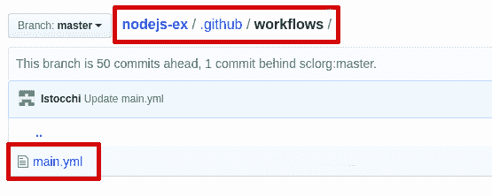
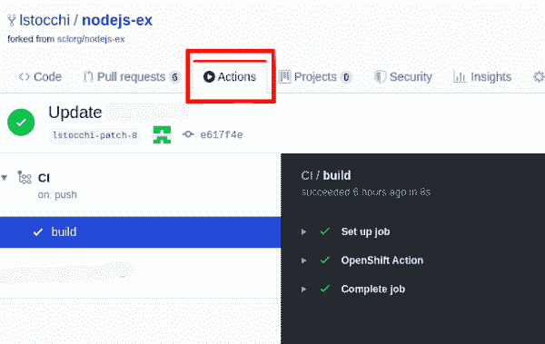

# OpenShift 操作:直接从 GitHub 库部署到 Red Hat OpenShift

> 原文：<https://developers.redhat.com/blog/2020/02/13/openshift-actions-deploy-to-red-hat-openshift-directly-from-your-github-repository>

这里有一个常见的情况:你写了你的代码，所有东西都在 GitHub 上，你准备发布它。但是，你知道你的工作还没有完成。您需要部署您的代码，这个过程有时会是一场噩梦。

理想情况下，您应该能够在一个地方完成整个过程，但直到现在，您总是必须设置外部服务并将它们与 GitHub 集成(或添加提交后挂钩)。相反，如果您可以替换所有这些额外的东西，只用几行 YAML 代码就可以直接从 GitHub 库运行所有的东西，那会怎么样呢？这正是 GitHub 动作的目的。

GitHub Actions 是 GitHub 最近推出的新功能。它们使用户能够直接从他们的 GitHub 存储库中设置定制的软件开发生命周期(SDLC)工作流。通过使用 actions，开发人员可以让 GitHub 处理许多由平台上的各种事件触发的进程，比如推送代码、发布等等。这样，您可以让 GitHub 在每次事件发生时部署您的应用程序，并只关注您的代码。

尽管 GitHub Actions 仍然很新，但我们已经迫不及待地想采取行动，让开发人员直接从他们的 GitHub 库连接并部署到他们的 [Red Hat OpenShift](http://developers.redhat.com/openshift/) 集群。在本文中，我们将快速浏览一下 [OpenShift Actions](https://github.com/redhat-developer/openshift-actions) 扩展，并展示它的设置和使用有多简单。

**注意:** OpenShift 动作可以直接从[这个链接](https://github.com/search?q=OpenShift+Actions)从 GitHub 市场下载。

### 使用 OpenShift 操作

要在 GitHub 存储库中使用 OpenShift 操作，首先创建您的工作流，并在`.github/workflows/<file name>.yml`中将其保存为 YAML 文件。通过点击 **Actions** 选项卡(在您的存储库的顶部，在 **Pull request** 旁边)，您将看到最流行的持续集成工作流，并且您将被引导设置您自己的工作流，如图 1 所示。

[](/sites/default/files/blog/2020/01/oc-action-1.png)

图 1:您在 GitHub 中的新工作流程。">

如下例所示，您可以定义触发工作流的事件、执行每个作业的运行者(例如，不同类型和版本的虚拟主机，包括 Linux、Windows 和 macOS)以及要运行的所有操作:

```
name: CI
on:
  # Trigger the workflow on push to the master branch
  push:
    branches:
      - master
jobs:
  build:
    runs-on: ubuntu-latest
    steps:
    - name: OpenShift Action
      uses: redhat-developer/openshift-actions@v1.1
      with:
        version: 'latest'
        openshift_server_url: ${{ secrets.OPENSHIFT_SERVER_URL }}
        parameters: '{"apitoken": "${{ secrets.API_TOKEN }}", "acceptUntrustedCerts": "true"}'
        cmd: |
          'version'
          'start-build nodejs-ex --follow'
          'status'

```

在我们的示例中，我们希望在每次有东西被推送到我们的主服务器时，在 OpenShift 上部署我们的应用程序。因此，我们将工作流配置为在事件推送发生时启动，并指定我们感兴趣的分支，即主节点。如果省略分支，工作流将在每次推送到存储库时触发。

接下来，我们需要指定是使用 GitHub 托管的还是自托管的运行程序。GitHub 只提供 Windows Server 2019、Linux Ubuntu 16.04/18.04、macOS Catalina 10.15 上的运行器。如果你想在[红帽企业版 Linux](http://developers.redhat.com/rhel8/)/[CentOS](https://www.centos.org/)/[Fedora](https://getfedora.org/)上拥有自己的 runner，你就得选择自托管。这里列出了所有支持的操作系统。

最后，我们需要设置我们想要执行的所有动作(步骤)。在这种情况下，我们只是使用 OpenShift 操作将应用程序部署到 OpenShift 集群，但是您也可以添加另一个操作来向某人发送电子邮件或 SMS，或者运行测试。发挥你的想象力。

**注意:**在本例中，我们使用的是 OpenShift Actions v1.1。要使用最新版本，[请前往市场](https://github.com/search?q=OpenShift+Actions)。

### OpenShift 动作输入

您可以看到 OpenShift 操作需要输入才能运行。让我们看看它们是什么以及它们的用途:

*   **`version` *(可选):*** 我们希望 OpenShift 操作在执行命令时使用的`oc` CLI 的版本。该输入接受三个不同的值:
    *   **版本号**(即`3.11.36`)
    *   **下载 oc 包**的网址(即`https://mirror.openshift.com/pub/openshift-v3/clients/3.11.36/linux/oc.tar.gz`)
    *   **版本**:
        *   用于形式`version: 'latest'`。
        *   下载可用的最新版本。
        *   充当此输入的默认值。
*   **`openshift_server_url` *(必选):***open shift 集群的 URL，以`openshift_server_url: ${{ secrets.OPENSHIFT_SERVER_URL }}`的形式使用。
*   **`parameters` *(必选):*** 一个 JSON 字符串，其中包含连接到 OpenShift 集群所需的值。必须是`parameters: '{"apitoken": "${{ secrets.API_TOKEN }}", "acceptUntrustedCerts": "true"}'`的形式。
*   **`cmd` *(必选):*** 要执行的一个或多个`oc`命令。

### OpenShift 动作验证

为了允许扩展连接到我们的集群，我们需要配置一个 OpenShift 连接。`parameters`输入用于此目的。根据其值，将使用两种受支持的身份验证方法之一:基本或令牌。

#### 基本认证

`parameters`输入使用用户名和密码连接到集群，即`parameters: '{"username": "${{ secrets.USERNAME }}", "password": "${{ secrets.PASSWORD }}", "acceptUntrustedCerts": "true"}'`

| **名称** | **要求** | **描述** |
| --- | --- | --- |
| `username` | *必需的* | OpenShift 用户名。 |
| `password` | *必需的* | 指定用户的密码。 |
| `acceptUntrustedCerts` | *optional* | 是否可以接受自签名(不可信)证书。 |
| `certificateAuthorityFile` | *optional* | 存储证书颁发机构文件的路径。 |

#### 令牌认证

`parameters`输入使用 API 令牌连接到集群，即`parameters: '{"apitoken": "${{ secrets.API_TOKEN }}"}'`。

| **名称** | **要求** | **描述** |
| --- | --- | --- |
| `apitoken` | *必需的* | 用于身份验证的 API 令牌。 |
| `acceptUntrustedCerts` | *optional* | 是否可以接受自签名(不可信)证书。 |
| `certificateAuthorityFile` | *optional* | 存储证书颁发机构文件的路径。 |

### 秘密

正如你在上面看到的，我们从来没有明文写我们的敏感数据。我们总是使用*秘密*。尽管这种设置不是强制性的，但我们强烈建议在需要时使用机密。

秘密是在存储库中创建的加密环境变量，仅由 GitHub Actions 使用。GitHub 使用经过公钥验证的加密和 Poly1305 密码算法在网络浏览器中加密秘密。更多信息参见[`TweetNaCl.js`文档](https://github.com/dchest/tweetnacl-js#public-key-authenticated-encryption-box)。

要使机密可用于操作，您必须在存储库中设置它，然后将其作为输入或环境变量添加到工作流文件中。

**注意:**对于组织的存储库，您必须拥有*管理员*的访问权限，才能创建加密的机密。对于用户帐户存储库，您必须是存储库*的所有者*才能创建加密的秘密。

以下是如何创造一个秘密:

1.  转到存储库的主页。
2.  点击**设置**。
3.  在左侧栏中，选择**机密**。
4.  在**名称**输入框中输入您的密码。(机密名称必须是唯一的，并且不能包含任何空格。)
5.  键入您的密码值。(为了确保 GitHub 在日志中编辑您的秘密，请避免使用结构化数据作为秘密的值。避免创建包含 JSON 或编码 Git blobs 的秘密。)
6.  点击**添加密码**。

**注意:**您的工作流程最多可以有 100 个秘密。

## 最后的话

此时，您应该能够设置您的工作流，并在每次触发您的 YAML 文件中选择的事件时看到 OpenShift 操作的运行。为了检查您的工作流是否正常工作，您可以随时访问存储库中的 **Actions** 选项卡，并验证所有步骤都成功了，如图 2 所示。

[](/sites/default/files/blog/2020/01/oc-actio-2.png)

图 2:在存储库的 **Actions** 选项卡中检查您的工作流。”>

如果您遇到任何错误，有任何建议，或者如果您希望实现新功能，您可以通过[我们的 repo](https://github.com/redhat-developer/openshift-actions) 提交问题。OpenShift Actions 是一个开源项目，欢迎提出建议、意见和请求。

*Last updated: January 21, 2022*