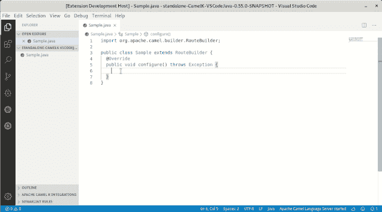

# Camel K 独立 Java 文件:现在支持 Java 语言

> 原文：<https://developers.redhat.com/blog/2020/02/03/camel-k-standalone-java-file-now-with-java-language-support>

[阿帕奇骆驼 K](https://camel.apache.org/projects/camel-k/) 要尽量轻量化。因此，Camel K 项目提供了独立的 Java 文件来描述 Camel 集成。这种做法的缺点是现有的 ide 不能提供开箱即用的完整支持。为了提供对 Apache Camel K 的独立 Java 文件的完整体验，有三种解决方案:

*   创建一个带有 Camel 依赖项的假项目。
*   在工作区根目录下的 lib 文件夹中手动添加所有 jar 依赖项。
*   使用最新的 [`java.project.referencedLibraries`偏好](https://github.com/redhat-developer/vscode-java/pull/1196)来自红帽的[语言支持 Java](https://marketplace.visualstudio.com/items?itemName=redhat.java) 扩展。

结果就是没有直观的配置。然而，Red Hat 为 Apache Camel K 开发的[工具提供了一种新的可能性。](https://marketplace.visualstudio.com/items?itemName=redhat.vscode-camelk)

对于 Apache Camel K 版本 0.11.0 的工具，现在包括了 Java 语言支持，并且只有两个需求。首先，您需要在 Java 文件的内容中包含单词“camel”。大多数时候，这个需求是由导入包本身来满足的。第二，工作空间中必须没有项目。如果有*个*项目，我们期望经典的 Maven/Gradle 构建提供 Java 语言支持。但是，这些要求在大多数情况下应该不是问题。

下面是 Apache Camel K 独立 Java 文件的完成过程:

接下来，你可以尝试用 Apache Camel K 转置教程 *[发送电报，用 Java 转置 Visual Studio 代码](https://developers.redhat.com/blog/2019/09/30/sending-a-telegram-with-apache-camel-k-and-visual-studio-code/)* 。

*Last updated: June 29, 2020*