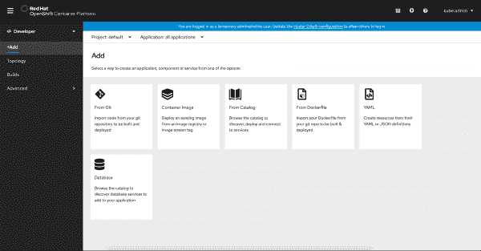
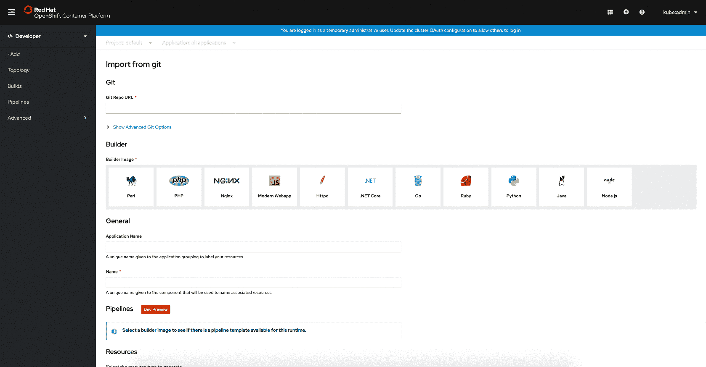
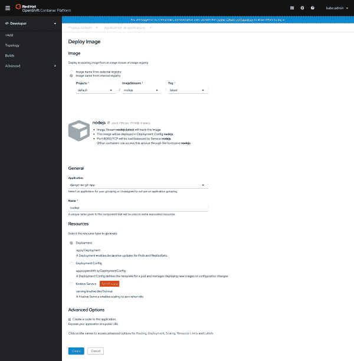
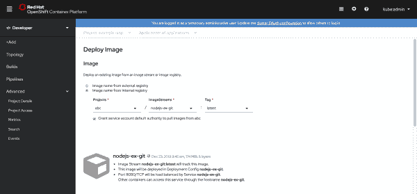
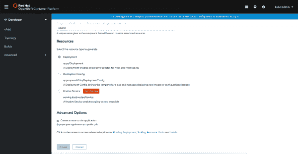

# 从 OpenShift 4.3 开发人员的角度部署应用

> 原文：<https://developers.redhat.com/blog/2020/01/17/deploying-applications-in-the-openshift-4-3-developer-perspective>

在本文中，我们从 [Red Hat OpenShift 4.3](http://developers.redhat.com/openshift/) 的开发者角度来看部署应用程序的用户流程改进。你可以在 [OpenShift 4.3 发布文章](https://developers.redhat.com/blog/2020/01/15/whats-new-in-the-openshift-4-3-console-developer-experience/)中了解更多关于所有以开发者为中心的控制台改进。自从在 OpenShift 4.2 版本中首次推出开发人员视角以来，我们已经与开发人员、开发人员倡导者、利益相关者和其他社区成员进行了频繁的反馈会议，以更好地了解体验如何满足他们的需求。总的来说，用户界面很受欢迎，我们将继续收集和使用反馈来提高我们的流量。

## 添加页面

在 OpenShift 4.2 中添加的 **+Add** 选项位于开发人员透视图的左侧导航部分，如图 1 所示，是开发人员向其 OpenShift 项目添加应用程序或服务的入口点。

Figure 1: Add an application or service to your OpenShift project using these six user flows.">

如您所见， **Add** 页面提供了六个用户流:

*   从 Git 添加组件。
*   部署容器映像。
*   从开发人员目录添加项目。
*   从 Git repo 导入 docker 文件。
*   进口 YAML。
*   添加数据库。

## **OpenShift 4.3 用户流量改进**

OpenShift 4.3 的发布带来了对从 git 导入**和**部署映像**流程的改进。让我们来看看每一个。**

### 从 git 导入**的构建器图像检测**

从 git 导入的**流程得到了增强，可以帮助用户通过自动填充细节来轻松创建应用程序，从而使流程更加自动化。这种改进来自于对构建器映像的自动检测，这有助于确定正确的构建策略。**

在 4.3 中，只要用户输入一个 **Git Repo URL** ，就会进行 URL 验证。验证 URL 后，构建器映像检测过程开始。推荐的构建器图像用一个星号表示，默认情况下是选中的，如图 2 所示。

Figure 2: Importing from Git triggers builder image detection.">

通过建议一个构建器映像，我们试图减少用户构建应用程序的步骤。但是，用户可以自由地手动选择不同的构建器映像。为了进一步提高流程的效率，**应用程序**和**名称**字段根据输入的 **Git Repo URL** 填充智能默认值。如果这些字段不是用户想要的，也可以进行编辑。在这些表单域中为用户提供可选的建议有助于用户更快地进行操作，而无需强制他们输入什么。

### 从图像流部署图像

**Deploy Image** 流现在提供了使用内部注册表中的映像名部署映像的能力，如图 3 所示。这个选项出现在 3.11 版本的 OpenShift 中，在 4.3 版本中有所增强。

Figure 3: Deploy an image using an image name from an internal registry.">

当选择这个选项时，用户通过在表单的 **Image** 部分选择相关的项目、图像流和标记来识别要部署的容器图像，如图 4 所示。

Figure 4: An example internal registry deployment.">

为了改进 3.11 中的流程，在选择项目时，我们验证是否有适当的权限从该项目中提取图像。当没有适当的访问权限时，用户可以选择通过复选框授予该访问权限，默认情况下会选中该复选框。

## **新增** **资源板块**

在 Developer 透视图的 4.2 初始版本中，默认情况下，从 Git 导入的**、从 Dockerfile** 导入的**和部署映像**用户流创建部署配置。当安装无服务器操作员时，会显示一个无服务器部分，允许用户选择一个复选框，表明他们希望创建一个 Knative 服务。

在 4.3 中，我们向这些流添加了一个**资源**部分，允许用户选择创建什么类型的资源，如图 5 所示。默认是一个 Kubernetes **部署**。其他可供选择的资源类型有**部署配置**和**被动服务**。 **Knative Service** 选项仅在安装了 OpenShift 无服务器操作器时可用。因为这些表单是动态的，并且根据用户的选择而变化，所以可用的**高级选项**将根据所选择的资源而不同。

Figure 5: Choose the type of resource to create in the new Resources section.">

## **了解更多信息**

有兴趣了解更多关于 OpenShift 应用程序开发的信息吗？查看 OpenShift 上关于[应用程序开发的 Red Hat 资源。](http://developers.redhat.com/openshift)

### **提供反馈**

想给我们反馈吗？加入我们的 [OpenShift 开发者体验 Google 小组](https://groups.google.com/forum/#!forum/openshift-dev-users)，参与讨论，或者参加我们的办公时间反馈会议。或者，给我们发一封[电子邮件](mailto:openshift-ux@redhat.com)，告诉我们您对 OpenShift 控制台用户体验的意见。

*Last updated: June 29, 2020*