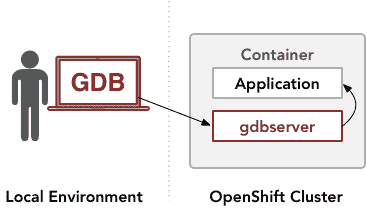

# 在 Red Hat OpenShift 容器中调试应用程序

> 原文：<https://developers.redhat.com/blog/2020/01/09/debugging-applications-within-red-hat-openshift-containers>

当在一个 [Red Hat OpenShift](https://developers.redhat.com/openshift/) 容器中调试一个应用程序时，记住容器中的 Linux 环境受到各种约束是很重要的。由于这些限制，调试工具的全部功能可能都不可用:

*   无特权的 OpenShift 容器被限制访问一些低级调试工具所需的内核接口。

> **注意:**open shift 上几乎所有的应用都运行在非特权容器中。无特权容器允许使用标准调试工具，如 [`gdbserver`](https://sourceware.org/gdb/onlinedocs/gdb/Server.html) 或 [`strace`](https://strace.io/) 。不能在非特权容器中使用的调试工具的例子包括 [`perf`](https://perf.wiki.kernel.org/index.php/Main_Page) ，它需要访问内核的`perf_events`接口，以及 [SystemTap](https://sourceware.org/systemtap) ，它依赖于内核的模块加载功能。

*   OpenShift 容器中系统包的调试信息不可访问。正在进行的工作(作为 [elfutils](https://sourceware.org/elfutils/) 项目的一部分)是开发[调试信息(`debuginfod` )](https://developers.redhat.com/blog/2019/10/14/introducing-debuginfod-the-elfutils-debuginfo-server/) 的文件服务器，这将使这种访问成为可能。
*   当构建相应的容器映像时，OpenShift 容器中的一组包是提前固定的。一旦容器开始运行，就不能再安装额外的包了。一些调试工具预装在常用的容器基础映像中，但是在配置容器映像构建过程时，必须添加任何其他工具。

为了成功调试容器化的应用程序，有必要理解这些约束以及它们如何决定可以使用哪些调试工具。

## 容器映像中预装的调试工具

OpenShift 平台的大多数容器基础映像至少包括最低水平的预安装调试功能。通用基本映像，如 [Red Hat Enterprise Linux (RHEL)通用基本映像](https://www.redhat.com/en/blog/introducing-red-hat-universal-base-image)包括 GDB 调试器的`gdbserver`组件，而用于高级语言运行时的容器基本映像通常包括专用于这些运行时的调试功能。

通用的 Red Hat Enterprise Linux 容器基础映像包括常用的 GDB 调试器的 [`gdbserver`](https://sourceware.org/gdb/onlinedocs/gdb/Server.html) 组件。通过配置在 OpenShift 集群外部运行的交互式 GDB 会话，可以使用 Gdbserver 将远程命令传递给容器内的`gdbserver`实例。这个`gdbserver`实例可以直接访问容器化的应用程序。为了响应来自 GDB 会话的远程命令，`gdbserver`将从应用程序收集信息，并将其传递回 GDB 会话:



下面的调试会话说明了如何将`gdbserver`附加到基于[红帽通用基础映像](https://www.redhat.com/en/blog/introducing-red-hat-universal-base-image) (UBI)的容器中的程序。此会话中的命令也应该能够处理基于早期 Red Hat Enterprise Linux 容器基础映像的容器。这个过程在由 [CodeReady Containers 1.2.0](https://developers.redhat.com/products/codeready-containers/download) 管理的 OpenShift 4.2.8 集群上进行了测试。

我们通过创建一个容器来开始会话:

```
$ oc new-app --name='ubi8-example' nodeshift/ubi8-s2i-web-app:latest~https://github.com/lholmquist/react-web-app

```

用`oc get pods`操作获得容器的名称:

```
$ oc get pods
NAME                        READY   STATUS             RESTARTS   AGE
ubi8-example-1-22wlk        1/1     Running            0          2m45s
ubi8-example-1-build        0/1     Completed          0          5m20s
ubi8-example-1-deploy       0/1     Completed          0          2m53s

```

要验证容器是否包含`gdbserver`包，使用 [`oc exec`](https://docs.openshift.com/container-platform/4.2/nodes/containers/nodes-containers-remote-commands.html) 操作在容器内执行一个`rpm`命令:

```
$ oc exec -it ubi8-example-1-22wlk -- rpm -qa | grep gdbserver
gdb-gdbserver-8.2-6.el8.x86_64

```

我们需要我们要调试的程序的进程 ID。要获得它，在容器内执行一个`ps`命令:

```
$ oc exec -it ubi8-example-1-22wlk -- ps -ax
PID TTY      STAT   TIME COMMAND
  1 ?        Ss     0:00 /bin/bash /usr/libexec/s2i/run
  9 ?        Sl     0:00 /usr/bin/node /usr/bin/npx serve -s /opt/app-root/output -l 
 48 pts/0    Rs+    0:00 ps -ax

```

接下来，启动一个本地 GDB 会话，并连接到容器中的`gdbserver`:

```
$ gdb
(gdb) target extended-remote | oc exec -i ubi8-example-1-22wlk -- gdbserver --multi - 
Remote debugging using | oc exec -i ubi8-example-1-22wlk -- gdbserver --multi -
Remote debugging using stdio

```

这里，GDB 被指示连接到容器中的一个`gdbserver`进程。这个`gdbserver`进程以一个`oc exec`操作开始，并被配置为监听其标准输入上的命令。OpenShift 基础设施通过网络将`gdbserver`流程的标准输入和标准输出传递给本地 GDB 会话。

接下来，指示 GDB 连接到容器中的主服务器进程，该进程由我们之前获得的进程 ID 标识:

```
(gdb) attach 9
Attaching to process 9
Attached; pid = 9
Reading /usr/bin/node from remote target...
...
0x00007fd1cb44228e in epoll_pwait () from target:/lib64/libc.so.6

```

此时，GDB 已经准备好调试流程。

### 对 OpenShift 容器中 GDB 功能的限制

在 Red Hat OpenShift 容器中，某些 GDB 功能可能不可用，具体取决于容器的配置方式。

例如，依赖于对调试信息的访问的 GDB 函数将不可用。尽管[调试信息包](https://access.redhat.com/documentation/en-us/red_hat_enterprise_linux/7/html-single/developer_guide/index#enabling-debugging_understanding-debuginfo-packages)在许多 Linux 发行版中都可用，包括 Red Hat Enterprise Linux，但是这些包只能提前包含在容器映像中，并且一旦容器已经在运行，就不能安装在无特权的容器中。

然而，在没有调试信息的情况下，可以使用 GDB 函数的一个子集:

*   GDB 可以[在函数入口点触发断点和跟踪点](https://sourceware.org/gdb/onlinedocs/gdb/Linespec-Locations.html#Linespec-Locations)。
*   GDB 可以使用[静态定义的跟踪](https://sourceware.org/gdb/onlinedocs/gdb/Static-Probe-Points.html) (SDT)标记机制来触发程序中各种高级事件的断点或跟踪点。
*   GDB 可以[生成程序内存的核心文件](https://sourceware.org/gdb/onlinedocs/gdb/Core-File-Generation.html#Core-File-Generation)。核心文件可以在 OpenShift 环境之外保存和检查。
*   GDB 可以[从程序中获得堆栈跟踪](https://sourceware.org/gdb/onlinedocs/gdb/Stack.html#Stack)。

以下示例显示了如何使用命令`thread apply all bt`来获取进程中每个线程的堆栈跟踪:

```
    (gdb) attach 9
    (gdb) thread apply all bt

    Thread 11 (Thread 9.19):
    #0  0x00007fd1cb71747c in pthread_cond_wait@@GLIBC_2.3.2 ()
       from target:/lib64/libpthread.so.0
    #1  0x00005585ba200d7d in uv_cond_wait ()
    #2  0x00005585ba1eea22 in worker ()
    #3  0x00007fd1cb7112de in start_thread () from target:/lib64/libpthread.so.0
    #4  0x00007fd1cb442133 in clone () from target:/lib64/libc.so.6

    ...

    Thread 2 (Thread 9.10):
    #0  0x00007fd1cb44228e in epoll_pwait () from target:/lib64/libc.so.6
    #1  0x00005585ba203f7e in uv.io_poll ()
    #2  0x00005585ba1f3ea0 in uv_run ()
    #3  0x00005585ba10faa4 in node::WorkerThreadsTaskRunner::DelayedTaskScheduler::Start()::{lambda(void*)#1}::_FUN(void*) ()
    #4  0x00007fd1cb7112de in start_thread () from target:/lib64/libpthread.so.0
    #5  0x00007fd1cb442133 in clone () from target:/lib64/libc.so.6

    Thread 1 (Thread 9.9):
    #0  0x00007fd1cb44228e in epoll_pwait () from target:/lib64/libc.so.6
    #1  0x00005585ba203f7e in uv.io_poll ()
    #2  0x00005585ba1f3ea0 in uv_run ()
    #3  0x00005585ba0e3c7a in node::NodeMainInstance::Run() ()
    #4  0x00005585ba072eb4 in node::Start(int, char**) ()
    #5  0x00007fd1cb369873 in __libc_start_main () from target:/lib64/libc.so.6
    #6  0x00005585ba00f14e in _start ()

```

其次，要求停止应用程序的 GDB 功能与定期健康检查不兼容。如果一个容器已经被配置为运行[定期健康检查](https://docs.openshift.com/container-platform/4.2/nodes/containers/nodes-containers-health.html)，OpenShift 基础设施将定期向容器化的应用程序发送一条消息，以验证它正在运行。如果应用程序已被 GDB 暂停，它将无法响应消息，OpenShift 将在假设应用程序已崩溃的情况下重新启动容器。此重新启动将中断调试会话并重置应用程序状态。在这种情况下，长时间暂停程序是不可行的。对于这种情况，GDB 支持后台执行和动态跟踪。GDB 的[后台执行命令](https://sourceware.org/gdb/onlinedocs/gdb/Background-Execution.html#Background-Execution)，比如`attach&`，允许 GDB 在不暂停的情况下附加到一个程序上。GDB 的 [tracepoint 设施](https://sourceware.org/gdb/onlinedocs/gdb/Tracepoints.html#Tracepoints)可以在程序继续运行的同时收集数据。

### 高级语言的调试工具

包含高级语言运行时的基于容器的映像可能包含相应的调试功能。例如，Java 容器映像包括对 Java 远程调试协议的支持，Node.js 容器映像包括 Node.js 检查器代理。Jeff Maury 的一篇文章描述了如何在 Java 运行时的容器映像中启用和使用调试特性，Lucas Holmquist 的一篇文章描述了如何在 Node.js 应用程序的容器映像中启用和使用调试特性。

尽管许多常用的容器基映像都包含调试工具，但不能绝对保证容器基映像会包含它们。有必要检查容器映像的内容，以便理解所包含的调试工具，并确定是否需要安装额外的包。

## 在容器映像构建时安装调试工具

有一些调试工具可以在容器中使用，但没有预安装在容器基本映像中。在容器映像构建过程中，诸如 [strace](https://strace.io/) 或 [Valgrind](https://valgrind.org/) 之类的工具必须包含在容器中。

为了向容器添加调试工具，必须配置容器映像构建过程以执行附加的包安装命令。在映像构建过程中是否允许安装包取决于构建容器映像的方法。OpenShift 提供了几种构建容器映像的方法。这些方法被称为[构建策略](https://docs.openshift.com/container-platform/4.2/builds/build-strategies.html)。目前，OpenShift 支持 Dockerfile、Source-to-Image (S2I)、Pipeline 和定制构建策略。并非所有的构建策略都允许包安装:在最常用的策略中，Dockerfile 策略允许包安装，但 S2I 策略不允许，因为 S2I 构建过程在非特权环境中构建容器映像。非特权环境中的构建过程缺乏调用包安装命令的能力。

在 Dockerfile 构建过程中为容器映像安装的调试工具包包含在该容器映像中。例如，以下 Dockerfile 命令指定了一个包含`strace`包的容器:

```
FROM registry.access.redhat.com/ubi8/ubi-init
RUN yum -y install strace

```

## 需要特权容器的调试工具

如果 OpenShift 容器不具有访问工具所需的操作系统功能的特权，则调试工具不能在该容器内运行。例如， [SystemTap](https://sourceware.org/systemtap) 的默认内核模块后端不能在缺乏加载内核模块权限的容器中运行。类似地， [perf](https://perf.wiki.kernel.org/index.php/Main_Page) 需要访问内核`perf_events`接口， [bcc](https://www.iovisor.org/technology/bcc) 需要访问 BPF 跟踪功能。这些函数在非特权的 OpenShift 容器中不可用。一般来说，需要提升特权的调试工具只能在集群管理员创建的[特权容器](https://docs.openshift.com/container-platform/4.2/authentication/managing-security-context-constraints.html)中使用。

一般而言，为了确定调试工具是否可以在 OpenShift 容器内使用，有必要调查该工具所依赖的操作系统接口集，然后确定 OpenShift 容器是否有足够的权限来访问这些接口。常用的调试工具如`gdbserver`或`strace`能够在非特权的 OpenShift 容器中运行，因为它们依赖于`ptrace()`系统调用，该调用在非特权容器中默认可用。

## 结论

本文总结了在 OpenShift 上调试容器化应用程序的各种选项。目前，为了对正在运行的 OpenShift 应用程序进行故障排除，有必要预测可能需要的一组调试工具，并且必须提前采取措施以确保这些调试工具将出现在容器中。

*Last updated: June 29, 2020*