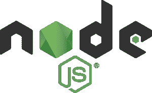

# Node.js 的 Red Hat 支持

> 原文：<https://developers.redhat.com/blog/2020/01/07/red-hat-support-for-node-js>

在过去的两年里，[红帽中间件](https://developers.redhat.com/middleware/)已经在[红帽 OpenShift](https://developers.redhat.com/openshift/) 上提供了一个受支持的 Node.js 运行时，作为[红帽运行时](https://www.redhat.com/en/products/runtimes)的一部分。我们的目标是提供上游 Node.js 核心项目的快速发布，让开发人员快速启动和运行的示例应用程序，Node.js 容器映像，与 Red Hat 的云原生堆栈的其他组件的集成，以及(当然)为客户提供世界一流的服务和支持。今年早些时候，Red Hat 发布和支持 Node.js even [的团队因为这项工作](https://developers.redhat.com/blog/2019/03/01/rhoar-node-js-wins-a-devie-award/)获得了 DeveloperWeek 颁发的“Devie”奖，进一步认可了 Red Hat 在支持社区和生态系统方面的作用。

## 红帽 Node.js 专家触手可及

Red Hat 以多种方式与云上业务关键型应用程序中增长最快的运行时进行合作，包括为社区做出贡献、成为技术指导委员会的一员，甚至参与和推动战略计划以开创 Node.js 的未来。将这项工作与我们的 Red Hat Enterprise Linux (RHEL)和 OpenShift 专业知识相结合，我们可以帮助您实现在云上和云外交付和支持业务关键型应用程序的目标。

## 如何从红帽获取 Node.js

为了达到我们的客户满意度和易用性的目标，Red Hat [为两个最新的 Node.js 长期服务(LTS)版本提供支持](https://access.redhat.com/products/nodejs/)。有两种支持模式供您选择。以下是它们所包含内容的对比:

| **红帽企业版 Linux 和 OpenShift 订阅** | **红帽运行时订阅** |
| Node.js 针对 Red Hat Enterprise Linux 7 打包在 Red Hat Software Collections(RHS cl)中，针对 RHEL 8 打包为 AppStream 中的一个模块。 | Node.js 打包在适用于 Red Hat Enterprise Linux 7 的 Red Hat Software Collections(RHS cl)中，并作为适用于 RHEL 8 的 AppStream 中的一个模块。 |
| Node.js 红帽企业 Linux 和 OpenShift 容器平台(OCP)的容器。 | node . js containers for Red Hat Enterprise Linux 和 Red Hat open shift Container Platform(OCP)。 |
| 安装和维护支持。 | 

*   Comprehensive production support, including patches and patches to get you up and running quickly.
*   Comprehensive development support (Node.js expertise)
*   Request for new function (upstream of Node.js).
*   Support microservices libraries, developer tools (such as [Node Shift](https://developers.redhat.com/blog/2019/08/30/easily-deploy-node-js-applications-to-red-hat-openshift-using-nodeshift/) ) and startup applications.
*   Support the integration with Functionality as a Service and Knative.

 |
| 两年红帽企业 Linux 支持各 Node.js 版本。 | 两年的红帽企业版 Linux 对每个 Node.js 版本的支持。 |
| 每六周更新一次[红帽容器目录](https://catalog.redhat.com/software/containers/search?q=node.js&p=1)中的图片。 | 更新图片 [红帽容器目录](https://catalog.redhat.com/software/containers/search?q=node.js&p=1) 每六周。 |

对于 OpenShift 客户，Node.js 运行时通过 Red Hat 容器目录以包含 Node.js 的容器化 OpenShift [S2I 构建器映像](https://blog.openshift.com/create-s2i-builder-image/)的形式提供。Node.js 容器映像可以从命令行(使用`oc`命令)或从 OpenShift 开发人员控制台提取。

对于 Red Hat Enterprise Linux 客户，Node.js 可以从[Red Hat Software Collections](https://developers.redhat.com/products/softwarecollections/overview)频道安装在 RHEL 7 上，并作为一个模块安装在 RHEL 8 的 AppStream 中。

使用这些发行版的 Red Hat 客户将能够获得最新的更新和安全建议，了解容器更新的时间和原因，并保持最新的标记图像。展望未来，根据 [Red Hat JBoss 中间件产品更新和支持政策](https://access.redhat.com/support/policy/updates/jboss_notes)，客户可以期待对 Node.js 和其他云原生运行时的支持。

## 证明文件

Runtimes 团队一直在为 Red Hat 的 Node.js build 添加和改进官方文档。这项工作包括对[发行说明](https://access.redhat.com/documentation/en-us/red_hat_build_of_node.js/10/html/release_notes_for_node.js_10/)和 [Node.js 运行时指南](https://access.redhat.com/documentation/en-us/red_hat_build_of_node.js/10/html/node.js_runtime_guide/)的更新。

## 开发者互动学习场景

这些自定进度的场景(参见图 1)为您提供了一个预配置的 OpenShift 实例，无需任何下载或配置即可从您的浏览器访问该实例。使用该工具[试验 Node.js](https://learn.openshift.com/middleware/rhoar-getting-started-nodejs/) 或了解运行时内的其他技术，并查看 OpenShift 上的 Node.js 如何帮助解决现实世界的问题。

Figure 1: The Node.js Interactive Learning Scenario.

## 更多资源

*   [node . js 产品页面的红帽构建](https://access.redhat.com/products/nodejs/)
*   [用 Node.js 在 RHEL 上的容器中开发](https://developers.redhat.com/blog/2019/09/13/develop-with-node-js-in-a-container-on-red-hat-enterprise-linux/)
*   [红帽加入 Node.js 基金会](https://developers.redhat.com/blog/2015/10/07/red-hat-joins-node-js-foundation/)
*   [node . js 的 Red Hat 构建的容器图像](https://catalog.redhat.com/software/containers/search?q=node.js&p=1)
*   [今天在红帽 OpenShift 上使用 node . js 12](https://developers.redhat.com/blog/2019/04/29/use-node-js-12-on-red-hat-openshift-today/)
*   [node . js on open shift for Your Enterprise](http://lanceball.com/riviera-dev-2017/)
*   [用断路器保护 Node.js REST 客户端](https://lanceball.com/words/2017/01/05/protect-your-node-js-rest-clients-with-circuit-breakers)

*Last updated: January 19, 2022*