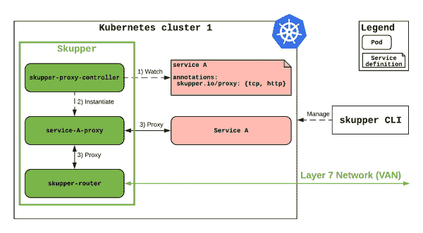
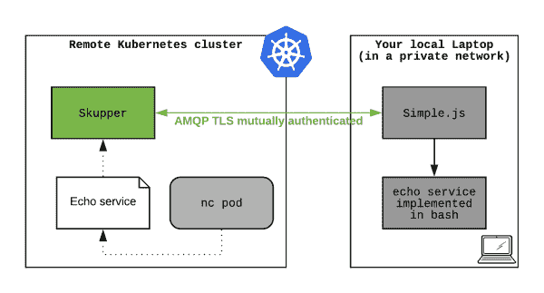

# io:让您的服务跨 Kubernetes 集群进行通信

> 原文：<https://developers.redhat.com/blog/2020/01/01/skupper-io-let-your-services-communicate-across-kubernetes-clusters>

在过去的几年中，容器的普及和采用飞速发展，并且 [Kubernetes](https://developers.redhat.com/topics/kubernetes/) 容器编排平台也已经被广泛采用。随着这些变化，在现实世界中处理部署在 Kubernetes 集群上的应用程序时，出现了一系列新的挑战。一个挑战是如何处理多个集群之间的通信，这些集群可能位于不同的网络(甚至是私有网络)、防火墙后面等等。

这个问题的一个可能的解决方案是使用虚拟应用网络(VAN ),它有时被称为第 7 层网络。简而言之，VAN 是一个部署在应用程序级别的逻辑网络，它为细粒度的应用程序组件引入了一个新的寻址层，对网络拓扑没有任何限制。要获得更深入的解释，请阅读[这篇优秀的文章](https://netprototalk.com/2019/11/12/virtual-application-networks-for-hybrid-cloud-interconnect/)。

那么，什么是 [Skupper](https://skupper.io) ？用项目自己的话说:

Skupper 是第七层服务互连。它支持 Kubernetes 集群之间的安全通信，无需 VPN 或特殊的防火墙规则。

Skupper 是一个 VAN 实现。其高层架构如图 1 所示:

[](/sites/default/files/blog/2019/12/skupper-overview.png)

Figure 1: Skupper.io architectural overview.

一旦在每个 Kubernetes 集群中安装了 Skupper 并与其他集群连接，集群一中的服务 A 就可以与集群二中的服务 B 通信，并与集群三中的服务 C 通信(反之亦然)。集群不需要都是公共的或者在相同的基础设施上。它们可能在防火墙后面，甚至在外部无法访问的专用网络上(假设它们可以到达外部，将自己连接到 skupper VAN)。

## skipper 建筑

给定整体架构，图 1 中的绿色 Skupper 组件是如何工作的？图 2 列出了 Kubernetes cluster one 的 Skupper 组件，并描述了它们之间的交互:

[](/sites/default/files/blog/2019/12/skupper-detailed-architecture.png)Fig. 2 - Skupper.io detailed architecture

Figure 2: Skupper's detailed architecture.

首先要注意的是，可以使用专用的`skupper` CLI 命令来管理 Skupper。接下来，当您第一次在 Kubernetes 和 OpenShift 集群中安装 Skupper 时，会部署两个组件:`skupper-router`和`skupper-proxy-controller`。前者是负责创建 VAN 的开源高级消息队列协议(AMQP)路由器 [Apache Qpid](https://qpid.apache.org/) 的实例。Qpid 通过将 HTTP 和 TCP 流量隧道传输到 AMQP 来帮助 Kubernetes 和 OpenShift 集群进行通信。

如果你熟悉[操作符模式](https://kubernetes.io/docs/concepts/extend-kubernetes/operator/)，可以把`skupper-proxy-controller`看作一个操作符:这个工具监视用`skupper.io/proxy`标注的服务，并为它们中的每一个实例化一个`service-*-proxy` pod。该 pod 将服务 A 使用的协议(即 HTTP 或 TCP)通过隧道传输到 AMQP，剩下的工作由`skupper-router`完成。

## 用例:一个拥有 Skupper 的本地服务出口商

在混合环境中有效开发云原生应用程序编码和测试带来的另一个挑战。在开发时，组成应用程序的一些服务可能本地托管在您的笔记本电脑上(或您的开发环境中)，而其他服务可能部署在远程 Kubernetes 集群上。在不设置 VPN 或其他“复杂”的网络配置的情况下，如何轻松地让远程集群访问您的本地服务？

一种选择是利用 Skupper 机制将运行在 Kubernetes 之外的本地服务导出到远程 Kubernetes 集群。图 3 描绘了我们想要实现的目标——一个简单的 TCP echo 服务，运行在我们的笔记本电脑上，通常连接到有防火墙的专用网络:

[](/sites/default/files/blog/2019/12/service-exporter.png)Fig. 3 - "Service exporter" use case with Skupper.io

Figure 3: A service exporter use case with Skupper.

我们希望从运行在远程 Kubernetes 集群上的 pod 访问该服务，该集群不能通过网络访问笔记本电脑网络。
**注意:**目前需要许多手动步骤，因为这个用例还没有作为`skupper` CLI 子命令实现。关于何时实现该功能还有一个问题没有解决。在这种情况下，接下来的所有步骤都将被一个`skupper CLI`调用所取代。

让我们看看您需要遵循的步骤(目前):

1.  从从 https://github.com/skupperproject/skupper-cli/releases 下载最新版本的`skupper`命令行界面开始。将它添加到您的路径中，并使其可执行。
2.  使用`oc`或`kubectl`登录您的远程集群。
3.  在远程集群上安装 Skupper:

```
$ skupper init --id public
```

4.  使 skupper 路由器可以从群集外部访问:

```
$ oc apply -f - << EOF
kind: Route
apiVersion: route.openshift.io/v1
metadata:
  name: skupper-messaging
spec:
  to:
    kind: Service
    name: skupper-messaging
    weight: 100
  port:
    targetPort: amqps
  tls:
    termination: passthrough
    insecureEdgeTerminationPolicy: None
  wildcardPolicy: None
EOF

```

5.  在群集上创建一个代表本地 echo 服务的服务。这个服务没有实现，它只是帮助 Skupper 正确处理这个特性:

```
$ oc apply -f - << EOF
kind: Service
apiVersion: v1
metadata:
  name: echo
  annotations:
    skupper.io/proxy: tcp
spec:
  ports:
    - protocol: TCP
      port: 2000
      targetPort: 2000
  selector:
    dummy: selector
EOF
```

6.  克隆`skupper-proxy`项目:

```
$ git clone git@github.com:skupperproject/skupper-proxy.git
```

7.  使用以下命令转到项目的`bin/`目录:

```
$ cd skupper-proxy/bin
```

8.  提取相互验证连接所需的证书:

```
$ oc extract secret/skupper
```

9.  修改`connection.json`如下所示:

```
{
    "scheme": "amqps",
    "host": "",
    "port": "443",
    "verify": false,
    "tls": {
        "ca": "ca.crt",
        "cert": "tls.crt",
        "key": "tls.key",
        "verify": false
    }
}
```

其中主机可通过以下方式获得:

```
$ oc get route skupper-messaging -o=jsonpath='{.spec.host}{"\n"}'
```

10.  在端口 2000 上本地运行一个简单的 Bash TCP echo 服务，该服务将在一个独立的 shell 中保持运行:

```
$ nc -l 2000 -k -c 'xargs -n1 echo'
```

11.  连接到远程集群上运行的 Skupper。请注意，端口必须与 echo 服务在步骤 10 中使用的端口(即 2000)相匹配，并且`echo`必须与您之前在集群上创建的服务名称相匹配:

```
$ node ./simple.js 'amqp:echo=>tcp:2000'
```

现在。一切都准备好了。您可以进入远程集群，使用安装了 Netcat 命令`nc`的 pod，就像安装了`busybox:latest`一样，然后运行:

```
$ nc localhost echo
```

键入一个单词，你应该会看到它在你的笔记本电脑上经过`skupper-proxy-pod`->-`skupper routerrouter`->-`simple.js`->-`TCP echo service`后返回。

## 结论和后续步骤

这个项目仍在大力开发，每天都在改进。在[官方网站](https://skupper.io)上查看进度，或者直接从 [GitHub](https://github.com/skupperproject) 项目的代码上查看。具体来说，[这里是跟踪](https://github.com/skupperproject/skupper-cli/issues/11)直接作为 Skupper CLI 命令支持本地服务导出器用例所涉及的所有工作的问题。

*Last updated: June 29, 2020*