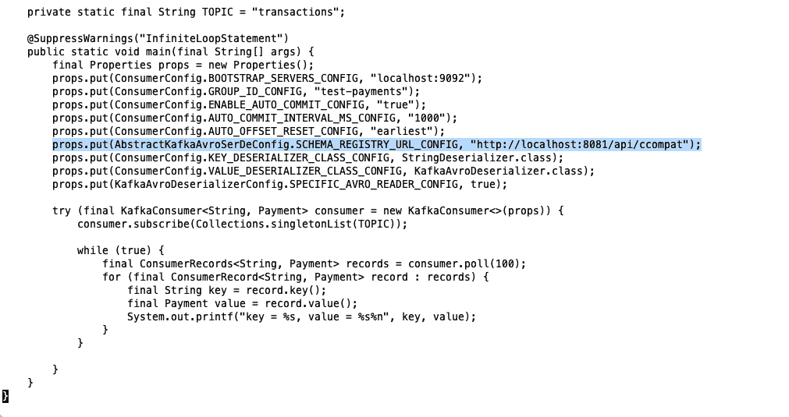

# 用 Red Hat 集成服务注册表替换汇合模式注册表

> 原文：<https://developers.redhat.com/blog/2019/12/17/replacing-confluent-schema-registry-with-red-hat-integration-service-registry>

随着最新版本的 [Red Hat Integration](https://www.redhat.com/en/products/integration) 的发布，我们引入了一些令人兴奋的新功能。随着基于 Apache Kafka 的环境的增强，Red Hat [宣布了 Red Hat Integration service registry 的](https://developers.redhat.com/blog/2019/11/26/red-hat-simplifies-transition-to-open-source-kafka-with-new-service-registry-and-http-bridge/)[技术预览版](https://access.redhat.com/support/offerings/techpreview)以帮助团队管理他们的服务模式。开发人员现在可以使用注册中心来查询每个服务端点所需的模式和构件，或者注册和存储新的结构以供将来使用。

## 事件驱动架构的注册表

Red Hat Integration 的 service registry 基于 [Apicurio 项目注册表](https://github.com/hguerrero/amq-examples/tree/master/registry-example-avro#apicurio-service-registry-example---avro)，提供了一种方法来将用于序列化和反序列化 Kafka 消息的模式与发送/接收它们的应用程序分离。服务注册中心是模式(和 API 设计)工件的存储库，提供了 REST API 和一组可选规则，用于实施内容有效性和演化。注册中心处理 Apache Avro、JSON Schema、Google Protocol buff(proto buf)等数据格式，以及 OpenAPI 和 AsyncAPI 定义。

为了便于从汇合过渡，服务注册中心增加了与汇合模式注册中心 REST API 的兼容性。这意味着使用汇合客户端库的应用程序可以替换模式注册表，而使用 Red Hat Integration service Registry。

## 替换汇合架构注册表


为了本文简单起见，我将使用一个现有的 [Avro 客户端示例](https://github.com/confluentinc/examples/tree/5.3.1-post/clients/avro)向您展示如何从融合模式注册中心切换到 Red Hat 集成服务注册中心。

您将需要使用 [docker-compose](https://docs.docker.com/compose/) 来启动本地环境，并使用 Git 来克隆存储库代码。

1.克隆示例 GitHub 存储库:

```
$ git clone https://github.com/confluentinc/examples.git
$ cd examples
$ git checkout 5.3.1-post
```

2.更改到 avro 示例文件夹:

```
$ cd clients/avro/
```

3.打开`src/main/java/io/confluent/examples/clients/basicavro`下的`ConsumerExample.java`文件。
4。用以下内容替换 SCHEMA_REGISTRY_URL_CONFIG 属性:

```
...
props.put(AbstractKafkaAvroSerDeConfig.SCHEMA_REGISTRY_URL_CONFIG, "http://localhost:8081/api/ccompat");
...
```

5.对`ProducerExample.java`文件重复最后一步。
6。下载这个 [docker-compose.yaml](https://github.com/hguerrero/amq-examples/blob/master/registry-example-avro/docker-compose.yaml) 文件示例，用 Apicurio 注册表部署一个简单的 Kafka 集群。
7。启动 Kafka 集群和注册表。

```
$ docker-compose -f docker-compose.yaml up
```

8.若要运行生成器，请编译项目:

```
$ mvn clean compile package
```

9.运行`ProducerExample.java`:

```
$ mvn exec:java -Dexec.mainClass=io.confluent.examples.clients.basicavro.ProducerExample
```

10.几分钟后，您应该会看到以下输出:

```
...
Successfully produced 10 messages to a topic called transactions
[INFO] ------------------------------------------------------------------------
[INFO] BUILD SUCCESS
[INFO] ------------------------------------------------------------------------
...
```

11.现在运行消费者:

```
$ mvn exec:java -Dexec.mainClass=io.confluent.examples.clients.basicavro.ConsumerExample
```

消息应该显示在您的屏幕上:

```
...
offset = 0, key = id0, value = {"id": "id0", "amount": 1000.0}
offset = 1, key = id1, value = {"id": "id1", "amount": 1000.0}
offset = 2, key = id2, value = {"id": "id2", "amount": 1000.0}
offset = 3, key = id3, value = {"id": "id3", "amount": 1000.0}
offset = 4, key = id4, value = {"id": "id4", "amount": 1000.0}
offset = 5, key = id5, value = {"id": "id5", "amount": 1000.0}
offset = 6, key = id6, value = {"id": "id6", "amount": 1000.0}
offset = 7, key = id7, value = {"id": "id7", "amount": 1000.0}
offset = 8, key = id8, value = {"id": "id8", "amount": 1000.0}
offset = 9, key = id9, value = {"id": "id9", "amount": 1000.0}
...
```

12.要检查生成器添加到注册表中的模式，可以发出以下 curl 命令:

```
$ curl --silent -X GET http://localhost:8081/api/ccompat/schemas/ids/1 | jq .
```

13.结果应该会显示 Avro 模式:

```
{
  "schema": "{\"type\":\"record\",\"name\":\"Payment\",\"namespace\":\"io.confluent.examples.clients.basicavro\",\"fields\":[{\"name\":\"id\",\"type\":\"string\"},{\"name\":\"amount\",\"type\":\"double\"}]}"
}
```

搞定了。

正如您所看到的，您只需更改注册中心的 URL 来使用 Red Hat service registry，而无需更改应用程序中的任何代码。

如果您对 Red Hat Integration service registry 的其他特性感兴趣，您可以在我的 [amq-examples GitHub 资源库](https://github.com/hguerrero/amq-examples)中看到一个使用 Quarkus Kafka 扩展的完整示例。

## 摘要

Red Hat Integration service registry 是模式和 API 工件的中央数据存储。开发人员可以查询、创建、读取、更新和删除服务工件、版本和规则，以管理他们的服务结构。服务注册中心也可以作为 Apache Kafka 客户端融合模式注册中心的替代物。只需更改注册表的 URL，您就可以使用 Red Hat service registry，而无需更改应用程序中的代码。

**参见:**

*   [Red Hat 将 Apache Kafka 支持的 Debezium CDC 连接器升级到技术预览版](https://developers.redhat.com/blog/2019/11/22/red-hat-advances-debezium-cdc-connectors-for-apache-kafka-support-to-technical-preview/)
*   [Red Hat 通过新的服务注册中心和 HTTP 桥简化了向开源 Kafka 的过渡](https://developers.redhat.com/blog/2019/11/26/red-hat-simplifies-transition-to-open-source-kafka-with-new-service-registry-and-http-bridge/)

*Last updated: April 13, 2021*