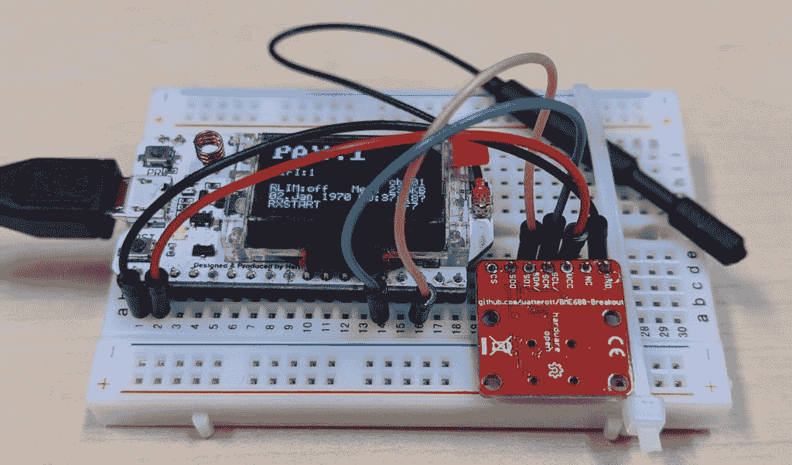
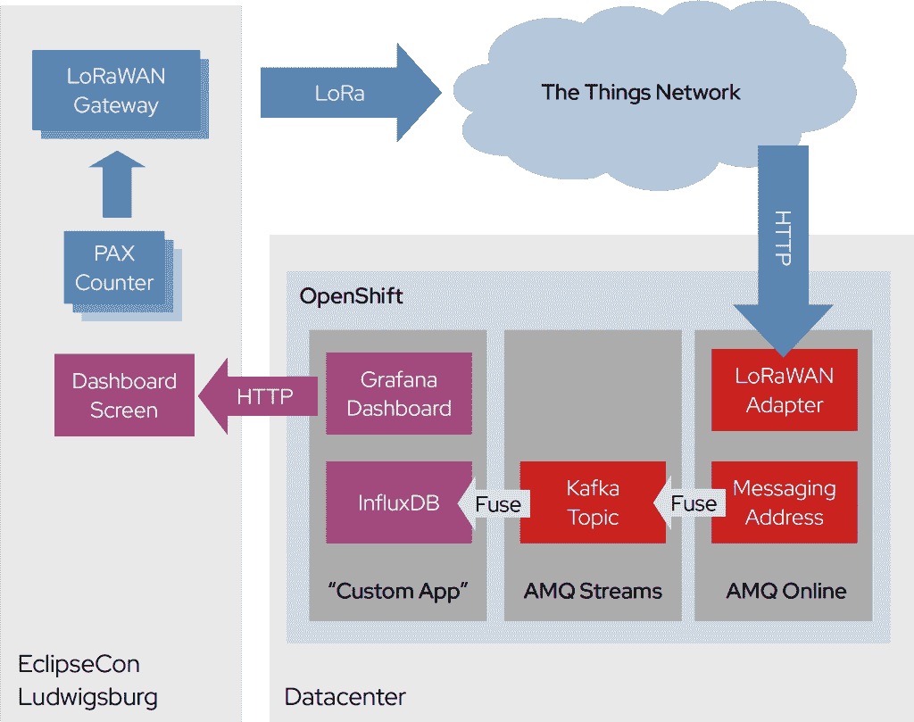
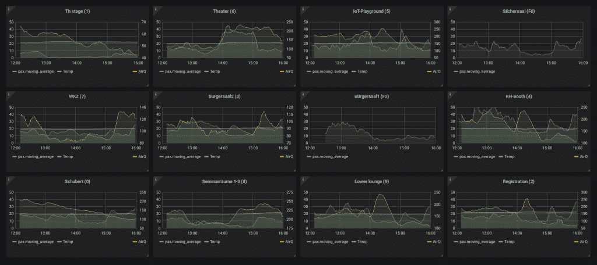

# EclipseCon 物联网操场上的 LoRaWAN 设置

> 原文：<https://developers.redhat.com/blog/2019/12/10/lorawan-setup-at-the-eclipsecon-iot-playground>

最近在德国路德维希堡举行的 [EclipseCon Europe](https://www.eclipsecon.org/europe2019) 展会上，我们在物联网展区设置了一个大型仪表盘，显示 WiFi 设备数量、温度和空气质量的图表，所有这些都通过 [LoRaWAN](https://lora-alliance.org/about-lorawan) 传输。我们在社区日期间致力于这个项目，并在整个会议期间保留了这个设置，在会议期间我们展示了它，并对它进行了进一步的处理。本文描述了该设置的体系结构，并给出了复制它的方法。

## 传感器

我们选择这个 [PAX 计数器](https://github.com/cyberman54/ESP32-Paxcounter)作为我们的传感器设备。基于 ESP32 和 LoRaWAN，它允许您测量该地区独特的 WiFi 客户端的数量。顾名思义，PAX 计数器只对设备进行计数。它不会跟踪它们，而这个功能正是我们想要的。此外，您可以添加额外的传感器，BME680 空气质量传感器开箱即可获得支持。虽然拥有开源固件很棒，但拥有随时运行的体验也很棒。幸运的是，这个 PAX 柜台给了我们两个。

## 云的一边

为了获得良好的 LoRa 覆盖，我们部署了两个[物联网室内](https://www.thethingsnetwork.org/docs/gateways/thethingsindoor/)网关。这些设备很便宜，也很容易安装，其中两个就可以覆盖整个场地。我们最初的目标是在一个简单的 Grafana 仪表板中提供数据可视化，以便人们可以感受到我们部署了什么。

我们的后端架构使用了 Eclipse Hono、Qpid 调度路由器和 Apache Kafka，如下所示:

将遥测数据从物联网转发到 Grafana 仪表板应该不需要那么多组件。然而，我们的想法不仅仅是在仪表板上显示数据。

## 准备好迎接不止是洛拉万

我们与来自 [Eclipse MicroProfile](https://developers.redhat.com/videos/youtube/GKYROutwJHU/) 的人合作，也提供了到数据流的连接。为此，[阿帕奇卡夫卡](https://developers.redhat.com/videos/youtube/CZhOJ_ysIiI/)似乎是正确的选择。Kafka 可以持久保存数据流，并允许您在以后连接到它，从开始重新开始使用，而已经存在的仪表板将继续接收数据，没有任何更改或中断。我们还可以添加任意多的用户，像其他用户一样消费数据。

我们不想把自己局限于这一个传感器，只局限于 LoRaWAN 或物联网。这就是 Eclipse Hono 发挥作用的地方。它有能力将不同的物联网协议标准化，如 LoRaWAN 上行链路，或 MQTT 和 Sigfox 到 AMQP 1.0。使用这个工具使我们能够插入任何其他数据提供者，而不会被数据管道的其他部分注意到。

## 完成设置

当然，还有数据格式的问题。Eclipse Hono 和 Kafka 都是有效载荷不可知的。不幸的是，传感器有自己的数据格式，InfluxDB 有自己的自定义 API。将两者结合在一起并不太难，但是使用 Apache Camel 会更简单。几行 XML 或 Java 代码，你就有了两个正在运行的桥，一个将原始物联网数据从 EnMasse 消息传递地址转发到 Kafka 主题。另一个用于解析有效负载，并将其注入 InfluxDB。

为什么我们决定在第二步解析有效载荷？Kafka 让存储来自物联网层的每一条消息变得如此简单。传感器提供的数据比我们想要插入时间序列数据库的数据要多。通过以这种方式处理事情，我们仍然拥有 Kafka 集群中可用的原始值，其他人可以在必要时使用它们。

部署完所有的传感器后，看到这种可视化变得真实起来真是太棒了:

大仪表板显示了每个传感器的信息，包括 WiFi 设备的数量、当前温度和空气质量指数。默认情况下，您可以看到过去三个小时。

## 使用微配置文件

当然，如果能利用数据做一些更有趣的事情，而不仅仅是拥有一个漂亮的仪表板，那就更好了。这就是我们在社区日期间通过将一个 [Quarkus](https://quarkus.io/) 应用程序连接到 Kafka 数据流并开始处理它而开始尝试的。不幸的是，设置适当的 TLS 和身份验证花费的时间比预期的要长，所以我们没有时间了。

然而，这并不妨碍我们继续。下一节的资源库肯定会看到与物联网相关的 Quarkus 例子。

## 你自己试试吧

部署这个解决方案实际上相当容易，并且应该很容易复制。毕竟，我们重用了 EnMasse 和 Strimzi 等现有组件来部署 Hono 和 Kafka。当然，你可以用[红帽 AMQ 在线](https://developers.redhat.com/blog/2019/05/14/bringing-iot-to-red-hat-amq-online/)和[红帽 AMQ 流](https://access.redhat.com/products/red-hat-amq)做同样的事情，因为 LoRaWAN 适配器是红帽 AMQ 在线 1.3 的物联网技术预览版的一部分。

你可以在 GitHub 资源库[ctron/ECE 2019-IOT-playground](https://github.com/ctron/ece2019-iot-playground/)中找到部署脚本。

*Last updated: July 1, 2020*