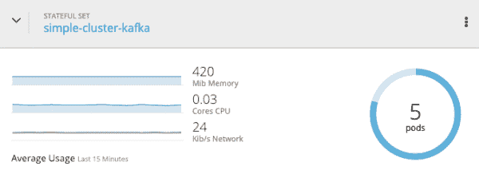
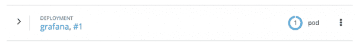
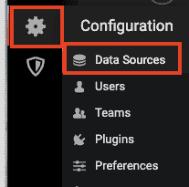
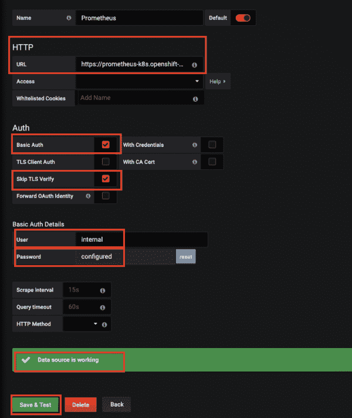
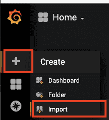
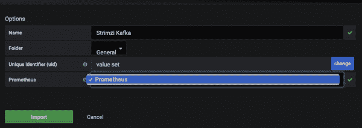

# 了解 OpenShift 和 Kubernetes 的红帽 AMQ 流组件:第 3 部分

> 原文：<https://developers.redhat.com/blog/2019/12/06/understanding-red-hat-amq-streams-components-for-openshift-and-kubernetes-part-3>

在本系列的前几篇文章中，我们首先介绍了 OpenShift 上红帽 AMQ 流的[基础知识，然后向](https://developers.redhat.com/blog/2019/12/04/understanding-red-hat-amq-streams-components-for-openshift-and-kubernetes-part-1/)[展示了如何设置 Kafka Connect、Kafka Bridge 和 Kafka Mirror Maker。](https://developers.redhat.com/blog/2019/12/05/understanding-red-hat-amq-streams-components-for-openshift-and-kubernetes-part-2/)在我们继续之前，请记住以下几个要点:

*   AMQ 溪流是基于阿帕奇卡夫卡。
*   Red Hat OpenShift 容器平台的 AMQ 流基于 Strimzi 项目。
*   容器上的 AMQ 流有多个组件，如集群运算符、实体运算符、镜像生成器、Kafka connect 和 Kafka Bridge。

既然我们已经设置好了一切(或者我们认为是这样)，那么让我们来看看新环境的监控和警报。

## 卡夫卡出口商

默认情况下，Kafka 集群不会导出其所有指标。因此，我们需要使用 Kafka Exporter 来收集集群的代理状态、使用情况和性能。重要的是要有更多的洞察力，这样你才能理解消费者的消息消费是否与生产者的消息推送速度相同。否则，这种缓慢的消费行为会让系统付出代价。建议尽早发现这些问题。

要设置 Kafka Exporter，首先要编辑现有的 Kafka 集群配置，或者创建一个新的配置来包含 Kafka Exporter。例如:

```
apiVersion: kafka.strimzi.io/v1beta1
kind: Kafka
metadata:
  name: simple-cluster
spec:
  kafka:
    version: 2.3.0
    replicas: 5
    listeners:
      plain: {}
      tls: {}
    config:
      offsets.topic.replication.factor: 5
      transaction.state.log.replication.factor: 5
      transaction.state.log.min.isr: 2
      log.message.format.version: "2.3"
    storage:
      type: jbod
      volumes:
      - id: 0
        type: persistent-claim
        size: 5Gi
        deleteClaim: false
  zookeeper:
    replicas: 3
    storage:
      type: persistent-claim
      size: 5Gi
      deleteClaim: false 
  entityOperator:
    topicOperator: {}
    userOperator: {}
  kafkaExporter: {}

```

接下来，将新的更改应用到现有集群:

```
$ oc apply -f amq-kafka-cluster-kafka-exporter.yml
```

您可以在图 1 中看到结果:

[](/sites/default/files/blog/2019/11/img_5dccd925de3ef.png)

Figure 1: Your new Kafka Exporter instance.

## 普罗米修斯和格拉夫纳

Prometheus 是一个系统监控和警报工具包，它从 Kafka 集群中抓取指标。这个工具的缺点是它没有一个好的 GUI。因此，我们使用 [Grafana](https://grafana.com/oss/grafana/) 作为界面，使用 Prometheus 作为数据馈送来创建操作仪表板。

让我们从指标和创建控制面板开始:

1.  向 Kafka 资源添加 Kafka 指标。这个片段引用自作为红帽 AMQ 流产品的一部分提供的`examples/metrics/kafka-metrics.yaml`文件:

```
$ oc project amq-streams
$ oc edit kafka simple-cluster

# Add the below in the spec->kafka

    metrics:
      # Inspired by config from Kafka 2.0.0 example rules:
      # https://github.com/prometheus/jmx_exporter/blob/master/example_configs/kafka-2_0_0.yml
      lowercaseOutputName: true
      rules:
      # Special cases and very specific rules
      - pattern : kafka.server<type=(.+), name=(.+), clientId=(.+), topic=(.+), partition=(.*)><>Value
        name: kafka_server_$1_$2
        type: GAUGE
        labels:
          clientId: "$3"
          topic: "$4"
          partition: "$5"
      - pattern : kafka.server<type=(.+), name=(.+), clientId=(.+), brokerHost=(.+), brokerPort=(.+)><>Value
        name: kafka_server_$1_$2
        type: GAUGE
        labels:
          clientId: "$3"
          broker: "$4:$5"
      # Some percent metrics use MeanRate attribute
      # Ex) kafka.server<type=(KafkaRequestHandlerPool), name=(RequestHandlerAvgIdlePercent)><>MeanRate
      - pattern: kafka.(\w+)<type=(.+), name=(.+)Percent\w*><>MeanRate
        name: kafka_$1_$2_$3_percent
        type: GAUGE
      # Generic gauges for percents
      - pattern: kafka.(\w+)<type=(.+), name=(.+)Percent\w*><>Value
        name: kafka_$1_$2_$3_percent
        type: GAUGE
      - pattern: kafka.(\w+)<type=(.+), name=(.+)Percent\w*, (.+)=(.+)><>Value
        name: kafka_$1_$2_$3_percent
        type: GAUGE
        labels:
          "$4": "$5"
      # Generic per-second counters with 0-2 key/value pairs
      - pattern: kafka.(\w+)<type=(.+), name=(.+)PerSec\w*, (.+)=(.+), (.+)=(.+)><>Count
        name: kafka_$1_$2_$3_total
        type: COUNTER
        labels:
          "$4": "$5"
          "$6": "$7"
      - pattern: kafka.(\w+)<type=(.+), name=(.+)PerSec\w*, (.+)=(.+)><>Count
        name: kafka_$1_$2_$3_total
        type: COUNTER
        labels:
          "$4": "$5"
      - pattern: kafka.(\w+)<type=(.+), name=(.+)PerSec\w*><>Count
        name: kafka_$1_$2_$3_total
        type: COUNTER
      # Generic gauges with 0-2 key/value pairs
      - pattern: kafka.(\w+)<type=(.+), name=(.+), (.+)=(.+), (.+)=(.+)><>Value
        name: kafka_$1_$2_$3
        type: GAUGE
        labels:
          "$4": "$5"
          "$6": "$7"
      - pattern: kafka.(\w+)<type=(.+), name=(.+), (.+)=(.+)><>Value
        name: kafka_$1_$2_$3
        type: GAUGE
        labels:
          "$4": "$5"
      - pattern: kafka.(\w+)<type=(.+), name=(.+)><>Value
        name: kafka_$1_$2_$3
        type: GAUGE
      # Emulate Prometheus 'Summary' metrics for the exported 'Histogram's.
      # Note that these are missing the '_sum' metric!
      - pattern: kafka.(\w+)<type=(.+), name=(.+), (.+)=(.+), (.+)=(.+)><>Count
        name: kafka_$1_$2_$3_count
        type: COUNTER
        labels:
          "$4": "$5"
          "$6": "$7"
      - pattern: kafka.(\w+)<type=(.+), name=(.+), (.+)=(.*), (.+)=(.+)><>(\d+)thPercentile
        name: kafka_$1_$2_$3
        type: GAUGE
        labels:
          "$4": "$5"
          "$6": "$7"
          quantile: "0.$8"
      - pattern: kafka.(\w+)<type=(.+), name=(.+), (.+)=(.+)><>Count
        name: kafka_$1_$2_$3_count
        type: COUNTER
        labels:
          "$4": "$5"
      - pattern: kafka.(\w+)<type=(.+), name=(.+), (.+)=(.*)><>(\d+)thPercentile
        name: kafka_$1_$2_$3
        type: GAUGE
        labels:
          "$4": "$5"
          quantile: "0.$6"
      - pattern: kafka.(\w+)<type=(.+), name=(.+)><>Count
        name: kafka_$1_$2_$3_count
        type: COUNTER
      - pattern: kafka.(\w+)<type=(.+), name=(.+)><>(\d+)thPercentile
        name: kafka_$1_$2_$3
        type: GAUGE
        labels:
          quantile: "0.$4"

```

该过程将逐个重启`simple-cluster-kafka`窗格，如图 2 所示:

[](/sites/default/files/blog/2019/11/img_5dcdd6da69fc4.png)

Figure 2: Restarting the pods.

2.  确认您已让 Prometheus 在集群中运行:

```
$ oc get pod -n openshift-monitoring | grep prometheus
prometheus-k8s-0                               4/4       Running   140        3d
prometheus-k8s-1                               4/4       Running   140        3d
prometheus-operator-687784bd4b-56vsk           1/1       Running   127        3d
```

如果上面没有返回任何 Prometheus pods，请咨询您的基础架构团队，以了解它们的安装位置。如果未安装，则查看文档中的 [Prometheus 安装步骤。](https://access.redhat.com/documentation/en-us/red_hat_amq/7.5/html/using_amq_streams_on_openshift/assembly-metrics-setup-str#assembly-metrics-prometheus-str)

3.  安装 Grafana:

```
$ oc create -f https://raw.githubusercontent.com/strimzi/strimzi-kafka-operator/master/metrics/examples/grafana/grafana.yaml
```

您可以在图 3 中看到结果:

[](/sites/default/files/blog/2019/11/img_5dcde27326144.png)

Figure 3: Grafana is now deployed.

4.  为 Grafana 服务创建一条路线:

```
$ oc expose svc grafana --name=grafana-route
```

5.  登录到管理控制台(如图 4 所示):

```
$ oc get route | grep grafana
grafana-route grafana-route-amq-streams.apps.redhat.demo.com grafana
```

[](/sites/default/files/blog/2019/11/img_5dcde3b42e910.png)

Figure 4: The Grafana admin window.

**注意:**默认凭证为`admin`和`admin`。

当你第一次登录时，Grafana 会要求你更改密码。

6.  添加普罗米修斯作为数据源。进入设置图标，选择*数据源*，然后选择*普罗米修斯、*，如图 5 所示:

[](/sites/default/files/blog/2019/11/img_5dcde684b32dd.png)

Figure 5: The Graphana settings menu.

7.  输入普罗米修斯详细信息并保存:

*   **网址:**https://Prometheus-k8s . open shift-monitoring . SVC:9091
*   **基本验证:**已启用
*   **跳过 TLS 验证:**启用
*   **用户:**内部
*   **通过:**从集群管理员那里获得这些详细信息。

在继续之前，消息“数据源正在工作”应该出现在底部，如图 6 所示:

[](/sites/default/files/blog/2019/11/img_5dcdec58e1277.png)

Figure 6: Ready to proceed with the new configuration.

8.  选择 **+** ，然后选择*导入*，打开*导入*选项，如图 7 所示:

[](/sites/default/files/blog/2019/11/img_5dcde5947757f.png)

Figure 7: Select + and then Import to access the Import options dialog box.

9.  点击*上传。json 文件*来添加来自`examples/metrics/grafana-dashboards/strimzi-kafka.json`的 `strimzi-kafka.json`文件。
10.  选择*普罗米修斯*作为数据源，然后点击*导入:*

[](/sites/default/files/blog/2019/11/img_5dcded448a351.png)

Figure 8: Importing the sample dashboard.

这样做应该会产生示例 Grafana 仪表板。

## 结论

在本文中，我们探索了可以帮助我们监控红帽 AMQ 流的工具。这篇文章全面完善了我们的系列，我们涵盖了:

1.  动物园管理员、卡夫卡和实体操作者创作。
2.  [卡夫卡连接，卡夫卡桥，和镜像制造者。](https://developers.redhat.com/blog/2019/12/05/understanding-red-hat-amq-streams-components-for-openshift-and-kubernetes-part-2/)
3.  监控和管理(本文)。

希望您现在对如何在容器生态系统中运行 AMQ 流有了更好的理解。仔细阅读我们的示例，亲自看看结果。

### 参考

*   [Kafka Connect 文档](https://docs.confluent.io/current/connect/index.html)
*   [在 OpenShift 上使用 AMQ 流](https://access.redhat.com/documentation/en-us/red_hat_amq/7.5/html-single/using_amq_streams_on_openshift/index)
*   [改进普罗米修斯指标](https://strimzi.io/2019/10/14/improving-prometheus-metrics.html)

*Last updated: October 6, 2022*