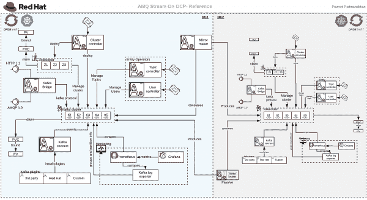
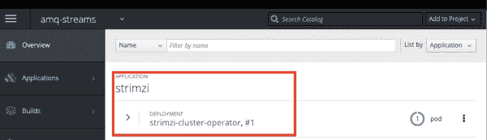
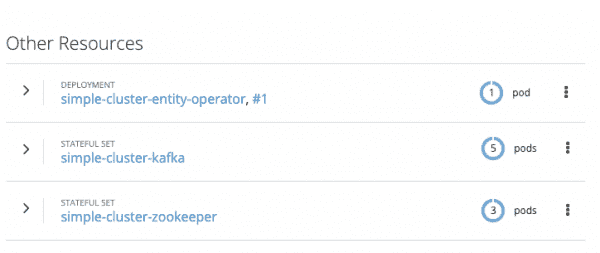
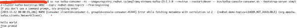

# 了解 OpenShift 和 Kubernetes 的红帽 AMQ 流组件:第 1 部分

> 原文：<https://developers.redhat.com/blog/2019/12/04/understanding-red-hat-amq-streams-components-for-openshift-and-kubernetes-part-1>

[红帽 AMQ 流](https://access.redhat.com/products/red-hat-amq#streams)是一个企业级[阿帕奇卡夫卡](https://kafka.apache.org/)(事件流)解决方案，使系统能够以高吞吐量和低延迟交换数据。AMQ 流作为红帽 AMQ 产品的一部分有两种不同的版本:一种在[红帽企业 Linux 平台](https://access.redhat.com/documentation/en-us/red_hat_amq/7.5)上，另一种在 [OpenShift 容器平台](https://access.redhat.com/documentation/en-us/red_hat_amq/7.5)上。在这个由三部分组成的文章系列中，我们将讨论 OpenShift 容器平台上的 AMQ 流。

为了充分利用这些文章，熟悉消息传递概念、 [Red Hat OpenShift](https://developers.redhat.com/openshift/) 和 [Kubernetes](https://developers.redhat.com/topics/kubernetes/) 会有所帮助。

当在容器上运行时，AMQ 流会带来不同的挑战(参见 Sean Glover 的演讲),例如:

*   升级卡夫卡
*   开始部署
*   管理动物园管理员
*   更换经纪人
*   重新平衡主题分区
*   停用或添加代理

使用来自 [Strimzi](https://strimzi.io/) 项目的[操作符模式](https://kubernetes.io/docs/concepts/extend-kubernetes/operator/)解决了这些挑战。

现在我们有了红帽 AMQ 流的基本背景，让我们深入了解它是如何工作的。

## 红帽 AMQ 溪流深潜

AMQ 物流有多个运营商，这有助于解决在集装箱领域运营 AMQ 物流的挑战:

*   **集群操作员**:在企业容器上部署和管理 Kafka 集群。
*   **实体操作符**:使用两个不同的子操作符管理用户和主题。**主题操作员**管理你的 Kafka 集群中的 Kafka 主题，**用户操作员**管理你的 Kafka 集群上的 Kafka 用户。
*   **Kafka Connect** :将外部系统连接到 Kafka 集群。
*   **Kafka Mirror Maker** :在 Kafka 集群之间复制数据。
*   **Kafka Bridge** :充当不同协议和 Kafka 集群之间的桥梁。目前支持 HTTP 1.1 和 AMQP 1.0。

图 1 显示了红帽 OpenShift 上红帽 AMQ 溪流的鸟瞰图:

[](/sites/default/files/blog/2019/11/img_5dcca436f1380.png)

Figure 1: How Red Hat AMQ Streams and Red Hat OpenShift interact.

现在让我们为所有这些组件创建一个“hello world”程序。鉴于本演练的篇幅，我们将分三篇文章讨论这个主题，如下所示:

*   第 1 部分:设置 ZooKeeper、Kafka 和实体操作符
*   第 2 部分:卡夫卡连接、卡夫卡桥和镜子制造者
*   第 3 部分:监控和管理

## 设置 ZooKeeper、Kafka 和实体操作符

在开始之前，您需要一个订阅了 Red Hat 的 OCP 集群来访问 Red Hat 容器映像，并具有集群管理访问权限。本演练使用红帽 AMQ 流 1.3.0:

1.  从[红帽 AMQ 流 1.3.o 下载页面](https://access.redhat.com/announcements/4529551)下载并解压红帽 AMQ 流 1.3.0 和 OpenShift 容器平台镜像:

```
$ unzip amq-streams-1.3.0-ocp-install-examples.zip
```

会有两个文件夹:`examples`和`install`。

2.  登录并为 AMQ 流创建一个新的项目和名称空间(参见图 2):

```
$ oc login -u admin_user -p admin_password https://redhat.ocp.cluster.url.com
$ oc new-project amq-streams
```

[](/sites/default/files/blog/2019/11/img_5dc8b39a0ac6a.png)

Figure 2: AMQ Streams now shows up as a project.

3.  导航到`install/cluster-operator`文件夹，修改角色绑定 YAML 文件，使用`amq-streams`作为它们的名称空间:

```
$ sed -i 's/namespace: .*/namespace: amq-streams/' install/cluster-operator/*RoleBinding*.yaml
```

对于 macOS:

```
$ sed -i '' 's/namespace: .*/namespace: amq-streams/' install/cluster-operator/*RoleBinding*.yaml
```

4.  创建集群操作符(参见图 3):

```
$ oc apply -f install/cluster-operator
kafka_2.12-2.3.0.redhat-00003 pramod$ oc apply -f install/cluster-operator
serviceaccount/strimzi-cluster-operator created
clusterrole.rbac.authorization.k8s.io/strimzi-cluster-operator-namespaced created
rolebinding.rbac.authorization.k8s.io/strimzi-cluster-operator created
clusterrole.rbac.authorization.k8s.io/strimzi-cluster-operator-global created
clusterrolebinding.rbac.authorization.k8s.io/strimzi-cluster-operator created
clusterrole.rbac.authorization.k8s.io/strimzi-kafka-broker created
clusterrolebinding.rbac.authorization.k8s.io/strimzi-cluster-operator-kafka-broker-delegation created
clusterrole.rbac.authorization.k8s.io/strimzi-entity-operator created
rolebinding.rbac.authorization.k8s.io/strimzi-cluster-operator-entity-operator-delegation created
clusterrole.rbac.authorization.k8s.io/strimzi-topic-operator created
rolebinding.rbac.authorization.k8s.io/strimzi-cluster-operator-topic-operator-delegation created
customresourcedefinition.apiextensions.k8s.io/kafkas.kafka.strimzi.io created
customresourcedefinition.apiextensions.k8s.io/kafkaconnects.kafka.strimzi.io created
customresourcedefinition.apiextensions.k8s.io/kafkaconnects2is.kafka.strimzi.io created
customresourcedefinition.apiextensions.k8s.io/kafkatopics.kafka.strimzi.io created
customresourcedefinition.apiextensions.k8s.io/kafkausers.kafka.strimzi.io created
customresourcedefinition.apiextensions.k8s.io/kafkamirrormakers.kafka.strimzi.io created
customresourcedefinition.apiextensions.k8s.io/kafkabridges.kafka.strimzi.io created
deployment.apps/strimzi-cluster-operator created
```

[](/sites/default/files/blog/2019/11/img_5dc8d869524a2.png)

Figure 3: The strimzi-cluster-operator was created.

5.  确保您有八个物理卷。对于演练，我们使用 5GB 永久卷:

```
$ oc get pv | grep Available
kafka_2.12-2.3.0.redhat-00003 pramod$ oc get pv -o wide | grep Available
NAME   CAPACITY  ACCESS MODES  RECLAIM POLICY  STATUS     CLAIM  STORAGECLASS   REASON    AGE
pv14   5Gi       RWO           Recycle         Available                                  34m
pv19   5Gi       RWO           Recycle         Available                                  34m
pv20   5Gi       RWO           Recycle         Available                                  34m
pv21   5Gi       RWO           Recycle         Available                                  34m
pv23   5Gi       RWO           Recycle         Available                                  34m
pv3    5Gi       RWO           Recycle         Available                                  34m
pv5    5Gi       RWO           Recycle         Available                                  34m
pv9    5Gi       RWO           Recycle         Available                                  34m
```

6.  创建持久集群配置`amq-kafka-cluster.yml`。`examples/kafka/kafka-persistent.yml`中的示例文件用作此配置的参考:

```
apiVersion: kafka.strimzi.io/v1beta1
kind: Kafka
metadata:
  name: simple-cluster
spec:
  kafka:
    version: 2.3.0
    replicas: 5
    listeners:
      plain: {}
      tls: {}
    config:
      offsets.topic.replication.factor: 5
      transaction.state.log.replication.factor: 5
      transaction.state.log.min.isr: 2
      log.message.format.version: "2.3"
    storage:
      type: jbod
      volumes:
      - id: 0
        type: persistent-claim
        size: 5Gi
        deleteClaim: false
  zookeeper:
    replicas: 3
    storage:
      type: persistent-claim
      size: 5Gi
      deleteClaim: false
  entityOperator:
    topicOperator: {}
    userOperator: {}
```

7.  创建 AMQ 流集群(参见图 4):

```
$ oc apply -f amq-kafka-cluster.yml
pramod$ oc get pv | grep Bound
pv12 5Gi RWO Recycle Bound ocplab/mongodb 38m
pv14 5Gi RWO Recycle Bound amq-streams/data-0-simple-cluster-kafka-4 38m
pv19 5Gi RWO Recycle Bound amq-streams/data-0-simple-cluster-kafka-3 38m
pv20 5Gi RWO Recycle Bound amq-streams/data-0-simple-cluster-kafka-2 38m
pv21 5Gi RWO Recycle Bound amq-streams/data-0-simple-cluster-kafka-1 38m
pv23 5Gi RWO Recycle Bound amq-streams/data-0-simple-cluster-kafka-0 38m
pv3 5Gi RWO Recycle Bound amq-streams/data-simple-cluster-zookeeper-2 38m
pv5 5Gi RWO Recycle Bound amq-streams/data-simple-cluster-zookeeper-0 38m
pv9 5Gi RWO Recycle Bound amq-streams/data-simple-cluster-zookeeper-3 38m
```

[](/sites/default/files/blog/2019/11/img_5dc8e3b3c15d3.png)

Figure 4: ZooKeeper, Kafka, and the Entity operator now appear.

要测试集群，请执行以下操作:

1.  登录 OpenShift 容器平台(OCP)集群，创建一个生产者示例应用程序，并推送几条消息:

```
$ oc run kafka-producer -ti --image=registry.redhat.io/amq7/amq-streams-kafka-23:1.3.0 --rm=true --restart=Never -- bin/kafka-console-producer.sh --broker-list simple-cluster-kafka-bootstrap:9092 --topic redhat-demo-topics
If you don't see a command prompt, try pressing enter.
>hello world
>from pramod
```

暂时忽略警告。

2.  打开另一个终端并创建一个消费者示例应用程序来收听消息:

```
$ oc run kafka-consumer -ti --image=registry.redhat.io/amq7/amq-streams-kafka-23:1.3.0 --rm=true --restart=Never -- bin/kafka-console-consumer.sh --bootstrap-server simple-cluster-kafka-bootstrap:9092 --topic redhat-demo-topics --from-beginning
```

您应该看到两条消息，它们是使用生产者终端发布的，如图 5 所示:

[](/sites/default/files/blog/2019/11/img_5dc9f71d54ebe.png)

Figure 5: The consumer terminal listening to the producer's messages.

3.  使用 Ctrl+C 退出生产者和消费者连接。

## 结论

在本文中，我们探讨了红帽 AMQ 流的基础知识及其组成部分。我们还展示了如何在 Red Hat OpenShift 上创建一个基本的 Red Hat AMQ 集群。在下一篇文章中，我们将讨论 Kafka Connect、Kafka Bridge 和 Mirror Maker。

### 参考

*   [片段的 GitHub](https://github.com/pramodmax/amqstream-getting-started)
*   [红帽 AMQ 流 1.3](https://access.redhat.com/products/red-hat-amq#streams)
*   [条纹图](https://strimzi.io/)
*   [使用 Strimzi 在 Kubernetes 上运行 Kafka，实现实时流媒体应用](https://www.youtube.com/watch?v=rzHQvImn2XY)
*   [在 OpenShift 上使用 AMQ 流](https://access.redhat.com/documentation/en-us/red_hat_amq/7.5/html-single/using_amq_streams_on_openshift/index)

*Last updated: January 18, 2022*