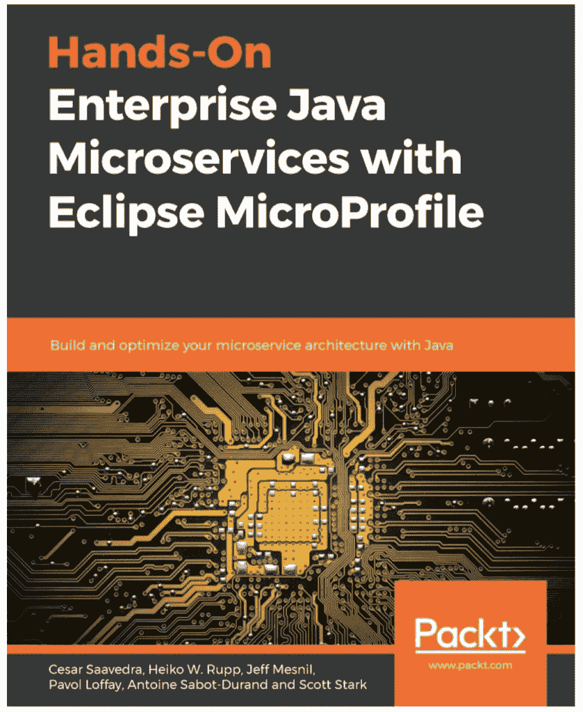

# 新的 Eclipse MicroProfile 书籍介绍了企业 Java 微服务

> 原文：<https://developers.redhat.com/blog/2019/12/02/new-eclipse-microprofile-book-provides-introduction-to-enterprise-java-microservices>

Red Hat 的同事 Cesar Saavedra、Pavol Loffay、Jeff Mesnil、T2、Antoine Sabot-Durand、Scott Stark 和我写了一本关于 T4 Eclipse MicroProfile 的书，名为《使用 Eclipse micro profile 的企业 Java 微服务实践》。

这本 256 页的书介绍了微服务及其重要性，并展示了 Eclipse MicroProfile 作为实现所谓的 12 因素应用程序的一种方式。

从现在到 12 月 15 日，您可以使用以下链接和折扣代码，通过 Packt 网站购买本电子书，享受八折优惠。

[*用 Eclipse 微文件动手做企业 Java 微服务*](https://www.packtpub.com/in/web-development/hands-on-enterprise-java-microservices-with-eclipse-microprofile)

折扣代码: **eclipse20**

这本书包括对以下微配置文件特性的详细解释和示例:配置、容错、健康检查、JWT 传播、度量和开放跟踪。通过一个会议应用程序示例展示了 MicroProfile 实现、Quarkus 和互操作性，并提供了一个工作中的 Eclipse MicroProfile 代码示例。我们还将讨论未来的发展以及在多云环境中使用 MicroProfile。

### [用 Eclipse MicroProfile 实践企业 Java 微服务](https://www.packtpub.com/web-development/hands-on-enterprise-java-microservices-with-eclipse-microprofile)

请访问 [Packt 网站](https://www.packtpub.com/web-development/hands-on-enterprise-java-microservices-with-eclipse-microprofile)了解更多信息。

*Last updated: July 1, 2020*