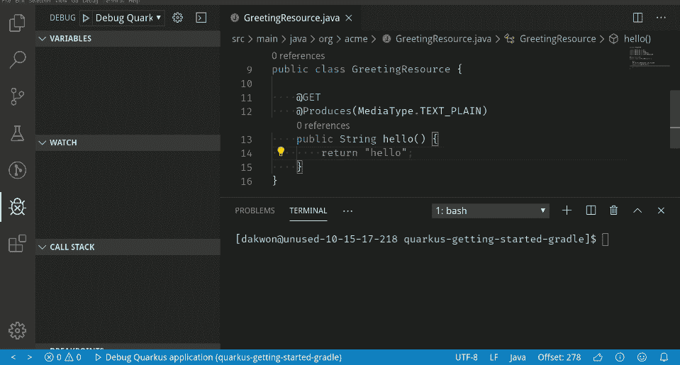
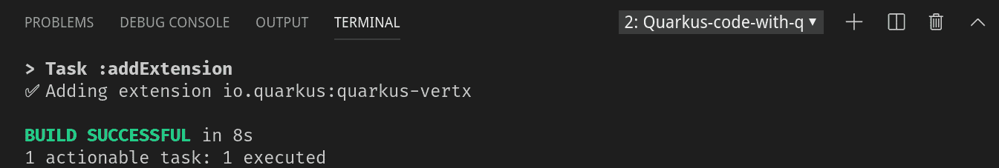
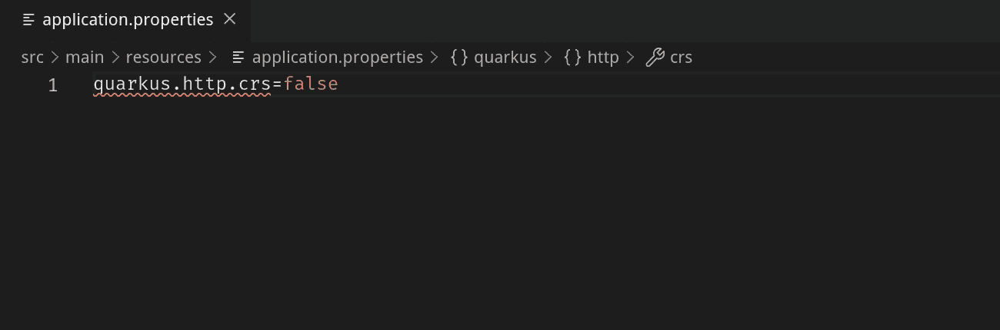
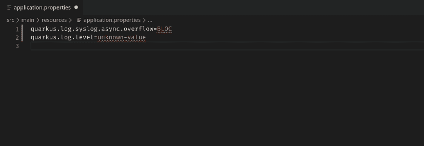
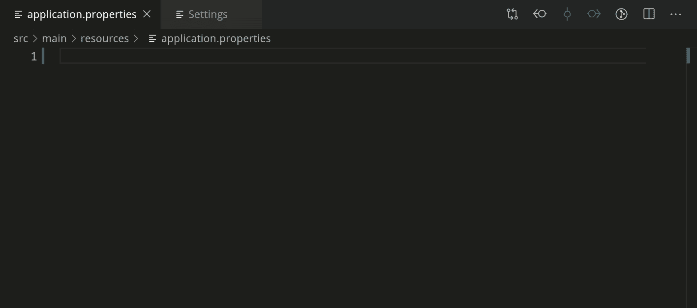
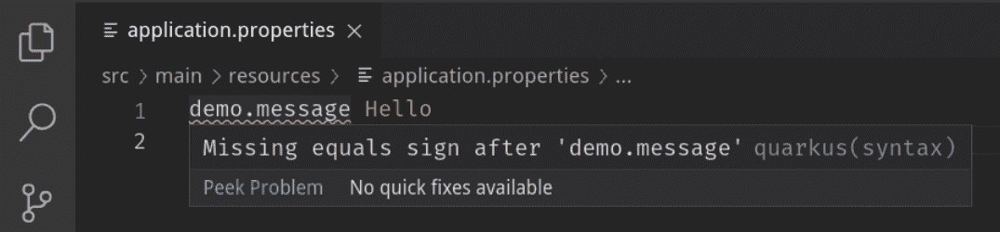
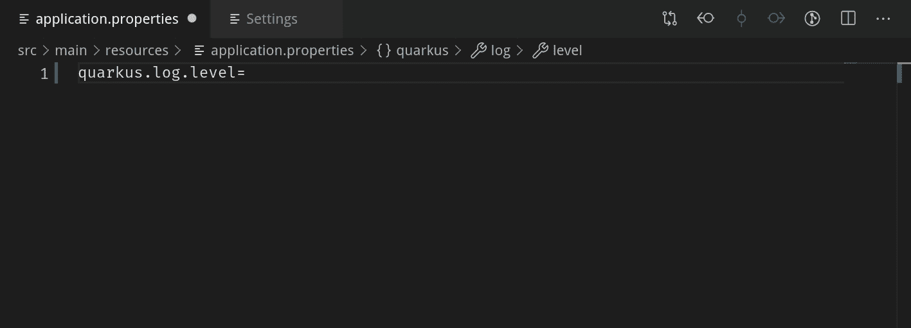
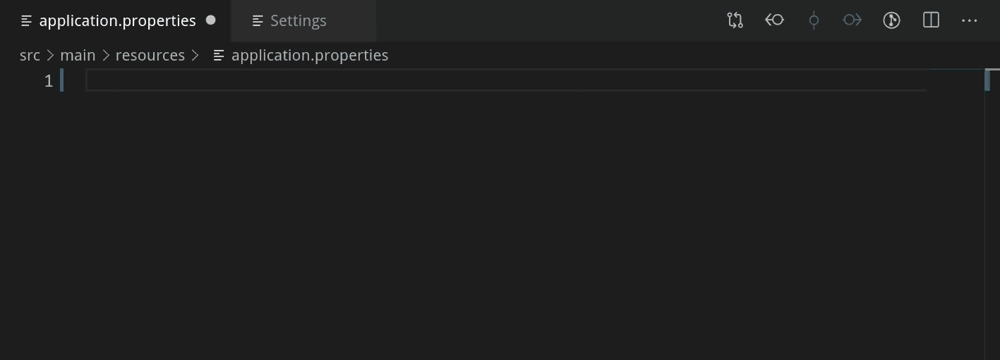

# Quarkus Tools for Visual Studio 代码 1.2.0 中的新功能

> 原文：<https://developers.redhat.com/blog/2019/11/21/new-features-in-quarkus-tools-for-visual-studio-code-1-2-0>

我们很自豪地向您展示 Visual Studio 代码的 [Quarkus 工具的新版本，为](https://marketplace.visualstudio.com/items?itemName=redhat.vscode-quarkus) [Quarkus](https://developers.redhat.com/topics/quarkus/) 应用程序开发提供 [VS 代码](https://developers.redhat.com/blog/category/vs-code/)的功能丰富的开发体验。这个版本主要介绍对 Gradle 项目的工具支持，以及添加新的`application.properties`语言特性。

观看新功能的演示:

[https://www.youtube.com/embed/hZ_JJ9izV7s?autoplay=0&start=0&rel=0](https://www.youtube.com/embed/hZ_JJ9izV7s?autoplay=0&start=0&rel=0)

## 新功能

*   Gradle —生成新的 Quarkus 项目
*   Gradle —调试 Quarkus 项目
*   Gradle —向 Quarkus 项目添加扩展
*   未知属性名称的快速修复
*   快速修复无效的枚举值
*   快速修复缺失的必需属性
*   添加排除未知属性验证的 glob 模式
*   日志级别值的语言功能支持
*   默认配置文件的文档
*   改进了生成新 quartus 项目时的输入验证

## 梯度支持

到目前为止，Quarkus Tools for Visual Studio 代码是面向 Maven Quarkus 项目的。这个版本最终为 Gradle Quarkus 项目带来了支持。展望未来，Maven 和 Gradle 都将考虑到新特性的实现。

### Gradle —生成新的 Quarkus 项目

项目生成向导现在提供了创建 Maven 或 Gradle 项目的选项。向导的其余部分和以前一样。完成向导后，您的新 Maven 或 Gradle 项目将自动下载并打开。

要打开项目生成向导，打开 VS 代码命令面板并调用`Quarkus: Generate a Quarkus project`命令。

### Gradle —调试 Quarkus 项目

debug 命令现在将检测您当前打开的 Quarkus 项目是 Maven 还是 Gradle 项目，并将通过运行 Quarkus Dev 命令启动应用程序(`mvn quarkus:dev`表示 Maven，`gradle quarkusDev`表示 Gradle)。一旦应用程序正在运行，调试器将被附加。

要运行 debug 命令，打开 VS 代码命令面板并调用`Quarkus: Debug current Quarkus project`命令。

### Gradle —向 Quarkus 项目添加扩展

添加扩展向导现在支持向 Gradle 项目添加 Quarkus 扩展。

要查看要添加的扩展列表，打开 VS 代码命令面板并调用`Quarkus: Add extensions to current project`命令。

这里添加了 Eclipse Vert.x 扩展:

由于选择了 Eclipse Vert.x，`./gradlew addExtension --extensions="quarkus-vertx"`命令将在集成终端中运行，以添加扩展:

简而言之，项目生成向导现在可以生成 Gradle 项目，并且`Quarkus: Add extensions to current project`和`Quarkus: Debug current Quarkus project`命令对*的* Gradle 和 Maven 项目都有效。

## 新`application.properties`功能

### 未知属性名称的快速修复

Quarkus Tools for Visual Studio 代码提供的验证支持检查您的`application.properties`文件中的未知属性键。这个版本带来了一个新的快速修复，建议已知属性为您的未知属性。这个特性有点像属性键的自动更正或“拼写检查”。

要执行快速修复，将鼠标悬停在未知属性上，然后单击*快速修复*以查看建议。请注意，只有当您的未知属性与已知属性同名时，快速修复建议才会出现。

### 快速修复无效的枚举值

类似地，还有一个新的快速修复方法，可以建议有效的枚举值。快速修复将建议所有有效枚举值，或者，如果无效枚举值与有效枚举值相似，则仅建议相似的枚举值。

### 快速修复缺失的必需属性

最后一个新的快速修复是将所有缺少的必需属性添加到`application.properties`文件的快速修复。要使用此功能，需要启用必需的属性验证，因为默认情况下它是禁用的。为此，打开 VS 代码设置并将 *Quarkus >工具>验证>必需>严重性*设置为*警告*或*错误*。

一旦`application.properties`文件打开，将会出现“缺少所需属性”的警告或错误信息。相应的快速修复会将所有缺少的必需属性添加到`application.properties`文件:

### 添加排除未知属性验证的 glob 模式

此版本还允许您从未知属性验证中排除某些属性。为此，转到 VS 代码设置，添加一个新的 glob 模式到 *Quarkus >工具>验证>未知>排除*设置。

这仅从未知属性验证中排除与 glob 模式匹配的属性。其他验证(如缺少等号验证)将继续工作。

这个特性的一个很好的用例是忽略某些微配置文件配置注释属性(参见 [quarkus-ls#135](https://github.com/redhat-developer/quarkus-ls/issues/135) )，Visual Studio 代码的 quarkus 工具暂时不识别这些属性。

### 日志级别值的语言功能支持

接下来，现在有了对`java.util.logging.Level`值的自动完成、文档、验证和悬停支持。自动完成将提供所有可能的值以及它们的文档。提供不正确的日志记录级别会导致验证错误。

### 默认配置文件的文档

目前，`application.properties`文件有三个默认配置文件:`%dev`、`%prod`和`%test`。悬停在默认属性上或在`%`符号后调用完成将提供相关文档:

### 验证新项目的用户输入

最后但同样重要的是，在使用向导生成新项目时，输入验证消息现在更有帮助。groupId、artifactId、包名等有不同的命名限制。现在验证消息描述的是:

这就结束了这个版本的新特性。我们将欣喜若狂地听取任何反馈和建议，因为我们非常认真地对待它们。感谢阅读，敬请期待下期发布！

### 资源

VS 代码市场:[https://marketplace.visualstudio.com/items?itemName = red hat . vs code-quar kus](https://marketplace.visualstudio.com/items?itemName=redhat.vscode-quarkus)

GitHub 库:[https://github.com/redhat-developer/vscode-quarkus](https://github.com/redhat-developer/vscode-quarkus)

开一期 GitHub:[https://github.com/redhat-developer/vscode-quarkus/issues](https://github.com/redhat-developer/vscode-quarkus/issues)

changelog:[https://github . com/red hat-developer/vs code-quar kus/blob/master/changelog . MD](https://github.com/redhat-developer/vscode-quarkus/blob/master/CHANGELOG.md)

quar kus Tools for Visual Studio Code 1 . 0 . 0 发布:[https://quarkus.io/blog/quarkus-developer-joy-for-vs-code/](https://quarkus.io/blog/quarkus-developer-joy-for-vs-code/)

*Last updated: July 1, 2020*