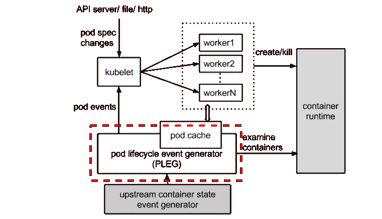
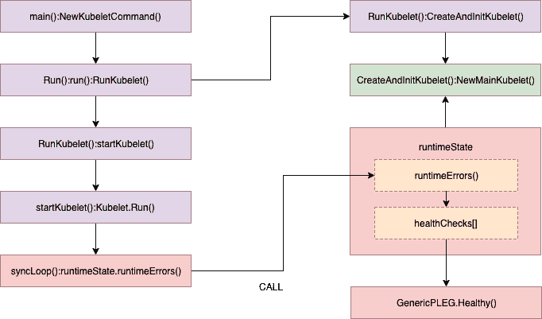
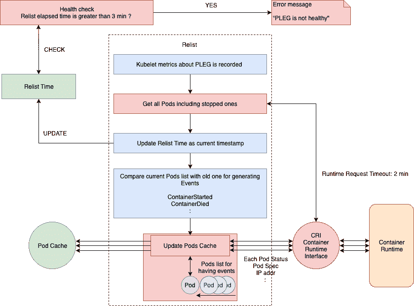
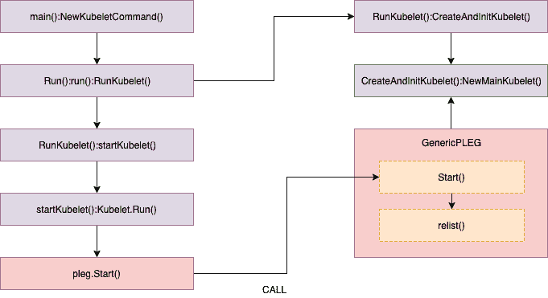
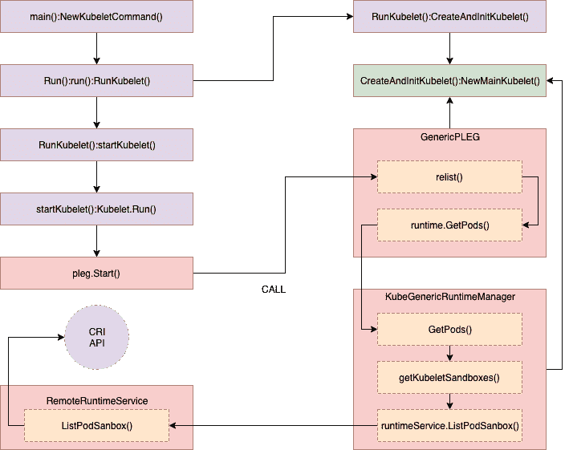
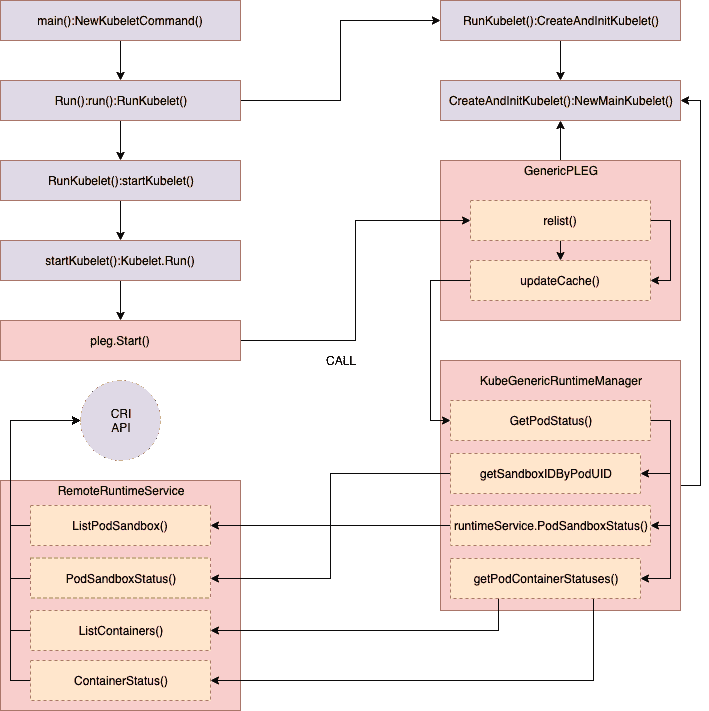
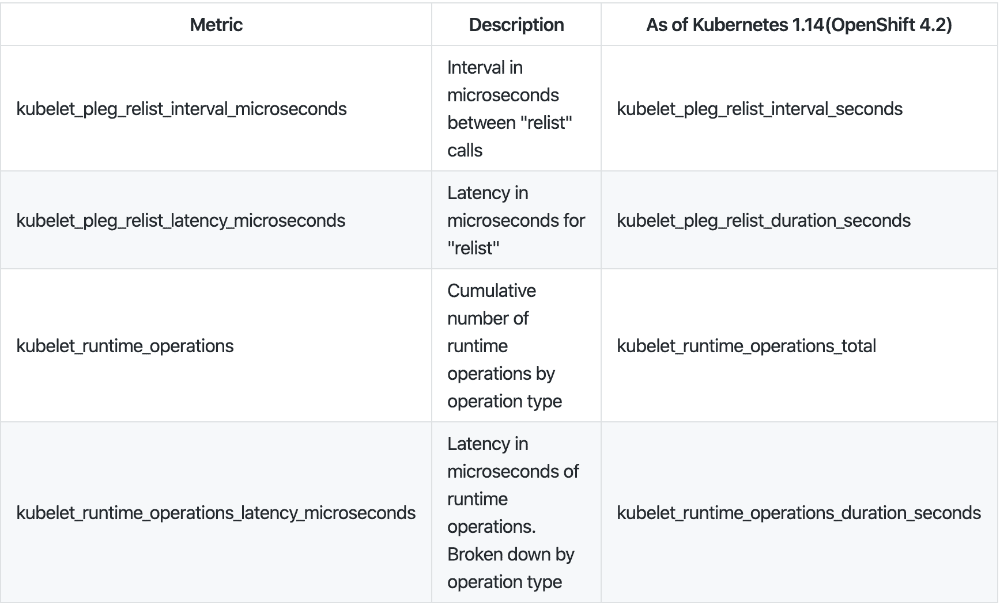

# Pod 生命周期事件生成器:了解 Kubernetes 中的“PLEG 不健康”问题

> 原文：<https://developers.redhat.com/blog/2019/11/13/pod-lifecycle-event-generator-understanding-the-pleg-is-not-healthy-issue-in-kubernetes>

在本文中，我将探讨在 [Kubernetes](https://developers.redhat.com/topics/kubernetes/) 中的“PLEG 不健康”问题，该问题有时会导致“节点未就绪”状态。在了解 Pod 生命周期事件生成器(PLEG)的工作原理时，了解有关此问题的故障排除会有所帮助。

## 什么是 PLEG？

kubelet (Kubernetes)中的 PLEG 模块使用每个匹配的 pod 级事件来调整容器运行时状态，并通过应用更改来保持 pod 缓存最新。

让我们看看流程图中下面的红色虚线。



原图在这里: [Kubelet: Pod 生命周期事件生成器(PLEG)](https://github.com/kubernetes/community/blob/master/contributors/design-proposals/node/pod-lifecycle-event-generator.md) 。

## “PLEG 不健康”是如何发生的？

Kubelet 通过在`SyncLoop()`中定期调用`Healthy()`来检查 PLEG 的健康状况，如下所示。

`Healthy()`检查`relist`过程(PLEG 关键任务)是否在 3 分钟内完成。该函数作为“PLEG”添加到`runtimeState`中，并定期从“同步循环”中调用(默认为每 10 秒一次)。如果“重新列出”过程超过 3 分钟，则通过此堆栈过程报告“PLEG 不健康”问题。

我将在每一部分带你浏览基于 Kubernetes 1.11 (OpenShift 3.11)的相关源代码，以帮助你理解。如果您不熟悉 Go 语法，也不用担心，因为阅读代码中的注释就足够了。我还将在代码前解释摘要，并从源代码中删除不太重要的内容以提高可读性。



```
//// pkg/kubelet/pleg/generic.go - Healthy()

// The threshold needs to be greater than the relisting period + the
// relisting time, which can vary significantly. Set a conservative
// threshold to avoid flipping between healthy and unhealthy.
relistThreshold = 3 * time.Minute
:
func (g *GenericPLEG) Healthy() (bool, error) {
  relistTime := g.getRelistTime()
  elapsed := g.clock.Since(relistTime)
  if elapsed > relistThreshold {
	return false, fmt.Errorf("pleg was last seen active %v ago; threshold is %v", elapsed, relistThreshold)
  }
  return true, nil
}

//// pkg/kubelet/kubelet.go - NewMainKubelet()
func NewMainKubelet(kubeCfg *kubeletconfiginternal.KubeletConfiguration, ...
:
  klet.runtimeState.addHealthCheck("PLEG", klet.pleg.Healthy)

//// pkg/kubelet/kubelet.go - syncLoop()
func (kl *Kubelet) syncLoop(updates <-chan kubetypes.PodUpdate, handler SyncHandler) {
:
// The resyncTicker wakes up kubelet to checks if there are any pod workers
// that need to be sync'd. A one-second period is sufficient because the
// sync interval is defaulted to 10s.
:
  const (
	base   = 100 * time.Millisecond
	max	= 5 * time.Second
	factor = 2
  )
  duration := base
  for {
      if rs := kl.runtimeState.runtimeErrors(); len(rs) != 0 {
   	   glog.Infof("skipping pod synchronization - %v", rs)
   	   // exponential backoff
   	   time.Sleep(duration)
   	   duration = time.Duration(math.Min(float64(max), factor*float64(duration)))
   	   continue
      }
	:
  }
:
}

//// pkg/kubelet/runtime.go - runtimeErrors()
func (s *runtimeState) runtimeErrors() []string {
:
    for _, hc := range s.healthChecks {
   	 if ok, err := hc.fn(); !ok {
   		 ret = append(ret, fmt.Sprintf("%s is not healthy: %v", hc.name, err))
   	 }
    }
:
}
```

## 查看“重新列表”

让我们来看看`relist`函数的更多细节。具体来说，您需要仔细观察远程流程调用，并检查如何处理拉取数据，因为这些部分很容易成为瓶颈。



在上面的流程图中，可以看到`relist`的流程和实现。参考[这里](https://github.com/openshift/origin/blob/release-3.11/vendor/k8s.io/kubernetes/pkg/kubelet/pleg/generic.go#L180-L284)的完整源代码。

即使`relist`被设置为每 1s 调用一次，也可能需要 1s 以上才能完成。如果容器运行时响应缓慢和/或在一个周期中有许多容器变化。所以，下一个`relist`会在前一个完成后调用。例如，如果`relist`需要 5s 才能完成，那么下一次重新列表时间就是 6s (1s + 5s)。



```
//// pkg/kubelet/kubelet.go - NewMainKubelet()

// Generic PLEG relies on relisting for discovering container events.
// A longer period means that kubelet will take longer to detect container
// changes and to update pod status. On the other hand, a shorter period
// will cause more frequent relisting (e.g., container runtime operations),
// leading to higher cpu usage.
// Note that even though we set the period to 1s, the relisting itself can
// take more than 1s to finish if the container runtime responds slowly
// and/or when there are many container changes in one cycle.
plegRelistPeriod = time.Second * 1

// NewMainKubelet instantiates a new Kubelet object along with all the required internal modules.
// No initialization of Kubelet and its modules should happen here.
func NewMainKubelet(kubeCfg *kubeletconfiginternal.KubeletConfiguration, ...
:
  klet.pleg = pleg.NewGenericPLEG(klet.containerRuntime, plegChannelCapacity, plegRelistPeriod, klet.podCache, clock.RealClock{})

//// pkg/kubelet/pleg/generic.go - Start()

// Start spawns a goroutine to relist periodically.
func (g *GenericPLEG) Start() {
  go wait.Until(g.relist, g.relistPeriod, wait.NeverStop)
}

//// pkg/kubelet/pleg/generic.go - relist()
func (g *GenericPLEG) relist() {
... WE WILL REVIEW HERE ...
}
```

该函数过程首先记录 Kubelet 的一些指标(如`kubelet_pleg_relist_latency_microseconds`)，然后使用 CRI 接口从容器运行时获取所有“pods”(包括停止的 Pods)列表，以获取当前的 Pods 状态。此窗格列表用于与以前的窗格列表进行比较，以检查更改，并且匹配的窗格级别事件会随更改的状态一起生成。

```
//// pkg/kubelet/pleg/generic.go - relist()
  :
  // get a current timestamp
  timestamp := g.clock.Now()

  // kubelet_pleg_relist_latency_microseconds for prometheus metrics
    defer func() {
   	 metrics.PLEGRelistLatency.Observe(metrics.SinceInMicroseconds(timestamp))
    }()

  // Get all the pods.
    podList, err := g.runtime.GetPods(true)
  :
```

下面是跟踪“GetPods()”调用堆栈的详细信息。



```
//// pkg/kubelet/kuberuntime/kuberuntime_manager.go - GetPods()

// GetPods returns a list of containers grouped by pods. The boolean parameter
// specifies whether the runtime returns all containers including those already
// exited and dead containers (used for garbage collection).
func (m *kubeGenericRuntimeManager) GetPods(all bool) ([]*kubecontainer.Pod, error) {
    pods := make(map[kubetypes.UID]*kubecontainer.Pod)
    sandboxes, err := m.getKubeletSandboxes(all)
:
}

//// pkg/kubelet/kuberuntime/kuberuntime_sandbox.go - getKubeletSandboxes()

// getKubeletSandboxes lists all (or just the running) sandboxes managed by kubelet.
func (m *kubeGenericRuntimeManager) getKubeletSandboxes(all bool) ([]*runtimeapi.PodSandbox, error) {
:
	resp, err := m.runtimeService.ListPodSandbox(filter)
:
}

//// pkg/kubelet/remote/remote_runtime.go - ListPodSandbox()

// ListPodSandbox returns a list of PodSandboxes.
func (r *RemoteRuntimeService) ListPodSandbox(filter *runtimeapi.PodSandboxFilter) ([]*runtimeapi.PodSandbox, error) {
:
	resp, err := r.runtimeClient.ListPodSandbox(ctx, &runtimeapi.ListPodSandboxRequest{
:
	return resp.Items, nil
}
```

获取所有 pod 后，最后的`relist`时间被更新为当前时间戳。换句话说，可以通过使用这个更新的时间戳来评估`Healthy()`。

```
//// pkg/kubelet/pleg/generic.go - relist()

  // update as a current timestamp
  g.updateRelistTime(timestamp)
```

如前所述，在比较了当前和以前的窗格列表后，每个匹配的窗格级别事件都是根据下面两个列表之间的差异/变化生成的。

这里`generateEvents()`生成匹配的 pod 级事件(如`ContainerStarted`、`ContainerDied`等)，然后由`updateEvents()`更新事件。

```
//// pkg/kubelet/pleg/generic.go - relist()

  pods := kubecontainer.Pods(podList)
  g.podRecords.setCurrent(pods)

  // Compare the old and the current pods, and generate events.
  eventsByPodID := map[types.UID][]*PodLifecycleEvent{}
  for pid := range g.podRecords {
	oldPod := g.podRecords.getOld(pid)
	pod := g.podRecords.getCurrent(pid)

	// Get all containers in the old and the new pod.
	allContainers := getContainersFromPods(oldPod, pod)
	for _, container := range allContainers {
  	    events := computeEvents(oldPod, pod, &container.ID)

  	    for _, e := range events {
    	        updateEvents(eventsByPodID, e)
  	    }
        }
  }
```

trace `computeEvents()`调用栈的详细信息如下所示。

```
//// pkg/kubelet/pleg/generic.go - computeEvents()

func computeEvents(oldPod, newPod *kubecontainer.Pod, cid *kubecontainer.ContainerID) []*PodLifecycleEvent {
:
	return generateEvents(pid, cid.ID, oldState, newState)
}

//// pkg/kubelet/pleg/generic.go - generateEvents()

func generateEvents(podID types.UID, cid string, oldState, newState plegContainerState) []*PodLifecycleEvent {
:
	glog.V(4).Infof("GenericPLEG: %v/%v: %v -> %v", podID, cid, oldState, newState)
	switch newState {
	case plegContainerRunning:
  	return []*PodLifecycleEvent{{ID: podID, Type: ContainerStarted, Data: cid}}
	case plegContainerExited:
  	return []*PodLifecycleEvent{{ID: podID, Type: ContainerDied, Data: cid}}
	case plegContainerUnknown:
  	return []*PodLifecycleEvent{{ID: podID, Type: ContainerChanged, Data: cid}}
	case plegContainerNonExistent:
  	switch oldState {
  	case plegContainerExited:
    	// We already reported that the container died before.
    	return []*PodLifecycleEvent{{ID: podID, Type: ContainerRemoved, Data: cid}}
  	default:
    	return []*PodLifecycleEvent{{ID: podID, Type: ContainerDied, Data: cid}, {ID: podID, Type: ContainerRemoved, Data: cid}}
  	}
	default:
  	panic(fmt.Sprintf("unrecognized container state: %v", newState))
  }
}
```

该过程的最后一部分检查是否有与 pod 相关联的事件，并如下更新`podCache`。

``updateCache()`将检查每个 pod，并在单个循环中逐一更新，因此，如果在同一`relist`期间有许多 pod 发生变化，此过程可能会成为瓶颈。最后，更新后的新 pod 生命周期事件被发送到`eventChannel`。`

 `跟踪调用栈细节对于理解过程并不重要，但是一些远程客户端被每个 pod 调用以获得 pod 检查信息。这可能会增加与 pod 数量成比例的延迟，因为许多 pod 通常会生成许多事件。

```
//// pkg/kubelet/pleg/generic.go - relist()

  // If there are events associated with a pod, we should update the
  // podCache.
  for pid, events := range eventsByPodID {
	pod := g.podRecords.getCurrent(pid)
	if g.cacheEnabled() {
  	// updateCache() will inspect the pod and update the cache. If an
  	// error occurs during the inspection, we want PLEG to retry again
  	// in the next relist. To achieve this, we do not update the
  	// associated podRecord of the pod, so that the change will be
  	// detect again in the next relist.
  	// TODO: If many pods changed during the same relist period,
  	// inspecting the pod and getting the PodStatus to update the cache
  	// serially may take a while. We should be aware of this and
  	// parallelize if needed.
  	if err := g.updateCache(pod, pid); err != nil {
    	glog.Errorf("PLEG: Ignoring events for pod %s/%s: %v", pod.Name, pod.Namespace, err)
    	:
  	}
  	:
	}
	// Update the internal storage and send out the events.
	g.podRecords.update(pid)
	for i := range events {
  	// Filter out events that are not reliable and no other components use yet.
  	if events[i].Type == ContainerChanged {
    	   continue
  	}
  	g.eventChannel <- events[i]
     }
  }
```

下面是跟踪`updateCache()`调用堆栈的详细信息。`GetPodStatus()`调用多个远程请求进行 pod 检查。



```
//// pkg/kubelet/pleg/generic.go - updateCache()

func (g *GenericPLEG) updateCache(pod *kubecontainer.Pod, pid types.UID) error {
:
    timestamp := g.clock.Now()
    // TODO: Consider adding a new runtime method
    // GetPodStatus(pod *kubecontainer.Pod) so that Docker can avoid listing
    // all containers again.
    status, err := g.runtime.GetPodStatus(pod.ID, pod.Name, pod.Namespace)
  :
    g.cache.Set(pod.ID, status, err, timestamp)
    return err
}

//// pkg/kubelet/kuberuntime/kuberuntime_manager.go - GetPodStatus()

// GetPodStatus retrieves the status of the pod, including the
// information of all containers in the pod that are visible in Runtime.
func (m *kubeGenericRuntimeManager) GetPodStatus(uid kubetypes.UID, name, namespace string) (*kubecontainer.PodStatus, error) {
  podSandboxIDs, err := m.getSandboxIDByPodUID(uid, nil)
  :
    for idx, podSandboxID := range podSandboxIDs {
   	 podSandboxStatus, err := m.runtimeService.PodSandboxStatus(podSandboxID)
	:
    }

    // Get statuses of all containers visible in the pod.
    containerStatuses, err := m.getPodContainerStatuses(uid, name, namespace)
  :
}

//// pkg/kubelet/kuberuntime/kuberuntime_sandbox.go - getSandboxIDByPodUID()

// getPodSandboxID gets the sandbox id by podUID and returns ([]sandboxID, error).
// Param state could be nil in order to get all sandboxes belonging to same pod.
func (m *kubeGenericRuntimeManager) getSandboxIDByPodUID(podUID kubetypes.UID, state *runtimeapi.PodSandboxState) ([]string, error) {
  :
  sandboxes, err := m.runtimeService.ListPodSandbox(filter)
  :  
  return sandboxIDs, nil
}

//// pkg/kubelet/remote/remote_runtime.go - PodSandboxStatus()

// PodSandboxStatus returns the status of the PodSandbox.
func (r *RemoteRuntimeService) PodSandboxStatus(podSandBoxID string) (*runtimeapi.PodSandboxStatus, error) {
    ctx, cancel := getContextWithTimeout(r.timeout)
    defer cancel()

    resp, err := r.runtimeClient.PodSandboxStatus(ctx, &runtimeapi.PodSandboxStatusRequest{
   	 PodSandboxId: podSandBoxID,
    })
  :
    return resp.Status, nil
}

//// pkg/kubelet/kuberuntime/kuberuntime_container.go - getPodContainerStatuses()

// getPodContainerStatuses gets all containers' statuses for the pod.
func (m *kubeGenericRuntimeManager) getPodContainerStatuses(uid kubetypes.UID, name, namespace string) ([]*kubecontainer.ContainerStatus, error) {
  // Select all containers of the given pod.
  containers, err := m.runtimeService.ListContainers(&runtimeapi.ContainerFilter{
	LabelSelector: map[string]string{types.KubernetesPodUIDLabel: string(uid)},
  })
  :
  // TODO: optimization: set maximum number of containers per container name to examine.
  for i, c := range containers {
	status, err := m.runtimeService.ContainerStatus(c.Id)
	:
  }
  :
  return statuses, nil
}
```

我们已经通过相关的源代码看了一下`relist`进程，并调用了堆栈跟踪。我希望这能给你更多关于 PLEG 的细节，以及如何在这个过程中更新所需的数据。

## 监控“重新列表”

我们可以使用 kubelet 度量来监控`relist`延迟。`relist`周期为 1 秒，换句话说，重新列表完成时间(kubelet _ pleg _ relist _ latency _ 微秒)+ 1 秒就是`kubelet_pleg_relist_interval_microseconds`。此外，您可以监视每个操作在容器运行时需要多长时间。这些指标也有助于故障排除。



您可以在节点主机上使用`https://127.0.0.1:10250/metrics`来获取指标。

```
# HELP kubelet_pleg_relist_interval_microseconds Interval in microseconds between relisting in PLEG.
# TYPE kubelet_pleg_relist_interval_microseconds summary
kubelet_pleg_relist_interval_microseconds{quantile="0.5"} 1.054052e+06
kubelet_pleg_relist_interval_microseconds{quantile="0.9"} 1.074873e+06
kubelet_pleg_relist_interval_microseconds{quantile="0.99"} 1.126039e+06
kubelet_pleg_relist_interval_microseconds_count 5146

# HELP kubelet_pleg_relist_latency_microseconds Latency in microseconds for relisting pods in PLEG.
# TYPE kubelet_pleg_relist_latency_microseconds summary
kubelet_pleg_relist_latency_microseconds{quantile="0.5"} 53438
kubelet_pleg_relist_latency_microseconds{quantile="0.9"} 74396
kubelet_pleg_relist_latency_microseconds{quantile="0.99"} 115232
kubelet_pleg_relist_latency_microseconds_count 5106

# HELP kubelet_runtime_operations Cumulative number of runtime operations by operation type.
# TYPE kubelet_runtime_operations counter
kubelet_runtime_operations{operation_type="container_status"} 472
kubelet_runtime_operations{operation_type="create_container"} 93
kubelet_runtime_operations{operation_type="exec"} 1
kubelet_runtime_operations{operation_type="exec_sync"} 533
kubelet_runtime_operations{operation_type="image_status"} 579
kubelet_runtime_operations{operation_type="list_containers"} 10249
kubelet_runtime_operations{operation_type="list_images"} 782
kubelet_runtime_operations{operation_type="list_podsandbox"} 10154
kubelet_runtime_operations{operation_type="podsandbox_status"} 315
kubelet_runtime_operations{operation_type="pull_image"} 57
kubelet_runtime_operations{operation_type="remove_container"} 49
kubelet_runtime_operations{operation_type="run_podsandbox"} 28
kubelet_runtime_operations{operation_type="start_container"} 93
kubelet_runtime_operations{operation_type="status"} 1116
kubelet_runtime_operations{operation_type="stop_container"} 9
kubelet_runtime_operations{operation_type="stop_podsandbox"} 33
kubelet_runtime_operations{operation_type="version"} 564

# HELP kubelet_runtime_operations_latency_microseconds Latency in microseconds of runtime operations. Broken down by operation type.
# TYPE kubelet_runtime_operations_latency_microseconds summary
kubelet_runtime_operations_latency_microseconds{operation_type="container_status",quantile="0.5"} 12117
kubelet_runtime_operations_latency_microseconds{operation_type="container_status",quantile="0.9"} 26607
kubelet_runtime_operations_latency_microseconds{operation_type="container_status",quantile="0.99"} 27598
kubelet_runtime_operations_latency_microseconds_count{operation_type="container_status"} 486
kubelet_runtime_operations_latency_microseconds{operation_type="list_containers",quantile="0.5"} 29972
kubelet_runtime_operations_latency_microseconds{operation_type="list_containers",quantile="0.9"} 47907
kubelet_runtime_operations_latency_microseconds{operation_type="list_containers",quantile="0.99"} 80982
kubelet_runtime_operations_latency_microseconds_count{operation_type="list_containers"} 10812
kubelet_runtime_operations_latency_microseconds{operation_type="list_podsandbox",quantile="0.5"} 18053
kubelet_runtime_operations_latency_microseconds{operation_type="list_podsandbox",quantile="0.9"} 28116
kubelet_runtime_operations_latency_microseconds{operation_type="list_podsandbox",quantile="0.99"} 68748
kubelet_runtime_operations_latency_microseconds_count{operation_type="list_podsandbox"} 10712
kubelet_runtime_operations_latency_microseconds{operation_type="podsandbox_status",quantile="0.5"} 4918
kubelet_runtime_operations_latency_microseconds{operation_type="podsandbox_status",quantile="0.9"} 15671
kubelet_runtime_operations_latency_microseconds{operation_type="podsandbox_status",quantile="0.99"} 18398
kubelet_runtime_operations_latency_microseconds_count{operation_type="podsandbox_status"} 323
:
```

以上指标可以在 Red Hat OpenShift 上默认使用 Prometheus 进行监控。


## 结论

根据我的经验，“PLEG 不健康”可能是由各种原因造成的，我相信还有很多潜在的原因我们还没有发现。我想介绍以下原因供您参考。

*   容器运行时延迟或超时(性能下降、死锁、错误...)在远程请求期间。
*   主机资源的运行窗格太多，或者高规格主机上的运行窗格太多，无法在 3 分钟内完成重新列表。正如本文所见，无论主机资源如何，事件和延迟都与 pod 数量成正比。
*   从 Kubernetes 1.14 (OpenShift 4.2)开始，PLEG 重新列表中的死锁问题已被修复。
*   CNI 错误时，获得一个吊舱网络状态。

## 参考

*   [Kubelet: Pod 生命周期事件生成器(PLEG)](https://github.com/kubernetes/community/blob/master/contributors/design-proposals/node/pod-lifecycle-event-generator.md)
*   [Kubelet:运行时 Pod 缓存](https://github.com/kubernetes/community/blob/master/contributors/design-proposals/node/runtime-pod-cache.md)
*   [kubernetes/pkg/kube let/pleg/generic . go 中的 relist()](https://github.com/openshift/origin/blob/release-3.11/vendor/k8s.io/kubernetes/pkg/kubelet/pleg/generic.go#L180-L284)
*   过去关于 CNI 的错误— [PLEG 不健康错误，节点标记为未就绪](https://bugzilla.redhat.com/show_bug.cgi?id=1486914#c16)

*Last updated: July 1, 2020*`