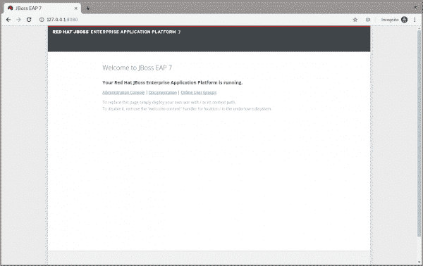
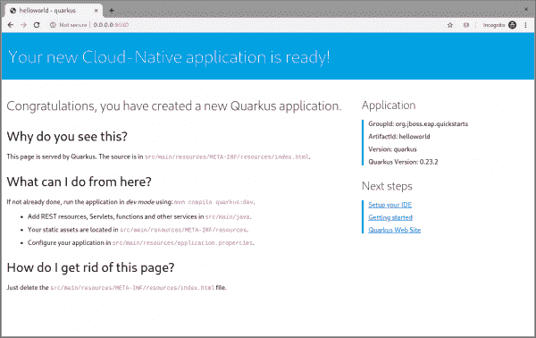

# Quarkus:现代化“hello world”JBoss EAP 快速入门，第 1 部分

> 原文：<https://developers.redhat.com/blog/2019/11/07/quarkus-modernize-helloworld-jboss-eap-quickstart-part-1>

[Quarkus](https://quarkus.io/) 用它自己的话说，是“超音速亚原子 Java”和“为 GraalVM & OpenJDK HotSpot 量身定制的 Kubernetes 原生 Java 堆栈，由同类最佳的 Java 库和[标准精心打造。](https://quarkus.io/vision/standards)“为了说明如何将现有的 Java 应用程序升级到 Quarkus，我将使用[Red Hat JBoss Enterprise Application Platform(JBoss EAP)quick starts`helloworld`](https://github.com/jboss-developer/jboss-eap-quickstarts/tree/7.2.0.GA/helloworld)quick start 作为 Java 应用程序构建的示例，该应用程序使用 Quarkus 中支持的技术(CDI 和 Servlet 3)。

值得注意的是，Quarkus 和 JBoss EAP 都依赖于为开发人员提供尽可能基于标准的工具。如果您的应用程序还没有运行在 JBoss EAP 上，这没有问题。您可以使用[Red Hat Application Migration Toolkit](https://developers.redhat.com/products/rhamt)将它从您当前的应用服务器迁移到 JBoss EAP。之后，可以在 [`helloworld`](https://github.com/mrizzi/jboss-eap-quickstarts/tree/quarkus/helloworld) 模块内的[https://github . com/mrizzi/JBoss-EAP-quick starts/tree/quar kus](https://github.com/mrizzi/jboss-eap-quickstarts/tree/quarkus)存储库中获得代码的最终版本。

本文基于 Quarkus 提供的指南[，主要是](https://quarkus.io/guides/)[创建你的第一个应用](https://quarkus.io/guides/getting-started-guide)和[构建一个本地可执行文件](https://quarkus.io/guides/building-native-image-guide.html)。

## 获取代码

首先，在本地克隆 [JBoss EAP quickstarts](https://github.com/jboss-developer/jboss-eap-quickstarts) 存储库，运行:

```
$ git clone https://github.com/jboss-developer/jboss-eap-quickstarts.git
Cloning into 'jboss-eap-quickstarts'...
remote: Enumerating objects: 148133, done.
remote: Total 148133 (delta 0), reused 0 (delta 0), pack-reused 148133
Receiving objects: 100% (148133/148133), 59.90 MiB | 7.62 MiB/s, done.
Resolving deltas: 100% (66476/66476), done.
$ cd jboss-eap-quickstarts/helloworld/
```

## 试试普通香草口味的

quickstart 的名称是关于这个应用程序做什么的一个强有力的线索，但是让我们遵循一个科学的方法来更新这个代码，所以首先要做的事情是:按原样尝试这个应用程序。

### 部署`helloworld`

1.  打开一个终端，导航到 JBoss EAP 目录的根目录`EAP_HOME`(你可以[下载](https://developers.redhat.com/products/eap/download))。
2.  通过键入以下命令，使用默认配置文件启动 JBoss EAP 服务器:

```
$ EAP_HOME/bin/standalone.sh

```

**注意:**对于 Windows，使用`EAP_HOME\bin\standalone.bat`脚本。

几秒钟后，日志应该如下所示:

```
[org.jboss.as] (Controller Boot Thread) WFLYSRV0025: JBoss EAP 7.2.0.GA (WildFly Core 6.0.11.Final-redhat-00001) started in 3315ms - Started 306 of 527 services (321 services are lazy, passive or on-demand)
```

3.  在浏览器中打开`http://127.0.0.1:8080`，应该会出现如图 1 所示的页面:

[](/sites/default/files/blog/2019/10/jboss-eap-home-page.png)*Figure 1: The JBoss EAP home page.*">

4.  按照来自[的指令构建并部署快速启动](https://github.com/jboss-developer/jboss-eap-quickstarts#build-and-deploy-the-quickstart)，部署`helloworld`快速启动并执行(从项目根目录)命令:

```
$ mvn clean install wildfly:deploy

```

该命令应该以如下所示的日志成功结束:

```
[INFO] ------------------------------------------------------------------------ 
[INFO] BUILD SUCCESS 
[INFO] ------------------------------------------------------------------------ 
[INFO] Total time: 8.224 s

```

`helloworld`应用程序现在已经在 JBoss EAP 中第一次部署了，大约用了八秒钟。

### 测试`helloworld`

按照[访问应用](https://github.com/jboss-developer/jboss-eap-quickstarts/tree/7.2.0.GA/helloworld#access-the-application)指南，在浏览器中打开`http://127.0.0.1:8080/helloworld`看到应用页面，如图 2 所示:

[](/sites/default/files/blog/2019/10/jboss-eap-hello-world.png)JBoss EAP Hello World*Figure 2: JBoss EAP's Hello World.*">

### 更改

将`createHelloMessage(String name)`输入参数从`World`改为`Marco`(我小我贱):

```
writer.println("<h1>" + helloService.createHelloMessage("Marco") + "</h1>");
```

再次执行命令:

```
$ mvn clean install wildfly:deploy

```

然后在浏览器中刷新网页以检查消息显示的变化，如图 3 所示:

[](/sites/default/files/blog/2019/10/jboss-eap-hello-marco.png)*Figure 3: JBoss EAP's Hello Marco.*">

### 取消部署`helloworld`并关机

如果要在关闭 JBoss EAP 之前取消部署(可选)应用程序，请运行以下命令:

```
$ mvn clean install wildfly:undeploy

```

要关闭 JBoss EAP 实例，请在运行它的终端中输入 Ctrl+C。

## 让我们现代化吧

现在我们可以把原来的`helloworld`留下来更新了。

### 创建新分支

快速启动项目执行完毕后，创建一个新的工作分支:

```
$ git checkout -b quarkus 7.2.0.GA

```

### 更改`pom.xml`文件

是时候开始改变应用程序了。从`pom.xml`文件开始。从`helloworld`文件夹中，运行以下命令让 Quarkus 添加 XML 块:

```
$ mvn io.quarkus:quarkus-maven-plugin:0.23.2:create

```

本文使用的是 0.23.2 版本。要知道哪个是最新版本，请参考[https://github.com/quarkusio/quarkus/releases/latest/](https://github.com/quarkusio/quarkus/releases/latest/)，因为夸尔库斯的发布周期很短。

该命令改变了`pom.xml`，文件添加:

*   属性`<quarkus.version>`定义要使用的 Quarkus 版本。
*   用于导入 Quarkus 物料清单(BOM)的`<dependencyManagement>`模块。通过这种方式，没有必要向每个 Quarkus 依赖项添加版本。
*   负责打包应用程序并提供开发模式的插件。
*   用于创建应用程序本地可执行文件的`native`概要文件。

需要对`pom.xml`进行进一步修改，手动完成:

1.  将`<groupId>`标签移出`<parent>`模块，并在`<artifactId>`标签上方。因为我们在下一步中移除了`<parent>`块，所以必须保留`<groupId>`。
2.  移除`<parent>`块:应用程序不再需要 JBoss 父 pom 来运行 Quarkus。
3.  用您喜欢的值添加`<version>`标签(在`<artifactId>`标签下面)。
4.  去掉`<packaging>`标签:这个应用程序将不再是一个 WAR，而是一个普通的罐子。
5.  更改以下依赖关系:
    1.  用 [`io.quarkus:quarkus-arc`](https://quarkus.io/extensions/#core) 替换`javax.enterprise:cdi-api`依赖，删除`<scope>provided</scope>`，因为——如文档中所述——这个 Quarkus 扩展提供了 CDI 依赖注入。
    2.  用 [`io.quarkus:quarkus-undertow`](https://quarkus.io/extensions/#web) 替换`org.jboss.spec.javax.servlet:jboss-servlet-api_4.0_spec`依赖项，删除`<scope>provided</scope>`，因为——如文档中所述——这是为 servlets 提供支持的 Quarkus 扩展。
    3.  移除`org.jboss.spec.javax.annotation:jboss-annotations-api_1.3_spec`依赖项，因为它是与之前更改的依赖项一起提供的。

在[https://github . com/mrizzi/JBoss-EAP-quick starts/blob/quar kus/hello world/POM . XML](https://github.com/mrizzi/jboss-eap-quickstarts/blob/quarkus/helloworld/pom.xml)上可以找到`pom.xml`文件的完全更改版本。

注意，上面的`mvn io.quarkus:quarkus-maven-plugin:0.23.2:create`命令，除了对`pom.xml`文件的修改之外，还向项目添加了组件。添加的文件和文件夹有:

*   文件`mvnw`和`mvnw.cmd`以及`.mvn`文件夹: [Maven 包装器](https://github.com/takari/maven-wrapper)允许你用特定版本的 Maven 运行 Maven 项目，而不需要你安装那个特定的 Maven 版本。
*   `docker`文件夹(在`src/main/`中):该文件夹包含`native`和`jvm`两种模式的示例`Dockerfile`文件(以及一个`.dockerignore`文件)。
*   `resources`文件夹(在`src/main/`中):该文件夹包含一个空的`application.properties`文件和示例 Quarkus 登陆页面`index.html`(详见“[运行现代化的`helloworld`](#try-the-modernized-helloworld) ”)。

### 运行`helloworld`

为了测试应用程序，使用`quarkus:dev`，它在开发模式下运行 Quarkus(关于[开发模式的更多细节，请点击](https://quarkus.io/guides/getting-started-guide#development-mode))。

**注意:**我们预计这一步会失败，因为仍然需要对应用程序进行更改，如本节所述。

现在运行该命令，检查它是否工作以及如何工作:

```
$ ./mvnw compile quarkus:dev
[INFO] Scanning for projects...
[INFO]
[INFO] ----------------< org.jboss.eap.quickstarts:helloworld >----------------
[INFO] Building Quickstart: helloworld quarkus
[INFO] --------------------------------[ war ]---------------------------------
[INFO]
[INFO] --- maven-resources-plugin:2.6:resources (default-resources) @ helloworld ---
[INFO] Using 'UTF-8' encoding to copy filtered resources.
[INFO] Copying 2 resources
[INFO]
[INFO] --- maven-compiler-plugin:3.1:compile (default-compile) @ helloworld ---
[INFO] Nothing to compile - all classes are up to date
[INFO]
[INFO] --- quarkus-maven-plugin:0.23.2:dev (default-cli) @ helloworld ---
Listening for transport dt_socket at address: 5005
INFO  [io.qua.dep.QuarkusAugmentor] Beginning quarkus augmentation
INFO  [org.jbo.threads] JBoss Threads version 3.0.0.Final
ERROR [io.qua.dev.DevModeMain] Failed to start quarkus: java.lang.RuntimeException: io.quarkus.builder.BuildException: Build failure: Build failed due to errors
	[error]: Build step io.quarkus.arc.deployment.ArcProcessor#validate threw an exception: javax.enterprise.inject.spi.DeploymentException: javax.enterprise.inject.UnsatisfiedResolutionException: Unsatisfied dependency for type org.jboss.as.quickstarts.helloworld.HelloService and qualifiers [@Default]
	- java member: org.jboss.as.quickstarts.helloworld.HelloWorldServlet#helloService
	- declared on CLASS bean [types=[javax.servlet.ServletConfig, java.io.Serializable, org.jboss.as.quickstarts.helloworld.HelloWorldServlet, javax.servlet.GenericServlet, javax.servlet.Servlet, java.lang.Object, javax.servlet.http.HttpServlet], qualifiers=[@Default, @Any], target=org.jboss.as.quickstarts.helloworld.HelloWorldServlet]
	at io.quarkus.arc.processor.BeanDeployment.processErrors(BeanDeployment.java:841)
	at io.quarkus.arc.processor.BeanDeployment.init(BeanDeployment.java:214)
	at io.quarkus.arc.processor.BeanProcessor.initialize(BeanProcessor.java:106)
	at io.quarkus.arc.deployment.ArcProcessor.validate(ArcProcessor.java:249)
	at sun.reflect.NativeMethodAccessorImpl.invoke0(Native Method)
	at sun.reflect.NativeMethodAccessorImpl.invoke(NativeMethodAccessorImpl.java:62)
	at sun.reflect.DelegatingMethodAccessorImpl.invoke(DelegatingMethodAccessorImpl.java:43)
	at java.lang.reflect.Method.invoke(Method.java:498)
	at io.quarkus.deployment.ExtensionLoader$1.execute(ExtensionLoader.java:780)
	at io.quarkus.builder.BuildContext.run(BuildContext.java:415)
	at org.jboss.threads.ContextClassLoaderSavingRunnable.run(ContextClassLoaderSavingRunnable.java:35)
	at org.jboss.threads.EnhancedQueueExecutor.safeRun(EnhancedQueueExecutor.java:2011)
	at org.jboss.threads.EnhancedQueueExecutor$ThreadBody.doRunTask(EnhancedQueueExecutor.java:1535)
	at org.jboss.threads.EnhancedQueueExecutor$ThreadBody.run(EnhancedQueueExecutor.java:1426)
	at java.lang.Thread.run(Thread.java:748)
	at org.jboss.threads.JBossThread.run(JBossThread.java:479)
Caused by: javax.enterprise.inject.UnsatisfiedResolutionException: Unsatisfied dependency for type org.jboss.as.quickstarts.helloworld.HelloService and qualifiers [@Default]
	- java member: org.jboss.as.quickstarts.helloworld.HelloWorldServlet#helloService
	- declared on CLASS bean [types=[javax.servlet.ServletConfig, java.io.Serializable, org.jboss.as.quickstarts.helloworld.HelloWorldServlet, javax.servlet.GenericServlet, javax.servlet.Servlet, java.lang.Object, javax.servlet.http.HttpServlet], qualifiers=[@Default, @Any], target=org.jboss.as.quickstarts.helloworld.HelloWorldServlet]
	at io.quarkus.arc.processor.Beans.resolveInjectionPoint(Beans.java:428)
	at io.quarkus.arc.processor.BeanInfo.init(BeanInfo.java:371)
	at io.quarkus.arc.processor.BeanDeployment.init(BeanDeployment.java:206)
	... 14 more

```

失败了。为什么？发生了什么事？

`UnsatisfiedResolutionException`异常指的是`HelloService`类，它是`HelloWorldServlet`类(`java member: org.jboss.as.quickstarts.helloworld.HelloWorldServlet#helloService`)的成员。问题是`HelloWorldServlet`需要一个`HelloService`的注入实例，但是找不到(即使两个类在同一个包中)。

感谢[上下文和依赖注入](https://quarkus.io/guides/cdi-reference)指南，是时候回到 [Quarkus 指南](https://quarkus.io/guides/)来利用文档并理解`@Inject`——以及上下文和依赖注入(CDI)——如何在 Quarkus 中工作了。在 [Bean 发现](https://quarkus.io/guides/cdi-reference#bean_discovery)段落中，它说，“没有 Bean 定义注释的 Bean 类不会被发现。”

查看`HelloService`类，很明显没有 bean 定义注释，必须添加一个来让 Quarkus 发现 bean。因此，因为它是一个无状态对象，所以添加`@ApplicationScoped`注释是安全的:

```
@ApplicationScoped
public class HelloService {

```

**注意:**IDE 应该提示您添加此处显示的所需软件包(如果需要，可以手动添加):

```
import javax.enterprise.context.ApplicationScoped;

```

如果您不确定在原始 bean 没有定义作用域的情况下应该应用哪个作用域，请参考[JSR 365:Java 2.0 的上下文和依赖注入——默认作用域](https://docs.jboss.org/cdi/spec/2.0/cdi-spec.html#default_scope)文档。

现在，再次尝试运行应用程序，再次执行`./mvnw compile quarkus:dev`命令:

```
$ ./mvnw compile quarkus:dev
[INFO] Scanning for projects...
[INFO]
[INFO] ----------------< org.jboss.eap.quickstarts:helloworld >----------------
[INFO] Building Quickstart: helloworld quarkus
[INFO] --------------------------------[ war ]---------------------------------
[INFO]
[INFO] --- maven-resources-plugin:2.6:resources (default-resources) @ helloworld ---
[INFO] Using 'UTF-8' encoding to copy filtered resources.
[INFO] Copying 2 resources
[INFO]
[INFO] --- maven-compiler-plugin:3.1:compile (default-compile) @ helloworld ---
[INFO] Changes detected - recompiling the module!
[INFO] Compiling 2 source files to /home/mrizzi/git/forked/jboss-eap-quickstarts/helloworld/target/classes
[INFO]
[INFO] --- quarkus-maven-plugin:0.23.2:dev (default-cli) @ helloworld ---
Listening for transport dt_socket at address: 5005
INFO  [io.qua.dep.QuarkusAugmentor] (main) Beginning quarkus augmentation
INFO  [io.qua.dep.QuarkusAugmentor] (main) Quarkus augmentation completed in 576ms
INFO  [io.quarkus] (main) Quarkus 0.23.2 started in 1.083s. Listening on: http://0.0.0.0:8080
INFO  [io.quarkus] (main) Profile dev activated. Live Coding activated.
INFO  [io.quarkus] (main) Installed features: [cdi]

```

这一次，应用程序成功运行。

### 运行现代化的`helloworld`

如终端日志所示，打开浏览器到`http://0.0.0.0:8080`(默认的 Quarkus 登陆页面)，出现如图 4 所示的页面:

[](/sites/default/files/blog/2019/10/quarkus-dev-landing-page.png)*Figure 4: The Quarkus dev landing page.*">

该应用程序在`WebServlet`注释中有以下上下文定义:

```
@WebServlet("/HelloWorld")
public class HelloWorldServlet extends HttpServlet {

```

因此，您可以浏览到`http://0.0.0.0:8080/HelloWorld`以到达如图 5 所示的页面:

[](/sites/default/files/blog/2019/10/quarkus-dev-hello-world.png)*Figure 5: The Quarkus dev Hello World page.*">

有用！

### 更改

请注意，`./mvnw compile quarkus:dev`命令仍在运行，我们不会停止它。现在，尝试对代码进行同样的(非常小的)更改，看看 Quarkus 如何改善开发人员的体验:

```
writer.println("<h1>" + helloService.createHelloMessage("Marco") + "</h1>");
```

保存文件，然后刷新网页，检查`Hello Marco`是否出现，如图 6 所示:

[](/sites/default/files/blog/2019/10/quarkus-dev-hello-marco.png)*Figure 6: The Quarkus dev Hello Marco page.*">

花点时间检查终端输出:

```
INFO  [io.qua.dev] (vert.x-worker-thread-3) Changed source files detected, recompiling [/home/mrizzi/git/forked/jboss-eap-quickstarts/helloworld/src/main/java/org/jboss/as/quickstarts/helloworld/HelloWorldServlet.java]
INFO  [io.quarkus] (vert.x-worker-thread-3) Quarkus stopped in 0.003s
INFO  [io.qua.dep.QuarkusAugmentor] (vert.x-worker-thread-3) Beginning quarkus augmentation
INFO  [io.qua.dep.QuarkusAugmentor] (vert.x-worker-thread-3) Quarkus augmentation completed in 232ms
INFO  [io.quarkus] (vert.x-worker-thread-3) Quarkus 0.23.2 started in 0.257s. Listening on: http://0.0.0.0:8080
INFO  [io.quarkus] (vert.x-worker-thread-3) Profile dev activated. Live Coding activated.
INFO  [io.quarkus] (vert.x-worker-thread-3) Installed features: [cdi]
INFO  [io.qua.dev] (vert.x-worker-thread-3) Hot replace total time: 0.371s

```

刷新页面触发了源代码变更检测和 Quarkus automagic“停止-开始”所有这些仅用了 0.371 秒(这是 Quarkus“超音速亚原子 Java”体验的一部分)。

### 构建`helloworld`打包的罐子

现在代码已经按预期运行，可以使用命令打包了:

```
$ ./mvnw clean package
```

该命令在`/target`文件夹中创建两个 jar。第一个是`helloworld-<version>.jar`，它是从 Maven 命令用项目的类和资源构建的标准工件。第二个是`helloworld-<version>-runner.jar`，这是一个可执行的 JAR。

请注意，这不是一个*超级 jar* ，因为所有的依赖项都被复制到了`/target/lib`文件夹中(而不是捆绑在 jar 中)。因此，要在另一个位置或主机上运行这个 JAR，JAR 文件和`/lib`文件夹中的库都必须被复制，考虑到 JAR 中`MANIFEST.MF`文件的`Class-Path`条目明确列出了来自`lib`文件夹的 JAR。

要创建一个*超级罐子*应用程序，请参考[优步罐子创建](https://quarkus.io/guides/maven-tooling#uber-jar-maven) Quarkus 指南。

### 运行`helloworld`打包的罐子

现在，可以使用标准的`java`命令来执行打包的 JAR:

```
$ java -jar ./target/helloworld-<version>-runner.jar
INFO  [io.quarkus] (main) Quarkus 0.23.2 started in 0.673s. Listening on: http://0.0.0.0:8080
INFO  [io.quarkus] (main) Profile prod activated.
INFO  [io.quarkus] (main) Installed features: [cdi]

```

如上所述，在浏览器中打开`http://0.0.0.0:8080` URL，并测试一切正常。

### 构建`helloworld`快速启动本地可执行文件

到目前为止一切顺利。quickstart 作为一个使用 Quarkus 依赖项的独立 Java 应用程序运行，但是可以通过在现代化道路上增加一个步骤来实现更多功能:构建一个本地可执行文件。

#### 安装 GraalVM

首先，必须安装用于创建本机可执行文件的工具:

1.  从[https://github.com/oracle/graal/releases/tag/vm-19.2.0.1](https://github.com/oracle/graal/releases/tag/vm-19.2.0.1)下载 GraalVM 19.2.0.1。
2.  使用以下命令解压缩文件:

`$ tar xvzf graalvm-ce-linux-amd64-19.2.0.1.tar.gz`

3.  转到`untar`文件夹。
4.  执行以下命令下载并添加本机映像组件:

`$ ./bin/gu install native-image`

5.  将`GRAALVM_HOME`环境变量设置为步骤二中创建的文件夹，例如:

`$ export GRAALVM_HOME={untar-folder}/graalvm-ce-19.2.0.1`)

有关其他操作系统的更多详细信息和安装说明，请参见[构建本机可执行文件-先决条件](https://quarkus.io/guides/building-native-image-guide.html#prerequisites) Quarkus 指南。

#### 构建`helloworld`本地可执行文件

正如在[构建本机可执行文件—生成本机可执行文件](https://quarkus.io/guides/building-native-image-guide.html#producing-a-native-executable) Quarkus 指南中所述，“现在让我们为我们的应用程序生成一个本机可执行文件。它缩短了应用程序的启动时间，并产生了最小的磁盘占用空间。可执行文件将包含运行应用程序所需的一切，包括‘JVM’(缩小到刚好足以运行应用程序)和应用程序。”

要创建本机可执行文件，必须通过执行以下命令来启用 Maven `native`概要文件:

```
$ ./mvnw package -Pnative
```

构建花了我大约 1:10 分钟，结果是在`/target`文件夹中的`helloworld-<version>-runner`文件。

### 运行`helloworld`本地可执行文件

上一步创建的`/target/helloworld-<version>-runner`文件。它是可执行的，所以运行它很容易:

```
$ ./target/helloworld-<version>-runner
INFO  [io.quarkus] (main) Quarkus 0.23.2 started in 0.006s. Listening on: http://0.0.0.0:8080
INFO  [io.quarkus] (main) Profile prod activated.
INFO  [io.quarkus] (main) Installed features: [cdi]

```

如前所述，在浏览器中打开`http://0.0.0.0:8080` URL，测试一切是否正常。

## 后续步骤

我相信这种现代化，即使是一个基本的应用程序，也是使用 Quarkus 现有技术开发棕色地带应用程序的正确方式。这样，你就可以开始面对问题并解决它们，从而理解并学习如何解决它们。

[在本系列的第二部分中，](https://developers.redhat.com/blog/2019/11/08/quarkus-modernize-helloworld-jboss-eap-quickstart-part-2/)我将看看如何捕获内存消耗数据，以便评估性能改进，这是现代化过程的一个基本部分。

*Last updated: July 1, 2020*