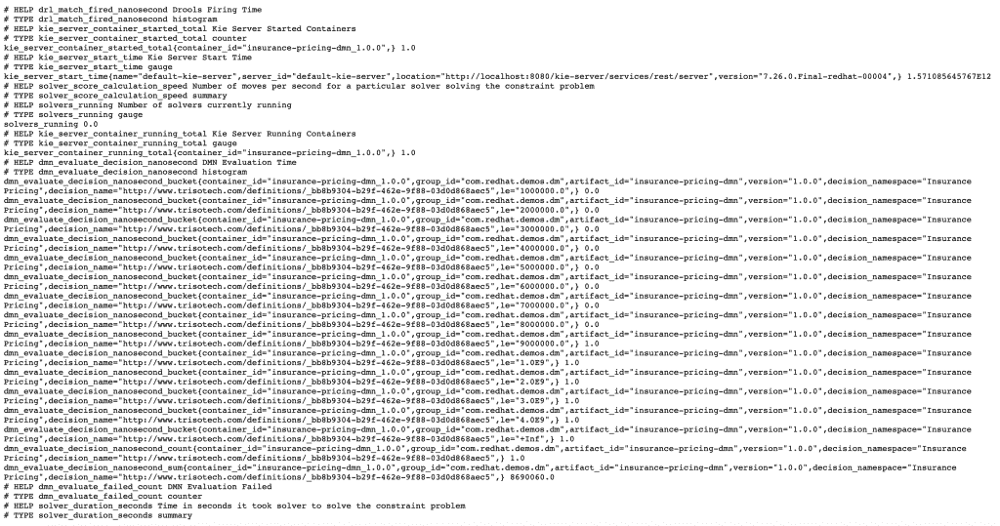
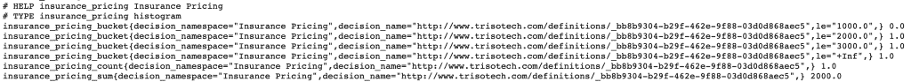

# 使用 Red Hat 流程自动化管理器和决策管理器的特定领域 Prometheus 指标

> 原文：<https://developers.redhat.com/blog/2019/10/31/domain-specific-prometheus-metrics-with-red-hat-process-automation-manager-and-decision-manager>

从 7.4 版本开始，[红帽过程自动化管理器](https://developers.redhat.com/products/rhpam/overview) (RHPAM)和[红帽决策管理器](https://www.redhat.com/en/technologies/jboss-middleware/decision-manager) (RHDM)通过[普罗米修斯](https://prometheus.io/)提供对各种度量的监控支持。该平台的执行服务器(也称为 KIE 服务器)提供了一个 Prometheus 扩展，如果启用该扩展，将会显示部署的容器数量、规则和决策评估的响应时间等指标。

在本例中，我们将使用 RHDM 7 保险定价演示作为我们的基础项目。此演示包含一个简单的决策模型和符号(DMN)模型，该模型根据客户的年龄以及客户以前是否发生过事故来计算保险价格。这个演示的 GitHub 库可以在[这里](https://github.com/jbossdemocentral/rhdm7-insurance-pricing-dmn-demo)找到，它包含了关于如何设置和运行这个演示的详细说明。

## KIE 服务器普罗米修斯扩展

默认情况下，KIE 服务器 Prometheus 扩展被禁用。这个扩展可以通过将 Java 系统属性`org.kie.prometheus.server.ext.disabled`设置为`false`来启用。例如，此任务可以在启动 Red Hat JBoss 企业应用程序平台(JBoss EAP)服务器时完成:

```
$ ./standalone.sh -Dorg.kie.prometheus.server.ext.disabled=false

```

或者，可以在 JBoss EAP 服务器配置文件的`<system-properties>`部分配置扩展(例如`standalone.xml`):

```
<property name="org.kie.prometheus.server.ext.disabled" value="false"/>

```

启用该扩展后，它为 Drools(规则和 DMN 决策)、OptaPlanner 和 jBPM 部署提供了许多现成的指标。这些指标可从以下网址获得:`http://<host>:<port>/kie-server/services/rest/metrics`。

此图显示了一个普通的 Red Hat Decision Manager 7.5 执行服务器中的指标，部署了一个 DMN 项目(KJAR)，进行了一次 DMN 评估:



我们可以看到，KIE 服务器提供了现成的指标，例如，DMN 评估的响应时间。根据部署的类型(例如，DMN、Drools、jBPM)，Prometheus 扩展支持不同的指标。

## 自定义指标:KIE 服务器 PrometheusMetricsProvider

KIE 服务器的 Prometheus 扩展有一个可插拔的架构，所以用户可以在这个平台上编写自己的扩展。这允许我们编写扩展来收集特定领域的决策模型、规则和流程的度量。例如，我们可以编写一个扩展，提供关于 DMN 决策节点做出的实际决策的度量，比如保险价格。比方说保险的价格在 1000 美元到 3000 美元之间。我们可以定义一个普罗米修斯 KIE 服务器扩展，创建一个普罗米修斯直方图，允许我们跟踪保险价格的分布。

为了实现定制的普罗米修斯度量，该扩展提供了`PrometheusMetricsProvider`接口。该接口定义了允许您返回各种 Drools、DMN、OptaPlanner 和 jBPM `EventListeners`的方法。当自定义的`PrometheusMetricsProvider`被注册时，扩展用不同的运行时动态地注册`EventListeners`。

您的定制`PrometheusMetricsProvider`通过 [Java ServiceLoader](https://docs.oracle.com/javase/8/docs/api/java/util/ServiceLoader.html) 机制注册。例如，名为`org.kie.server.services.prometheus.PrometheusMetricsProvider`的文件必须放在项目的`/META-INF/services`文件夹中。这个文件的内容是您的`PrometheusMetricsProvider`实现的完全限定类名。当您将您的`PrometheusMetricsProvider`的 JAR 文件放在 KIE 服务器的`WEB-INF/lib`文件夹中时，提供者会被自动发现并注册。

## 您的第一台 KIE 服务器 PrometheusMetricsProvider

让我们编写我们的第一个提供者，它为我们的 Red Hat 决策管理器[保险定价 DMN 演示](https://www.github.com/jbossdemocentral/rhdm7-insurance-pricing-dmn-demo.git)提供简单的指标，该演示监视由 DMN 模型确定的保险价格的分布。首先，我们创建一个简单的 Java Maven 项目。我们使用 Maven 原型方法来搭建新项目:

```
$ mvn archetype:generate -DgroupId=com.redhat.demos.dm -DartifactId=insurance-pricing-dmn-prometheus-provider -Dversion=1.0.0 -DarchetypeArtifactId=maven-archetype-quickstart -DinteractiveMode=false

```

在`pom.xml`文件中，我们添加了一个依赖项(使用的版本取决于您的 Red Hat Decision Manager 或 Red Hat Process Automation Manager 安装的版本):

```
<dependency>
  <groupId>org.kie.server</groupId>
  <artifactId>kie-server-services-prometheus</artifactId>
  <version>7.27.0.Final</version>
  <scope>provided</scope>
</dependency>

```

我们还需要在我们的`pom.xml`文件中添加一个`build`部分来设置 Java 源代码和目标版本:

```
<build>
  <plugins>
    <plugin>
      <artifactId>maven-compiler-plugin</artifactId>
      <version>3.1</version>
      <configuration>
        <source>1.8</source>
        <target>1.8</target>
      </configuration>
    </plugin>
  </plugins>
</build>

```

在项目的`src/main/java`目录中，创建一个名为`com.redhat.demos.dm.prometheus`的 Java 包。在这个包中，创建一个名为`InsurancePricingPrometheusMetricsProvider.java`的类。这个类必须实现`PrometheusMetricsProvider`接口。

为方法提供默认实现:

```
public class InsurancePricingPrometheusMetricsProvider implements PrometheusMetricsProvider {

  public AgendaEventListener createAgendaEventListener(String arg0, KieContainerInstance arg1) {
    return null;
  }

  public AsynchronousJobListener createAsynchronousJobListener() {
    return null;
  }

  public DMNRuntimeEventListener createDMNRuntimeEventListener(KieContainerInstance arg0) {
    return null;
  }

  public DeploymentEventListener createDeploymentEventListener() {
    return null;
  }

  public PhaseLifecycleListener createPhaseLifecycleListener(String arg0) {
    return null;
  }
}

```

我们现在定义我们的`DMNListener`，它将对 DMN 引擎中的事件做出反应，并收集普罗米修斯指标。在同一个包中，创建一个名为`InsurancePricingDMNListener.java`的 Java 类。我们将让这个类实现`DMNRuntimeEventListener`接口:

```
public class InsurancePricingDMNListener implements DMNRuntimeEventListener {
}

```

在我们的`InsurancePricingPrometheusMetricsProvider`中，我们现在可以实现`createDMNRuntimeEventListener`方法，并让它返回我们刚刚创建的`DMNRuntimeEventListener`实现:

```
public DMNRuntimeEventListener createDMNRuntimeEventListener(KieContainerInstance kci) {
  return new InsurancePricingDMNListener();
}

```

在我们的`InsurancePricingDMNListener`中，我们定义了一个`Histogram`，在其中我们将收集我们的保险定价:

```
private static final Histogram insurancePricing = Histogram.build()
                                                           .name("insurance_pricing")
                                                           .help("Insurance Pricing")
                                                           .labelNames("decision_namespace", "decision_name")
                                                           .buckets(1000, 2000, 3000)
                                                           .register();

```

注意，在这个例子中，我们将`Histogram`定义为一个`static`类成员。这是因为 Prometheus Java 客户机只允许您在给定的名称下注册一个收集器。另一种选择是用动态名称注册收集器。例如，一个依赖于 Maven `groupId`、`artifactId`和`KieContainerInstance`的`version`的收集器。

定义了我们的`Histogram`,我们现在可以实现`DMNRuntimeEventListener`的`afterEvaluateDecision`,其中我们可以检索决策的结果并将其添加到我们的 Prometheus 收集器中:

```
public void afterEvaluateDecision(AfterEvaluateDecisionEvent event) {
  DecisionNode decisionNode = event.getDecision();
  String decisionNodeName = decisionNode.getName();
  DMNDecisionResult result = event.getResult().getDecisionResultByName(decisionNodeName);

  switch (decisionNodeName) {
    case "Insurance Total Price":
      double resultAsDouble = 0.0;
      Object resultAsObject = result.getResult();
      //We only store if we find and Integer.
      if (resultAsObject instanceof Integer) {
        resultAsDouble = ((Integer) resultAsObject).doubleValue();
        insurancePricing.labels(decisionNode.getModelName(), decisionNode.getModelNamespace()).observe(resultAsDouble);
      }
      break;
    default:
      //Not the decision we want to monitor. Discarding.
      break;
  }
}

```

我们在这段代码中所做的是确定已经做出的决策的名称，如果名称等于“保险价格总计”，则将决策的结果(保险价格)添加到 Prometheus 直方图中。

完成的项目可以在这里找到[。](https://github.com/jbossdemocentral/rhdm7-insurance-pricing-dmn-demo-prometheus-metrics)

## 打包并部署 PrometheusMetricsProvider

为了部署我们的`PrometheusMetricsProvider`，我们首先需要将它打包到一个 JAR 文件中。我们使用 Maven 来做到这一点:

```
$ mvn clean install

```

该命令将在项目的`target`目录中创建`insurance-pricing-dmn-prometheus-provider-1.0.0.jar`文件。我们现在可以将这个 JAR 文件复制到 RHPAM/RHDM 执行服务器/KIE 服务器的`WEB-INF/lib`目录中。

随着我们的`PrometheusMetricsProvider`部署完毕，我们现在可以启动启用了 Prometheus 扩展的平台了:

```
$ ./target/jboss-eap-7.2/bin/standalone.sh -Dorg.kie.prometheus.server.ext.disabled=false

```

## 运行演示

随着您的`PrometheusMetricsProvider`的安装和 Red Hat Decision Manager 的运行，我们现在可以测试我们的指标了。参考[保险定价 DMN 演示自述文件](https://github.com/jbossdemocentral/rhdm7-insurance-pricing-dmn-demo)中的演示指南，将 DMN 模型部署到执行服务器并执行请求。

当您现在查阅 KIE 服务器中的普罗米修斯指标页面时，您可以看到以下指标，这些指标记录了由 DMN 模型确定的保险价格的分布情况:



## 结论

我们现在已经看到了 Red Hat Decision Manager 和 Red Hat Process Automation Manager 如何通过新的 KIE 服务器扩展为 Prometheus 提供支持。该扩展使用可插拔架构，允许我们插入自定义的`PrometheusMetricsProviders`。这些指标提供者可以用定制的、特定于领域的指标来扩充现成的 Prometheus 指标。

*Last updated: July 1, 2020*