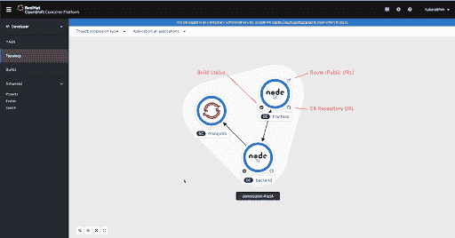
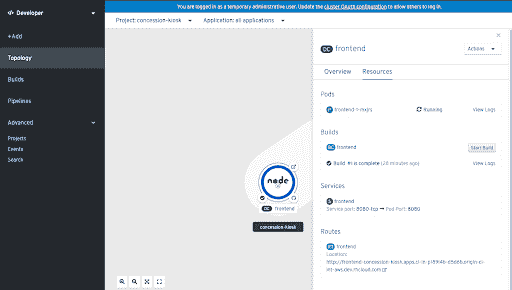
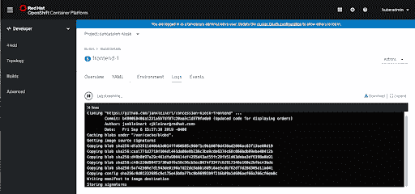
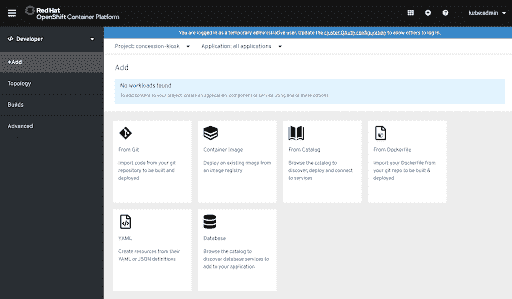
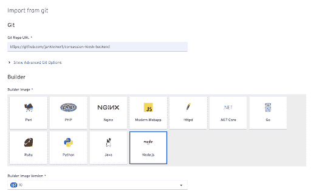
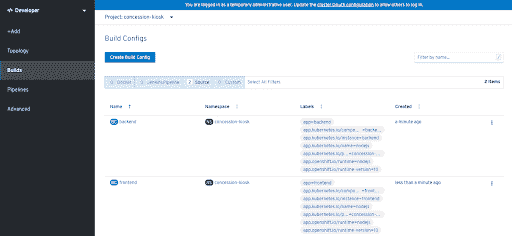
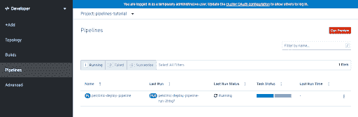
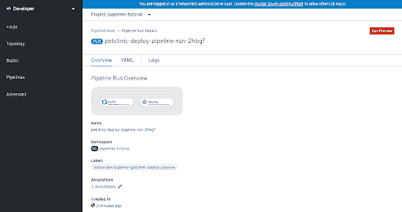

# Red Hat OpenShift 4.2 web 控制台中的开发人员视角之旅

> 原文：<https://developers.redhat.com/blog/2019/10/16/openshift-developer-perspective>

https://youtu.be/opdrYhIjqrg

在 [Red Hat OpenShift 4.2 版本](https://developers.redhat.com/blog/2019/10/16/developer-tools-openshift/)的所有新功能中，我最期待的是针对开发者的 web 控制台更新。如果你使用过 [OpenShift 4.1](https://docs.openshift.com/container-platform/4.1/welcome/oce_about.html) ，那么你可能已经熟悉了更新的管理员视角，在这里你可以管理工作负载、存储、网络、集群设置等等。

新增的开发人员视角旨在为开发人员提供优化的特性和工作流体验，他们很可能需要这些特性和工作流来提高工作效率。开发人员可以专注于更高层次的抽象，如他们的应用程序和组件，然后更深入地挖掘组成他们应用程序的 [OpenShift](https://developers.redhat.com/openshift/) 和 [Kubernetes](https://developers.redhat.com/topics/kubernetes/) 资源。

让我们从开发人员的角度出发，探索一些关键特性。

## 拓扑视图

拓扑视图呈现了一个项目的以应用程序为中心的视图。选择一个项目后，拓扑视图会显示组成应用程序的不同组件。您可以看到组件的名称、pod 状态、构建状态(如果适用)以及源代码和路径(如果可用)的链接。作为应用程序一部分的组件将全部位于同一分组中，在下面的屏幕截图中，由组件周围的浅色形状表示。Kubernetes 为应用程序和应用程序实例推荐的标签是确定哪些组件属于一个分组的基础。您可以选择使用箭头来连接应用程序中的组件，以帮助显示组件之间的关系。

## 

## 查看关于组件的信息

当您在拓扑视图中单击一个组件时，将会出现一个侧面板，显示有关该组件的信息。在下面的屏幕截图中，您可以看到当单击前端部署配置时，面板中的 Resources 选项卡上会出现什么。

有到 pod、构建、服务和路由的链接，以及查看 pod 或构建日志的快捷链接。

## **向 Kubernetes 应用添加组件**

开发人员视角有几个内置的方法来简化部署应用程序、服务和数据库的过程。当您在左侧导航菜单中选择*+添加*时，您将看到可用的选项。

可以选择从 Git 存储库中的代码构建和部署，部署容器映像，从开发人员目录部署，或者从 docker 文件或 YAML/JSON 定义部署。您还可以轻松地部署数据库供您的应用程序使用。单击这些选项中的大部分会给您一种向导式的体验，提示您输入必要的信息。

## 查看和创建构件

左侧导航中的 *Builds* 链接提供了对现有构建配置的快速访问，以及创建新构建配置的选项。

在这个页面中，您可以深入到每个构建配置，以获得关于构建、环境变量、事件等更多信息。

## 探索 Red Hat OpenShift 管道

Red Hat OpenShift 4.2 版本将为 OpenShift 的新 CI/CD 解决方案提供一个开发者预览版，该解决方案名为 [OpenShift Pipelines](https://www.openshift.com/learn/topics/pipelines) ，基于 [Tekton](https://developers.redhat.com/blog/2019/07/19/getting-started-with-tekton-on-red-hat-openshift/) 。Developer Perspective 还将提供一个 OpenShift 管道的开发者预览，用于使用 OpenShift 管理 CI/CD。

如果您的集群上安装了 OpenShift Pipelines 操作符，那么您将在左侧导航中看到 Pipelines 链接。Pipelines 部分让您可以看到已经设置的任何管道，并能够管理项目 CI/CD 的各个方面。您可以查看作为 CI/CD 流程一部分的不同资源，查看执行管道(即管道运行)的日志，并深入管道运行以查看 CI/CD 管道的当前或以前状态。

你可以在这里了解更多关于 OpenShift Pipelines 的信息，它目前正在开发预览版中。

## 亲自尝试以开发人员为中心的变化

要真正了解 web 控制台中的开发人员视角如何帮助您在 Red Hat OpenShift 上提高工作效率，请亲自尝试一下。你可以[点击这里的下载链接](http://developers.redhat.com/products/codeready-containers)安装 4.2 OpenShift 集群。有几个可用的基础设施选项，包括“笔记本电脑”，它允许您使用代码就绪容器在本地[安装一个 OpenShift 集群。](http://developers.redhat.com/products/codeready-containers)

了解更多关于在 developers.redhat.com/openshif 大学使用 OpenShift 进行应用开发的信息

*Last updated: July 1, 2020*