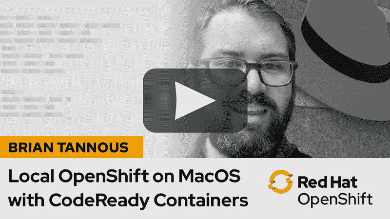

# 适用于 Windows 和 macOS 的 Red Hat CodeReady 容器概述

> 原文：<https://developers.redhat.com/blog/2019/10/16/local-openshift-5>

[Red Hat code ready Containers](https://developers.redhat.com/products/codeready-containers)1.0 现已推出，支持 Red Hat OpenShift 4.2。CodeReady Containers 是“您的笔记本电脑上的 OpenShift”，这是在您的机器上运行本地 OpenShift 环境的最简单的方法。你可以在[技术预览发布帖](https://developers.redhat.com/blog/2019/09/05/red-hat-openshift-4-on-your-laptop-introducing-red-hat-codeready-containers/)中获得 CodeReady 容器的概述。你可以[从产品页面](https://developers.redhat.com/products/codeready-containers)下载 CodeReady 容器。

为了这次发布，来自 Red Hat Cloud Platforms 的 Brian Tannous 已经将安装 CodeReady 容器和将您的第一个应用程序部署到 OpenShift 的便捷视频指南放在了一起。

 
[本地 OpenShift 在 Windows 上用红帽 CodeReady 容器](https://developers.redhat.com/openshift/local-openshift-windows/)

[MAC OS 上的本地 OpenShift 与 Red Hat CodeReady 容器](https://developers.redhat.com/openshift/local-openshift-macos/)

在[developers.redhat.com/openshift](https://developers.redhat.com/openshift/)了解更多关于 OpenShift 应用开发的信息。

*Last updated: July 1, 2020*