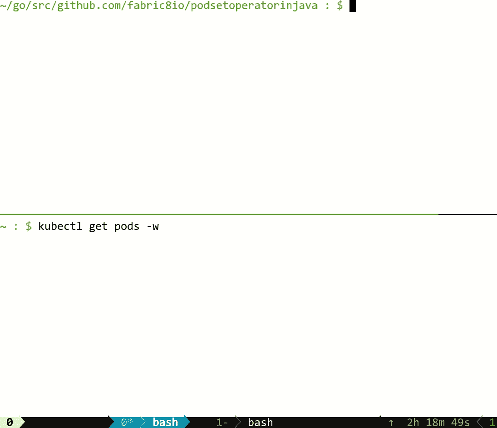

# 使用 Fabric8 Kubernetes 客户端用 Java 编写一个简单的 Kubernetes 操作符

> 原文：<https://developers.redhat.com/blog/2019/10/07/write-a-simple-kubernetes-operator-in-java-using-the-fabric8-kubernetes-client>

Kubernetes 已经不仅仅是一个运行容器工作负载的平台。它的 API 可以用特定于应用程序的自定义资源定义(CRD)来扩展，并且您可以实现自己的逻辑，使您的应用程序动态地适应集群中的变化。在本文中，我们将使用 [Fabric8 Kubernetes 客户端](https://github.com/fabric8io/kubernetes-client)用 [Java](https://developers.redhat.com/developer-tools/java) 编写一个简单的 Kubernetes 操作符。

## 什么是 Kubernetes 操作员？

Kubernetes Operators 是 Kubernetes 的软件扩展，它利用[定制资源](https://kubernetes.io/docs/concepts/extend-kubernetes/api-extension/custom-resources/)来管理应用程序及其组件。它们允许您扩展集群的行为，而无需修改 Kubernetes 本身的代码。他们只是 Kubernetes API 的客户端，充当自定义资源的控制器。

简单地说，Kubernetes 操作符是利用 Kubernetes API 来执行一些任务的代码；自定义资源充当特定代码所依据的配置模型。

## 用 Java 编写一个简单的 PodSet 运算符

### PodSet 自定义资源

我们将编写一个非常简单的操作符，尝试做一些类似于[复制集](https://kubernetes.io/docs/concepts/workloads/controllers/replicaset/)的事情。所有的代码都托管在 [GitHub](https://github.com/rohanKanojia/podsetoperatorinjava) 上。它试图准确地维护 x 数量的豆荚，就像用它作为亲代一样。为此，我们将使用一个非常简单的名为`PodSet`的定制资源。以下是它的自定义资源定义:

```
apiVersion: apiextensions.k8s.io/v1
kind: CustomResourceDefinition
metadata:
  name: podsets.demo.fabric8.io
spec:
  group: demo.fabric8.io
  versions:
    - name: v1alpha1
      served: true
      storage: true
      schema:
        openAPIV3Schema:
          type: object
          properties:
            spec:
              type: object
              properties:
                replicas:
                  type: integer
            status:
              type: object
              properties:
                availableReplicas:
                  type: integer
      subresources:
        status: {}
  names:
    kind: PodSet
    plural: podsets
    singular: podset
    shortNames:
      - ps
  scope: Namespaced

```

应用这个自定义资源定义后，一个简单的`PodSet`资源可以写成:

```
apiVersion: demo.fabric8.io/v1alpha1
kind: PodSet
metadata:
  name: example-podset
spec:
  replicas: 5
```

### 书写运算符

现在让我们跳到编写操作符，看看项目结构:

```
podsetoperatorinjava : $ tree .    
.
├── license.txt
├── podset-operator-in-java.iml
├── pom.xml
├── README.md
└── src
    ├── main
    │   ├── java
    │   │   └── io
    │   │       └── fabric8
    │   │           └── podset
    │   │               └── operator
    │   │                   ├── controller
    │   │                   │   └── PodSetController.java
    │   │                   ├── crd
    │   │                   │   ├── PodSet.java
    │   │                   │   ├── PodSetList.java
    │   │                   │   ├── PodSetSpec.java
    │   │                   │   └── PodSetStatus.java
    │   │                   ├── PodSetOperatorMain.java
    │   │                   └── util
    │   │                       └── DeepCopy.java
    │   └── resources
    │       ├── crd.yaml
    │       ├── cr.yaml
    │       └── second-cr.yml
```

从结构上，我们可以看出三点:

1.  `PodSet`、`PodSetList`、`PodSetSpec`、`PodSetStatus`、`DoneablePodSet`作为`PodSet`自定义资源的模型类，需要将 Kubernetes API 响应反序列化为对象。
2.  `PodSetOperatorMain`，是项目的主驱动类。
3.  `PodSetController`类，包含与操作符相关的主要 Kubernetes 逻辑。

让我们详细看一下其中的每一项。


首先，要用 Java 与 Kubernetes API 交互，我们需要 [Fabric8 Kubernetes 客户端](https://github.com/fabric8io/kubernetes-client)。它是与 Kubernetes 交互的最流行的 Java APIs 之一。我们需要将它添加到 pom.xml 中。

下面是我们的 pom.xml 在添加 Fabric8 客户端作为依赖项后的样子:

```
<?xml version="1.0" encoding="UTF-8"?>
<project xmlns="http://maven.apache.org/POM/4.0.0"
         xmlns:xsi="http://www.w3.org/2001/XMLSchema-instance"
         xsi:schemaLocation="http://maven.apache.org/POM/4.0.0 http://maven.apache.org/xsd/maven-4.0.0.xsd">
    <modelVersion>4.0.0</modelVersion>

    <groupId>io.fabric8</groupId>
    <artifactId>podset-operator-in-java</artifactId>
    <version>1.0-SNAPSHOT</version>
    <packaging>jar</packaging>
    <properties>
        <version.fabric8.client>5.0.1</version.fabric8.client>
        <maven.compiler.source>1.8</maven.compiler.source>
        <maven.compiler.target>1.8</maven.compiler.target>
        <maven-assembly-plugin.version>3.3.0</maven-assembly-plugin.version>
        <junit-jupiter-engine.version>5.6.2</junit-jupiter-engine.version>
        <maven-surefire-plugin.version>3.0.0-M4</maven-surefire-plugin.version>
        <exec-maven-plugin.version>3.0.0</exec-maven-plugin.version>
        <jkube.version>1.1.0</jkube.version>
    </properties>

    <dependencies>
        <dependency>
            <groupId>io.fabric8</groupId>
            <artifactId>kubernetes-client</artifactId>
            <version>${version.fabric8.client}</version>
        </dependency>

        <dependency>
            <groupId>io.fabric8</groupId>
            <artifactId>kubernetes-server-mock</artifactId>
            <version>${version.fabric8.client}</version>
            <scope>test</scope>
        </dependency>
        <dependency>
            <groupId>org.junit.jupiter</groupId>
            <artifactId>junit-jupiter-api</artifactId>
            <version>${junit-jupiter-engine.version}</version>
            <scope>test</scope>
        </dependency>
        <dependency>
            <groupId>org.junit.jupiter</groupId>
            <artifactId>junit-jupiter-engine</artifactId>
            <version>${junit-jupiter-engine.version}</version>
            <scope>test</scope>
        </dependency>
        <dependency>
            <groupId>org.junit.jupiter</groupId>
            <artifactId>junit-jupiter-migrationsupport</artifactId>
            <version>${junit-jupiter-engine.version}</version>
            <scope>test</scope>
        </dependency>
    </dependencies>

    <build>
        <plugins>
            <plugin>
                <groupId>org.apache.maven.plugins</groupId>
                <artifactId>maven-assembly-plugin</artifactId>
                <version>${maven-assembly-plugin.version}</version>
                <executions>
                    <execution>
                        <phase>package</phase>
                        <goals>
                            <goal>single</goal>
                        </goals>
                        <configuration>
                            <archive>
                                <manifest>
                                    <mainClass>
                                        io.fabric8.podset.operator.PodSetOperatorMain
                                    </mainClass>
                                </manifest>
                            </archive>
                            <descriptorRefs>
                                <descriptorRef>jar-with-dependencies</descriptorRef>
                            </descriptorRefs>
                        </configuration>
                    </execution>
                </executions>
            </plugin>
            <plugin>
                <groupId>org.eclipse.jkube</groupId>
                <artifactId>kubernetes-maven-plugin</artifactId>
                <version>${jkube.version}</version>
            </plugin>
            <plugin>
                <groupId>org.codehaus.mojo</groupId>
                <artifactId>exec-maven-plugin</artifactId>
                <version>${exec-maven-plugin.version}</version>
            </plugin>
            <plugin>
                <groupId>org.apache.maven.plugins</groupId>
                <artifactId>maven-surefire-plugin</artifactId>
                <!-- JUnit 5 requires Surefire version 2.22.0 or higher -->
                <version>${maven-surefire-plugin.version}</version>
            </plugin>
        </plugins>
    </build>

</project>

```

一旦添加了所有必需的依赖项(在我们的例子中，只有一个:-))，我们就可以编写 POJOs，Java 客户端需要它来为我们的`PodSet`定制资源创建一个客户端。以下是将它们添加到项目后的一些外观:

**PodSet.java**

```
package io.fabric8.podset.operator.model.v1alpha1;

import io.fabric8.kubernetes.api.model.Namespaced;
import io.fabric8.kubernetes.client.CustomResource;
import io.fabric8.kubernetes.model.annotation.Group;
import io.fabric8.kubernetes.model.annotation.Version;

@Version("v1alpha1")
@Group("demo.fabric8.io")
public class PodSet extends CustomResource<PodSetSpec, PodSetStatus> implements Namespaced { }

```

**PodSetList.java:**

```
package io.fabric8.podset.operator.model.v1alpha1;

import io.fabric8.kubernetes.client.CustomResourceList;

public class PodSetList extends CustomResourceList<PodSet> { }

```

**子窗体. java:**

```
package io.fabric8.podset.operator.model.v1alpha1;

public class PodSetSpec {
    public int getReplicas() {
        return replicas;
    }

    @Override
    public String toString() {
        return "PodSetSpec{replicas=" + replicas + "}";
    }

    public void setReplicas(int replicas) {
        this.replicas = replicas;
    }

    private int replicas;
}

```

一旦我们添加了模型类，我们就可以开始编写操作符了。让我们从主驱动类(即`PodSetOperatorMain`)开始，它将调用`PodSetController`中所有必要的函数。

首先，我们需要为`Pod`资源和`PodSet`资源初始化消息器，因为我们将监听与这些资源相关的事件，并在我们的操作符中对它们做出反应。为了了解这些事件何时被触发，我们将使用 Kubernetes 和 client-go(现在添加到 Fabric8 Kubernetes Java 客户端中)公开的一个原语 SharedInformer。让我们看看它是如何工作的:

我们可以像这样初始化 informer 工厂:

```
SharedInformerFactory informerFactory = client.informers();

```

要获得`Pod`资源的通知程序，我们需要传递`Pod`、`PodList`和 resync period(基本上是通知程序再次建立连接的间隔)的类。

```
SharedIndexInformer<Pod> podSharedIndexInformer = informerFactory.sharedIndexInformerFor(Pod.class, PodList.class, 10 * 60 * 1000);

```

因为`PodSet`是一个定制资源，我们需要在创建它的 informer 时传递额外的信息。这并不多，只是一些与它的自定义资源定义(CRD)相关的小细节。

```
CustomResourceDefinitionContext podSetCustomResourceDefinitionContext = new CustomResourceDefinitionContext.Builder()
                    .withVersion("v1alpha1")
                    .withScope("Namespaced")
                    .withGroup("demo.fabric8.io")
                    .withPlural("podsets")
                    .build();
SharedIndexInformer<PodSet> podSetSharedIndexInformer = informerFactory.sharedIndexInformerForCustomResource(podSetCustomResourceDefinitionContext, PodSet.class, PodSetList.class, 10 * 60 * 1000);

```

一旦我们有了`Pod`和`PodSet`资源的告密者，那么我们需要将所有这些传递给`PodSetController`(将在后面讨论)。之后，我们将初始化控制器并运行它。现在我们的`PodSetOperatorMain`看起来像这样:

```
try (KubernetesClient client = new DefaultKubernetesClient()) {
    String namespace = client.getNamespace();
    if (namespace == null) {
        logger.log(Level.INFO, "No namespace found via config, assuming default.");
        namespace = "default";
    }

    logger.log(Level.INFO, "Using namespace : " + namespace);
    CustomResourceDefinitionContext podSetCustomResourceDefinitionContext = new CustomResourceDefinitionContext.Builder()
            .withVersion("v1alpha1")
            .withScope("Namespaced")
            .withGroup("demo.fabric8.io")
            .withPlural("podsets")
            .build();

    SharedInformerFactory informerFactory = client.informers();

    MixedOperation<PodSet, PodSetList, Resource<PodSet>> podSetClient = client.customResources(PodSet.class, PodSetList.class);
    SharedIndexInformer<Pod> podSharedIndexInformer = informerFactory.sharedIndexInformerFor(Pod.class, PodList.class, 10 * 60 * 1000);
    SharedIndexInformer<PodSet> podSetSharedIndexInformer = informerFactory.sharedIndexInformerForCustomResource(podSetCustomResourceDefinitionContext, PodSet.class, PodSetList.class, 10 * 60 * 1000);
    PodSetController podSetController = new PodSetController(client, podSetClient, podSharedIndexInformer, podSetSharedIndexInformer, namespace);

    podSetController.create();
    informerFactory.startAllRegisteredInformers();
    informerFactory.addSharedInformerEventListener(exception -> logger.log(Level.SEVERE, "Exception occurred, but caught", exception));

    podSetController.run();
} catch (KubernetesClientException exception) {
    logger.log(Level.SEVERE, "Kubernetes Client Exception : " + exception.getMessage());
}

```

现在我们需要看一下`PodSetController`，它包含与 Kubernetes APIs 交互的主要逻辑，并根据接收到的事件进行所需的更改。我们先来看它的`create()`方法:

```
public void create() {
    podSetInformer.addEventHandler(new ResourceEventHandler<PodSet>() {
        @Override
        public void onAdd(PodSet podSet) {
            enqueuePodSet(podSet);
        }

        @Override
        public void onUpdate(PodSet podSet, PodSet newPodSet) {
            enqueuePodSet(newPodSet);
        }

        @Override
        public void onDelete(PodSet podSet, boolean b) {
            // Do nothing
        }
    });

    podInformer.addEventHandler(new ResourceEventHandler<Pod>() {
        @Override
        public void onAdd(Pod pod) {
            handlePodObject(pod);
        }

        @Override
        public void onUpdate(Pod oldPod, Pod newPod) {
            if (oldPod.getMetadata().getResourceVersion().equals(newPod.getMetadata().getResourceVersion())) {
                return;
            }
            handlePodObject(newPod);
        }

        @Override
        public void onDelete(Pod pod, boolean b) {
            // Do nothing
        }
    });
}

```

正如我们所看到的，它为两个通知者添加了事件处理程序:`Pod`和`PodSet`。在`PodSet`的例子中，我们将它添加到操作员的工作队列中，以便以后处理。在`Pod`的情况下，我们检查那个`Pod`资源是否与我们的`PodSet`定制资源相关，然后只有我们试图处理它(即，从元数据中获取它的所有者，并再次检查所有者的状态)。

让我们看看我们的控制器的`run()`方法；它只是将项目从工作队列中取出，并将其传递给执行主要工作的`reconcile()`方法。下面是`reconcile()`的正文方法:

```
/**
 * Tries to achieve the desired state for podset.
 *
 * @param podSet specified podset
 */
protected void reconcile(PodSet podSet) {
    List<String> pods = podCountByLabel(APP_LABEL, podSet.getMetadata().getName());
    if (pods.isEmpty()) {
        createPods(podSet.getSpec().getReplicas(), podSet);
        return;
    }
    int existingPods = pods.size();

    // Compare it with desired state i.e spec.replicas
    // if less then spin up pods
    if (existingPods < podSet.getSpec().getReplicas()) {
        createPods(podSet.getSpec().getReplicas() - existingPods, podSet);
    }

    // If more pods then delete the pods
    int diff = existingPods - podSet.getSpec().getReplicas();
    for (; diff > 0; diff--) {
        String podName = pods.remove(0);
        kubernetesClient.pods().inNamespace(podSet.getMetadata().getNamespace()).withName(podName).delete();
    }

    // Update PodSet status
    updateAvailableReplicasInPodSetStatus(podSet, podSet.getSpec().getReplicas());
}

```

这个 `reconcile()`方法似乎在做以下事情:

*   它接收一个`PodSet`对象作为它试图进行协调的参数。然后，它尝试列出集群中所有标签为`app=<name of PodSet>;`的 pod，假设是`app=example-podset`。
*   一旦标签为`app=example-podset`的所有 pod 的列表操作被获取，它检查 pod 的数量是否等于 PodSet.spec.replicas。如果 pod 的数量较少，它将更多的 pod 旋转到集群中。
*   如果 pod 的数量超过期望值，它会尝试从集群中删除 pod。

### 运行您的操作员

我们已经讨论了`PodSetController`的大部分重要部分，所以让我们尝试在 Kubernetes 集群上运行我们的操作符。我用 [Minikube](https://github.com/kubernetes/minikube) 来运行这个，你可以从他们的[发布](https://github.com/kubernetes/minikube/releases)页面得到。

```
# Make sure PodSet CustomResourceDefinition is already applied onto the cluster. If not, just apply it using this command
kubectl apply -f src/main/resources/crd.yaml

# Build project
mvn clean install

# Run project
mvn exec:java -Dexec.mainClass=io.fabric8.podset.operator.PodSetOperatorMain

```

当您运行这个程序时，您应该能够看到在创建一个`PodSet`自定义资源时创建的 pods，如下面的 gif 所示:



就是这样！如果以上步骤对你有效，那么恭喜你！您已经成功地用 Java 编写了一个操作符。

### 在 Kubernetes 中将您的运营商作为 Pod 运行:

我们将使用 [Eclipse JKube](https://github.com/eclipse/jkube) 的 [Kubernetes Maven 插件](https://www.eclipse.org/jkube/docs/kubernetes-maven-plugin)将我们的操作者打包成一个映像并部署到 Kubernetes。在将操作员部署到 Kubernetes 之前，我们需要配置我们的应用程序将使用的`ServiceAccount`的权限。由于我们的应用程序将使用默认的`ServiceAccount`，我将使用以下命令向默认的“ServiceAccount”授予集群管理权限:

```
kubectl create clusterrolebinding default-pod --clusterrole cluster-admin --serviceaccount=default:default
```

在这篇博客中，我将在 minikube 上展示对 Kubernetes 的部署。您可以根据 minikube 的 docker 守护进程轻松构建 docker 映像，然后像这样部署操作符:

```
podsetoperatorinjava : $ eval $(minikube -p minikube docker-env)
podsetoperatorinjava : $ mvn k8s:build k8s:resource k8s:apply
```

如果您没有在 minikube 上尝试，并且需要将图像推送到某个外部注册表(Docker Hub 或 Quay.io)。您需要使用 Eclipse JKube 的`k8s:push`目标。在此之前，您需要配置 kubernetes-maven-plugin 来根据注册表名称和您的用户名创建图像。您可以将这些属性添加到项目中:

```
<properties>
      <image.user>rohankanojia</image.user>
      <jkube.generator.name>quay.io/${image.user}/${project.artifactId}:${project.version}</jkube.generator.name>
       <!-- Rest of properties -->
</properties>

```

然后，您可以发出`mvn k8s:build k8s:push`来构建映像并将其推送到指定的注册表。

### 查看更多

GitHub 库:[https://github.com/rohanKanojia/podsetoperatorinjava](https://github.com/rohanKanojia/podsetoperatorinjava)

[https://www.youtube.com/embed/uxR7Mfpn9HI?autoplay=0&start=0&rel=0](https://www.youtube.com/embed/uxR7Mfpn9HI?autoplay=0&start=0&rel=0)

*Last updated: December 10, 2021*