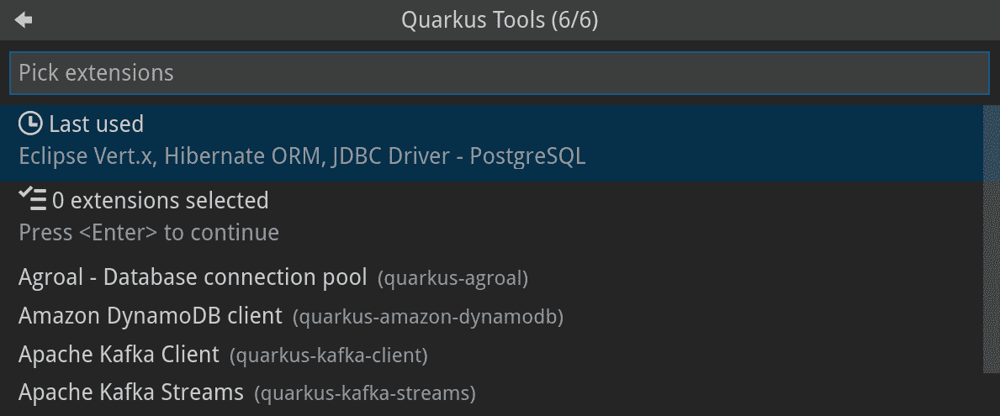
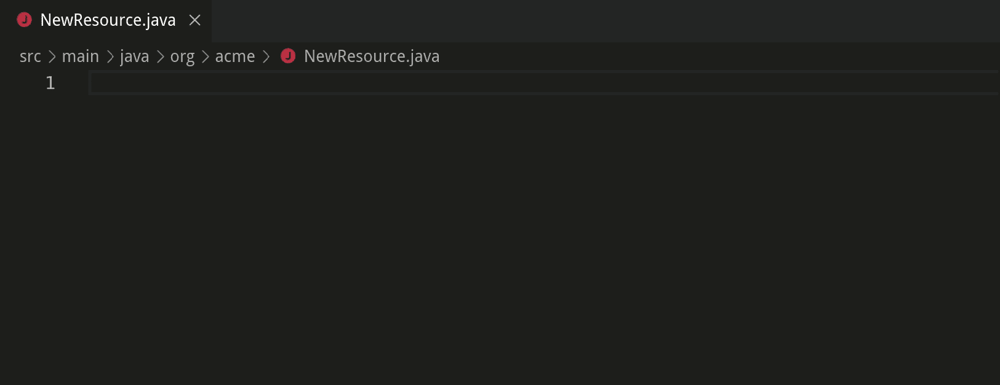
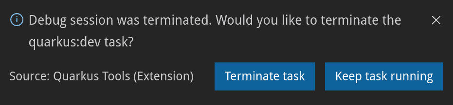
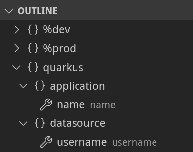
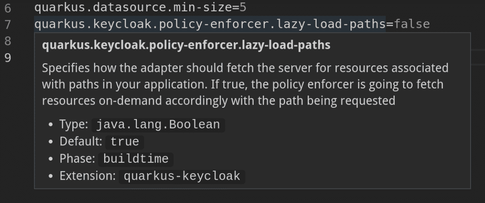
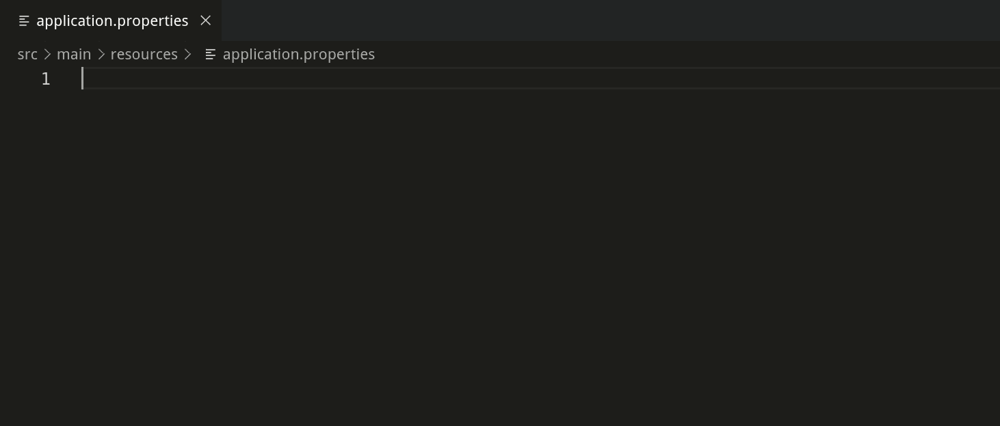
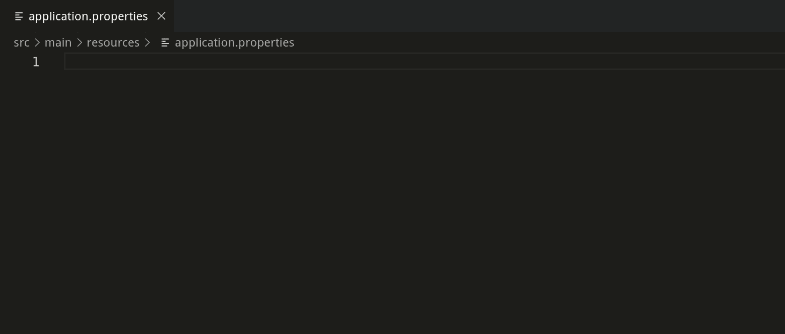
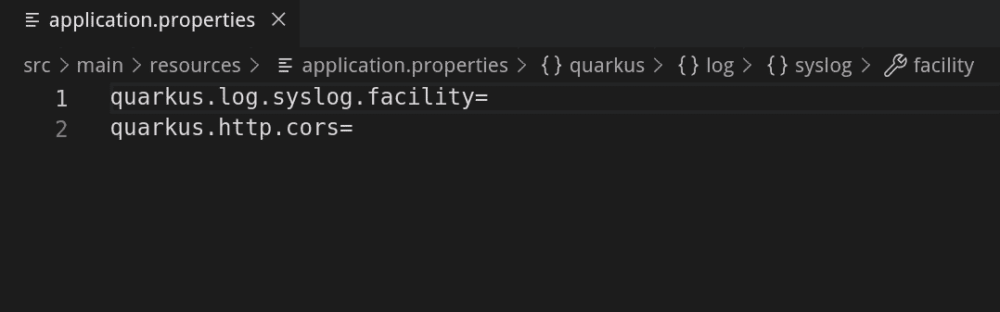
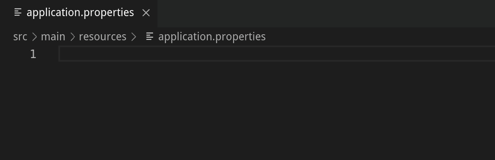
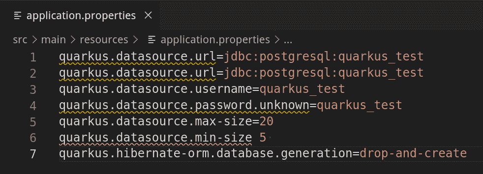

# Visual Studio 代码的新 Quarkus 扩展如何改进开发体验

> 原文：<https://developers.redhat.com/blog/2019/09/23/how-the-new-quarkus-extension-for-visual-studio-code-improves-the-development-experience>

今年早些时候，我们被介绍给了 Quarkus，这是 Java 应用程序的下一代、容器优先的框架。正如所料，这样的新框架和技术为新的开发者工具让路，这些工具致力于使开发体验更好。

最近发布的 Quarkus Tools for Visual Studio 代码版本旨在通过在 VS 代码中引入 Quarkus 项目开发特有的特性来实现这一目标。新的 VS 代码扩展依赖于几个 VS 代码的 Java 扩展，所以建议您安装 [Java 扩展包](https://marketplace.visualstudio.com/items?itemName=vscjava.vscode-java-pack)。本文概述了 Quarkus Tools for Visual Studio 代码必须提供的功能:为已经很方便的 Java 框架提供方便的特性。

要了解更多详细信息，请查看 GitHub 知识库。

观看 quar kus Visual Studio 代码工具的演示:

https://youtu.be/XMrLP_7IbW0

### 生成基于 Maven 的 Quarkus 项目

以前，生成基于 Maven 的 Quarkus 项目需要运行 Maven 命令或使用 [code.quarkus.io](https://code.quarkus.io/) 创建项目。现在，您可以直接从 VS 代码中的用户界面创建一个新项目。这可以通过一个新的向导来完成，该向导使用最新版本的 Quarkus 生成基于 Maven 的 Quarkus 项目。

向导将要求您输入项目的 groupId、artifactId、项目版本、包名、资源名和目标目录。它还允许您选择要添加到新项目中的 Quarkus 扩展。如果您之前通过向导选择了 Quarkus 扩展，那么“上次使用”选项可以让您轻松选择所有之前选择的扩展。

### 代码片段支持

VS 代码扩展提供了创建新的 Quarkus 资源和测试的代码片段，这有助于加快您的工作流程。您可以通过调用`Insert Snippet` VS Code 命令或者简单地在 Java 文件中键入代码片段前缀来使用这些代码片段。按 tab 将光标置于下一个感兴趣的位置。

### 将 quartus 扩展添加到 quartus 项目

VS 代码扩展提供了一个单独的向导，用于向当前项目添加 Quarkus 扩展。

在选择了所需的 Quarkus 扩展之后，添加扩展的 Maven 命令将在 VS Code 的集成终端中运行。

### 调试 quartus 项目

使用 VS 代码扩展的 debug 命令启动调试会话会自动在项目文件夹中创建并添加新的 VS 代码任务和调试配置。这一步允许 VS 代码在启动调试会话时通过运行`quarkus:dev`命令自动启动 Quarkus 应用程序。调试器将在应用程序启动后立即附加到它。当关闭调试会话时，您可以选择终止 Quarkus 应用程序或保持其运行。

### application.properties 的树视图

打开 application.properties 文件时，VS 代码资源管理器大纲将为您提供一个包含所有属性键和值的树视图。此功能对于大型 application.properties 文件尤其有用，因为它按属性的命名空间和配置文件对属性进行分组。

### 悬停和 application.properties 的文档

悬停在属性键上的能力使得查看属性的文档变得容易。文档提供了属性键的值类型、默认值(如果存在)、阶段(属性是在 Quarkus 运行时还是在构建时应用)以及扩展名。

### 完成 application.properties

到目前为止，application.properties 文件中可能会出现 400 多个可能的预定义 Quarkus 属性。我向你挑战，要你把它们都记住:)。因为可以配置大量的属性，所以属性键和值补全对于使用 application.properties 文件的任何人都很有用。

打开 application.properties 文件后，您可以在键入时或使用 Ctrl+Space(对于 macOS 为 Option+Space)键盘快捷键接收属性键完成选项。完成选项列表与项目当前可用的 Quarkus 扩展保持同步。这意味着，无论何时添加或删除 Quarkus 扩展，补全选项列表都会更新，为您提供相关的补全选项。

如果属性键有默认值，它将作为完成的一部分自动插入。

完成也可用于枚举类型和布尔值。

还对映射属性提供了完成支持。编辑属性后按 tab 键会将光标放在下一个位置。

### application.properties 的验证

最后但同样重要的是，我们对 application.properties 提供了验证支持。我们目前提供了对未知属性、重复属性和缺少等号的验证支持。

## 后续步骤

正如您所看到的，Quarkus Tools for Visual Studio Code 具有很好的特性，可以帮助提供无缝的开发人员体验，并在 VS 代码中促进 quar kus 项目开发。然而，这并不意味着扩展是完美的和无 bug 的；目前仍在改进中。我们渴望添加新的特性(比如在 web 浏览器中打开 REST 端点 URL 的 CodeLens 特性)并改进现有的特性(比如完成、验证、代码片段)。

如果您喜欢 Eclipse 和 IntelliJ IDEA 之类的 ide，好消息是针对这些 ide 的 Quarkus 工具目前正在开发中。因为 application.properties 特性是通过[语言服务器协议(LSP)](https://microsoft.github.io/language-server-protocol/) 提供的，所以可以向其他编辑器和 ide 提供相同的特性。

如果您有任何问题或功能请求，请通过在此创建 GitHub 问题[让我们知道。我们非常乐意听取任何改进建议。如果你想为这个项目做贡献，贡献指南位于 GitHub 库](https://github.com/redhat-developer/vscode-quarkus/issues)[这里](https://github.com/redhat-developer/vscode-quarkus/blob/master/CONTRIBUTING.md)。

感谢您的阅读！

*Last updated: July 1, 2020*