# 使用 Keycloak 代替 Picketlink 进行基于 SAML 的身份验证

> 原文：<https://developers.redhat.com/blog/2019/08/27/using-keycloak-instead-of-picketlink-for-saml-based-authentication>

[Picketlink](http://picketlink.org/) 项目现在是[Red Hat JBoss Enterprise Application Platform(EAP)](https://developers.redhat.com/products/eap/overview)中一个不推荐使用的模块，因此 Picketlink 可能不会在 EAP/Wildfly 的下一个版本中发布，并且在不久的将来也不会对`picketlink`模块进行任何修复。

然而，Picketlink 现在与 [Keycloak](https://www.keycloak.org/about.html) 合并，后者是由 Red Hat 的 JBoss 社区开发的开源身份和访问管理解决方案。在本文中，我们将提出一个替代`picketlink`模块的解决方案。一些组织使用`picketlink`作为服务提供者，通过第三方身份提供者(即 Active Directory Federated Services(AD FS)、OKTA、PingFederate 等)实现基于 SAML 的认证。).在这篇文章中，我们将了解如何配置 keycloak-saml 适配器来代替 Picketlink，从而通过第三方身份提供者实现基于 saml 的身份验证。

### 设置依赖方

In AD FS Management console, right-click *Trust relationships → Relying Party Trusts* and select *Add Relying Party Trust* from the menu:

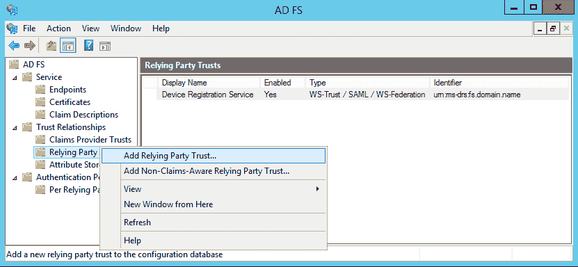

AD FS 允许您导入元数据，无需任何手动干预即可完成配置。然而，这里我们需要手动配置。

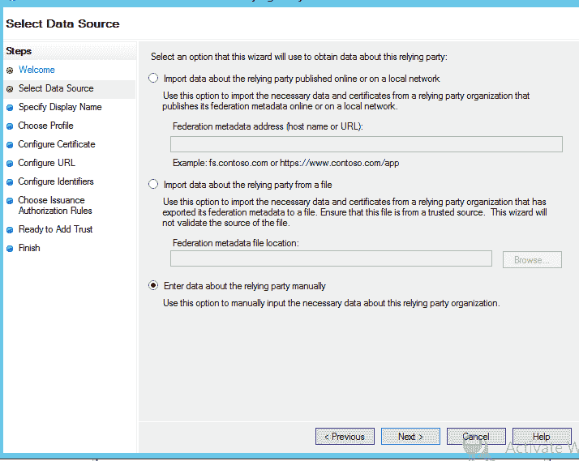

为基于 SAML2.0 的联盟选择 *AD FS 配置文件*:

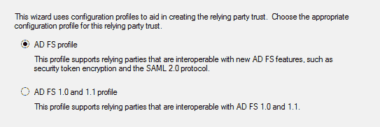

如果需要启用加密声明，请导入将用于加密的证书，但要确保服务提供者有相关的私钥。

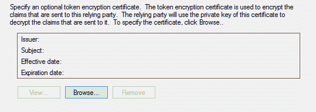

检查 SAML2.0 WebSSO 协议支持，以启用 SAML 与 web 应用程序的联合:

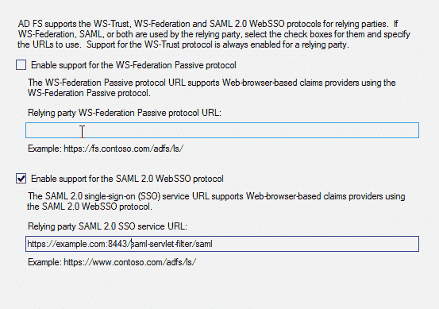

添加依赖方信任的 URL 可以在此添加多个 URL:

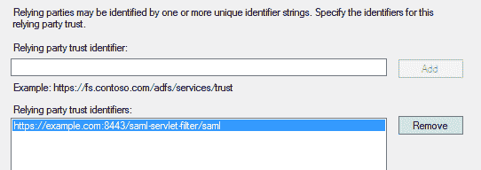

允许所有用户允许所有用户访问依赖方:

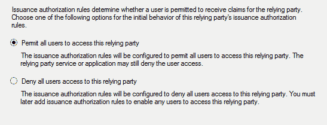

一旦添加了依赖方信任，AD FS 将能够根据服务提供商的请求正确地对用户进行身份验证，但是所请求的名称 ID 格式将不会被识别，SAML 响应也不会包含任何其他信息，如电子邮件。因此，有必要将来自 AD 用户详细信息的声明映射到 SAML 文档中。

### 三条规则

我们将建立三个规则:一个用于映射用户 ID，一个用于映射标准用户属性，另一个用于用户组。所有这些都是通过点击*编辑索赔规则*中的*添加规则*按钮开始的。

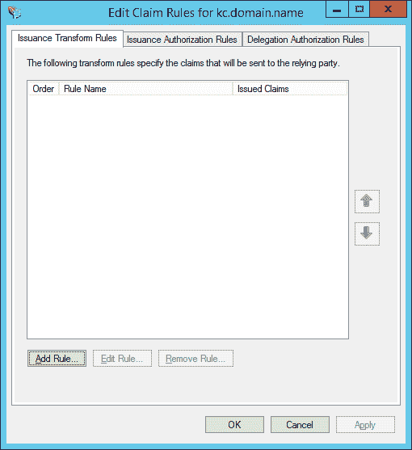

第一个规则将 Windows 限定域名中的用户 ID 映射到 SAML 响应。在*添加转换索赔规则*窗口中，选择*转换*一个进来的索赔规则类型:

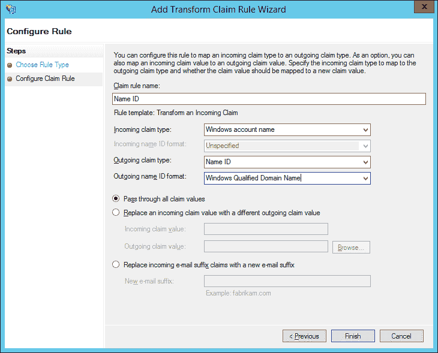

The example above targets the Windows account name ID format. Other name ID formats are supported but are outside the scope of this post. See [this article](https://blogs.msdn.microsoft.com/card/2010/02/17/name-identifiers-in-saml-assertions/) on how to set up name IDs for persistent and transient formats.

第二个规则将用户电子邮件映射到 SAML 响应。在*添加转换声明规则*窗口中，选择发送 LDAP 属性作为声明规则类型。您可以根据需要添加其他属性:

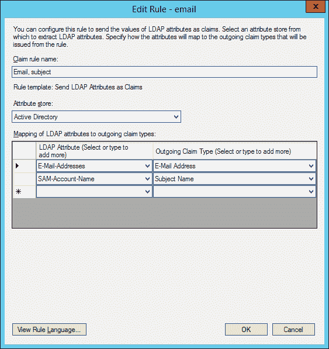

如果用户是一个命名组的成员，第三个规则将发送一个组名。再次启动*添加转换声明规则*窗口，选择*发送组成员身份*作为*声明规则*类型。然后在字段中输入请求的值:

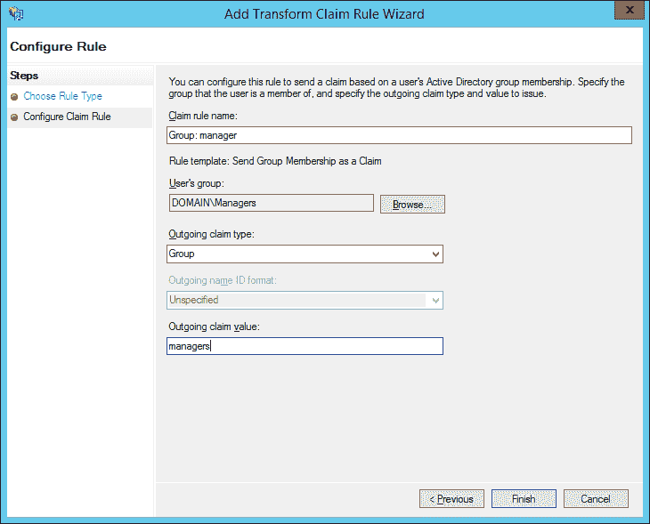This setup would send an attribute named Group in the SAML assertion with value managers if the authenticated user is a member of the DOMAIN\Managers group.Now install keycloak-saml-adapter in Wildfly,

*   从 https://www.keycloak.org/downloads.html 下载 Wildfly 客户端适配器。
*   在`$Wildfly_Home`处解压缩 saml-adapter。在 Linux 中，解压缩可以通过执行命令`unzip keycloak-wildfly-adapter-dist.zip`来完成。
*   成功提取 CLI 脚本后。`adapter-install-saml.cli`将在`$Wildfly_Home/bin`出现，需要通过 jboss-cli 命令执行，即`$Wildfly_Home/bin/jboss-cli.sh --connect --file=adapter-install-saml.cli`。

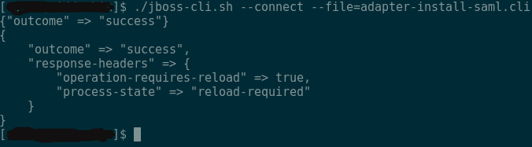

Wildfly 现在已经准备好了 keycloak-saml 适配器。要通过 SAML 协议启用 AD FS 身份验证，必须像 picketlink.xml 一样配置`keycloak-saml.xml`文件，如下所示，并将其放在应用程序的 WEB-INF 中。

```
<keycloak-saml-adapter  
               xmlns:xsi="http://www.w3.org/2001/XMLSchema-instance"
               xsi:schemaLocation="urn:keycloak:saml:adapter 
               http://www.keycloak.org/schema/keycloak_saml_adapter_1_7.xsd">
      <SP entityID="https://example.com:8443/saml-servlet-filter/" sslPolicy="EXTERNAL"
           nameIDPolicyFormat="urn:oasis:names:tc:SAML:1.1:nameid-format:WindowsDomainQualifiedName"
           logoutPage="/logout.jsp">
           <IDP entityID="idp" signatureAlgorithm="RSA_SHA256">
                <SingleSignOnService signRequest="false"
                        validateResponseSignature="false"
                        requestBinding="POST"
                        bindingUrl="https://example.adfs.com/adfs/ls/"/>
                <SingleLogoutService signRequest="false"
                        signResponse="false"
                        validateRequestSignature="false"
                        validateResponseSignature="false"
                        requestBinding="POST"
                        responseBinding="POST"
                        postBindingUrl="https://example.adfs.com/adfs/ls/"
                        redirectBindingUrl="https://example.adfs.com/adfs/ls/"/>
          </IDP>
      </SP>
</keycloak-saml-adapter>
```

就是这样。现在，keycloak-saml 适配器已经设置好，可以开始使用了。

*Last updated: August 26, 2019*