# 在 OpenShift 上为 Red Hat Decision Manager 启用 CI/CD

> 原文：<https://developers.redhat.com/blog/2019/07/22/enabling-ci-cd-for-red-hat-decision-manager-on-openshift>

作为微服务采用之旅的一部分，总有一天组织会开始实施越来越多的规则服务，作为整个应用解决方案的一部分。一次可能要管理和部署数百个规则服务，这使得应用程序团队的工作更具挑战性，并最终导致整个生产部署的延迟。

[Red Hat Decision Manager](https://developers.redhat.com/products/red-hat-decision-manager/overview)(RHDM)是一个解决方案，使开发人员和应用程序团队能够为他们的应用程序需求实现决策服务或业务规则。我将介绍我们如何充分利用 Red Hat Decision Manager 和 [Red Hat OpenShift](http://developers.redhat.com/openshift/) 带来的功能来实现顺畅的 CI/CD 流程，以便快速部署决策服务。(本教程假设您已经很好地理解了 RHDM 和 OpenShift。)

这里概述的所有步骤都可以在我在 GitHub 中创建的演示中找到。该演示基于简单的旅游保险业务规则。如果您不希望遵循这里的步骤，您可以转到 GitHub 使用脚本来部署演示。请注意，随着我继续增强演示，GitHub 的内容可能会随着时间的推移而改变。

## 架构概述

让我们快速浏览一下我们将在本文中涉及的架构。请记住，这是在 OpenShift 上部署 RHDM 的众多可能性之一。从图中可以看出，决策中心和决策管理器部署在开发环境中，而只有决策管理器部署在 SIT、UAT 和 PROD 中。在这些环境中不需要决策中心，因为我们可以使用 CI/CD 流程轻松地在这些环境中部署决策服务的更改。

[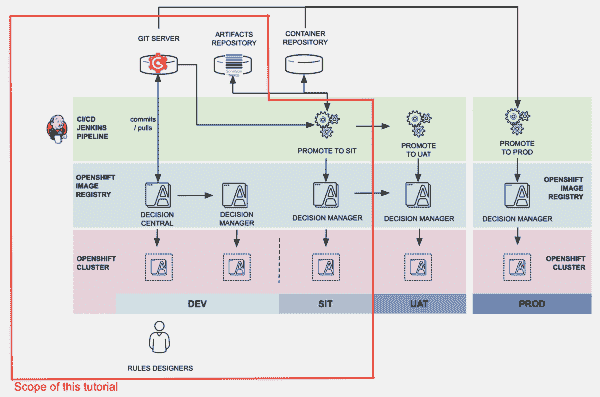](/sites/default/files/blog/2019/07/rhdm-cicd-architecture.png)RHDM CI/CD Architecture

RHDM CI/CD 架构">

规则设计者或规则开发人员访问开发环境中的决策中心来开发或修改业务规则。变更可以在开发环境中的 kie-server 中进行部署和测试。当决定从 DEV 到 SIT 的更改是好的时，Jenkins 管道用于构建 kjar 并将其部署到 SIT 环境中的决策服务器。对于 kjar 和容器构建，Nexus 存储库也被配置为 maven repo。

在本文中，为了简化演示，来自决策中心的更改被直接推送到 Gogs 服务器。一个配置好的 Git 钩子将执行 curl POST 来调用 Jenkins 作业，使用管道构建 kjar，将 kjar 部署到 Nexus 中，然后将 kjar 从 Nexus 部署到 OpenShift SIT 环境中。我相信这足以为任何想要建立类似环境的人提供一个良好的开端，甚至扩展到 UAT 和 PROD 环境。

在现实环境中，您还可以考虑使用一个单独的容器存储库来存储容器映像的现成黄金副本。这样，您就可以随时引用这个黄金容器映像来部署到包括生产环境在内的多个环境中。一个这样的集装箱图像库是红帽码头。

## 在 OpenShift 上准备我们的环境

在部署 RHDM 之前，确保 RHDM 图像流在 OpenShift 上可用。以 cluster-admin 身份登录，并通过运行以下命令来验证图像流。如果图像流在 OpenShift 上不可用，请按照[这些说明进行配置](https://access.redhat.com/documentation/en-us/red_hat_decision_manager/7.3/html/deploying_a_red_hat_decision_manager_authoring_or_managed_server_environment_on_red_hat_openshift_container_platform/dm-openshift-prepare-con#imagestreams-file-install-proc)。您的环境中可能有不同的图像流版本标记；请注意对这里列出的步骤进行必要的更改。

```
oc get imagestreamtag -n openshift | grep rhdm73-decisioncentral-openshift
oc get imagestreamtag -n openshift | grep rhdm73-kieserver-openshift
```

我们正在创建三个 OpenShift 项目来代表不同的环境。在这个例子中，我们将创建一个名为 Tools 的项目来对 Jenkins、Nexus 和 Gogs 容器进行分组——DM DEV 和 DM SIT 各有一个单独的项目。

```
oc new-project rhdm-tools --display-name="Tools"
oc new-project rhdm-sit --display-name="DM SIT"
oc new-project rhdm-dev --display-name="DM DEV"

```

在后面的部分，当我们使用 Jenkins 管道将使用 kie-server 模板的 kjar 部署到 SIT 环境中时，这个 kie-server 模板将在许多其他 OpenShift 组件之上创建必要的角色绑定。为了让 Jenkins 能够在 SIT 环境中提供 kie-server，我们需要确保 Jenkins 拥有适当的权限。运行以下命令为 Jenkins 创建必要的权限。您可能会收到此通知: *" 警告:找不到服务帐户‘Jenkins’， "* ，暂时可以忽略。

```
oc create role RoleBindingRbacCreate --verb=create --resource=rolebindings.rbac.authorization.k8s.io -n rhdm-sit
oc create role RoleBindingCreate --verb=create --resource=rolebindings.authorization.openshift.io -n rhdm-sit
oc policy add-role-to-user edit system:serviceaccount:rhdm-tools:jenkins -n rhdm-sit
oc policy add-role-to-user edit system:serviceaccount:rhdm-tools:jenkins -n rhdm-sit
oc adm policy add-role-to-user RoleBindingRbacCreate system:serviceaccountrhdm-tools:jenkins --role-namespace=rhdm-sit -n rhdm-sit
oc adm policy add-role-to-user RoleBindingCreate system:serviceaccount:rhdm-tools:jenkins --role-namespace=rhdm-sit -n rhdm-sit

```

### 部署 Gogs 容器并准备演示数据

接下来，我们将在 Tools 项目中创建 Gogs 容器。

```
oc new-app -f https://raw.githubusercontent.com/chengkuangan/templates/master/gogs-persistent-template.yaml -p SKIP_TLS_VERIFY=true -n rhdm-tools
```

等待 Gogs 容器准备就绪。导航到 Gogs 控制台，创建一个新用户，并执行下面几个命令。

我们将使用来自 GitHub 的示例项目。

```
git clone --bare https://github.com/chengkuangan/travel-insurance-rules.git
cd travel-insurance-rules.git
```

创建一个令牌，以便您可以使用该令牌通过命令行创建 Gogs repo。请相应地更改`${GOGUSER},  ${GOGSPASSWORD}, ${GOGD_HOSTNAME}`。

```
curl -X POST -H "content-type: application/json" -d '{"name":"sample-token","sha1":"8a4fc41b4868aecdd623b10cb1b64a36c6ee51f3"}' 'http://${GOGSUSER}:${GOGSPASSWORD}@${GOGS_HOSTNAME}/api/v1/users/${GOGSUSER}/tokens'

```

使用上一步中创建的令牌创建必要的存储库。请相应地更改`${GOGUSER},  ${GOGSPASSWORD}, ${GOGD_HOSTNAME}`。

```
curl -H "Content-Type: application/json" -d '{"name": "travel-insurance-rules", "description": "Travel Insurance Rules Demo", "private": false}' -X POST 'http://${GOGSUSER}:${GOGSPASSWORD}@${GOGS_HOSTNAME}/api/v1/user/repos?token=8a4fc41b4868aecdd623b10cb1b64a36c6ee51f3'
```

确保您在本地`travel-insurance-rules.git`目录中。将样本代码放入 Gogs 存储库中。请相应地更改`${GOGUSER},  ${GOGSPASSWORD}, ${GOGD_HOSTNAME}`。

```
git push --mirror 'http://${GOGSUSER}:${GOGSPASSWORD}@${GOGS_HOSTNAME}/${GOGSUSER}/travel-insurance-rules.git'
```

删除 git 目录。

```
cd ..
rm -rf travel-insurance-rules.git
```

现在，我们将从刚刚创建的 Gogs 存储库中克隆存储库，因为我们需要对演示进行一些更改。你可以直接到 Gogs 控制台来做这件事；然而，我发现使用命令更好。请相应地更改`${GOGUSER},  ${GOGSPASSWORD}, ${GOGD_HOSTNAME}`、`${PROJECTNAME}`。这里的`${PROJECTNAME}`是指部署了 Nexus 的项目，例如`rhdm-tools`。

```
git clone http://${GOGS_HOSTNAME}/${GOGSUSER}/travel-insurance-rules.git 
cd travel-insurance-rules
sed -i -e "s/http:\/\/nexus3.demo1-tools.svc.cluster.local/http:\/\/nexus3.${PROJECTNAME}.svc.cluster.local/g" ./Jenkinsfile
sed -i -e "s/http:\/\/nexus3.demo1-tools.svc.cluster.local/http:\/\/nexus3.${PROJECTNAME}.svc.cluster.local/g" ./openshift-nexus-settings.xml
git add .
git commit -m "Updated Jenkinsfile"
git push 'http://${GOGSUSER}:${GOGSPASSWORD}@${GOGS_HOSTNAME}/${GOGSUSER}/travel-insurance-rules.git'
cd ..
rm -rf travel-insurance-rules
```

[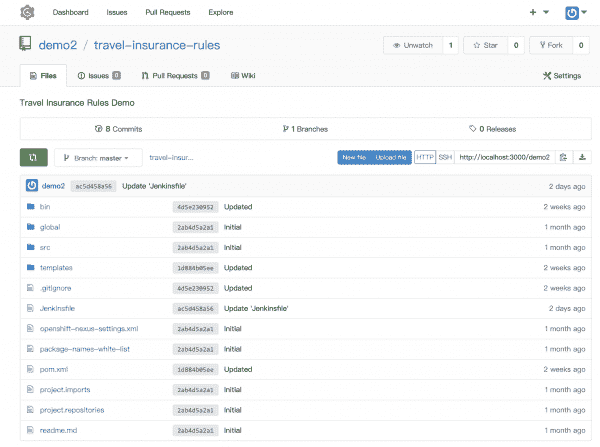](/sites/default/files/blog/2019/07/rhdm-gogs-repo-2.png)Gogs Repository

Gogs 存储库">

### 供应 Nexus 3

下一步是部署 Nexus 容器。

```
oc new-app -f https://raw.githubusercontent.com/chengkuangan/templates/master/nexus3-persistent-templates.yaml -n rhdm-tools
```

等待 Nexus 容器准备好，这需要一些时间。运行以下命令在 Nexus 中创建必要的 repo。请相应地更换`${NEXUS_HOSTNAME}`，例如 http://nexus3-rhdm-tools.apps.ocp.demo.com。

```
curl -o /tmp/nexus-functions -s https://raw.githubusercontent.com/chengkuangan/scripts/master/configure_nexus3_repo.sh; source /tmp/nexus-functions admin admin123 http://${NEXUS_HOSTNAME}
```

[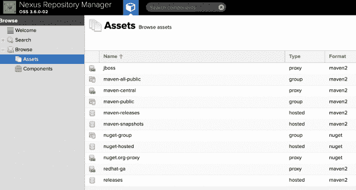](/sites/default/files/blog/2019/07/rhdm-nexus-repos.png)Nexus Repos

nexus repos " >

### 詹金斯条款

接下来，部署 Jenkins 容器。

```
oc new-app jenkins-persistent -n rhdm-tools
```

等待容器准备好。然后，用 OpenShift 用户登录 Jenkins，接受默认的权限提示。一旦进入，创建一个新的令牌并记下这个令牌；我们将在下一个命令中使用它来创建 Jenkins 作业。保管好这个令牌，因为你将无法从詹金斯那里再次取回它。

[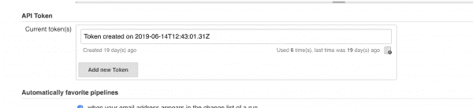](/sites/default/files/blog/2019/07/rhdm-jenkins-token.png)Create Jenkins Token

创建 Jenkins 令牌">

运行以下命令创建一个 Jenkins 作业并填充正确的设置。记住根据您的环境为`${PROJECTNAME}, ${DOMAIN_NAME}, ${GOGUSER}, ${JENKINS_USERNAME}, ${JENKINS_TOKEN}`使用正确的值。

```
curl -k https://jenkins-${PROJECTNAME}.${DOMAIN_NAME}/jnlpJars/jenkins-cli.jar --output /tmp/jenkins-cli.jar
curl -k https://raw.githubusercontent.com/chengkuangan/travel-insurance-rules/master/templates/jenkins-job.xml --output /tmp/jenkins-job-work.xml
sed -i -e "s/https:\/\/github.com\/chengkuangan\/travel-insurance-rules.git/http:\/\/gogs:3000\/${GOGSUSER}\/travel-insurance-rules.git/g" /tmp/jenkins-job-work.xml
java -jar /tmp/jenkins-cli.jar -s https://jenkins-${PROJECTNAME}.${DOMAIN_NAME}/ -noCertificateCheck -auth ${JENKINS_USERNAME}:${JENKINS_TOKEN}  create-job travel-insurance-rules < /tmp/jenkins-job-work.xml

```

[](/sites/default/files/blog/2019/07/rhdm-jenkins-job.png)Jenkins Job

詹金斯工作">

### 在开发环境中部署 kie-server 和决策中心

创建部署 kie-server 和决策中心所需的密钥库。为了使本教程简单，我为 kie-server 和 Decision Central 使用一个密钥库。对于生产，建议使用单独的密钥库和更安全的密码。

```
keytool -genkeypair -alias jboss -keyalg RSA -keystore ./keystore.jks -storepass mykeystorepass --dname 'CN=demo1,OU=Demo,O=ocp.demo.com,L=KL,S=KL,C=MY'
```

为 kie-服务器和决策中心创造秘密。

```
oc create secret generic kieserver-app-secret --from-file=./keystore.jks -n rhdm-dev
oc create secret generic decisioncentral-app-secret --from-file=./keystore.jks -n rhdm-dev
```

使用创作模板部署 kie 服务器和决策中心。您可以从[红帽产品下载网站](https://access.redhat.com/downloads)获得模板。

注意，我还在`oc new-app`命令中传递了`GIT_HOOKS_DIR`参数。这表示我们稍后将创建的 Git 挂钩的目录，以确保每当对决策中心项目文件进行更改时，都会自动推送到 Gogs repo。记住在命令行参数中替换`$KIESERVER_KEYSTORE_PASSWORD`和`$PROJ_DM_DEV_NAME`的值。

```
oc new-app -f https://raw.githubusercontent.com/chengkuangan/travel-insurance-rules/master/templates/rhdm73-authoring.yaml -p DECISION_CENTRAL_HTTPS_SECRET=decisioncentral-app-secret -p KIE_SERVER_HTTPS_SECRET=kieserver-app-secret -p DECISION_CENTRAL_HTTPS_PASSWORD=$KIESERVER_KEYSTORE_PASSWORD -p KIE_SERVER_HTTPS_PASSWORD=$KIESERVER_KEYSTORE_PASSWORD -p APPLICATION_NAME=dmanager -p IMAGE_STREAM_TAG=1.1 -p GIT_HOOKS_DIR=/opt/eap/standalone/data/kie/hooks *-n $PROJ_DM_DEV_NAME*
```

[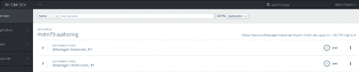](/sites/default/files/blog/2019/07/rhdm-dev-containers.png)KIE Server and Decision Central in DEV Environment

开发环境中的 KIE 服务器和决策中心">

您可能会注意到，我使用模板创建了一个永久卷。这不是从 Red Hat 网站下载的 RHDM 创作模板中的默认设置。当我们稍后在 Decision Central POD 中导入和创建 ssh 密钥、ssh `config`和 ssh `known_hosts`文件时，这是必需的和有用的。

[](/sites/default/files/blog/2019/07/rhdm-dc-pv-ssh.png)Decision Central DC Modification for .ssh PV

DC 中央决策修改为。ssh PV " >

## 完成 CI/CD 流程

### 配置 Gogs

出于演示目的，我将在 Gogs repo 设置中配置接收后 Git 挂钩。这只是一个简单的 curl POST 到 Jenkins 任务，每当 Gogs 存储库中有代码变更时，就开始 Jenkins 构建，由 Decision Central 提交。在现实环境中，您可能希望基于不同的情况编写一个更完整的脚本来调用 Jenkins job build，或者您可能希望只使用内置的 Webhooks。

下面是在`post-receive` Git hook 中使用的 curl 命令。请注意，这是我们之前使用创建的令牌时使用的同一个 Jenkins 用户。根据实际环境的需要替换 Jenkins 主机名。根据您的环境更改用户和令牌。

```
#!/bin/bash
curl -k -X POST --user demo1-admin-edit-view:<token> https://jenkins-demo1-tools.apps.3.1.190.191.nip.io/job/travel-insurance-rules/build
```

[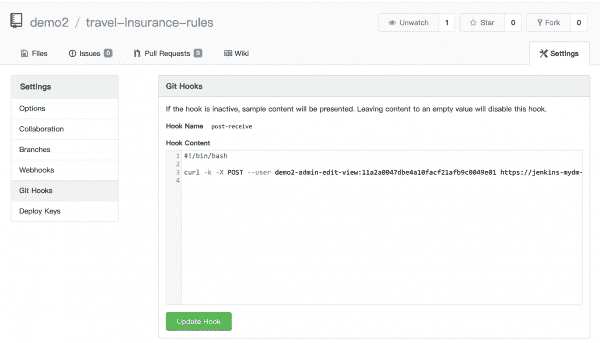](/sites/default/files/blog/2019/07/rhdm-gogs-githook.png)Simple Git Hook

简单的 Git 挂钩">

使用以下命令创建一个 ssh 密钥，并确保该电子邮件与来自 Gogs 用户的电子邮件相匹配。使用空密码。然后，将公钥(id_rsa.pub)添加到 Gogs 中。请记住在不同的目录下创建这些密钥，以避免覆盖您现有的密钥。

```
ssh-keygen -t rsa -C "myeamil@email.com" -N ""
```

[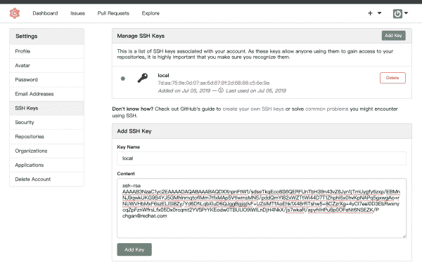](/sites/default/files/blog/2019/07/rhdm-gogs-sshkeys.png)Gogs SSH Keys

Gogs SSH Keys " >

### 配置决策中心

为了让 Decision Central 能够将项目变更拉进和推送到 Gogs，我们需要传输之前创建的私有密钥(`id_rsa`)、ssh `config`文件，并在容器的`/home/jboss/.ssh`目录中创建一个 ssh `known_hosts`文件。对于我们之前使用修改后的 RHDM 创作模板创建的 PV，这允许对 known_hosts 文件的写访问，以及这些 ssh 相关文件的持久性。

接下来，`oc rsh`进入决策中心容器，创建包含以下内容的文件`/home/jboss/.ssh/config`(具有 644 文件权限)。确保主机和主机名与我们之前创建的节点端口的 svc 相匹配。替换其他值以匹配您自己的环境。您可以在 POD 外部创建该文件，并使用`oc cp`命令将其复制到 POD 中。

```
Host gogs-ssh.demo1-tools.svc.cluster.local
    Hostname gogs-ssh.demo1-tools.svc.cluster.local
    User demo1
    Port 1025
    IdentityFile ~/.ssh/id_rsa
```

[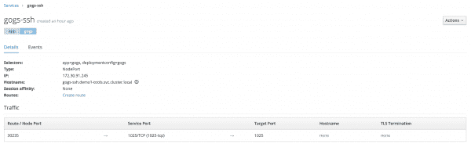](/sites/default/files/blog/2019/07/rhdm-gogs-ssh-nodeport.png)Gogs NodePort for SSH

SSH 的 Gogs 节点端口">

将 ssh 私钥(id_rsa)文件复制到`/home/jboss/.ssh`中，确保它拥有文件权限 600。您可以使用`oc cp`命令来完成这项工作。

通过在 POD 中运行以下命令创建一个空的`known_hosts`。您也可以使用`oc exec`命令来完成这项工作。

```
touch /home/jboss/.ssh/known_hosts
```

接下来，`oc rsh`进入 Decision Central POD，使用以下命令测试到 Gogs 的 ssh 连接。系统将提示您接受并信任主机名。重要的是要做到这一点；否则，当您在决策中心控制台上修改项目文件时，保存更改的尝试将在后端失败，并在决策中心服务器日志中抛出错误消息*“主机密钥验证失败”*。

```
ssh -vT gogs-ssh.rhdm-tools.svc.cluster.local
```

导航至`/opt/eap/standalone/data/kie/hooks`。用 755 文件权限创建一个名为`post-commit`的文件。`post-commit`文件只包含一行，如下所示。这个文件的位置是我们使用 RHDM 创作模板创建容器时用于`GIT_HOOKS_DIR`的参数。

```
git push
```

因为我们没有更改模板中的默认 adminUser 和密码，所以我们需要导航到 Decision Manager 部署配置来检索生成的 adminUser 和密码。

[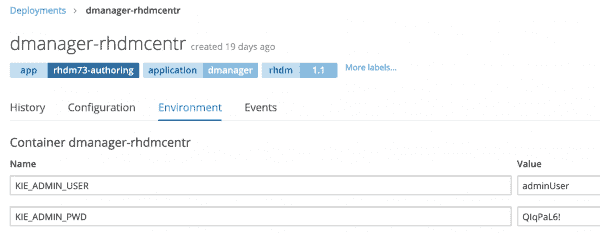](/sites/default/files/blog/2019/07/rhdm-dc-admin-user.png)Decision Central adminUser and Password

决策中心管理员用户和密码">

使用 adminUser 登录到决策中心，并将项目源代码从 Gogs 存储库中导入到决策中心。确保它是正确的 Gogs ssh URL，并注意我们使用的是端口为 1025 的内部 svc 主机名。

[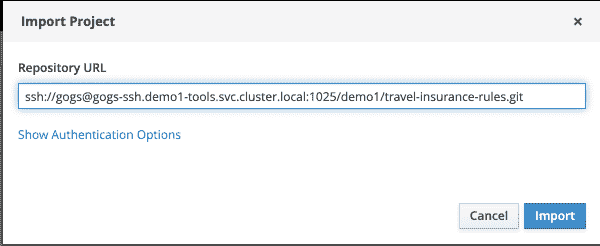](/sites/default/files/blog/2019/07/rhdm-import-project-from-gogs-1.png)Import Project from Gogs

从 Gogs 导入项目">

现在，尝试对其中一个项目文件进行更改。如果集成成功，您将看到更改被推送到 Gogs 中，然后 Jenkins 的工作将立即开始。请注意，第一次詹金斯建设将需要更长的时间。

[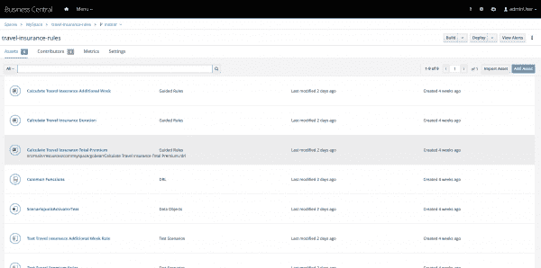](/sites/default/files/blog/2019/07/rhdm-dc-project-artifacts.png)Imported Decision Service Project Contents

导入的决策服务项目内容">

[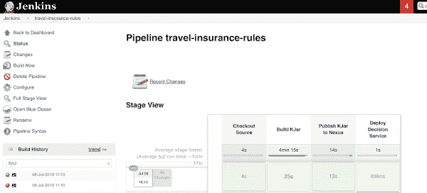](/sites/default/files/blog/2019/07/rhdm-jenkins-builds.png)A Success Triggered Jenkins Build

一次成功触发了 Jenkins Build " >

正如您已经注意到的，在 DEV 环境中部署了一个 kie-server。在您的实际环境中，您可能希望首先在 DEV 中将决策服务部署到 kie-server 中。在部署到 SIT 环境之前，请确保它正在工作。根据本文中的知识，您可以随时随地改变流程以适应您的环境。

## 接下来你能做什么？

*   对您的 UAT 环境应用相同的方法。
*   在您的环境中引入一个容器映像存储库，以便在您需要将相同的决策服务部署到多个环境中时，最大限度地减少频繁构建决策服务的需求。你可以考虑 Red Hat Quay 或者其他类似的仓库，比如 Nexus。
*   引入蓝绿色部署，以最大限度地减少决策服务部署停机时间。
*   引入治理流程作为您开发运维之旅的一部分。

## 参考

*   [如何在 OpenShift 上启用所需的图像流](https://access.redhat.com/documentation/en-us/red_hat_decision_manager/7.3/html/deploying_a_red_hat_decision_manager_authoring_or_managed_server_environment_on_red_hat_openshift_container_platform/dm-openshift-prepare-con#imagestreams-file-install-proc)
*   [在 OpenShift 上部署 RHDM 的完整指南](https://access.redhat.com/documentation/en-us/red_hat_decision_manager/7.3/html/deploying_a_red_hat_decision_manager_authoring_or_managed_server_environment_on_red_hat_openshift_container_platform/)

### 阅读更多

*   [在 OpenShift 上部署 Jenkins:第 1 部分](https://blog.openshift.com/deploying-jenkins-on-openshift-part-1/)
*   [具有 OpenShift 管道的云原生 CI/CD](https://blog.openshift.com/cloud-native-ci-cd-with-openshift-pipelines/)

*Last updated: February 17, 2022*