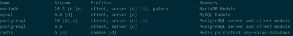

# 在 Red Hat Enterprise Linux 8 上快速设置灯堆栈

> 原文：<https://developers.redhat.com/blog/2019/07/03/quickly-set-up-a-lamp-stack-on-red-hat-enterprise-linux-8>

你试过[红帽企业版 Linux 8](https://developers.redhat.com/rhel8/) (RHEL8)了吗？请继续阅读，了解如何在 RHEL8 上快速设置[灯堆栈](https://developers.redhat.com/blog/2017/03/07/how-to-set-up-a-lamp-stack-on-red-hat-enterprise-linux-7/)，以便您可以体验内置于操作系统中的新功能。

灯组由四个主要部件和一些胶水组成。LAMP 堆栈中的第一个主要组件(“L”)是 Linux。在我的例子中，我使用的是 Red Hat Enterprise Linux 8，它为我提供了一个安全的操作系统、一个现代化的编程环境和一套用户友好的工具来控制它。

至于 web 服务器，传统上 LAMP 中的“A”代表 [Apache](https://www.apache.org) ，但是在 Red Hat Enterprise Linux 8 中，我们实际上有选项。我们发布 Apache `httpd`和 RHEL8，但是我们也发布 NGINX。因为我在这里有点传统，所以我会选择 Apache。

在 RHEL8 中，Apache 作为一个 [AppStream](https://developers.redhat.com/blog/2018/11/15/rhel8-introducing-appstreams/) 发布，它允许我们提供具有不同生命周期的内容。例如，使用 AppStreams，我们可以发布多个版本的 Python，并在正常的 RHEL 发布节奏之外添加新版本的编程环境。

在 RHEL8 上安装 Apache 就像在 Red Hat Enterprise Linux 的早期版本上一样简单。运行:

```
$ sudo yum -y install httpd
```

(你用的是`sudo`吧？如果您在安装时没有将您的用户 ID 设置为管理员，请参见[如何在 Red Hat Enterprise Linux 上启用 sudo](https://developers.redhat.com/blog/2018/08/15/how-to-enable-sudo-on-rhel/)。)这个命令启用 Apache 2.4 AppStream 并安装`httpd`包，包括它的默认依赖项。

要启动这个新安装的 web 服务器并确保它在重启后自动启动，我需要运行:

```
$ sudo systemctl enable --now httpd
```

而且，因为我希望我的服务器可以通过网络访问，所以我需要在我的系统上打开端口 80 和 443。我们可以从 Red Hat Enterprise Linux 8 Web 控制台中实现这一点(参见本文末尾的 [DevNation](https://developers.redhat.com/devnation/) 视频中的演示)，但是现在，让我们使用 RHEL8 提供的命令行工具。它们非常简单:

```
$ sudo firewall-cmd --add-service=http --add-service=https
```

```
$ sudo firewall-cmd --add-service=http --add-service=https --permanent
```

就是这样。第一个命令立即打开端口 80 和 443，第二个命令确保在重启或防火墙重启后，端口保持打开。

现在是数据库部分。同样，传统上，LAMP 中的“M”代表[MySQL](https://www.mysql.com)T2。然而如今，它也可以表示 [MariaDB](https://mariadb.org) 、 [MongoDB](https://www.mongodb.com) ，甚至 [PostgreSQL](https://www.postgresql.org) 。您可以通过运行以下命令来查看 RHEL8 附带了哪些数据库:

```
sudo yum module list
```

(为了简洁起见，我从图 1 的输出中去掉了非数据库应用程序流。)

[](/sites/default/files/blog/2019/05/Screenshot-from-2019-06-05-19-54-47.png)Figure 1: List of database AppStreams available in Red Hat Enterprise Linux 8.">

如您所见，MongoDB 不是 RHEL8 的选项。你可以阅读 [RHEL8 发行说明](https://access.redhat.com/documentation/en-us/red_hat_enterprise_linux/8-beta/html/8.0_beta_release_notes/)来了解一些背景知识。不过，我们确实有 MySQL 8、MariaDB 10.3、PostgreSQL 9.6 和 10 以及 [Redis](https://redis.io) 5。可供选择的太多了！

我想在这里构建一个相当传统的 LAMP 堆栈，所以我选择 MariaDB，它是 MySQL 的替代产品。我想安装一个数据库服务器，所以默认的概要文件(“`server`”，由上面输出中的`[d]`表示)将为我工作。如果我只想要客户端位，我可以安装`client`配置文件，这样可以节省一点磁盘空间，并且显然只给我 MariaDB 的客户端位。

不过，现在我要跑了:

```
$ sudo yum -y module install mariadb
```

顺便说一句，标准的`sudo yum -y install mariadb-server`也可以。

没有运行的数据库用处不大，所以让我们从下面开始:

```
$ sudo systemctl enable --now mariadb
```

我不需要打开防火墙端口，因为我的 web 服务器和数据库服务器运行在同一台机器上。如果您有单独的机器用于 Apache 和 MariaDB，那么您需要使用我上面显示的`firewall-cmd`命令将 MySQL 服务添加到防火墙中。您还需要调整 SELinux 策略，以允许 Apache 通过网络连接到数据库(安全第一！)，通过运行:

```
$ sudo setsebool -P httpd_can_network_connect_db on
```

最后，因为我将安全相关的课程牢记在心，所以我将运行`mysql_secure_installation`脚本:

```
$ sudo mysql_secure_installation
```

我们快到了。我有一台合适的 Linux 机器，我有我的 web 服务器，我有我的数据库服务器。仍然缺少的是一个编程环境和一些粘合剂。让我们看看 LAMP 中的“P”有哪些可用的编程环境:

```
$ sudo yum module list
```

我不会在这里再次展示整个输出，但是我们有 PHP，我们有两个主要版本的 Python，我们有 Ruby，还有许多其他选项。传统的 LAMP 对我来说意味着 PHP，所以这就是我将要安装的。一个简单命令就能解决这个问题:

```
$ sudo yum -y module install php
```

还剩下最后两个步骤。首先，有胶水。为了能够从我的 PHP 页面连接到 MariaDB 数据库，我需要安装一个微型库:

```
$ sudo yum -y install php-mysqlnd
```

然后，作为最后一步，我将重启 Apache 来获取新安装的 PHP 和 PHP MySQL 库:

```
$ sudo systemctl restart httpd
```

就这样，我们结束了。我们可以进入`/var/www/html`并在里面放一个 PHP 应用程序，一切都应该正常工作。

几个月前，Burr Sutter 在 DevNation Live 上接待了我，我们从开发人员的角度记录了 RHEL8 的概况。我们讨论了安装和使用编程环境、管理您的开发系统等等。感兴趣吗？观看视频:

[https://www.youtube.com/embed/4DiLdgtcavo](https://www.youtube.com/embed/4DiLdgtcavo)

我希望这个概述对你准备在 RHEL8 上设置灯栈有所帮助。请在评论或推特上告诉我你的想法，地址是 [@MaximBurgerhout](https://twitter.com/MaximBurgerhout) 。

*Last updated: July 8, 2019*