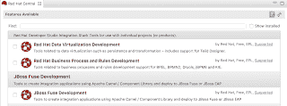
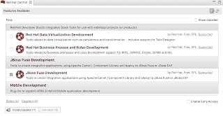
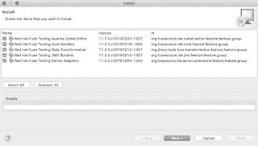

# 如何设置 Red Hat CodeReady Studio 12:集成工具

> 原文：<https://developers.redhat.com/blog/2019/05/29/how-to-set-up-red-hat-codeready-studio-12-integration-tooling>

最新的 Red Hat developer suite 版本 12 的发布带来了从 Red Hat JBoss Developer Studio 到 [Red Hat CodeReady Studio](https://developers.redhat.com/products/codeready-studio/overview) 的名称变更。这里的重点不是 Red Hat CodeReady 工作区，一种云和容器开发体验，而是本地安装的 developers studio。

新版本还带来了关于如何开始使用各种 Red Hat 集成、数据和过程自动化产品工具集的问题，这些工具集不是开箱即用的。本系列文章展示了如何安装每套工具，并解释了它们所支持的产品。希望这种简单的入门体验能够帮助您对下一个开发项目中可能要使用的工具做出明智的决定。

有三个不同的软件包为各种 Red Hat 中间件技术提供工具:

1.  [**红帽融合发展**](https://developers.redhat.com/blog/2019/05/29/how-to-set-up-red-hat-codeready-studio-12-integration-tooling/)
2.  红帽过程自动化开发
3.  Red Hat 数据虚拟化开发

本文将概述如何开始使用任何 CodeReady Studio 版本 12 的 *Red Hat Integration* 工具。

|  |
| 开发附加工具概述。 |

### 装置

Red Hat CodeReady Studio 可以通过[客户门户](https://access.redhat.com/jbossnetwork/restricted/listSoftware.html)(需要登录)或通过 developers.redhat.com 上的[早期访问下载获得。安装完成后，启动它，你会看到一个欢迎的*红帽中央*标签，在底部有一个标签可以查看可用的工具集，标签为*软件/更新*。](https://developers.redhat.com/products/devstudio/download/)

在撰写本文时，您可以在*软件/更新*选项卡上找到几个安装选项。选择底部的*软件/更新*选项卡，显示红色帽子*开发*工具附加组件。让我们选择 *JBoss Fuse Development* 复选框。

|  |
| 选择集成工具插件。 |

请注意，如果您之前安装了这些工具附件中的任何一个，您的选项列表将不会包括它们。点击*安装/更新*按钮开始附加安装，最后重启 CodeReady Studio 完成该过程。如果您对正在安装的内容感兴趣，可以查看组件和版本的弹出列表。请注意，随着早期版本向最终版本发展，这种情况将会改变。

请继续关注本系列的更多文章，它们将详细介绍剩余开发附加工具的安装。

|  |
| 安装部件。 |

### 更多工具

请参阅以下内容，了解 studio 以前版本的任何开发工具需求:

*   [如何为 CodeReady Studio 12 设置集成工具](https://developers.redhat.com/blog/2019/05/29/how-to-set-up-red-hat-codeready-studio-12-integration-tooling/)(本文)
*   如何为 CodeReady Studio 12(即将推出)设置流程自动化工具
*   如何为 CodeReady Studio 12 设置数据虚拟化工具(即将推出)

*Last updated: September 3, 2019*