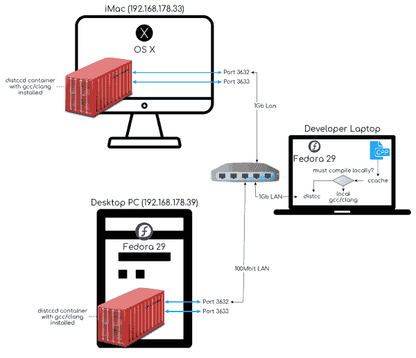
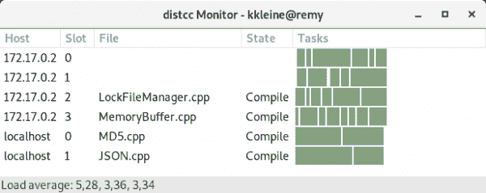
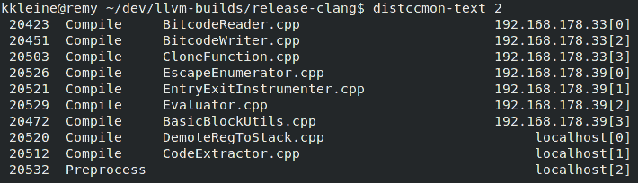
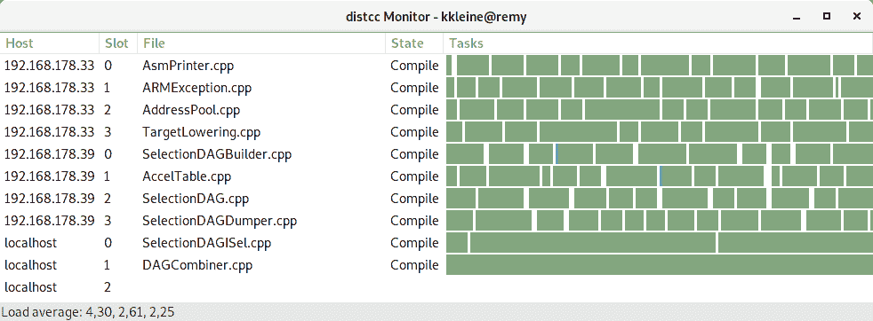

# 让你的 C++项目编译速度提高 3 倍的 2 个技巧

> 原文：<https://developers.redhat.com/blog/2019/05/15/2-tips-to-make-your-c-projects-compile-3-times-faster>

在本文中，我将演示如何通过使用 distcc 服务器容器分配编译负载来加快编译速度。具体来说，我将展示如何设置和使用运行一个 [distcc](https://distcc.github.io/) 服务器的容器来将编译负载分布到一个异构的节点集群上(开发笔记本电脑、旧的桌面 PC 和 Mac)。为了提高重新编译的速度，我将使用 [ccache](https://ccache.dev/) 。

## 期待什么

今天，你可以找到很多关于 Kubernetes 或 OpenShift 的文章。这不是这样一篇文章。我早在 2013 年就开始使用容器，尤其是 Docker，在开始的时候，我主要用它们来隔离事物，并拥有可复制的构建。这里也是如此；我们将构建一个容器，将其推送到 [DockerHub](https://hub.docker.com/) 进行分发，并在运行`docker run ...`时动态下载到其他机器上，因此不要期望这里会发生疯狂的事情。

事实上，即使你没有任何 Docker 的先验知识，你也应该能够理解。在社区版本(在 Linux 上)或 Docker 桌面(在 macOS 和 Windows 上)中获取并安装 Docker 引擎就足够了。

就 [C++](https://developers.redhat.com/topics/c/) 而言，除了你的项目使用 [CMake](https://cmake.org) 并用 [GCC](https://www.gnu.org/software/gcc/) 或 [Clang](https://clang.llvm.org/) 编译之外，我不期望任何代码方面的东西。

## 介绍

我最近在 Red Hat 开始了一份新工作，在那里我有机会参与 LLDB 项目。在很长一段时间没有使用 C++之后，我注意到的第一件事是编译的*缓慢*。我和 [Go](https://golang.org/) 合作了几年，编译性能在那里根本不是问题。它就这样从画面中消失了。

### 缓慢编译

当我说 [LLDB、](https://lldb.llvm.org/)的编译很慢时，我指的是在发布模式下编译`lldb`目标(git 标签:llvmorg-7.1.0)需要将近两个小时。发布版本已经是构建速度最快的了，考虑到我总共需要构建 7 个或更多 LLDB 版本( [clang](https://clang.llvm.org/) / [gcc](https://www.gnu.org/software/gcc/) ，debug/release， [asan](https://clang.llvm.org/docs/AddressSanitizer.html) /no asan，assert/no assert…)，这使得编译时间占用了整整一个工作日。

我的普通开发系统由一台使用了三年的联想 Thinkpad T460s 笔记本电脑组成，我在上面运行 T2 的 Fedora 29 和以下工具:

*   **海合会**(海合会)8.2.1 20180801(红帽 8 . 2 . 1–2)
*   版本 7 . 0 . 1(Fedora 7 . 0 . 1–6 . fc29)
*   ccache 版本 3.4.2
*   3.2rc1 x86_64-redhat-linux-gnu

当我在我的开发笔记本电脑上使用`make`和四个编译作业(`-j 4`)编译 LLDB 时，`time`命令报告如下:

```
real    72m24,439s
user    224m32,731s
sys     12m2,094s
```

这意味着我必须等待大约两个小时才能完成一次编译。

### 加速

当我使用`ninja`和 10 个编译任务(由`distcc -j`决定)在我的集群(笔记本电脑、台式机、iMac)上编译 LLDB 时，`time`命令报告如下:

```
real    22m29,130s
user    49m16,726s
sys     4m27,407s
```

这意味着用 ninja 编译，我的 distcc 集群是

*   **实时快 3.22 倍**。
*   **进程在用户模式下花费的总 CPU 秒数比**快 4.56 倍。
*   在内核模式下，进程花费的 CPU 秒数比快 2.7 倍。

我希望这能激励你继续阅读。


## 技巧#1:分配编译负载

我以前试验过使用 [distcc](https://distcc.github.io/) 加速编译的方法，它可以让你将编译任务分发到其他机器上。它要求您在工作机器(服务器)和开发机器(客户机)上安装完全相同的编译器。

所以我安装了一个运行 Fedora 29 的备用机器，让它成为我的编译集群的一部分。我在正确的版本中安装了所有正确的编译器，以匹配我在本地机器上运行的编译器。

但后来我意识到这将是一场噩梦。我不想用缓慢来换取复杂。更不用说当我把我的开发者系统升级到 Fedora 30 时我必须做的所有事情了。我真的必须升级集群中的所有工作机吗？

此外，我有一台 iMac 放在另一张桌子上，当我们不用它来编辑视频或照片或录制音乐时，它不会做太多事情。它能用于编译吗？毕竟，macOS 没有我在开发机器上使用的完全相同的编译器。这就是我在介绍中所说的异构节点集群。

为了省去如何设置 distcc 服务器，或者如何让 CMake 使用它的细节，我们将马上跳到技巧 2。


## 技巧#2:使用 distcc 服务器容器

我之前提到过，我有一台 iMac，当我在笔记本电脑上工作时，它什么也不做。如果我可以在上面运行一个容器(例如，用 Docker)来服务 distcc，并且已经设置了所有必要的工具，那不是很好吗？

为了更好地解释我想要达到的目标，这里有一个我的编译器集群架构的图表。

[](/sites/default/files/blog/2019/05/distcc-arch.png)

我的编译器集群架构图。">

事实证明，只要能在终端中运行`docker run`命令，你就可以(几乎)完全从底层操作系统中抽象出来。

如果你不熟悉 Docker，不要担心；这很容易。想想这个粗略的类比:

*   一个 Docker ***镜像*** 就像 Linux 中的一个 ***程序*** 。
*   ***一个容器*** 就像是 Linux 中一个程序的 ***进程*** ，也就是程序的一个实例。

显然，在容器存在之前，图像必须存在。要创建一个映像，您需要编写一个描述您想要开始的基本映像的`[Dockerfile](https://docs.docker.com/engine/reference/builder/)`(这里是指操作系统，尽管它并不正确)。在我的例子中，我希望尽可能靠近我的开发人员机器，所以我使用了`[fedora:29](https://github.com/kwk/distcc-docker-images/blob/7195a75cda2772bab400a89d24f6daae41eece44/Dockerfile.fedora29#L1)`图像。

```
FROM fedora:29
```

然后，安装映像附带的工具([安装工具)](https://github.com/kwk/distcc-docker-images/blob/7195a75cda2772bab400a89d24f6daae41eece44/Dockerfile.fedora29#L12):

```
**RUN** dnf install -y \
    clang \
    distcc \
    distcc-server \
    doxygen \
    gcc \
    graphviz \
    htop \
    libasan \
    libasan-static \
    libedit-devel \
    libxml2-devel \
    make \
    ncurses-devel \
    net-tools \
    python-devel \
    swig \
   && yum clean all
```

**注:**以上包不一定都需要。我在我的 Docker 镜像中安装了我在开发人员笔记本上安装的任何东西。当然，这是不需要的，因为 distcc 只看到预处理的编译单元。这意味着它不需要自己拥有所有可用的包含文件，而是将它们从我的开发人员笔记本电脑推送到 distcc 服务器。

在 Docker 容器中，只能有一个顶级流程，它是容器的核心。在我们的例子中，那就是 [distcc](https://github.com/kwk/distcc-docker-images/blob/7195a75cda2772bab400a89d24f6daae41eece44/Dockerfile.fedora29#L42) 。我们使用一个所谓的 [*入口点*](https://docs.docker.com/engine/reference/builder/#entrypoint) 来配置它，并传递所有我们希望保持独立于运行容器的机器的标志:

```
**ENTRYPOINT** [\
  "distccd", \
  "--daemon", \
  "--no-detach", \
  "--user", "distcc", \
  "--port", "3632", \
  "--stats", \
  "--stats-port", "3633", \
  "--log-stderr", \
  "--listen", "0.0.0.0"\
]
```

如果你不明白上面的任何一个标志，你可以用`[man distccd](https://linux.die.net/man/1/distccd)`来查找。

此外，我们还提供了一些默认标志，但您也可以更改这些标志:

```
# By default the distcc server will accept clients from everywhere.
# Feel free to run the docker image with different values for the
# following params.
**CMD** [\
  "--allow", "0.0.0.0/0", \
  "--nice", "5", \
  "--jobs", "5" \
]
```

基本上就是这样。你可以在这里找到我的`Dockerfile`的最新版本。

#### 如何在 Docker 文件之外构建 Docker 映像

请注意，我已经在 DockerHub 上配置了一个库来自动构建我的最新版本的`Dockerfile`图像。您可以发出以下命令来获取最新版本，而不是自己构建映像:

```
$ docker pull konradkleine/distcc:fedora29
```

如果您打算试验和修补它，您可以像这样构建图像:

```
$ git clone git@github.com:kwk/distcc-docker-images.git
$ cd distcc-docker-images
$ docker build -t konradkleine/distcc:fedora29 -f Dockerfile.fedora29 .

```

#### 如何运行 Docker 映像

要使基于 Linux、MacOS 或 Windows 的计算机成为集群的一部分，请确保您已经在该计算机上安装并正确配置了 Docker。然后在终端上运行以下命令:

```
$ docker run \
  -p 3632:3632 \
  -p 3633:3633 \
  -d \
  konradkleine/distcc:fedora29
```

这将下载(又名*拉*)我最新的 distcc Docker 镜像(如果还没有拉的话)，并在守护模式(`-d`)下运行。它将在主机上的相同编号下公开 distcc 的主端口(`3632`)和 distcc 的 HTTP 统计端口(`3633`)。

#### 如何测试 Docker 图像

对我来说，Docker 的美妙之处在于你可以随时使用你的开发机器来尝试一些东西。例如，要在您的本地主机上运行 distcc 容器，您可以运行之前的相同命令，但这次要给容器一个名称，以便您可以在后续的 Docker 命令中引用它:

```
$ docker run \
  -p 3632:3632 \
  -p 3633:3633 \
  -d \
 --name localdistcc \
  konradkleine/distcc:fedora29
```

然后我建议在新创建的容器中运行`htop`,看看发生了什么:

```
$ docker exec -it localdistcc htop

```

[](/sites/default/files/blog/2019/05/Bildschirmfoto-von-2019-04-23-17-06-14.png)

在 localdistcc 容器内运行 htop 表明您的容器只运行 distccd。">

让我们编译一些代码，并将其分发到我们的 localdistcc 节点。这里我将[编译 LLDB](https://lldb.llvm.org/resources/build.html#building-lldb-on-linux-freebsd-and-netbsd) 并进行调整:

```
$ git clone [https://github.com/llvm/llvm-project.git](https://github.com/llvm/llvm-project.git) ~/dev/llvm-project
```

```
*# Get the IP address of the* *localdistcc* *container*
```

```
$ export LOCAL_DISTCC_IP=$(docker inspect -f '{{range .NetworkSettings.Networks}}{{.IPAddress}}{{end}}' localdistcc)
```

```
$ export DISTCC_HOSTS="$LOCAL_DISTCC_IP/7 localhost"
```

```
$ mkdir -p ~/dev/llvm-builds/release-gcc-distcc
```

```
$ cd ~/dev/llvm-builds/release-gcc-distcc
```

```
$ cmake ~/dev/llvm-project/llvm \
  -G Ninja \
  -DCMAKE_BUILD_TYPE=Release \
  -DLLVM_USE_LINKER=gold \
  -DLLVM_ENABLE_PROJECTS="lldb;clang;lld" \
  -DCMAKE_C_COMPILER=/usr/bin/gcc \
  -DCMAKE_CXX_COMPILER=/usr/bin/g++ \
  -DCMAKE_EXPORT_COMPILE_COMMANDS=1 \
  -DCMAKE_C_COMPILER_LAUNCHER="ccache;distcc" \
  -DCMAKE_CXX_COMPILER_LAUNCHER="ccache;distcc"
```

```
$ ninja lldb -j $(distcc -j)
```

我用粗体标出了值得一看的部分。需要注意的是:

使用`docker inspect`获取运行 distcc 容器的容器的 IP 地址。

当导出`DISTCC_HOSTS`时，我建议你看一下`**/7**`,因为它告诉 distcc 将七个任务分配给这台机器。我的机器有八个核心，我不想它没电。默认情况下，只发送四个任务(见`man distcc`):

> **/LIMIT** 可在任何主机规格中添加十进制限制，以限制该客户端将发送到机器的作业数量。该限制默认为每台主机四个(本地主机两个)，但可能会受到服务器的进一步限制。您应该只需要为具有两个以上处理器的服务器增加这个值。

使用`-G Ninja`生成忍者的构建系统。

我们通过指定`CMAKE_C_COMPILER=/usr/bin/gcc`和`CMAKE_CXX_COMPILER=/usr/bin/g++`来使用我们想要使用的编译器的全限定路径。参见下一节关于伪装的内容来理解我们为什么要这样做。

使用 CMake 的`[CMAKE_<LANG>_COMPILER_LAUNCHER](https://cmake.org/cmake/help/latest/variable/CMAKE_LANG_COMPILER_LAUNCHER.html)`来调用`ccache distcc /usr/bin/gcc`而不仅仅是`/usr/bin/gcc`。这是一个避免伪装成`gcc`或`g++`的好机制。

伪装是一种技术，你创建名为`gcc`的文件，并在你的`PATH`上使用它来拦截打给`gcc`的电话。奇怪的是，Fedora 29 在你安装`ccache`的时候会这么做。这个包创建了指向`/usr/bin/ccache`的`/usr/lib64/ccache/gcc`。这有效地用`ccache`伪装了您的本地`gcc`二进制文件。事实上，`ccache`将伪装成一个完整的编译器舰队，包括但不限于`gcc, g++, clang, clang++`(完整列表见`rpm -ql ccache`)。这就是为什么我们使用编译器的全限定路径`/usr/bin/gcc`。

我们让 discc 通过查看可用的主机来计算并行运行多少个构建任务:`-j $(distcc -j)`。

当`ninja`构建时，看一下`distccmon-gnome`的输出(参见“故障排除”部分)。它应该显示如下内容:

[](/sites/default/files/blog/2019/05/Bildschirmfoto-von-2019-04-24-11-19-12.png)

使用 distcc 容器进行本地编译时的 gnome 输出。">

**注意:** `distcc -j`假设`DISTCC_HOSTS`中列出的所有主机都是不同的机器。但是容器运行在本地主机上，因此会消耗本地主机上的资源。这可能会影响开发人员机器的性能。如果事情变得缓慢，就中止编译；这只是为了测试。

### 解决纷争

#### 如何可视化编译的分布？

在 Fedora 29 上，我用的是`distccmon-gnome`或者`distccmon-text`(见下面截图)。要安装它们，运行`sudo dnf distcc-gnome distcc`。





#### 如何测试我的所有主机都在服务 distcc？

使用 netcat ( `nc`)测试您的所有节点是否都在服务 distcc。在下面的命令中，用您主机的 IP 替换`192.168.178.33 192.168.178.39`。**注意:**我经常使用 VPN，所以我使用固定的 IP 地址来缓解解析主机名的问题。

```
$ for i in 192.168.178.33 192.168.178.39; do nc -zv $i 3632; done
```

```
Ncat: Version 7.70 ( https://nmap.org/ncat )
Ncat: Connected to 192.168.178.33:3632.
Ncat: 0 bytes sent, 0 bytes received in 0.01 seconds.
Ncat: Version 7.70 ( https://nmap.org/ncat )
Ncat: Connected to 192.168.178.39:3632.
Ncat: 0 bytes sent, 0 bytes received in 0.01 seconds.
```

或者，您可以使用慢得多的`nmap`:

```
$ nmap -A 192.168.178.33/32 -p 3632 -Pn
Starting Nmap 7.70 ( https://nmap.org ) at 2019-04-23 14:05 CEST
Nmap scan report for MyServer (192.168.178.33)
Host is up (0.00069s latency).
```

```
PORT     STATE SERVICE VERSION
3632/tcp open  distccd distccd v1 ((GNU) 8.3.1 20190223 (Red Hat 8.3.1-2))
```

```
Service detection performed. Please report any incorrect results at https://nmap.org/submit/ .
Nmap done: 1 IP address (1 host up) scanned in 6.68 seconds
```

#### 为了更好的安全性，我如何指定谁可以使用我的 distcc 容器？

请注意，`Dockerfile`中的`CMD`部分定义了默认的`--allow 0.0.0.0/0`，以允许来自任何地方的连接。我建议您在运行 distcc 容器时调整这个参数:

```
$ docker run \
  -p 3632:3632 \
  -p 3633:3633 \
  -d \
  konradkleine/distcc:fedora29 \
  --allow <YOUR_HOST>
```

#### 我必须使用 ccache 还是可以直接使用 distcc？

您绝对只能使用其中一个，只需在使用 CMake 配置/生成项目时调整`CMAKE_C_COMPILER_LAUNCHER`和`CMAKE_CXX_COMPILER_LAUNCHER`变量。

```
# To use ccache and distcc
-DCMAKE_C_COMPILER_LAUNCHER="ccache;distcc" \
-DCMAKE_CXX_COMPILER_LAUNCHER="ccache;distcc"
```

```
# To use ccache alone (please note, that no distribution will 
# happen if you choose this option.)
-DCMAKE_C_COMPILER_LAUNCHER="ccache" \
-DCMAKE_CXX_COMPILER_LAUNCHER="ccache"
```

```
# To use distcc alone
-DCMAKE_C_COMPILER_LAUNCHER="distcc" \
-DCMAKE_CXX_COMPILER_LAUNCHER="distcc"
```

#### 如何向一台机器发送 4 个以上的作业？

在您的`DISTCC_HOSTS`环境变量中，您需要调整限制，默认为 4。它由主机名后的一个`/<LIMIT>`指定:

```
export DISTCC_HOSTS="fasthost/8 slowhost/2 localhost"
```

#### 如何才能知道 ccache 是否适合我？

我建议你看一下`ccache --show-stats`的输出，检查一下*的缓存命中率*。例如，下面的命中率为 15.61%，我会说，这比什么都没有好。

```
$ ccache --show-stats
cache directory                     /home/kkleine/.ccache
primary config                      /home/kkleine/.ccache/ccache.conf
secondary config      (readonly)    /etc/ccache.conf
stats zero time                     Wed Apr 17 18:44:31 2019
cache hit (direct)                  1787
cache hit (preprocessed)              21
cache miss                          9774
cache hit rate                     15.61 %
called for link                      584
called for preprocessing              35
compile failed                        12
preprocessor error                   116
unsupported code directive             4
no input file                         19
cleanups performed                     0
files in cache                     25218
cache size                           1.2 GB
max cache size                       5.0 GB
```

我希望你喜欢阅读这篇文章，并从中获得一些价值。也可以看看附带的视频。

[https://www.youtube.com/embed/kIKSx30t8bk](https://www.youtube.com/embed/kIKSx30t8bk)

*Last updated: November 15, 2021*