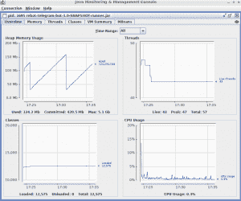
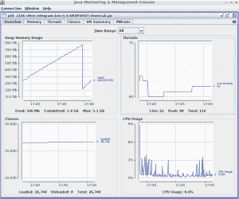

# 将 Java 应用程序迁移到 Quarkus，第 2 部分:之前和之后

> 原文：<https://developers.redhat.com/blog/2019/05/13/migrating-java-applications-to-quarkus-part-2-before-and-after>

本文是[将 Java 应用迁移到 Quarkus:经验教训](https://developers.redhat.com/blog/2019/04/12/migrating-java-applications-to-quarkus-lessons-learned/)的延续，在这里，我将对构建和运行 [Java](https://developers.redhat.com/index.php/topics/enterprise-java/) 应用在 [Quarkus](https://developers.redhat.com/blog/2019/03/20/quarkus-0-12-0-released/) 前后的性能指标进行比较。我在这里的目标是展示 Quarkus 有多棒，并可能帮助你决定使用 Quarkus 来构建你的酷微服务。

为了进行比较，我将使用上一篇文章中使用的同一个应用程序，使用 Thorntail 和 Quarkus 二进制文件。将根据以下指标进行比较:

*   构建整个项目的时间
*   弯曲大小
*   首次启动应用程序所花费的时间
*   平均内存使用量
*   平均 CPU 使用率
*   加载的类和活动线程

该应用程序将在三种不同的环境中进行测试，它们是:

*   我的本地开发环境
    *   联想 t460s
        *   英特尔酷睿 i7-6600U
        *   第 20G 帧
        *   SSD HD
*   Rpi 3 B+，[规格](https://www.raspberrypi.org/magpi/raspberry-pi-3bplus-specs-benchmarks/)
*   红帽 OpenShift v3.11 版

这里演示的一组测试都是在我的本地开发环境中完成的。首先，让我们构建两个版本，并比较构建过程花费的时间:

### 第四的

```
*spolti@t460s:~$ mvn clean package*
*...*
*[INFO] ------------------------------------------------------------------------*
*[INFO] BUILD SUCCESS*
*[INFO] ------------------------------------------------------------------------*
*[INFO] Total time:  01:01 min*
```

### **:**

```
*spolti@t460s:~$  mvn clean package* *...* *[INFO] ------------------------------------------------------------------------* *[INFO] BUILD SUCCESS* *[INFO] ------------------------------------------------------------------------* *[INFO] Total time:  01:20 min*
```

构建时间显示 Quarkus 比 Thorntail 快 19 秒，但构建时间本身并不太重要。接下来，在两个版本都构建好之后，让我们来看看它的大小:

```
*spolti@t460s:~$ du -sh **
***201M** rebot-telegram-bot-0.4-SNAPSHOT-thorntail.jar*
***38M** rebot-telegram-bot-1.0-SNAPSHOT-runner.jar*
```

这里我们有一个很大的不同，索恩泰尔生产了一个比夸库斯大五倍的超级罐子。

接下来的对比显示了第一次启动应用所花费的时间；通常情况下，比较起来需要更长的时间。在我的本地开发环境和 RPI 上启动、测试所有插件后，该应用程序将被停止:

### 第四的

```
*spolti@t460s:~$ time java -jar <omitted parameters> rebot-telegram-bot-1.0-SNAPSHOT-runner.jar*
*<Startup logs>*
***real** **0m10.633s***
*user 0m15.888s*
*sys 0m0.621s*

*pi@raspberrypi:~ $ time java -jar  <omitted parameters> rebot-telegram-bot-1.0-SNAPSHOT-runner.jar*
*<Startup logs>*
*real* *0m21.309s*
*user* *0m24.968s*
*sys* *0m1.050s*
```

### 索恩泰尔:

```
*spolti@t460s:~$ time java -jar <omitted parameters> rebot-telegram-bot-0.4-SNAPSHOT-thorntail.jar*
*<Startup logs>*
*real* *0m38.926s*
*user* *1m24.489s*
*sys* *0m3.008s*

pi@raspberrypi:~ $ time java -jar  *<omitted parameters>*  rebot-telegram-bot-0.4-SNAPSHOT-thorntail.jar
*<Startup logs>*
real 2m38.637s
user 2m51.688s
sys< 0m6.444s
```

在我看来，这是最重要的指标之一，也是帮助我决定尝试 Quarkus 的一个指标。在我的本地环境中，它比我以前的版本快了 30 秒，在 RPI 上快了大约 137 秒。这个应用程序特别需要几秒钟才能启动，因为它有大约 10 个插件，在启动时执行一些任务，导致延迟。但是，假设您的微服务由几个 Rest 端点组成；它可以在不到 1 秒的时间内启动。

现在，让我们看看 Java 内存是如何工作的。下图显示了 10 分钟内收集的信息:

### 第四的



### 索恩泰尔:



这个比较非常有趣，正如我们所看到的，除了线程，Quarkus 拥有最好的数字。差别不是太大，但是内存使用比 Thorntail 大得多，加载的类的数量也大得多，还不到一半。也就是说，当以 RPI 这样的设备为目标时，Quarkus 是一个完美的选择，因为它消耗的物理资源非常少。

接下来的指标是使用在 Red Hat OpenShift 上运行的 Thorntail 和 Quarkus 版本创建的容器映像完成的:

### 第四的


### 索恩泰尔:


在 OpenShift 上，我们还可以看到内存使用方面的显著差异，但是请注意，可以通过微调 JVM 内存配置来降低这个值。对于这个例子，没有进行这样的微调。

## 结论

我将运行在 Thorntail 上的旧应用程序迁移到 Quarkus 的体验非常好，到目前为止，我在指标方面只有很好的结果。在我看来，迁移到夸尔库斯是可行的；当然，还有许多不同的场景我没有介绍，但是我相信，在大多数场景中，迁移是可以完成的，并且可以取得很好的效果。

下表比较了我在测试中发现的所有结果:

| **公制** | 夸尔库斯 | 索恩泰尔 |
| **构建时间** | 01:01 分钟 | 01:20 分钟 |
| **妖孽罐子大小** | 38 米 | 201 米 |
| **启动时间(本地开发环境)** | 0m10.633s | 0m38.926s |
| **启动时间(rpi)** | 0m21.309s | 2m38.637s |
| **堆内存** | 约 45 米至约 125 米 | 约 240 米至约 790 米 |
| **线程** | ~43 | ~62 |
| **加载的类** | ~12.575 | ~26.744 |
| **CPU 使用率** | ~0.3 | ~0.6 |

我希望这篇文章对您有所帮助，并鼓励您在下一个项目中或者在迁移现有项目时尝试 Quarkus。在下一篇文章中，我将分享更多有趣的东西，这些东西是我必须做的，以使应用程序在本机映像中运行良好。所以，敬请期待下一期。

*Last updated: May 10, 2019***