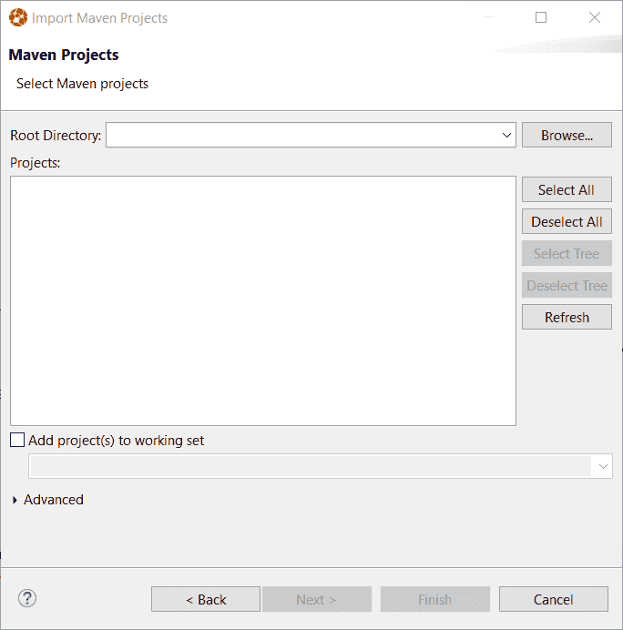
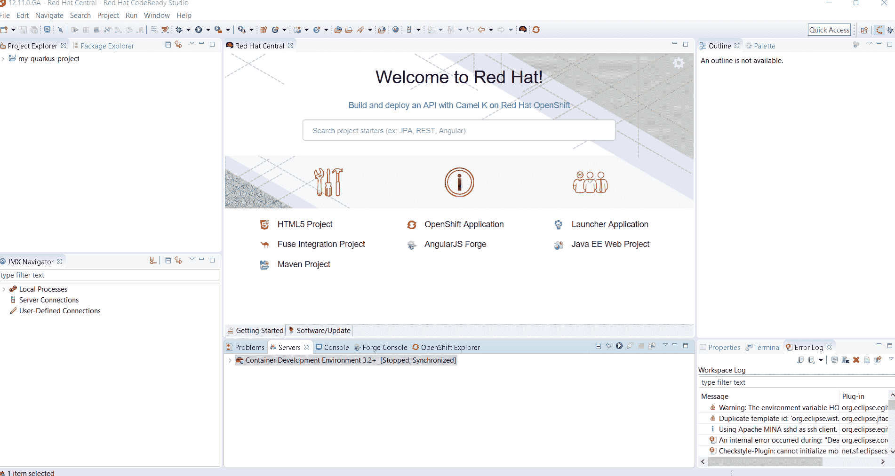
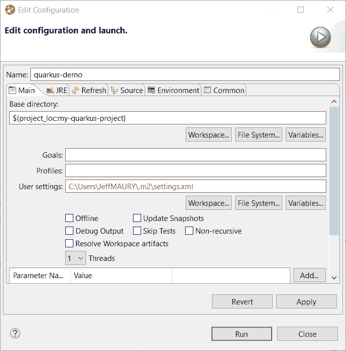
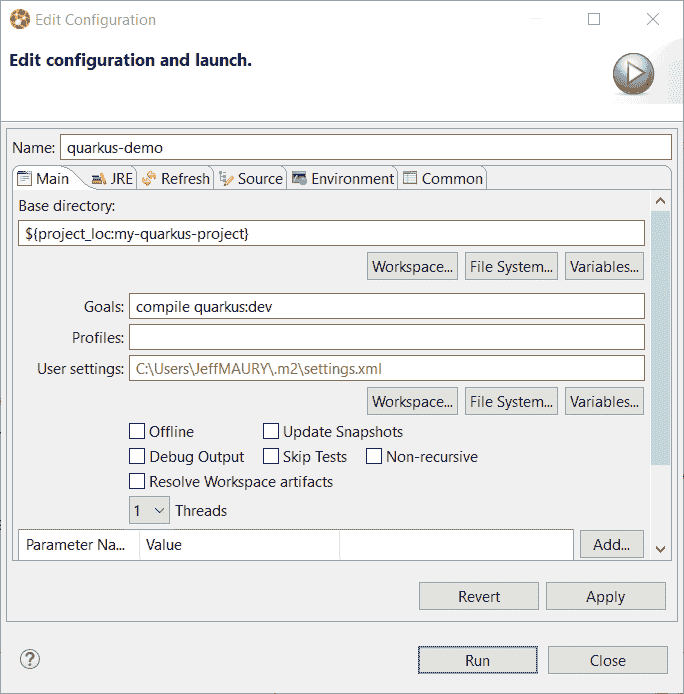
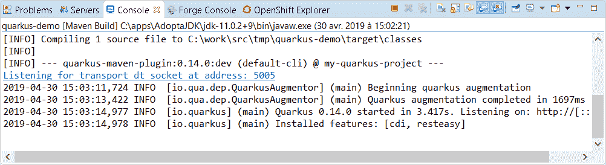
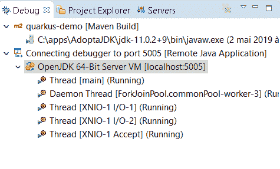

# 用 Eclipse IDE(Red Hat code ready Studio)创建您的第一个 Quarkus 项目

> 原文：<https://developers.redhat.com/blog/2019/05/09/create-your-first-quarkus-project-with-eclipse-ide-red-hat-codeready-studio>

你可能听说过 [Quarkus](https://quarkus.io) ，这是一个专为 Kubernetes 和容器定制的超音速亚原子 Java 框架。在本文中，我将展示在基于 Eclipse IDE 的环境中创建和设置 Quarkus 项目是多么容易。

请注意，即使我们在本文中使用了 [Red Hat CodeReady Studio](https://developers.redhat.com/products/codeready-studio/overview) ,任何 Eclipse IDE 都可以使用，前提是它具有基于 Java 的开发工具。所以，你也可以使用[Eclipse IDE for Java Developers](https://www.eclipse.org/downloads/packages/release/2019-03/r/eclipse-ide-java-developers)包或者[Eclipse IDE for Enterprise Java Developers](https://www.eclipse.org/downloads/packages/release/2019-03/r/eclipse-ide-enterprise-java-developers)包。

## 安装 IDE

如果您的工作站上还没有 IDE，您必须下载并安装一个。你可以使用 [Red Hat CodeReady Studio](https://developers.redhat.com/products/codeready-studio/overview) 或者来自 [Eclipse Foundation](https://eclipse.org/downloads) 的 Java 包。

安装 IDE 后，启动它并打开一个新的工作区，或者根据您的偏好重用现有的工作区。

## 创建您的第一个 Quarkus 项目

尽管可以在基于 Eclipse 的 IDE 中使用 new Maven project 向导创建一个基于 Maven 的项目，但是我们不会使用这种方法。它基于 Maven 原型的概念，Quarkus 项目不提供 Maven 原型来引导新项目，而是提供 Maven 插件来创建新项目。

因此，我们将遵循 [Quarkus 入门指南](https://quarkus.io/guides/getting-started-guide)中关于如何引导 Quarkus 项目的建议。

使用终端，进入要存储第一个 Quarkus 项目的文件夹，键入以下命令:

```
mvn io.quarkus:quarkus-maven-plugin:create
```

您将被要求为您的项目提供 *groupId* :

```
Set the project groupId [org.acme.quarkus.sample]:
```

按下*输入*键接受默认值。

您将被要求输入项目的 *artifactId* :

```
Set the project artifactId [my-quarkus-project]:
```

按下*输入*键接受默认值。

您将被要求提供项目的*版本*:

```
Set the project version [1.0-SNAPSHOT]:
```

按下*输入*键接受默认值。

然后，会询问您是否要在应用程序中添加一个 REST 端点。

```
Do you want to create a REST resource? (y/n) [no]:
```

输入*是*并按下*输入*键。

然后，您将被要求输入 REST 端点的类名。

```
Set the resource classname [org.acme.quarkus.sample.HelloResource]:
```

按下*输入*键接受默认值。

然后，您将被询问 REST 端点的路径。

```
Set the resource path [/hello]:
```

按下*输入*键接受默认值。

至此，您的第一个 Quarkus 项目已经在您的本地工作站上创建好了，让我们将它导入到我们的 IDE 中。

## 将第一个 Quarkus 项目导入 IDE

从 IDE 主窗口，打开*文件- >导入- >现有 Maven 项目*菜单:



使用*浏览*按钮，选择生成第一个 Quarkus 项目的文件夹:


按下 *Finish* 按钮，您现在应该会在*项目浏览器*窗口中看到一个新项目(请注意，这可能需要一段时间，因为如果这是您第一次在工作站上构建 Quarkus 项目，Maven 会下载一些 Quarkus 依赖项):



## 启动您的第一个 quartus 应用程序

从*项目浏览器*窗口，选择你的 Quarkus 项目( *my-quarkus-project* ，右键点击 *Run As - > Maven build...*菜单:



在目标*字段*中，输入`compile quarkus:dev`:



按下*运行*按钮。您的 Quarkus 应用程序将会启动，您应该会在*控制台*窗口中看到以下输出:



此时，您的 Quarkus 应用程序已经启动，您应该能够从以下 URL 访问它:[http://localhost:8080/hello](http://localhost:8080/hello)

## 调试您的第一个 quartus 应用程序

尽管 Quarkus 为开发人员提供了很好的热重装功能，但调试是一个关键工具。让我们看看如何在 Quarkus 应用程序上设置调试，然后启动一个调试会话。

您可能已经注意到，我们以 dev 模式启动了 Quarkus 应用程序，这意味着应用程序源代码中的任何更改都将在下一次 Quarkus 应用程序处理请求时被热重新加载。

Quarkus 的 dev 特性的另一个好处是，运行 Quarkus 应用程序的 Java 虚拟机已经在调试模式下启动。因此，要调试我们的 Quarkus 应用程序，我们只需要连接一个调试器。

如果您熟悉 Eclipse 中的 Java 开发工具，您就会知道，如果您知道 JVM 正在监听的调试端口，那么您可以很容易地针对以调试模式启动的正在运行的 JVM 启动 Java 调试器。

如果您查看 Quarkus 应用程序的输出，您会注意到以下消息:


这是 JVM 在调试模式下运行时生成的消息，它告诉我们所使用的端口是 5005。

现在，您可以创建一个远程 Java 调试器。更好的是，因为消息已经被 Eclipse Java 开发工具识别，您只需要点击与消息相关的列表，Eclipse 就会神奇地创建一个远程 Java 调试器，并将其连接到您的 Quarkus 应用程序！

点击超链接后，您将看不到任何内容，因为远程 Java 调试器已经在后台启动，并且连接到您的 Quarkus 应用程序。但是，如果您切换到 *Debug* 透视图，您可以检查它。为此，打开*窗口- >透视图- >打开透视图- >调试*菜单，并选择*调试*视图。您应该会看到类似如下的内容:



如您所见，调试器连接到了 Quarkus 应用程序。这意味着您可以在应用程序源代码中添加断点，下次发送请求时，Quarkus JVM 将停止，Eclipse IDE 将跳转到您设置断点的代码。

*Last updated: May 15, 2019*