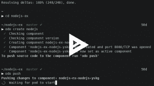

# 宣布 odo:面向开发人员的红帽 OpenShift

> 原文：<https://developers.redhat.com/blog/2019/05/03/announcing-odo-developer-focused-cli-for-red-hat-openshift>

继 odo [在今年早些时候](https://blog.openshift.com/developing-applications-on-openshift-in-an-easier-way/)首次发布之后，我们很高兴地宣布 odo 的 beta 版，这是一个托管在 [OpenShift GitHub 库](https://github.com/openshift/odo)上的官方项目。经过几个月的努力，测试版表明 API 是稳定的，功能不会改变。

OpenShift Do(简称 odo)是一个快速而简单的 CLI，适用于不断编写、构建和迭代源代码的开发人员。`odo`没有使用更精细的工具，比如`oc`，而是关注编码的迭代内循环(在提交到 Git 之前迭代代码变更)，而不是管理部署到 OpenShift 的每个应用程序。本文概述了 odo 的功能。

我们已经创建了 [odo](https://github.com/openshift/odo) 作为一个工具，让开发者专注于他们的源代码，而不是担心部署场景。通过使用`odo create`并为您的应用程序指定框架，让 odo 了解您的源代码是很容易的。无论你是推源代码还是二进制代码，odo 将会足够聪明地使用`odo push`来知道如何根据需要运行或构建它。

使用 odo，您可以迭代您的源代码，并观察 odo 如何通过一个简单的命令自动验证和部署源代码到 open shift:`odo watch`。

Red Hat OpenShift 是一个基于容器和 Kubernetes 构建的本地平台，为开发人员提供了一个用户界面和命令行来部署他们的应用程序。OpenShift 自动化了所有应用程序的构建、部署和管理，因此您可以专注于最重要的事情:代码。

首次在 Red Hat OpenShift 上开发应用程序时，开发人员通常按以下顺序完成任务:

1.  连接到 OpenShift 群集。
2.  使用模板或 Source-2-Image 将它们的源代码打包成 Docker 映像*或*。
3.  浏览 OpenShift 参考文档*或*，遵循 OpenShift 控制台上的逐步 GUI。
4.  使用`oc`或 OpenShift 控制台部署他们的应用程序。
5.  修改他们的源代码并重新部署应用程序。
6.  检查源代码是否已正确部署并正常工作。
7.  重复以上步骤，直到满意为止。

Odo 通过结合步骤 2 到 6 来自动化工作流程。

1.  连接到 OpenShift 群集。
2.  创建您的应用程序并用`odo create`定义它。
3.  使用`odo push`部署您的应用程序。这可以是源代码或二进制数据。
4.  用`odo watch`迭代或者让 odo 自动推送新的局部变化。

## Odo 功能

*   围绕类似概念(如项目、应用程序和组件)的简单和容易的部署。
*   完全基于客户端，不需要服务器。
*   支持多种语言和框架(Node.js、Java、Ruby、Perl、PHP 和 Python)
*   检测对本地源代码的更改，并相应地将其推送到集群，实时地对任何构建更改提供即时反馈。
*   列出 OpenShift 集群的所有可用组件和部署组件。本地配置，随处部署。

### **演示**

以下是将 Node.js 示例应用程序部署到 Red Hat OpenShift 集群的演示:

ascii link:[https://asciinema.org/a/225717](https://asciinema.org/a/225717)

### **即将举办的教程和研讨会**

在 [Red Hat Summit](https://www.redhat.com/en/summit/2019?intcmp=701f20000012i8UAAQ) 大会上，您可以参加 5 月 7 日(星期二)下午 3:45 举行的“将 dev 放回 devo PS:Cloud-native in local speed”分组会议，Jorge Morales 将带您了解 odo 的一些驱动因素，讨论其他竞争工具，并展示它的实际应用。

如果您喜欢深入的研讨会，Jan Kleinert 将在 5 月 9 日星期四上午 10:45 主持“作为凡人在 Red Hat OpenShift 上开发应用程序”,这是一个两小时的实践研讨会，将更深入地介绍 odo。

### 下一步是什么？

*   查看我们的 GitHub 库:[https://github.com/openshift/odo](https://github.com/openshift/odo)。
*   从源代码开始，部署您的应用程序。跟随我们的入门指南:[https://github . com/open shift/odo/blob/master/docs/getting-started . adoc](https://github.com/openshift/odo/blob/master/docs/getting-started.adoc)。

### 附加阅读

Jorge Morales Pou 的“[使用 odo 简化 OpenShift 上的应用程序开发”](https://developers.redhat.com/blog/?p=591037)

**如果您还没有注册参加红帽峰会，[现在就注册参加](https://www.redhat.com/en/summit/2019?intcmp=701f20000012i8UAAQ)。波士顿见！**

*Last updated: September 3, 2019*