# Red Hat OpenShift 4 中的 Jenkins CI/CD 入门

> 原文：<https://developers.redhat.com/blog/2019/05/02/get-started-with-jenkins-ci-cd-in-red-hat-openshift-4>

自动化是我们(开发人员)做的事情。我们自动化售票、汽车和流媒体音乐服务，以及一切你可以连接到模数转换器的东西。但是，我们有没有花时间来自动化我们的流程呢？

在本文中，我将展示如何使用 Jenkins CI/CD 和 Red Hat OpenShift 4 构建一个自动化集成和连续交付管道。我不会深究很多细节——有很多细节——但我们会有一个很好的概述。细节将在这一系列博客文章的后面解释。

**注意:**在这篇文章中，我有时会将 OpenShift 4 称为 OpenShift 容器平台(OCP)。

仅仅启动一个 OCP 集群是不够的。我们需要让詹金斯重新运转起来。幸运的是，OCP 有模板，这是一个不断增长的环境选择，您只需点击(或在命令行)即可启动并运行。然而，这个模板目录在 OCP 仪表板中并不明显。

在下面的屏幕截图中，您会注意到有九个选项可用:

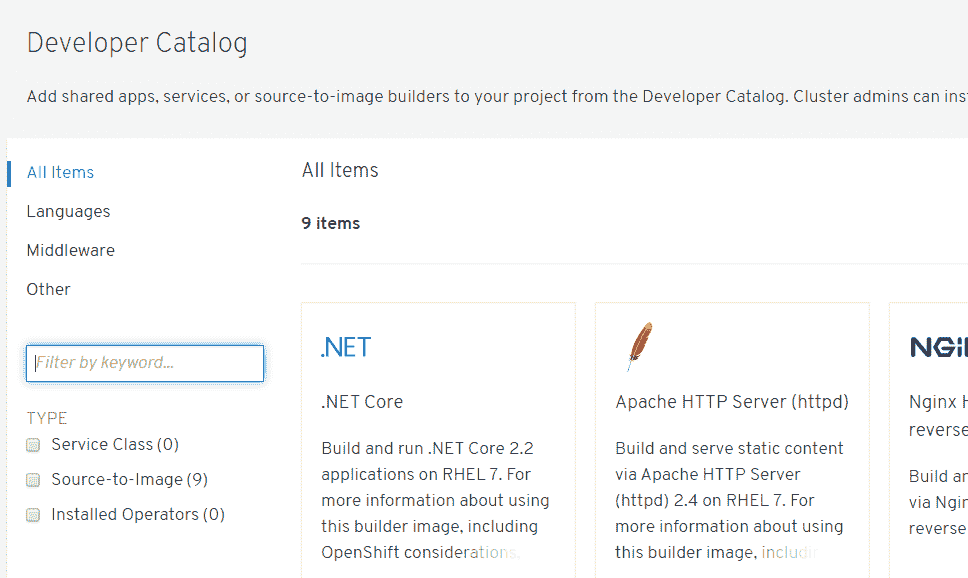

## 就这样吗？

九项。你也会注意到詹金斯不是一个选项。但如果这是一种选择呢？开发人员的朋友——命令行——是目录真正活跃起来的地方。我们可以运行以下命令来查看启动 OCP 4 集群时包含的但在控制面板上看不到的所有模板:

```
oc get templates -n openshift
```

您将看到一个列表，它太长了，无法在这里显示—大约有 91 个模板。目前，我们可以在命令行中使用它们，我们也会这样做。模板 Service Broker 用于使它们出现在仪表板上，但这是另一篇文章了。现在，我们将使用命令行。

如果您浏览列表，会发现 Jenkins 有两个模板:

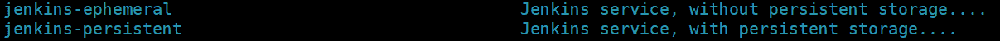

因为我们没有配置持久存储(这是另一篇文章)，所以我们将在本文中使用“Jenkins-periodic”模板。基本原理是相同的，知识也是可以转移的，但是这样我们在本文中将时间花在 Jenkins 和 CI/CD 上，而不是花在创建、配置和使用持久存储上。

## 给我詹金斯，现在

让我们从简单的部分开始:让 Jenkins 在我们的 OCP 4 集群中启动并运行。这是一个命令:

```
oc new-app jenkins-ephemeral
```

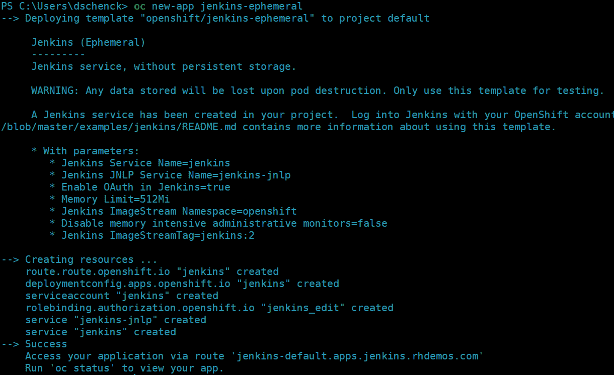

现在，您可以运行以下命令来获取 Jenkins 安装的 URL:

```
oc get routes
```

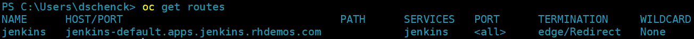

把那个网址(`jenkins-default.apps.jenkins.rhdemos.com`)输入你的浏览器，瞧...詹金斯:

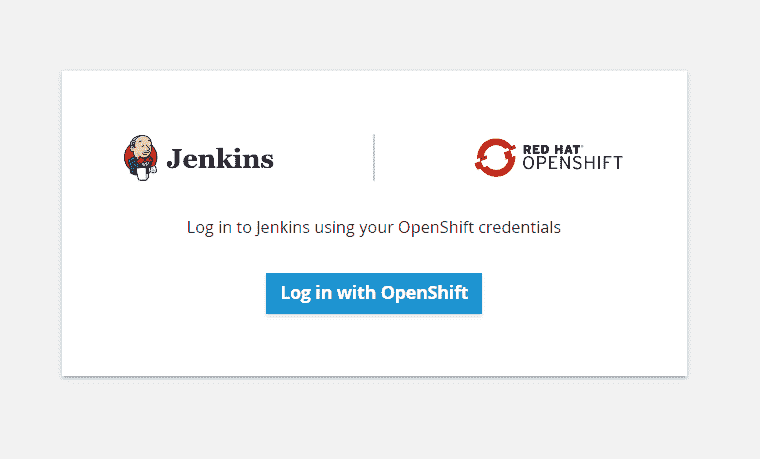

顺便说一下，如果您想查看完成所有这些工作的模板，您可以使用下面的命令来查看它:

```
oc get template/jenkins-ephemeral -o json -n openshift
```

## 詹金斯，为您服务

继续使用 OpenShift 登录，并选择*允许所选权限*选项。然后，您将看到您的 Jenkins 仪表盘:

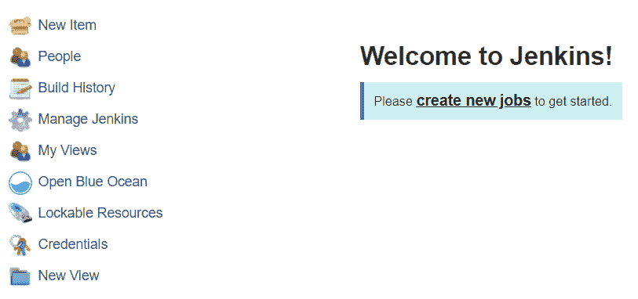

## 发射倒计时

那是容易的部分。现在真正的工作开始了。我们需要建立一个管道来构建我们的软件，但我们希望使用 OpenShift 中内置的构建。下面的命令将创建一个构建配置(或“BuildConfig”，这是一个“build config”类型的对象)，它包含我们给 OpenShift 的指令，告诉它如何构建我们的应用程序。在这个特殊的例子中，我们正在创建一个管道，该管道依次具有构建指令:

```
oc create -f https://raw.githubusercontent.com/openshift/origin/master/examples/jenkins/pipeline/nodejs-sample-pipeline.yaml
```

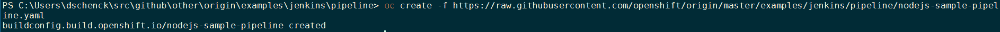

现在不要担心细节；我们将在下一篇博文中讨论这个问题。对于这篇文章，我们只是想看看什么是可能的，让创造性的齿轮转动起来。

想看看管道吗？使用以下命令:

```
oc get buildconfig/nodejs-sample-pipeline -o yaml
```

**注意:**这个构建示例使用 Node.js，我使用运行 PowerShell 的 Windows PC 完成了所有工作。开源和独立于平台——这就是这一切的美妙之处。也就是说，`oc`命令在哪里都管用。也；这个例子很大程度上依赖于[open shift 示例 GitHub 页面](https://github.com/openshift/origin/tree/master/examples/jenkins/pipeline)。

## 我们在哪里？

至此，在 Red Hat OpenShift 中，我们有了一个管道的构建配置。就是这样。我们实际上还没有*构建*任何东西；我们只有一个管道的配置。我们可以通过两种方式看到这一点——我们没有构建任何东西的事实:我们可以查看 OpenShift 仪表板的*构建*部分，我们可以查看 Jenkins 仪表板。在这两个项目中，我们*没有*看到我们的管道，因为我们还没有建立管道。

[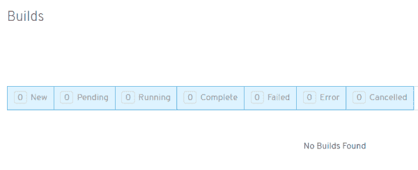](/sites/default/files/blog/2019/04/no-builds-found.png)No builds in the OpenShift dashboard.No builds in the OpenShift dashboard.">[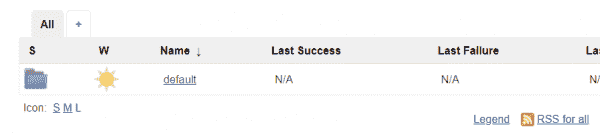](/sites/default/files/blog/2019/04/no-jenkins-pipelines.png)No pipelines (except the default which we should ignore).No pipelines (except the default which we should ignore).">

顺便说一下，如果你在 OpenShift 仪表板的 BuildConfig 部分查看，你会看到我们的构建配置就像一个准备发射的火箭。

## 让我们兜一圈

现在奇迹发生了。在命令行中，我们可以运行一个命令来查看我们想要构建的 BuildConfig 的名称:

```
oc get buildconfigs
```

[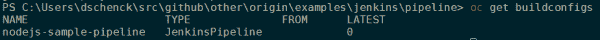](/sites/default/files/blog/2019/04/oc-get-buildconfigs.png)There it is! Let's get this show on the road!There it is. Let's get this show on the road.">

我们可以开始构建，然后，为了好玩，切换到 Jenkins 仪表板来观看它的运行。更好的是，在 Jenkins 中，选择菜单上的“打开蓝海”选项(在左侧)可以在一个漂亮、现代的界面中查看东西，而不是“经典”的 Jenkins UI。您将看到管道出现，从这里您可以跟踪构建。它可能需要几秒钟才能在詹金斯可用。

使用此命令启动所有操作:

```
oc start-build nodejs-sample-pipeline
```

[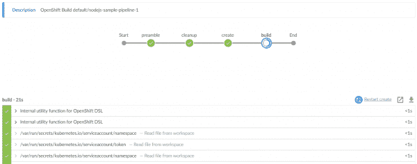](/sites/default/files/blog/2019/04/pipeline-in-Jenkins.png)It's alive!It's alive.">

管道建成了，构建开始了。如果你在 OpenShift 中的 *Builds* 下查找，你会看到两个独立的版本:

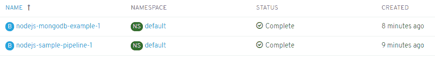

## 结果呢

基于知识和直觉的结合，我打赌有一个“nodejs-mongodb-example”服务的路径。运行`oc get routes`将确认:

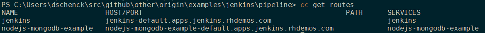

如果我将该 URL 放入浏览器，我应该得到:

[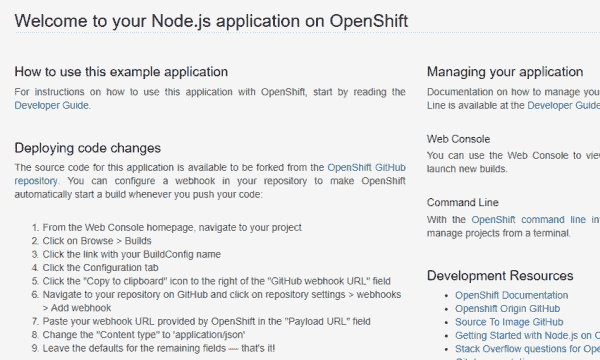](/sites/default/files/blog/2019/04/nodejs-example-in-browser.png)BAM! It worked!BAM. It worked.">

**注意:**看到图片中“部署代码变更”部分了吗？你可能想玩玩那个(提示，提示)。

## 我们做到了！

OpenShift 和 Jenkins 做到了。但是我们现在让 Jenkins 构建和部署我们的解决方案。

## 下一个？

我们能做的还有很多。测试？手动部署？部署到其他环境(例如，开发、测试、试运行和生产)。其他编程语言？此外，这种 Jenkins 环境没有持久存储，而这正是我们在现实世界中可能需要的。此外，我们需要更深入地了解发生了什么，并获得真正的理解，以便我们可以构建自己的解决方案。

还有更多的事情要做；请关注此空间以获取未来的文章。

*Last updated: September 3, 2019*