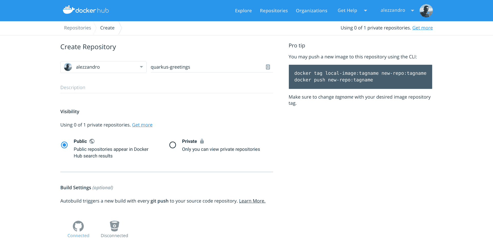

# 从零到夸夸其谈:简单的方法

> 原文：<https://developers.redhat.com/blog/2019/04/09/from-zero-to-quarkus-and-knative-the-easy-way>

你可能已经读过关于 Quarkus 的文章，但是你可能不知道 Quarkus 超快的启动速度使它成为你的功能即服务(FaaS)项目中使用 Knative 和无服务器的最佳选择。

Quarkus，也称为 Supersonic，Subatomic Java，是一个为 GraalVM 和 OpenJDK HotSpot 量身定制的 Kubernetes 原生 Java 堆栈，由一流的 Java 库和标准精心制作而成。Knative 是一个基于 Kubernetes 的平台，用于构建、部署和管理现代无服务器工作负载。你可以在这个[文章系列](https://blog.openshift.com/knative-serving-your-serverless-services/)中了解更多。

本文并不提供对 Knative 或 Quarkus 的全面深入研究。相反，我的目标是给你一个快速简单的方法开始使用这两种技术，这样你就可以自己进一步探索。

## 先决条件

在下面的例子中，我假设您已经安装了一台 Minishift 机器。 [Minishift](https://www.okd.io/minishift/) 是一个工具，通过在虚拟机内启动单节点 OKD 集群，帮助您在本地运行 [OKD](https://www.okd.io/) 。使用 Minishift，您可以在本地机器(Linux、Windows 或 Mac)上每天试用 OKD 或使用它进行开发。

请记住，在这个例子中，我使用的是 Minishift 的上游版本；当然，你可以复制并运行 Red Hat 的[容器开发工具包(CDK)](https://developers.redhat.com/products/cdk/overview/) 上的所有东西。

我将在 Red Hat OpenShift 环境中作为集群管理员执行以下所有命令。因此，在继续之前，您应该切换到管理员用户。

## 预热引擎

首先，我们需要在 Minishift 上设置 Knative。为此，我们需要由 OpenShift 团队克隆 Knative 的 Minishift 附加组件:

```
$ git clone https://github.com/openshift-cloud-functions/minishift-addons
$ minishift addons install minishift-addons/knative-istio
$ minishift addons install minishift-addons/knative-build
$ minishift addons install minishift-addons/knative-serving
$ minishift addons install minishift-addons/knative-eventing
```

之后，我们可以开始第一个附加组件的安装过程:knative-istio。

```
$ minishift addons apply knative-istio
```

一旦该步骤完成，您就可以安装知识资源了:

```
$ minishift addons apply knative-build
$ minishift addons apply knative-serving
$ minishift addons apply knative-eventing
```

当您完成所有这些设置后，您应该会发现一堆新的 pods 正在运行，使您的 Minishift 变为 Knative:

```
$ oc get pods --all-namespaces
...
knative-build                          build-controller-85b9c8d7f-f6jj4                          1/1       Running     0          2m
knative-build                          build-webhook-66bfc7ffc8-8s9tq                            1/1       Running     0          2m
knative-eventing                       controller-manager-0                                      1/1       Running     0          1m
knative-eventing                       eventing-controller-7d69f6945b-mhrrj                      1/1       Running     0          1m
knative-eventing                       in-memory-channel-controller-569f959967-qkt96             1/1       Running     0          1m
knative-eventing                       in-memory-channel-dispatcher-c54844b75-5l7bv              1/1       Running     0          1m
knative-eventing                       webhook-667567bc86-fz4p7                                  1/1       Running     0          1m
knative-serving                        activator-5c8d4bbc9d-4mt6l                                1/1       Running     0          1m
knative-serving                        activator-5c8d4bbc9d-qw4jh                                1/1       Running     0          1m
knative-serving                        activator-5c8d4bbc9d-z65gt                                1/1       Running     0          1m
knative-serving                        autoscaler-5d6dcf98f8-pcmqb                               1/1       Running     0          1m
knative-serving                        controller-98c69fcc-xjwls                                 1/1       Running     0          1m
knative-serving                        webhook-68dc778cb5-xmgwm                                  1/1       Running     0          1m
```

## 设置容器映像注册中心

在使用 Knative Build 之前，我们应该为这个快速入门设置另一个先决条件:Quarkus Knative Build 的容器映像注册中心。

不幸的是，正如我们稍后将看到的，Quarkus quickstart 示例将使用 Kaniko 作为 Knative 构建模板来生成(通过 Maven) Knative 构建资源的文件。我曾试图让 Kaniko 与 OpenShift 内部注册表一起工作，但我没有运气。我还[在 GitHub](https://github.com/GoogleContainerTools/kaniko/issues/623) 上开了一个问题，举报这种行为。

不幸的是， [Kaniko 似乎也不能很好地使用 Quay.io 注册表。另一种方法是将 Knative 构建模板从 Kaniko 移动到](https://github.com/GoogleContainerTools/kaniko/issues/400) [Buildah](https://www.projectatomic.io/blog/2017/11/getting-started-with-buildah/) 。

但是，我们想要最简单快捷的方法来启动和运行 Knative 和 Quarkus，因此，我们将使用 Dockerhub 在线注册。

首先，登录或注册 Dockerhub，然后准备创建名为 *quarkus-greetings 的容器存储库。*



我们现在可以继续进行 Knative 构建了。

## quartus 本地构建

我们现在准备好查看 Quarkus 快速启动回购，并开始玩 Knative Build。

```
$ git clone https://github.com/quarkusio/quarkus-quickstarts
$ cd quarkus-quickstarts/getting-started-knative
```

然后我们可以执行 Maven 命令来构建 Kubernetes 资源的文件。我们将把以下参数传递给 Maven 命令:

*   容器注册表 URL
*   容器注册表凭据
*   Git 源报告
*   推送构建结果的目标容器图像

```
$ mvn -Dcontainer.registry.url='https://index.docker.io/v1/' \
> -Dcontainer.registry.user='alezzandro' \
> -Dcontainer.registry.password='XXXXXXXYYYYYYYZZZZZZZZ' \
> -Dgit.source.revision='master' \
> -Dgit.source.repo.url='https://github.com/quarkusio/quarkus-quickstarts.git' \
> -Dapp.container.image='quay.io/alezzandro/quarkus-greetings' \
> clean process-resources
[INFO] Scanning for projects...
[INFO] 
[INFO] ----------------< org.acme:quarkus-quickstart-knative >-----------------
[INFO] Building quarkus-quickstart-knative 1.0-SNAPSHOT
[INFO] --------------------------------[ jar ]---------------------------------
[INFO] 
[INFO] --- maven-clean-plugin:2.5:clean (default-clean) @ quarkus-quickstart-knative ---
[INFO] Deleting /home/alex/gitprojects/quarkus-quickstarts/getting-started-knative/target
[INFO] 
[INFO] --- build-helper-maven-plugin:3.0.0:add-resource (add-resource) @ quarkus-quickstart-knative ---
[INFO] 
[INFO] --- maven-resources-plugin:2.6:resources (default-resources) @ quarkus-quickstart-knative ---
[INFO] Using 'UTF-8' encoding to copy filtered resources.
[INFO] skip non existing resourceDirectory /home/alex/gitprojects/quarkus-quickstarts/getting-started-knative/src/main/resources
[INFO] Copying 6 resources to /home/alex/gitprojects/quarkus-quickstarts/getting-started-knative/target/knative
[INFO] ------------------------------------------------------------------------
[INFO] BUILD SUCCESS
[INFO] ------------------------------------------------------------------------
[INFO] Total time: 1.840 s
[INFO] Finished at: 2019-03-29T13:29:55+01:00
[INFO] ------------------------------------------------------------------------
```

该命令在`target/knative`目录下创建资源文件:

```
$ ls target/knative/
build-sa.yaml container-registry-secrets.yaml deploy-key.yaml kaniko-pvc.yaml m2-pvc.yaml service.yaml
```

顺便说一下，Maven 命令还可以将 Git 凭证作为输入，用于下载私有 Git repo。无论如何，我们只是使用了公共的 Quarkus quickstart repo，所以我们不需要生成的`deploy-key.yaml`文件及其在`build-sa.yaml`中包含的 ServiceAccount 中的引用。我们需要移除它们:

```
$ rm target/knative/deploy-key.yaml 
$ cat target/knative/build-sa.yaml 
apiVersion: v1
kind: ServiceAccount
metadata:
name: build-bot
secrets:
  - name: container-registry-secrets
 *- name: deploy-key* <- We need to remove this line
```

我们现在可以创建 OpenShift 项目来保存所有这些准备好的资源:

```
$ oc new-project quarkus-greetings
Now using project "quarkus-greetings" on server "https://minishift.inmyopenshift.cloud:8443".
```

在继续之前，让我们为刚刚创建的名称空间设置特殊权限，正如 [Knative Minishift 插件 GitHub repo](https://github.com/openshift-cloud-functions/minishift-addons) 所建议的:

```
$ oc adm policy add-scc-to-user anyuid -z default -n quarkus-greetings
$ oc adm policy add-scc-to-user privileged -z default -n quarkus-greetings
```

最后，我们可以部署我们的 Kubernetes 资源:

```
$ oc apply --recursive --filename target/knative/
serviceaccount/build-bot created
secret/container-registry-secrets created
persistentvolumeclaim/kaniko-cache created
persistentvolumeclaim/m2-cache created
service.serving.knative.dev/quarkus-quickstart-knative created
```

之后，Knative 构建控制器将注意到新资源`quarkus-quickstart-knative`，并将开始构建:

```
$ oc get pods
NAME READY STATUS RESTARTS AGE
quarkus-quickstart-knative-00000-lrb2b 0/1 Init:0/3 0 4s
```

这个 pod 由三个 init-containers 组成，它们将初始化凭证、克隆 Git repo、构建它，并最终将映像推送到远程注册表:

*   构建步骤凭据初始化器
*   构建步骤 git 源
*   建造-步骤-对接-推进

我们还可以看看 Kaniko 将用来在“build-step-docker-push”容器中构建我们的图像的 [Dockerfile](https://github.com/quarkusio/quarkus-quickstarts/blob/master/getting-started-knative/Dockerfile) 。

docker 文件是一个多阶段文件，包含三个“FROM”指令，因此将使用三个容器。这意味着 Kaniko 将依次运行前两个容器来构建 Quarkus 应用程序的二进制文件，然后将二进制文件复制到最新的容器(第三个)中。

我们最终可以使用这些简单的命令来跟踪构建的状态:

```
$ oc get pods
NAME READY STATUS RESTARTS AGE
quarkus-quickstart-knative-00000-t8228 0/1 Running 0 1m

$ oc logs -f -c build-step-docker-push quarkus-quickstart-knative-00000-t8228
...
INFO[0695] EXPOSE 8080 
INFO[0695] cmd: EXPOSE 
INFO[0695] Adding exposed port: 8080/tcp 
INFO[0695] WORKDIR /work/ 
INFO[0695] cmd: workdir 
INFO[0695] Changed working directory to /work 
INFO[0695] Taking snapshot of full filesystem... 
INFO[0695] Skipping paths under /kaniko, as it is a whitelisted directory 
INFO[0695] Skipping paths under /workspace, as it is a whitelisted directory 
INFO[0695] Skipping paths under /cache, as it is a whitelisted directory 
INFO[0695] Skipping paths under /builder/home, as it is a whitelisted directory 
INFO[0695] Skipping paths under /run/secrets, as it is a whitelisted directory 
INFO[0695] Skipping paths under /var/run, as it is a whitelisted directory 
INFO[0695] Skipping paths under /dev, as it is a whitelisted directory 
INFO[0695] Skipping paths under /sys, as it is a whitelisted directory 
INFO[0695] Skipping paths under /proc, as it is a whitelisted directory 
INFO[0696] No files were changed, appending empty layer to config. No layer added to image. 
INFO[0696] ENTRYPOINT ["./application","-Dquarkus.http.host=0.0.0.0"] 
2019/03/29 19:16:06 pushed blob sha256:72f1a1307b6f2f9dd158e31e62f06529b09652fffb2630a51c0f3e8fcdcb62ba
2019/03/29 19:16:06 pushed blob sha256:4b3c899486387dd62fe5c4a31eeb37a073dbd9e0ee0065d47bed98ffd8e0889b
2019/03/29 19:16:15 pushed blob sha256:040efd5dc88c66de8192eb1a9f9f764e49d5466381b04b1aaf528caeea156e40
2019/03/29 19:16:16 pushed blob sha256:f0034e1b296e24109590a6436bdfd4ad44500a3b8c76eb21f300861e22c40540
2019/03/29 19:16:18 pushed blob sha256:21d95e340ee05b20c5082eab8847957df806532886d34608fcf6f49e69a21360
2019/03/29 19:16:18 index.docker.io/alezzandro/quarkus-greetings:latest: digest: sha256:fe0ef7d5b8f4d7ac334a9d94d4c8a8ac9f51b884def36e6660d4c46d09ac743c size: 917
```

一旦构建过程完成，我们就拥有了启动和运行无服务器服务的所有工具(如果需要的话)。我之所以写“如果被请求”,是因为我们刚刚构建了一个无服务器的应用程序，只有当一个请求到达我们的服务时，这个应用程序才会产生。

我们现在可以看看创建的 Knative 资源:

```
$ oc get ksvc
NAME DOMAIN LATESTCREATED LATESTREADY READY REASON
quarkus-quickstart-knative quarkus-quickstart-knative.quarkus-greetings.example.com quarkus-quickstart-knative-00000 quarkus-quickstart-knative-00000 False RevisionFailed

$ oc get configuration
NAME LATESTCREATED LATESTREADY READY REASON
quarkus-quickstart-knative quarkus-quickstart-knative-00000 quarkus-quickstart-knative-00000 False RevisionFailed

$ oc get revision
NAME SERVICE NAME READY REASON
quarkus-quickstart-knative-00000 quarkus-quickstart-knative-00000-service False NoTraffic

$ oc get route.serving.knative.dev
NAME DOMAIN READY REASON
quarkus-quickstart-knative quarkus-quickstart-knative.quarkus-greetings.example.com True
```

不要担心各种“错误”和“修订失败”的状态消息。他们只是报告说“NoTraffic”正在访问我们的服务，所以控制器和 autoscaler 将我们的应用程序置于空闲状态。

接下来，我们准备向我们的服务发出第一个请求。我们将使用`curl`二进制文件来发出 HTTP 请求，并且我们需要联系在`istio-system`名称空间中找到的 Knative Ingress 网关:

```
$ oc get pods -n istio-system | grep gateway
istio-egressgateway-7b46794587-c9mm8 1/1 Running 1 5h
istio-ingressgateway-57f76dc4db-7khgt 1/1 Running 1 5h
knative-ingressgateway-56d46fcb88-kmc4g 1/1 Running 1 2h
```

请记住，Knative 使用 HTTP“Host”头将请求路由到它的服务。为此，我们将使用一些技巧来获取正确的 IP 地址和要联系的端口，然后我们将传递我们之前发现的资源`route.serving.knative.dev`中包含的正确主机名:

```
$ INGRESSGATEWAY=knative-ingressgateway
$ IP_ADDRESS="$(minishift ip):$(oc get svc $INGRESSGATEWAY --namespace istio-system --output 'jsonpath={.spec.ports[?(@.port==80)].nodePort}')"

$ curl -H 'Host: quarkus-quickstart-knative.quarkus-greetings.example.com' $IP_ADDRESS/greeting/alex
hello alex
```

我们的服务刚刚回复了我们！让我们看看这对 Kubernetes 资源意味着什么:

```
$ oc get pods
NAME READY STATUS RESTARTS AGE
quarkus-quickstart-knative-00000-874sq 0/1 Completed 0 1h
quarkus-quickstart-knative-00000-deployment-688fcd9f4f-wccsf 2/2 Running 0 1m
```

如您所见，我们之前构建的 pod 已经启动并运行，为请求提供服务。让我们仔细看看:

```
$ oc describe pod quarkus-quickstart-knative-00000-deployment-688fcd9f4f-wccsf
Name: quarkus-quickstart-knative-00000-deployment-688fcd9f4f-wccsf
Namespace: quarkus-greetings
...
Status: Running
...
Containers:
user-container:
...
Image: index.docker.io/alezzandro/quarkus-greetings@sha256:fe0d37b98347a321769880030951cfd1a767a0cf1f105f4665ab3a70050a6d2c
...
queue-proxy:
Image: gcr.io/knative-releases/github.com/knative/serving/cmd/queue@sha256:ce66dd18f0d504e40e050f31b9de4315f8c225f308e9885eb4cbd82b2ba03c1a
...
```

即使我过滤了输出，运行前面的命令，您将会看到正在运行的 pod 由用户容器(quarkus-greetings 服务)和队列代理(将我们的容器连接到 Knative 系统的 sidecar 容器)组成。

## Minishift 中的 Knative 故障排除

我在我的 Minishift 设备上多次尝试这个例子，像任何软件一样，它可能会失败。如果在本演示的*服务*部分出现问题，开始故障诊断的最佳方式是在“knative-serving”名称空间中进行搜索:

```
$ oc get pods -n knative-serving
NAME READY STATUS RESTARTS AGE
activator-6677bbc9d6-2ql94 1/1 Running 0 51m
activator-6677bbc9d6-p6l7z 1/1 Running 0 51m
activator-6677bbc9d6-s84zk 1/1 Running 0 51m
autoscaler-5d87cc6b75-bjntw 1/1 Running 0 58m
controller-f4c59f474-z5x4n 1/1 Running 1 2h
webhook-5d9cbd46f7-q5rc6 1/1 Running 1 2h
```

查看激活器、自动缩放器和控制器盒的日志。如果您在日志中看到错误或失败，请尝试使用如下简单命令重新启动它们:

```
$ oc delete pod POD_NAME

```

不用担心后果。Kubernetes *Deployments* 资源将会产生一个全新的 pod，只要你手动删除一个。

就这些了，伙计们。我希望你能亲自尝试一下这个演示，并希望这个 *kube* 与你同在！

*Last updated: September 3, 2019*