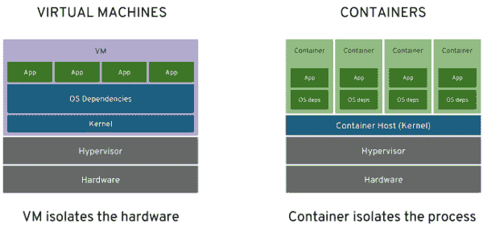

# 容器、Kubernetes 和微服务:从这里开始

> 原文：<https://developers.redhat.com/blog/2019/03/21/containers-kubernetes-and-microservices-start-here>

虽然[容器](https://developers.redhat.com/blog/category/containers/)和 [Kubernetes](https://developers.redhat.com/topics/kubernetes/) 和[微服务](https://developers.redhat.com/topics/microservices/)似乎在每一次谈话中都会出现，但在谈论、演示和实际*在生产中使用*技术之间有很大的鸿沟。任何人都可以讨论容器，许多人可以演示它们，但是很少有人在微服务架构中成功地使用容器和 Kubernetes。

为什么？可能有许多原因，但一个简单的原因可能是开发人员不知道从哪里开始。

请将这一系列文章视为您的起点。放松，继续阅读，准备进入容器、Kubernetes 和微服务的激动人心的世界。

## 你会说 C#？

首先，让我们兼容并蓄。你最喜欢的编程语言可以在 Linux 容器中找到。无论您是. NET 老手还是 Swift 初学者，您都会发现您可以使用容器。注意:你甚至可以创建容器来运行 [COBOL](https://opensource.com/article/17/8/what-about-cobol) 程序。进入 Linux 容器的世界，你不必放弃自己喜欢的编码语言；把那个借口放在一边。

## 什么是容器？

容器是执行图像的结果。是的，这不是最有用的定义。是*准确*，但是没有帮助。

让我们从理解图像开始，因为图像是在容器中运行的。

## 什么是图像？

映像是可以执行的环境的快照—启动、通电等。几年前，在云出现之前，当我们只有个人电脑时，复制个人电脑的一种常见方式是使用一种软件工具来制作硬盘的完美副本，即硬盘的“映像”。然后你可以把硬盘放在另一台电脑上，这样你就有了一台原机的复制品。这种方法在企业环境中非常流行，以确保每个人都有相同的 PC 配置。

因此，从虚拟计算的角度来考虑这个问题。您可以从虚拟机(VM)复制到文件，然后通过网络发送，而不是从一个硬盘复制到另一个硬盘。可以将该文件复制到另一个虚拟机并启动，这样就有了第一个虚拟机的副本。这是大约 2013 年的标准操作程序，当时扩展应用程序意味着启动更多虚拟机来处理工作负载。

## 进入 LXC

即使 Unix 容器可以追溯到 1979 年(惊讶？我知道我是)，Linux 容器真正有了基础是在 2008 年随着 [LinuX 容器(](https://linuxcontainers.org/)[【LXC】](https://linuxcontainers.org/)[)](https://linuxcontainers.org/)的推出。即便如此，这项技术直到 2013 年 Docker 大受欢迎时才真正起飞。

想象一下，您可以复制一个可执行程序并将其放入映像中，而不是克隆整个虚拟机。想象一下，映像不需要操作系统(OS)在其中。相反，它只需符合底层操作系统的内核即可(例如，所有系统调用都与 Linux 内核兼容)。这意味着镜像可以在几乎任何 Linux 系统上运行，因为它只使用内核。现在您有了一个可移植的应用程序，顺便说一下，它启动起来非常快，因为操作系统已经在主机系统上运行了。

这是一个 Linux 图像。它在容器中运行。当它实际运行时，它是一个容器。您可能会听到这些术语可以互换使用。虽然这在技术上不正确，但只要理解并接受它就行了。

这些映像比同类虚拟机更小；它们可以作为文件共享和传递，而且启动速度很快。因为将图像做得尽可能小是一种标准做法，所以大量的工作都放在制作更小的组件上。例如，为了与 Linux 内核对话，你需要操作系统的某个部分，所以供应商(例如 T2 红帽企业 Linux CoreOS T3)正在尽他们所能使事情更紧凑。甚至。NET Core 运行得很好，因为它现在只在需要的时候才以部件的形式发货和安装。这意味着以前在 Internet 信息服务(IIS)中运行的网站使用。NET 框架，占用了几千兆字节的空间，现在可以占用，例如，700 兆字节。图 1 显示了虚拟机和容器的比较。

Figure 1: Virtual machines compared with containers.">

## 我该如何开始？

从哪里开始取决于您的机器，特别是您运行的操作系统。MacOS、Windows 和 Linux 对运行 Linux 容器有不同的要求。

### 马科斯

该说明可在[安装页面](https://docs.docker.com/docker-for-mac/install/)上找到。

### Windows 操作系统

微软在他们的页面上有关于 Windows 10 上的 Linux 容器的说明。

### 一种男式软呢帽

这是我最喜欢的。有两个工具可以在 Fedora 上使用:Buildah 和 Podman。要安装它们，只需在终端命令行输入`buildah`并按照提示进行安装。同样，在终端命令行中键入`podman`,并按照提示进行操作。

### 红帽企业版 Linux

一个简单的命令，`yum install buildah podman`，你就可以开始运行了。

### 其他 Linux 发行版

您可以在此安装页面中找到从[开始的必要步骤。](https://docs.docker.com/install/)

## 这个守护进程是什么？

如果您使用 Docker 作为容器引擎，请注意它需要运行一个守护进程。这个过程对您来说是透明的，但它确实消耗 CPU 周期，您可能偶尔会看到关于它的消息或来自它的消息。守护程序必须正在运行才能构建映像。

如果你正在使用 [Buildah](https://developers.redhat.com/blog/2019/02/21/podman-and-buildah-for-docker-users/) 和 [Podman](https://developers.redhat.com/blog/2018/08/29/intro-to-podman/) ，[你不需要任何守护进程](https://www.redhat.com/en/blog/daemon-haunted-container-world-no-longer-introducing-buildah-10)。他们从一开始就考虑到了这一点。像许多软件项目一样，他们受益于过去并做出了改进。

## 下一步是什么？

接下来，我将展示如何用您选择的语言构建和运行“Hello World”应用程序，这将在下一篇文章中介绍。

*Last updated: September 3, 2019*