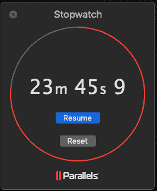
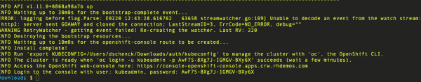

# AWS 上的 OpenShift 4.0 开发者预览版已经启动并运行

> 原文：<https://developers.redhat.com/blog/2019/03/07/openshift-4-0-developer-preview-on-aws-is-up-and-running>

OpenShift 4.0 开发者预览版(需要注册)适用于亚马逊网络服务(AWS)，如果你和我一样，你会想成为第一批得到它的人。

起点是[注册](https://developers.redhat.com/download-manager/link/3867591?)，在这里你可以找到概述信息和那个重要的“开始”按钮。点击它，你就可以去看盛大的演出了。

(如果你不是[红帽开发者](https://developers.redhat.com/)会员，这就是你[注册](https://developers.redhat.com/auth/realms/rhd/protocol/openid-connect/registrations?client_id=web&redirect_uri=https%3A%2F%2Fdevelopers.redhat.com%2F%2Fconfirmation&state=76233dbe-8a82-40c4-8da1-43aafef5d311&nonce=39c0accb-3936-46ae-8e66-ea37125c47fd&response_mode=fragment&response_type=code)的理由。事实上，你必须成为会员才能访问信息和比特，但它是免费的，容易的和有价值的，所以为什么不呢？)

一旦你进入[开发者预览页面](https://developers.redhat.com/download-manager/link/3867591?)，你会找到说明和必要的链接。如果你已经熟练使用 AWS，你将毫无问题地快速前进。但是如果你和我两周前一样，你是 AWS 的新手，额外的信息会有所帮助。这篇博文就是“附加信息”

## 我的新手经历

有些事情你需要去做或者去理解，或者去指出，这会让你的生活变得更容易。作为 AWS 的新手，我把它们收集在这里，这样你就不会像我一样挣扎或失败。

### 您需要在 AWS Route 53 中注册集群域

什么是 AWS Route 53？是 AWS DNS 服务器。您需要在那里注册您的域，以便 AWS 可以将流量定向到您的集群，这意味着…您需要一个域。

如果这是你正在做的实验、评估或概念验证工作，我建议注册一个便宜的域名在这里使用。我注册了 rhdemos.com，它很便宜(大约一年 8 美元)，允许我在这个领域有完全的自由，而不用担心搅浑另一个(生产)领域的水。对我来说更容易管理。

我在 53 号公路上注册了 rhdemos.com，并收到一条消息说这可能需要一段时间，但结果只是几分钟。这很好；电脑讲究速度，我讨厌等待。

这对我来说是全新的领域，我设法在 AWS 文档中找到了自己的路(文档的链接在[开发者预览页面](https://cloud.openshift.com/clusters/install))。让我觉得“值得一提”的是:我下载了文件，并在我的工作用 MacBook Pro 上配置了我的凭证——只在那台机器上。我也可以对我使用的任何其他机器做同样的事情，但是当在 AWS 上使用 OpenShift 4.0 时，我的生活更容易(好吧，我很懒)只要坚持使用这台特定的机器。没什么大不了的。如果您想启用多台机器，您可能想在记忆犹新的时候在多台机器上同时执行这一步。这不是问题；只是一种考虑。

### 现在你差不多准备好了

我只需要下载安装程序，然后就可以开始了。我跟踪了[开发者预览页面](https://developers.redhat.com/download-manager/link/3867591?)上的链接，确保它在我的路径中并且被启用(也就是`chmod +x…`)，我就准备好了。

现在是有趣和简单的部分:你只需运行命令`./openshift-install create cluster`就可以了。请确保您的所有凭证和设置都是正确的。如果不这样做，安装就不会成功(不要问我怎么知道这个)。如果它真的失败了，而你懒惰或者不像我一样思考，你就进入 AWS，开始到处删除资产。

或者，如果你比我聪明，你可以运行`./openshift-install --help`并看到你可以简单地使用命令`./openshift-install destroy cluster`删除一切并重新开始。

男孩做了我感到哑口无言。

TL；DR: `./openshift-install destroy cluster`可以用来删除一个集群和所有相关的工件。

### 你可以很快创造和消灭事物

在运行命令销毁东西之后，我运行安装程序，没有出现任何问题。在安装过程中，会询问您使用哪个 AWS 区域(我使用了我的默认值)，基本域(还记得您注册的域名吗？)、一个集群名称(无论您想要什么)和一个“拉秘密”pull secret 来自开发者预览网页，对于您的电子邮件地址是唯一的。我把我的拷贝到了 Mac 电脑桌面上的一个文档中，以方便使用。

OpenShift 安装花了将近 24 分钟(图 1，如下)，之后它显示了关于登录、密码和 web 访问的重要信息(图 2，如下)。将这些信息放在手边。

Figure 1: Okay, not quite 24 minutes

Figure 2: Keep this information handy. (This is just an example. Go ahead and try it; it won't work.)

由于我只是在 AWS 上试验 OpenShift 4.0，所以我会定期创建和销毁一个集群。我没有让集群全天候运行；如果没有必要，为什么要花这笔钱？创建一个集群，然后在一天结束时销毁它实在是太容易了。这绝对是一个很大的优势，工程师们让这一切变得如此简单，这值得称赞。

### 你现在有选择了

是的，您可以使用 minishift 在本地 PC 上运行 [OpenShift](http://openshift.com/) 。这是轻松进入 OpenShift 的好方法。但是如果你想提高一个档次(比如说，安装和使用[Red Hat code ready work spaces](https://developers.redhat.com/products/codeready-workspaces/overview))或者让工作中的其他团队成员访问你的集群，这就很好了。此外，其性能优于在 PC 上运行的 minishift(它与 Slack、Chrome、您的电子邮件客户端等共享 CPU 周期)。

### 不要忘记:自动气象站计量器正在运行

你在 AWS 上管理事情。您将支付 AWS 资源(CPU 周期和磁盘以及所有其他部分)。如果你不小心，你会欠下一大笔账单。密切注意事物，如果不需要就销毁集群。已经警告过你了。

## 尽力尝试；努力去做

通过将上述现实世界的建议与[开发者预览页面](https://developers.redhat.com/download-manager/link/3867591?)上的优秀说明相结合，您可以在几分钟内在 AWS 上启动并运行 OpenShift 4.0 开发者预览版。这是你抓住那些吹牛的权利的机会...我是说，评估一下。是啊。

*Last updated: May 2, 2019*