# CRuby 的寄存器传输语言

> 原文：<https://developers.redhat.com/blog/2019/02/19/rtl-register-transfer-language-for-cruby>

在过去的两年里，我一直在努力提高克鲁比的表现。我一直在两个主要方面同时工作:为 CRuby 虚拟机(VM)引入寄存器传输语言(RTL)和[实时(JIT)编译](https://en.wikipedia.org/wiki/Just-in-time_compilation)。关于让 Ruby 3 比版本 2 (3X3)快 3 倍的目标的背景，请参见我以前的文章“T4 向 Ruby 3x3 性能目标迈进”。

JIT 项目正在顺利推进。我提出并实现的 JIT 方法和引擎已经被 CRuby 社区所采用。Takashi Kokubun 强化了代码，并使其适应当前的 CRuby [堆栈机](https://en.wikipedia.org/wiki/Stack_machine)，最近 MJIT 成为了 [CRuby 2.6 版本](https://www.ruby-lang.org/en/news/2018/12/25/ruby-2-6-0-released/)的一个实验性功能。

向 CRuby VM 引入寄存器传输语言(RTL)比引入最初的 JIT 编译器更困难。对 VM 的修改比 JIT 编译器的修改更具侵略性。

本文介绍了 RTL 对克罗比的利与弊。

## 什么是 RTL？

首先，什么是 RTL？当前的 CRuby VM 使用*堆栈指令*。以下是 Ruby 代码`a = b + c`的堆栈指令示例，其中`a`、`b`和`c`是局部变量:

```
      getlocal_OP__WC__0 <b index>
      getlocal_OP__WC__0 <c index>
      opt_plus
      setlocal_OP__WC__0 <a index>
```

前两条指令将局部变量`b`和`c`的值放到 VM 堆栈上。第三条指令从堆栈中取出两个值，执行加法，并将结果放入堆栈。最后一条指令从堆栈中取出结果，并将其赋给局部变量`a`。

堆栈指令从堆栈顶部隐式引用操作数*。因此，它们简单而简短。*

 *我们可以使用显式引用操作数*的指令*。我用术语*寄存器传输语言*和 *RTL* 来表示一组这样的指令。我使用这些名字是因为我已经在 GCC 项目上工作了很长时间，GCC 有一个带有显式引用操作数的中间表示，叫做 [RTL](https://gcc.gnu.org/onlinedocs/gccint/RTL.html) 。

上面的例子在 RTL 是这样的:

```
      plus <a index>, <b index>, <c index>
```

RTL 的指令更长，但相同代码的指令更少。通常 **RTL 被解释得更快**，因为执行的指令数量更少导致**更少的指令分派开销**和**更少的操作数值的内存流量**，这对于 CPU 和内存速度差距更大的现代计算机来说更重要。

更快的翻译是采用 RTL 的原因之一。使用 RTL 还有一个更重要的原因。为了显著提高 CRuby 的性能，**我们需要一个方便的中间表示(IR)来分析和转换 Ruby 代码**。在堆栈指令级很难做到这一点。因此，优化编译器从不使用堆栈指令。

堆栈指令是接口语言的一种很好的表示，因为它们简单紧凑。 [WASM](https://en.wikipedia.org/wiki/WebAssembly) 或 [Java 字节码](https://en.wikipedia.org/wiki/Java_bytecode)的堆栈指令就是接口表示的例子。优化和代码转换是在像 [LLVM IR](https://llvm.org/docs/LangRef.html) 这样带有显式操作数的指令上完成的，甚至是在像 [Graal IR](https://labs.oracle.com/pls/apex/f?p=labs:40150:0::::P40000_PUBLICATION_ID:4470) 这样同时包含数据流和控制流依赖的指令上完成的。

## 附加 RTL 指令

为了进一步提高 RTL 解释性能，最初，我增加了*专门的*、*组合的*和*推测的*指令。

当我们在 RTL 生成期间知道一个操作数值时，我们可以使用一个*专用指令*。这里有一个例子，我们可以使用`plusi`，一个带有立即值操作数的加法(`t<index>`和`l<index>`分别表示临时变量和局部变量的索引):

```
  val2temp t1, 42
  plus     t2, l1, t1    -->      plusi t2, l1, 42
```

通常，RTL 代码包含常用的指令对。我们可以将这样的对组合成一个*组合指令*。这里有一个例子，我们可以使用`btlt`，一个用于比较和分支的组合指令:

```
  lt t1, l1, t2                                
  bt Label, t1           -->     btlt Label, l1, t2
```

使用专门的和组合的指令减少了指令的数量和整个代码的大小。

通常，一条 CRuby VM 指令可以对几种不同的类型执行操作。例如，`plus`指令可以执行整数和浮点加法。如果已知操作数类型是相同的，我们可以使用只对给定操作数类型有效的更简单的指令。

*推测指令*在代码解释期间生成。原始指令检查操作数类型。如果它们相同，则该指令将其自身修改为推测性指令，这仅适用于给定的操作数类型。推测指令仍然检查操作数类型，如果它们不是所期望的，则推测指令将其自身修改为不可改变的指令，该指令如同原始指令一样对所有操作数类型起作用，但是它从不修改自身。

例如，`plus`指令可以改成`iplus`或`fplus`，分别只对整数或浮点操作数起作用。如果推测性加号指令接收到意外类型的操作数值，它将被更改为指令`uplus`(不可更改的加号)，该指令适用于任何操作数类型。并且指令`uplus`之后从不更改。

[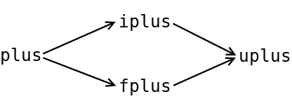](https://developers.redhat.com/blog/wp-content/uploads/2019/02/Specinsn.png)

对于解释用法，推测指令可能是无利可图的，因为它们仍然执行操作数类型检查。但是这些指令对于 JIT 编译非常重要，因为它们有助于执行推测性的优化。他们还在 JITted 代码中创建大型的扩展基本块，这些基本块被 JIT 编译器优化得相当好。

一般来说，我们也可以向堆栈指令中添加专门的、组合的和推测的指令，但是当堆栈指令被用作接口语言时，这没有什么意义，因为这样的指令通常会使接口变得复杂。

一种解决方案仅优于另一种解决方案的情况很少见。介绍 RTL 也不例外。如果我在这里忽略了以下 **RTL 的缺点**，我就不诚实了:

*   首先， **RTL 码通常较长**。**当操作数处理开销和糟糕的代码局部性超过较小的指令调度开销和较小的值内存流量时，RTL 也可能会更慢**。通常，当 RTL 代码与类似的堆栈指令代码具有相同数量的指令时，就会发生这种情况。一个典型的例子是只包含调用指令的代码，其中操作数只在堆栈模式下处理。
*   执行 **RTL 代码会在虚拟机堆栈**上消耗更多内存。当非调用 RTL 指令执行导致调用另一个 RTL 指令序列时，会发生这种情况。例如，RTL `plus`指令可以接收一个对象作为第一个操作数，对象类可以有一个用 Ruby 编写的方法`+`。在 RTL 执行的大部分时间里，我们在临时变量的所有堆栈槽后维护一个带有位置地址的堆栈指针。使用这种方法，我们不需要跟踪堆栈指针的变化，我们可以轻松地实现不同的 RTL 优化，包括指令删除和移动。顺便说一下，大多数 C 编译器都使用相同的方法:它们生成函数代码，在函数的(用户和临时)变量的所有堆栈槽之后，建立并保持一个引用位置的堆栈指针。如果我们有一个栈，那么栈上更多的内存消耗将不是问题。因为 Ruby 有线程，每个线程都有自己的堆栈，目前，我们需要为每个线程的堆栈预留内存，以应对最坏的堆栈消耗情况；为 RTL 预留的堆栈内存的增加将乘以线程的数量。
    幸运的是，Ruby 开发人员正在努力实现[可变长度堆栈](https://rubykaigi.org/2018/presentations/sugiyama-k.html#jun02)，因为固定长度堆栈在未来将成为 Ruby 代码的一个问题，届时[新的并发模型](https://rubykaigi.org/2018/presentations/ko1.html#jun01)将允许并行，并将为使用大量 Ruby 线程提供机会。
*   当我们使用堆栈指令时，对应于用 Ruby 编写的方法的堆栈的所有部分总是包含有效的 Ruby 值。如果这个值有两个零结束位，它是堆中某个对象的指针。对于 RTL，这可能是不正确的，因为一些堆栈槽的值可能是未定义的或包含过时的数据，例如，指向已经被垃圾收集的对象的指针。因此，**在 RTL 的情况下，垃圾收集器应该保守地处理堆栈槽值**。如果这个值看起来像一个指向堆中某个对象的指针，我们就把它当作一个指针，即使它不是，例如，即使它是一个未定义的随机数据。保守地处理堆栈值的代价要高一些(我们需要检查看起来像指针的值是堆中的某个地址),而且很有可能一个对象没有被垃圾收集，尽管它应该被垃圾收集。CRuby 已经为对应于用 c 编写的方法的堆栈部分编写了保守值处理的代码。我们只是在 RTL 实现中重用这些代码。

## RTL 最近的发展

一年前，我已经在我的博客文章中描述了 RTL 项目。从那以后，这个项目发生了很多事情。以下是对最近 RTL 开发工作的描述。

### 新 RTL 代码生成

最初，我实现了直接从 CRuby [AST](https://en.wikipedia.org/wiki/Abstract_syntax_tree) 生成 RTL 代码，而不是生成堆栈指令。在这种方法中，没有额外的 RTL 生成开销，但是也没有当前堆栈指令的位置。

不幸的是，栈指令接口已经对 Ruby 程序员开放了。有直接处理堆栈指令的 Ruby 应用程序，例如 Ruby 调试器。此外，Ruby 程序员可以在 Ruby 代码执行期间生成堆栈指令，或者将它们保存在永久内存中，稍后再加载到 VM 中，以节省编译 Ruby 源代码的时间。

在与 [YARV](https://en.wikipedia.org/wiki/YARV) 的作者 [Koichi Sasada](https://en.wikipedia.org/wiki/Koichi_Sasada) 和当前的堆栈指令讨论之后，我决定重新实现 RTL 生成。**应该从堆栈指令**中生成 RTL，而不是 AST。这可以在堆栈指令生成之后或者从永久存储器加载堆栈指令之后完成。

在过去的一年里，我一直致力于这个实现。在[我在](https://www.youtube.com/watch?v=qpZDw-p9yag) [RubyKaigi 2017](http://rubykaigi.org/2017) 的演讲中，我说过从堆栈指令而不是抽象节点中生成 RTL 会更简单。只有当我们不关心好的 RTL 码的产生时，这才是正确的。这里是一个如何生成未优化的 RTL 代码的**示例。你只需要为所有的指令结果使用临时变量。**

[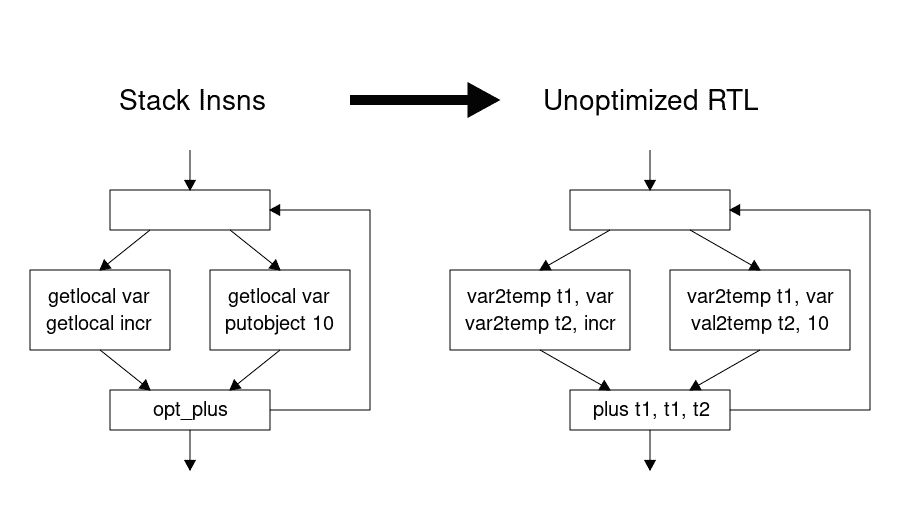](https://developers.redhat.com/blog/wp-content/uploads/2019/02/rtl-gen1.png)

RTL 允许我们使用局部变量和立即值作为指令操作数。这里是**优化的代码，可以为同一个示例生成**。我们可以删除两条将相同的局部变量值放入堆栈的指令。

[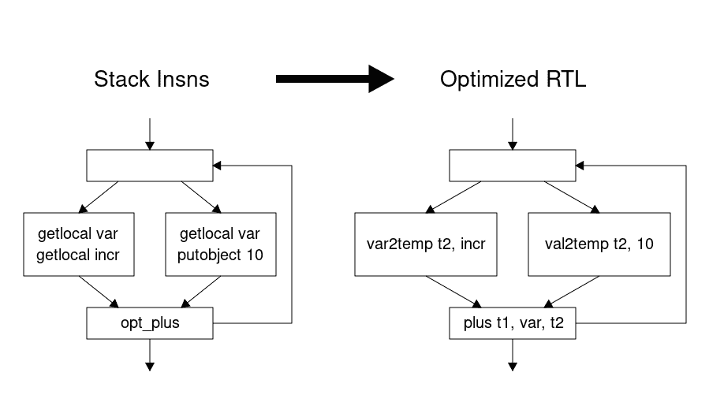](https://developers.redhat.com/blog/wp-content/uploads/2019/02/rtl-gen2.png)

为了生成优化的 RTL，我们需要知道每个堆栈槽包含什么，例如，一个已知的常量值或一些局部变量值。如果堆栈槽在[控制流图](https://en.wikipedia.org/wiki/Control_flow_graph) (CFG)的连接点上包含不同的值，我们应该将这些不同的值放入同一个临时变量中。

我不会详细描述如何获得这些信息。它由下面的[前向数据流问题](https://en.wikipedia.org/wiki/Data-flow_analysis)定义，其解基于格理论:

* * *

[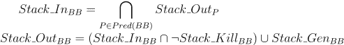](https://developers.redhat.com/blog/wp-content/uploads/2019/02/stack-data-flow.png)

* * *

这里， *Stack_In* 和 *Stack_Out* 是一个基本块(BB)开始和结束时的堆栈状态。 *Stack_Kill* 和 *Stack_Gen* 定义了给定基本块(BB)中堆栈状态的变化。下面的格子描述了可能的堆栈槽状态变化。

[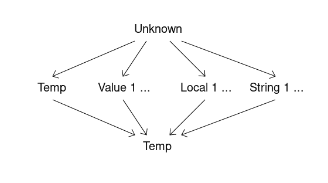](https://developers.redhat.com/blog/wp-content/uploads/2019/02/lattice.png)

例如，如果在 CFG 中的一个直接前趋 BB 中堆栈槽状态是未知的，并且在所有其他直接前趋 BB 中被设置为某个已知值，则堆栈槽状态将是 BB 开始时的已知值。

如果已知堆栈槽状态在所有前趋 BB 中具有某个局部变量的值，则堆栈槽状态将是 BB 开始时的局部变量。如果前一个的状态具有不同的局部变量的值，堆栈槽状态将是 BB 开始时的临时变量(在这种情况下，我们必须将局部变量移动到前一个的临时变量中)，等等。

我担心 RTL 一代可能会耗费时间。幸运的是，事实并非如此。它给[opt 胡萝卜基准](https://github.com/mame/optcarrot)的总编译时间增加了不到 1.5%的**。**

对了，还可以利用经典的[常数折叠](https://en.wikipedia.org/wiki/Constant_folding#Constant_propagation)和[复制传播](https://en.wikipedia.org/wiki/Copy_propagation)和[死码消除](https://en.wikipedia.org/wiki/Dead_code_elimination)来优化 RTL 代码。但是这样的优化会比我的方法慢，因为它们需要更多的通道。

RTL 代删除了许多`nop`指令，但有时该代会添加其他新的`nop`指令。当原始堆栈和生成的 RTL 指令之间没有直接对应关系，并且我们需要`nop`指令来正确标记异常处理和指令跟踪边界时，就会发生这种情况。

### 新 RTL 指令

为了减小 RTL 代码的大小，我添加了**新的专用 RTL 指令**，用于操作数按堆栈顺序处理的各种情况。例如，如果我们有一个 RTL 指令`plus <index -1>, <index -1>, <index -2>`，它使用`index -1`和`index-2`获取临时堆栈槽，并使用`index -1`将结果放入堆栈槽，我们可以使用简单的指令`splus <index -1>`。

CRuby 有一个[世代垃圾收集器](https://en.wikipedia.org/wiki/Tracing_garbage_collection#Generational_GC_(ephemeral_GC))，每次我们给一个(非临时)变量赋值的时候，我们都要通知垃圾收集器这个情况。所以对于 RTL 指令的结果，我们应该检查结果不是临时变量，然后调用垃圾收集器。

虽然检查很小，但它可能会大大降低 RTL 解释速度。我发现，在大多数情况下，如果我们只使用临时变量作为 RTL 指令结果，并且如果我们需要将最终结果存储在局部变量中，则可以生成额外的移动指令，这样可以为解释器生成更快的代码。

对于 MJIT，对 RTL 指令结果的这种约束是不必要的，因为优化编译器可以很容易地消除检查。

### RTL 码合并

自从我开始从事 RTL 和 JIT 的工作以来，我从未将主干合并到我的开发分支中。这是一个大错误。克鲁比的发展速度非常快。在过去的两年里，Koichi Sasada 对 VM 代码做了很多修改，Takashi Kokubun 对 MJIT 做了很多修改。

将 2 年的主干更改合并到我的 CRuby RTL 分公司花了 6 个月。我花了 50%的工作时间在 CRuby 开发上。这意味着一年的 CRuby 开发需要我 1.5 个月的工作来将主干变更合并到我的 CRuby RTL 分支中。这充分说明了在克鲁比实施 RTL 所需要的变革的侵略性。

但最后，我有了非常接近 CRuby 2.6 版本的新 RTL CRuby 代码，我可以将 RTL CRuby 在解释器和 JIT 模式下的性能与 trunk CRuby 在最新合并点上的性能进行比较。

### RTL CRuby 与 trunk CRuby 的性能比较

为了对 RTL 和堆栈指令进行比较，我使用了一台英特尔 i7-9700K 机器，在 Linux Fedora Core 29 下具有 16GB 的内存。我比较了 RTL 版的 CRuby 和主干在最近的合并点与 RTL 分公司。下面的比较信息**总是针对相同的模式**(仅 CRuby 解释器和使用 JIT 的 CRuby)给出。

每个基准测试运行三次，使用最好的结果。对于墙和 CPU 时间，这是最小的时间。对于峰值内存消耗，这是 CRuby 进程的最小[最大驻留大小](https://en.wikipedia.org/wiki/Resident_set_size)。

我使用了微型和小型基准。您可以在 GitHub 上我的存储库中的目录 [MJIT-benchmark](https://github.com/vnmakarov/ruby/tree/stack-rtl-mjit/MJIT-benchmarks) 中找到这些基准。

[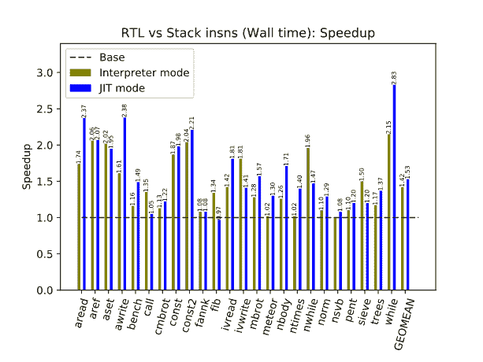](https://developers.redhat.com/blog/wp-content/uploads/2019/02/wall.png)

[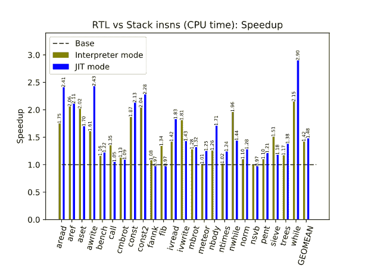](https://developers.redhat.com/blog/wp-content/uploads/2019/02/cpu.png)

如你所见，RTL 版本的 CRuby 在解释器和 JIT 模式下分别快了 40%和 50%。九个月前，带有 JIT 编译器的 RTL 版本快了将近两倍，但是，多亏了 Takashi Kokubun，[带有堆栈指令的 MJIT 从那时起有了很大的改进](https://medium.com/@k0kubun/ruby-2-6-jit-progress-and-future-84e0a830ecbf)。

[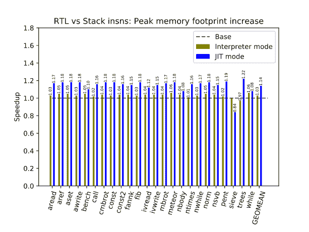](https://developers.redhat.com/blog/wp-content/uploads/2019/02/mem.png)

对于 RTL 版本的 CRuby，在解释器和 JIT 模式下，峰值内存消耗分别增加了大约 **3%和**14%。出现这种情况的主要原因是:

*   RTL 版本的 CRuby 代码更大。
*   我们必须保留两个版本的 Ruby 字节码:堆栈和 RTL 指令。
*   我们增加了 Ruby 进程的虚拟机堆栈大小，以通过深度递归的 CRuby 测试，因为 RTL 代码执行会消耗更多的虚拟机堆栈内存。

我还使用了[opt 胡萝卜](https://github.com/mame/optcarrot)进行基准测试。它是一个中等大小的 Ruby 程序，模拟任天堂游戏电脑。为仿真计算机的图像处理单元(PPU)生成的帧数定义了程序运行的时间。我用了 2，000 帧的 Optcarrot。opt 胡萝卜代码有两个版本。一个是未优化版本，另一个是手动优化版本。要运行优化版本，应使用选项`--opt`。

这是结果。

[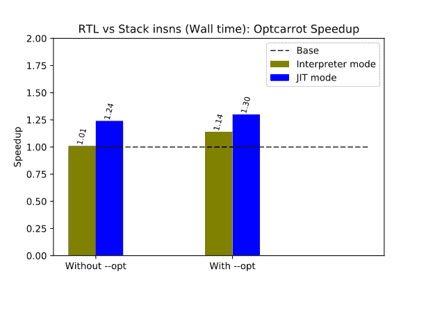](https://developers.redhat.com/blog/wp-content/uploads/2019/02/optcarrot-wall.png)

[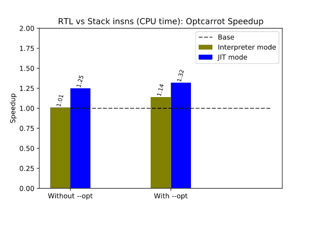](https://developers.redhat.com/blog/wp-content/uploads/2019/02/optcarrot-cpu.png)

RTL 版本的 CRuby 运行速度比 T1 快 30%。

[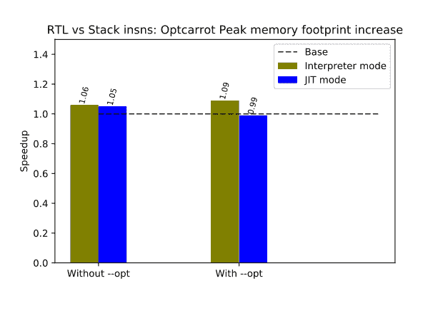](https://developers.redhat.com/blog/wp-content/uploads/2019/02/optcarrot-mem.png)

### 特定于 Ruby 的 RTL 优化

为了展示 Ruby 代码分析和转换的 RTL 优势，我最近实现了对浮点值进行装箱和拆箱的冗余代码移除。

CRuby 使用所谓的*标记值*。让我们考虑 64 位机器，因为它们是目前最常用的。

许多值只是指向堆中对象的指针。因为堆中的对象是 8 字节对齐的，所以指针的后三位总是零。

Fixnum 值使用 63 位，有二进制标签`1`。较大的整数由堆中的多精度数表示。

浮点值使用 62 位，有二进制标签`10`。

[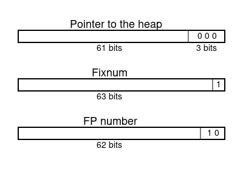](https://developers.redhat.com/blog/wp-content/uploads/2019/02/values.png)

大多数计算机使用 IEEE 标准进行浮点运算。根据标准，双浮点数有 1 位用于数字符号，11 位用于二进制指数，52 位用于尾数(也称为*分数*)。

[](https://developers.redhat.com/blog/wp-content/uploads/2019/02/IEEE_double.png)

那么 CRuby 如何将 64 位的 double 装入 62 位呢？CRuby 只能对所有可能的 double 值的子集执行此操作。子集之外的数字保存在堆中。

CRuby 可以从尾数或符号中保留固定的 2 位。但是这将是一个非常糟糕的想法，因为大约 3/4 的数字将被存储在堆中。唯一合理的选择是在指数中保持固定的 2 位。指数范围太大，大多数程序只使用它的很小一部分。

CRuby 使用这种方法。它固定了指数中的 2 位。具有固定位的指数在从负 255 到 256 的范围内。我分别把双浮点值从和**到** CRuby 64 位值的转换**拆箱**和**装箱**。

下面是 CRuby 用来装箱 IEEE 双浮点值`d`的 C 代码:

```
    union { double d; VALUE v; } t; int bits;
    t.d = d;
    bits = (int)((VALUE)(t.v >> 60) & 0x7);
    if (t.v != 0x3000000000000000 /* 1.72723e-77 */ && !((bits-3) & ~0x01)) {
        return (RUBY_BIT_ROTL(t.v, 3) & ~(VALUE)0x01) | 0x02;
    }
    else if (t.v == (VALUE)0) { /* +0.0 */
        return 0x8000000000000002;
    }
    /* else create heap representation */
```

这是非常聪明和优化良好的代码。我不会解释代码是如何工作的。这对于描述装箱/取消装箱优化是不必要的。如果你喜欢谜题，你可以弄清楚这段代码实际上是做什么的。

下面是拆箱浮点值`v`的 C 代码:

```
    union { double d; VALUE v; } t; int bits;
    if (v != (VALUE)0x8000000000000002) { /* LIKELY */
        VALUE b63 = (v >> 63);
        t.v = RUBY_BIT_ROTR((2 - b63) | (v & ~(VALUE)0x03), 3);
        return t.d;
    }
    return 0.0;
```

CRuby JIT 编译器(MJIT)使用 [GCC](https://gcc.gnu.org/) 或 [LLVM](https://llvm.org/) 来生成机器码。对于这对 Ruby 乘法语句:

```
    r *= m
    r *= m
```

JIT 生成的代码可以粗略地用下面的伪代码来表示:

```
    d1 = unbox r
    d2 = unbox m
    d1 = d1 * d2
    r = box d1    // redundant
    d1 = unbox r  // redundant
    d2 = unbox m  // redundant
    d1 = d1 * d2
    r = box d1
```

其中`d1`和`d2`为 C 双浮点变量。

任何优化编译器，包括 GCC 或 LLVM，都不能删除冗余的拆箱和装箱代码。所以我们需要自己优化这个。

下面是乘法语句对的简化 RTL:

```
    mult      t1, l4, l3
    temp2loc  l4, t1
    mult      t1, l4, l3
    temp2loc  l4, t1
```

其中`l3`和`l4`分别表示 Ruby 变量`m`和`r`的局部 RTL 变量。

在多次解释该 RTL 代码后，RTL `mult`指令被转换成推测浮点乘法指令`fmult`:

```
    fmult     t1, l4, l3
    temp2loc  l4, t1
    fmult     t1, l4, l3
    temp2loc  l4, t1
```

当 MJIT 为 RTL 推测指令生成代码时，我们知道推测浮点指令的结果总是 JITted 代码中的浮点值。如果结果由于某种原因不是浮点值，那么推测指令将被转换成非推测形式，所生成的机器代码的执行将被取消，并且我们将切换到新的非推测代码的解释。

当我们知道结果是浮点值时，我们可以在后续指令中重用未装箱的双浮点值。这给出了优化的一个非常简单的想法。

更详细地说，我们构建 RTL 代码的控制流图(RTL 指令的基本块和它们之间描述可能的控制流的边),并确定哪些局部或临时变量在每个基本块的开头和结尾包含浮点值，解决下面的前向数据流问题:

* * *

[](https://developers.redhat.com/blog/wp-content/uploads/2019/02/FP-data-flow.png)

* * *

这里，中的*和*中的*是已知在基本块的开始和结束处包含浮点值的局部和临时变量。 *Gen* 在基本块的末尾定义包含浮点值的局部和临时变量，因为这些变量是基本块中推测浮点指令的结果。 *Kill* 定义局部和临时变量，其值可能在基本块的末尾变成非浮点值。例如，在基本块中用作一般算术指令的结果的局部变量在基本块中被杀死。*

然后我们使用这些信息生成 JIT 代码，尽可能重用未装箱的值。

这种优化能带来多大的利润？

让我们考虑一下 Ruby 代码:

```
def f
  r = 2.0; m = 1.001
  i = 0
  while i < 1_000 do
      r *= m; r *= m; r *= m; r *= m; r *= m
      r *= m; r *= m; r *= m; r *= m; r *= m
      i += 1
  end
  r
end
r = 0.0
100_000.times { r = f}
p r
```

下面的条形图包含了在不同 CRuby 使用模式下，Ruby 代码在英特尔 i7-9700K 上的运行时间(以秒为单位):

[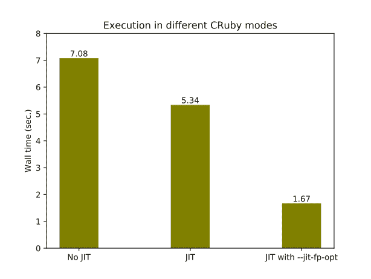](https://developers.redhat.com/blog/wp-content/uploads/2019/02/fpopt.png)

因此在这个例子中，优化将 JITted 代码提高了 3.2 倍。

在没有明确表示临时变量的情况下，使用堆栈指令很难实现这种优化。优化还需要当前堆栈指令集中没有的推测指令。

类似地，RTL 可以用于[转义分析](https://en.wikipedia.org/wiki/Escape_analysis)以避免在堆中创建对象，这在某些情况下可以大大加快执行速度。

## 结论

在这篇文章中，我试图展示 RTL 对克鲁比的优势和劣势。从我的角度来看，这是值得认真考虑使用 RTL 在未来的克鲁比。

将 RTL 加入克鲁比并不是一件容易的事情。这种变化对 CRuby 代码的影响很大，可能我不是合适的人选，因为我仍然是 CRuby 开发的新手。

维护分支上的代码需要我付出很多努力。我想我已经完成了 CRuby 的 RTL 项目，我将致力于另一个较少依赖 CRuby 代码的项目，该项目也将有利于提高 CRuby 的性能。

我希望代码和建议的解决方案对 Ruby 核心开发人员仍然有用，如果有人试图在 CRuby 中使用它们，我将很乐意提供帮助。

RTL 实现的源代码可以在我的库中找到，在 branch [stack-rtl-mjit](https://github.com/vnmakarov/ruby/tree/stack-rtl-mjit) 上。为了便于比较 RTL 和堆栈 VM 的实现，这个分支总是基于一个只包含主干变更的[分支](https://github.com/vnmakarov/ruby/tree/stack-rtl-mjit-base)，这个分支目前非常接近 CRuby 2.6 版本。

## 关于 Red Hat 开发人员的其他 Ruby 性能文章

*   [向 Ruby 3x3 性能目标迈进](https://developers.redhat.com/blog/2018/03/22/ruby-3x3-performance-goal/)
*   [走向更快的 Ruby 哈希表](https://developers.redhat.com/blog/2017/02/27/towards-faster-ruby-hash-tables/)
*   [用 SystemTap 让代码的操作更加透明](https://developers.redhat.com/blog/2018/05/14/making-the-operation-of-code-more-transparent-and-obvious/)
*   [“使用动态追踪工具，卢克”](https://developers.redhat.com/blog/2018/05/11/use-the-dynamic-tracing-tools-luke/)

*Last updated: January 10, 2023**