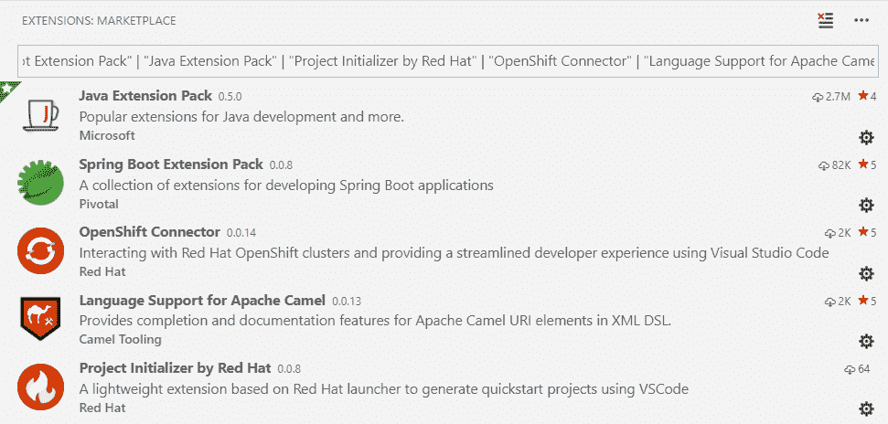

# 使用 VS 代码开发基于 Spring Boot 的 Camel 和 Red Hat Fuse 项目

> 原文：<https://developers.redhat.com/blog/2019/01/24/vscode-camel-red-hat-fuse>

在 [VS 代码](https://code.visualstudio.com/)内部开发阿帕奇 Camel 和[红帽 Fuse](https://developers.redhat.com/products/fuse/overview/) 应用正在改进！在我的[以前的文章](https://developers.redhat.com/blog/author/apupier/)中，我提到过 Camel URI 补全在 VS 代码中可用于 [XML](https://developers.redhat.com/blog/2018/02/15/apache-camel-uri-completion/) 和 [Java DSL](https://developers.redhat.com/blog/2018/07/10/apache-camel-uri-completion-with-java-dsl/) 。通过利用几个 VS 代码扩展，现在有可能获得端到端的开发体验。目前在 VS 代码中可用的 Camel 工具主要针对基于 Spring Boot 的 Camel 应用程序。该工具涵盖了从创建 Camel 项目、本地测试和调试它到在您做出更改时自动重新构建并在您的本地[open shift](https://www.openshift.com/)/[Kubernetes](https://developers.redhat.com/topics/kubernetes/)实例上重新部署它的开发过程。

有几种方法可以利用 VS 代码工具。我将展示我认为最容易开始的过程。

使用 VS 代码扩展，您可以在 VS 代码中执行以下操作:

*   创建一个融合项目
*   骆驼 URI 的自动完成
*   发起一项测试
*   在本地机器上调试 Java
*   部署到本地 OpenShift 实例( [Red Hat 容器开发工具包](https://developers.redhat.com/products/cdk/overview/) /minishift)
*   自动重新部署到 OpenShift

让我们看一段视频:

https://youtu.be/okyaqCx6Pz0

## 使用的扩展

截图中的五个扩展对 Camel 开发非常有用。它们是在之前的视频中使用的。您可以使用搜索栏中的这一行来轻松找到它们:

*"Spring Boot 扩展包" | "Java 扩展包" | " Red Hat 的项目初始化器" | "OpenShift 连接器" | " Apache Camel 的语言支持"*

## 下一步是什么？

我们需要您的反馈，您可以帮助塑造 Red Hat Fuse/Camel 工具的未来。仍然存在已知的局限性。请尝试这些扩展，并投票或报告您最想看到的附加功能。

## 相关文章

*   [使用新的基于约曼的项目生成器启动 camel 项目](https://developers.redhat.com/blog/2019/01/07/using-the-yeoman-camel-project-generator-to-jump-start-a-project/)
*   [宣布 Visual Studio 代码的 Red Hat OpenShift 扩展](https://developers.redhat.com/blog/2018/11/28/announcing-red-hat-openshift-extension-for-visual-studio-code-public-preview/)
*   [VS 代码 XML 扩展和 XML 语言服务器](https://developers.redhat.com/blog/2018/12/04/xml-language-server-vscode-extension/)
*   使用 Apache Camel 自动生成新闻并发布到 WordPress】
*   [Apache Camel URI 完成:Eclipse、VS 代码和 OpenShift.io 的简单安装](https://developers.redhat.com/blog/2018/05/21/apache-camel-uri-completion-easy-installation-for-eclipse-vs-code-and-openshift-io/)
*   [扩展 Eclipse Che 7 以使用 VS 代码扩展](https://developers.redhat.com/blog/2019/01/22/extending-eclipse-che-7-to-use-vs-code-extensions/)
*   [云中的骆驼骑士](https://developers.redhat.com/videos/youtube/zuEYtMvHN6g)

*Last updated: January 29, 2019*