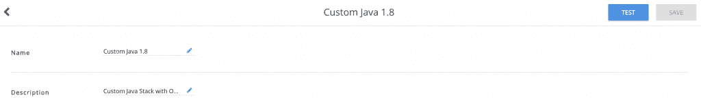
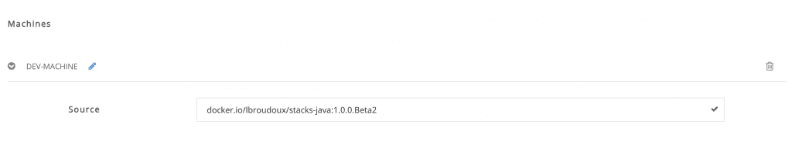
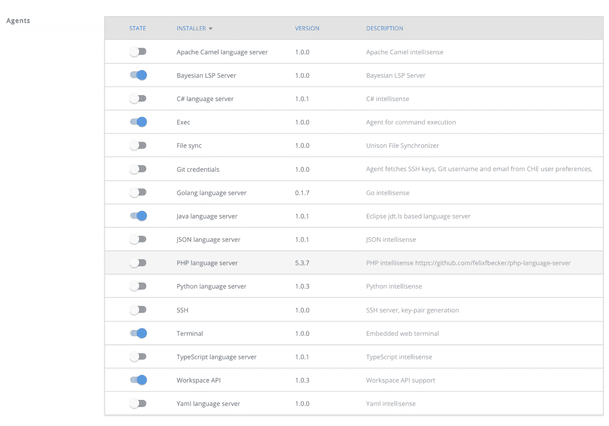
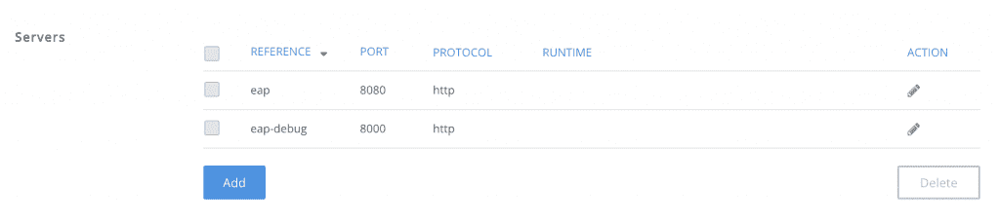
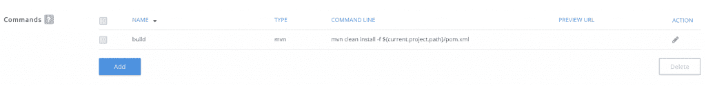
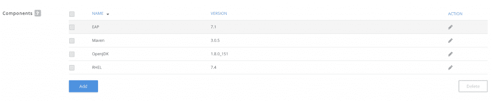
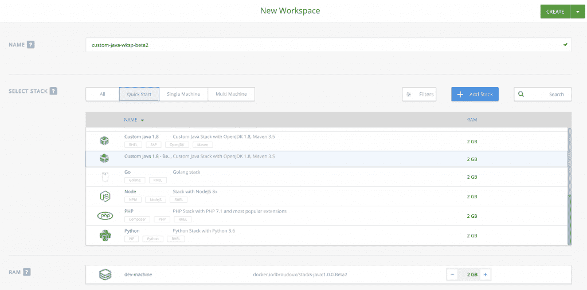
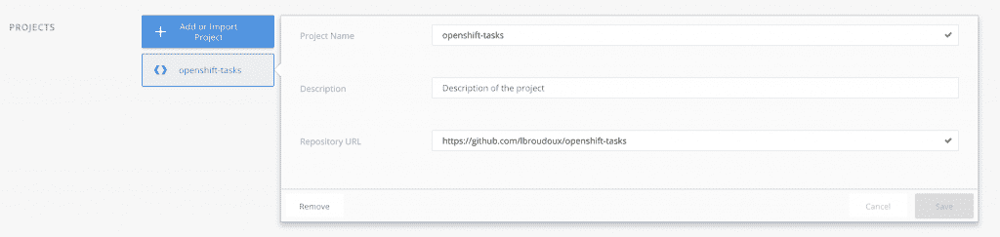
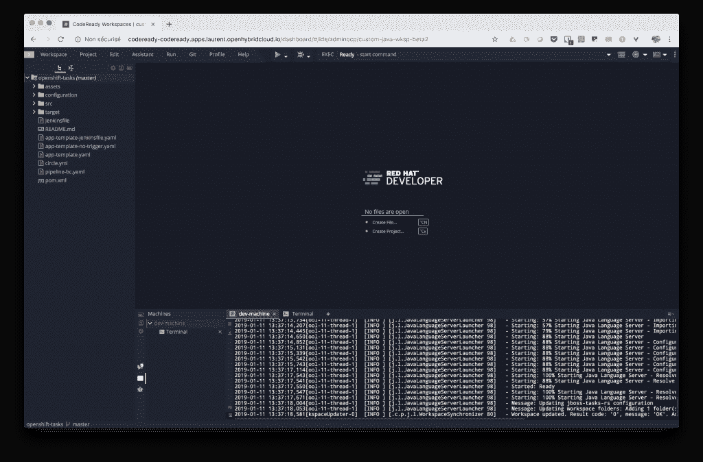

# 用 Red Hat CodeReady 工作区简化您的 JBoss EAP 开发环境:第 1 部分

> 原文：<https://developers.redhat.com/blog/2019/01/21/codeready-workspaces-streamline-jboss-eap-development>

距离宣布发布[Red Hat code ready work spaces 1 . 0 . 0 Beta](https://developers.redhat.com/blog/2018/12/11/codeready-workspaces-openshift/)刚刚过去一个月。因为基于云/浏览器的 IDE 可能充满了承诺，开发人员通常会持怀疑态度，认为它们是偶尔编码人员的玩具，但不适合软件工匠。但是您很快就会发现，Red Hat 的产品可以成为构建定制环境的好伙伴。

这个由两部分组成的系列的目标是通过使用 [Red Hat JBoss 企业应用程序平台](https://developers.redhat.com/products/eap/overview/) (JBoss EAP)，给出一个使用 Red Hat CodeReady 工作区开发一个 [Java EE](https://developers.redhat.com/topics/enterprise-java/) (现在是 Jakarta EE)应用程序的演练。我将详细介绍如何使用自己的工具，如何使用对 JBoss EAP 有用的命令来配置工作区，以及如何分享一切，以便您可以轻松地接纳新开发人员。

## Red Hat 代码就绪工作区

[Red Hat code ready work spaces](https://developers.redhat.com/products/codeready-workspaces/overview/)构建于 Eclipse Che 开源项目之上，提供:

*   开发工作区的集中配置管理
*   对开发环境的安全访问，源代码可能保留在中央服务器上，而不是开发人员的笔记本电脑上
*   可扩展的配置允许您携带自己的工具，并重用您将在生产中使用的运行时
*   丰富的基于浏览器的开发体验，包括自动完成、导航、调试器和通过工厂概念的轻松共享

整个产品运行在一个 [Red Hat OpenShift](http://openshift.com/) 集群上(内部或云中)，所以你的机器上不需要安装任何东西。[安装说明](https://access.redhat.com/documentation/en-us/red_hat_codeready_workspaces_for_openshift/1.0.0/html/administration_guide/)给出了如何在你的 OpenShift 集群上设置一切的细节；安装是通过运行在集群 Ansible Service Broker 上的 [Ansible PlayBook Bundle](https://developers.redhat.com/blog/2018/05/23/customizing-an-openshift-ansible-playbook-bundle/) 完成的。尽管它广泛使用了[容器](https://developers.redhat.com/blog/category/containers/)技术来安装、定义堆栈和配置工作空间，但它并不专门用于开发作为容器运行的应用程序。这就是我在这篇文章中试图展示的。

那么，你已经设置好你的 Red Hat CodeReady 工作区了吗？让我们一起深入这个 JBoss EAP 之旅吧！

## 定义您的自定义堆栈

Red Hat CodeReady Workspaces 堆栈是工作区的基本构建块:它包括编译、测试、调试或打包应用程序所需的一切。尽管 Red Hat CodeReady Workspaces 安装附带了许多技术的默认堆栈(Java、JBoss EAP、Spring Boot、NodeJS、Python 等)，但扩展它们并创建自己的堆栈是一种常见的做法。堆栈基于一个或多个容器映像，因此，提供堆栈基本上就是编写 docker 文件和构建映像。

一些常见的使用案例，想象您的组织使用自签名证书来访问基础设施，或者您已经开始在 OpenShift 上使用容器化的应用程序，并且发现使用`oc`或`odo`命令行工具非常方便。您可能需要扩展 Red Hat 提供的默认`stacks-java:1.0.0.Beta1`——已经包括 OpenJDK、JBoss EAP 和 Maven——以便添加您的自定义 CA 证书和您需要的工具:

```
FROM registry.access.redhat.com/codeready-workspaces-beta/stacks-java:1.0.0.Beta1
ADD ca.crt /etc/pki/ca-trust/source/anchors/ca.crt
RUN sudo update-ca-trust
USER root
RUN echo yes | keytool -keystore /etc/pki/java/cacerts -importcert \
               -alias HOSTDOMAIN -file /etc/pki/ca-trust/source/anchors/ca.crt \
               -storepass changeit
RUN curl -LO https://github.com/openshift/origin/releases/download/v3.11.0/openshift-origin-client-tools-v3.11.0-0cbc58b-linux-64bit.tar.gz && \
         tar xvf openshift-origin-client-tools-v3.11.0-0cbc58b-linux-64bit.tar.gz
RUN mv openshift-origin-client-tools-v3.11.0-0cbc58b-linux-64bit/oc /usr/local/bin/oc && \
         chmod +x /usr/local/bin/oc
```

一旦您生成了这个`Dockerfile`并将您的`ca.crt`文件放在同一个目录中，您只需构建您的映像并将它放入一个容器映像注册表中，该注册表可供您的 OpenShift 集群使用。

```
$ docker build --tag lbroudoux/stacks-java:1.0.0.Beta2 .
$ docker push lbroudoux/stacks-java:1.0.0.Beta2
```

上面，我已经把我的图片放在 docker.io 上，你可以很容易地重复使用我的图片进行快速测试。然后，我们可以从管理控制台开始构建一个定制的 Red Hat CodeReady 工作区堆栈。

点击*堆栈*左侧菜单，查看默认堆栈。然后你只需点击*添加堆栈*按钮，出现一个模态对话框，要求你输入*配方*。对于本文，我们将创建一个单独的容器堆栈，所以只需选择 *DOCKERIMAGE* 缩略图，并输入我们之前创建的 Docker 图像的名称:`docker.io/lbroudoux/stacks-jaba:1.0.0.Beta2`。

验证图像存在后，我们导航到允许您配置堆栈的表单。因此，首先给它分配一个*名称*和一个*描述*。

[](https://developers.redhat.com/blog/wp-content/uploads/2019/01/crw-stack-name.png)

向下滚动到*机器*部分。这里我们有一台*机器*，我们决定将其命名为*开发机器*。我们可以检查我们的机器是否基于我们提供的容器映像，我们还可以调整专用于这台机器的资源数量。这里有关于机器[的更多信息。](https://access.redhat.com/documentation/en-us/red_hat_codeready_workspaces_for_openshift/1.0.0/html/administration_guide/administering_workspaces#machine)

[](https://developers.redhat.com/blog/wp-content/uploads/2019/01/crw-stack-machine.png)

向下滚动，我们可以查看*代理商*(或*安装商*)部分。代理允许您激活 Eclipse Che 的特定特性。在这里，我们将需要处理 Java 的基本功能:能够执行命令、打开终端以及与 Workspace API 交互。更多关于安装者的信息可以在[这里](https://access.redhat.com/documentation/en-us/red_hat_codeready_workspaces_for_openshift/1.0.0/html/administration_guide/administering_workspaces#installer)找到。

[](https://developers.redhat.com/blog/wp-content/uploads/2019/01/crw-stack-agents.png)

下面是堆栈配置的一个非常重要的部分，在这里你可以定义不同的*服务器*来暴露你的机器。服务器定义允许您声明网络端口，这些端口将由您的工作空间公开，并且您的开发人员将使用这些端口来与应用程序进行交互和连接。在我们的 JBoss EAP 开发环境中，我们将声明两个端口:

*   端口 8080 将允许与 JBoss EAP 应用服务器进行常规交互。
*   端口 8000 将用于远程调试部署的应用程序。

更多关于服务器的信息请点击[这里](https://access.redhat.com/documentation/en-us/red_hat_codeready_workspaces_for_openshift/1.0.0/html/administration_guide/administering_workspaces#servers)。

[](https://developers.redhat.com/blog/wp-content/uploads/2019/01/crw-stack-servers.png)

下一部分与*命令*相关。这里我们将添加一个命令来使用 Maven 构建整个项目。我们将在新工作区的第一次测试中添加一些其他命令。命令用于构建、调试您的应用程序并与您的服务器交互。更多关于命令的信息在[这里](https://access.redhat.com/documentation/en-us/red_hat_codeready_workspaces_for_openshift/1.0.0/html/administration_guide/administering_workspaces#commands)。

[](https://developers.redhat.com/blog/wp-content/uploads/2019/01/crw-stack-commands.png)

最后，您可以添加对嵌入到堆栈中的*组件*的描述。这些描述是纯粹的信息组件，有助于用*标签*来组织存储库中的堆栈。

[](https://developers.redhat.com/blog/wp-content/uploads/2019/01/crw-stack-components.png)

一旦您完成了对这些最后部分的编辑，您现在可以*保存*您的堆栈，以便以后通过 JBoss EAP 工作区使用。您还可以检查您所做的一切是否可以导出为 JSON，是否可以版本化并保存到 Git 存储库中。只需点击*原始配置*部分中的*显示*按钮。到目前为止，我们所看到和做的一切都可以在我的[github.com/lbroudoux/codeready-workspaces](https://github.com/lbroudoux/codeready-workspaces)资源库中找到。

## 启动 JBoss EAP 工作区

现在我们有了一个可以构建的堆栈，我们可以创建一个新的工作区。因此，从仪表板或 Red Hat CodeReady 工作区的工作区页面，只需单击*添加工作区*按钮。创建一个工作空间从给它一个*名*开始，并选择我们之前创建的堆栈，如下所示。

[](https://developers.redhat.com/blog/wp-content/uploads/2019/01/crw-workspace-name.png)

工作区是用来处理项目的，所以在*项目*部分，一定要添加一个新项目。例如，您可以参考位于 GitHub 上的一个。我使用了 github.com/lbroudoux/openshift-tasks 的，这是一个 JEE/JBoss EAP 应用程序，我用它来演示 OpenShift 上的部署，尽管在我们的例子中，我们将把应用程序部署到一个常规的，而不是容器化的 JBoss EAP 实例。

[](https://developers.redhat.com/blog/wp-content/uploads/2019/01/crw-workspace-project.png)

保持其他选项不变，然后创建并运行您的工作区。几分钟后，您将拥有一个工作的 IDE，其中一个项目已经从 GitHub 中克隆出来，所有的开发工具(如 Java 语言服务器)已经启动并进入`dev-machine`控制台。

[](https://developers.redhat.com/blog/wp-content/uploads/2019/01/crw-workspace-open.png)

## 后续步骤

在本系列的第一部分中，我们已经看到了如何扩展 Red Hat CodeReady 工作区基础映像，以包括额外的工具和证书。我们已经在管理门户中将所有内容注册为自定义堆栈。最后，我们开始了一个新的工作空间，其中包含了编码、编译、部署、调试和打包我们的 JEE/JBoss EAP 应用程序所需的一切。

阅读 *[使用 Red Hat CodeReady Workspaces 简化您的 JBoss EAP 开发环境:第 2 部分](https://developers.redhat.com/blog/2019/01/28/codeready-workspaces-streamline-jboss-eap-development-part2/)* 来了解如何为上面的开发任务配置您的工作空间。我们将看到如何通过 Red Hat code ready work spaces Factory 使一切变得易于复制和分发。

*Last updated: February 21, 2019*