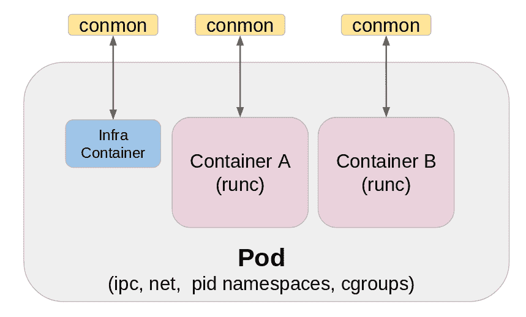

# Podman:在本地容器运行时管理 pod 和容器

> 原文：<https://developers.redhat.com/blog/2019/01/15/podman-managing-containers-pods>

人们把跑步豆荚和[Kubernetes](https://kubernetes.io/)联系在一起。当他们在开发运行时中运行容器时，他们甚至没有考虑过 pods 可能扮演的角色——即使是在本地化的运行时中。大多数来自码头工人世界的跑单集装箱的人并没有想到跑箱的概念。有几个很好的理由可以考虑在本地使用 pod，而不是使用 pod 来自然地对容器进行分组。

例如，假设您有多个需要使用 MariaDB 容器的容器。但是您不希望将该数据库绑定到可路由网络；要么在你的桥里，要么更远。使用 pod，您可以绑定到 pod 的`localhost`地址，并且由于共享的网络名称空间，该 pod 中的所有容器都将能够连接到它。

## 吊舱员吊舱:你需要知道的事情

[吊舱](https://kubernetes.io/docs/concepts/workloads/pods/pod/) 概念是由[Kubernetes](https://developers.redhat.com/topics/kubernetes/)引进的。波德曼吊舱类似于库伯内特 的定义。

[](https://developers.redhat.com/blog/wp-content/uploads/2019/01/podman-pod-architecture.png)

每个吊舱都包括一个“红外线”容器。这个容器什么也不做，只是睡觉。它的目的是保存与 pod 相关联的名称空间，并允许 podman 将其他容器连接到 pod。这允许您启动和停止 pod 内的容器，pod 将保持运行，而如果主容器控制 POD，这将是不可能的。默认的 infra 容器是基于`k8s.gcr.io/pause`图像的，除非您明确指出，否则所有的窗格都有基于默认图像的容器。

组成 Pod 的大多数属性实际上都分配给了“infra”容器。端口绑定、cgroup-parent 值和内核名称空间都被分配给“infra”容器。理解这一点很重要，因为一旦创建了 pod，这些属性就被分配给“infra”容器，并且不能更改。例如，如果您创建了一个 pod，然后决定要添加一个绑定新端口的容器，那么 Podman 将不能这样做。在添加新容器之前，您需要重新创建带有附加端口绑定的 pod。

在上图中，注意每个容器上方的方框，conmon，这是容器监视器。这是一个小的 C 程序，它的工作是观察容器的主进程，如果容器死亡，保存退出代码。它还保持打开容器的 tty，以便以后可以附加它。这就是允许 podman 以分离模式(后台)运行的原因，因此 podman 可以退出，但 conmon 会继续运行。每个容器都有自己的 conmon 实例。

## CLI: podman pod

我们通过`podman pod`命令公开了与 pod 的大部分交互。在其他操作中，您可以使用`podman pod`来创建、删除、查询和检查 pod。您可以通过不带任何参数运行`podman pod`来查看所有与 pod 相关的命令。

> ```
> $ sudo podman pod
> 
> NAME:
>  podman pod - Manage container pods.
> 
> Pods are a group of one or more containers sharing the same network, pid and ipc namespaces.
>  USAGE:
>  podman pod command [command options] [arguments...]
> 
> COMMANDS:
>  create     Create a new empty pod
>  exists     Check if a pod exists in local storage
>  inspect    displays a pod configuration
>  kill       Send the specified signal or SIGKILL to containers in pod
>  pause      Pause one or more pods
>  ps, ls, list  List pods
>  restart    Restart one or more pods
>  rm         Remove one or more pods
>  start      Start one or more pods
>  stats      Display percentage of CPU, memory, network I/O, block I/O and PIDs for containers in one or more pods
>  stop       Stop one or more pods
>  top        Display the running processes of containers in a pod
>  unpause    Unpause one or more pods
> 
> OPTIONS:
>  --help, -h  show help
> ```

## 创建一个 pod

使用 Podman 创建 pod 的传统方法是使用`podman pod create`命令。

> ```
> $ sudo podman pod create --help
> 
> NAME:
>  podman pod create - Create a new empty pod
> 
> USAGE:
>  podman pod create [command options] [arguments...]
> 
> DESCRIPTION:
>  Creates a new empty pod. The pod ID is then printed to stdout. You can then start it at any time with the podman pod start <pod_id> command. The pod will be created with the initial state 'created'.
> 
> OPTIONS:
>  --cgroup-parent value Set parent cgroup for the pod
>  --infra Create an infra container associated with the pod to share namespaces with
>  --infra-command value The command to run on the infra container when the pod is started (default: "/pause")
>  --infra-image value The image of the infra container to associate with the pod (default: "k8s.gcr.io/pause:3.1")
>  --label value, -l value Set metadata on pod (default [])
>  --label-file value Read in a line delimited file of labels (default [])
>  --name value, -n value  Assign a name to the pod
>  --pod-id-file value Write the pod ID to the file
>  --publish value, -p value  Publish a container's port, or a range of ports, to the host (default [])
>  --share value A comma delimited list of kernel namespaces the pod will share (default: "cgroup,ipc,net,uts")
> ```

在最基本的上下文中，您可以简单地发出`podman pod create`，Podman 将创建一个没有额外属性的 pod。还将为 pod 分配一个随机名称。

> ```
> $ sudo podman pod create
> 
> 9e0a57248aedc453e7b466d73ef769c99e35d265d97f6fa287442083246f3762
> ```

我们可以使用`podman pod list`命令:列出 pod

> ```
> $ sudo podman pod list
> POD ID      NAME          STATUS CREATED     # OF CONTAINERS   INFRA ID
> 9e0a57248aed   youthful_jones  Running 5 seconds ago   1  6074ffd22b93
> ```

注意，容器中只有一个容器。容器是“infra”命令。我们可以通过传递命令行开关* - pod*来使用`podman ps`命令进一步观察这一点。

> ```
> $ sudo podman ps -a --pod
> CONTAINER ID  IMAGE     COMMAND  CREATED   STATUS     PORTS  NAMES          POD
> 6074ffd22b93  k8s.gcr.io/pause:3.1   3 minutes ago  Up 3 minutes ago      9e0a57248aed-infra  9e0a57248aed
> ```

这里我们可以看到`podman ps`中的 pod id 与`podman pod list`中的 pod ID 相匹配。并且容器图像与默认的“infra”容器图像相同。

## 向 pod 添加容器

您可以使用`podman create`和`podman run`命令中的* - pod*选项向 pod 添加一个容器。例如，这里我们将运行**top**的容器添加到新创建的* youthful _ jones * pod。注意* - pod*的用法。

> ```
> $ sudo podman run -dt --pod youthful_jones docker.io/library/alpine:latest top
> 0f62e6dcdfdbf3921a7d73353582fa56a545502c89f0dfcb8736ce7be61c9271
> ```

现在我们的 pod 中有两个容器。

> ```
> $ sudo podman pod ps
> POD ID      NAME            STATUS  CREATED      # OF CONTAINERS   INFRA ID
> 9e0a57248aed   youthful_jones  Running 7 minutes ago   2  6074ffd22b93
> ```

查看集装箱列表，我们还可以看到每个集装箱及其各自的 pod 分配。

> ```
> $ sudo podman ps -a --pod
> CONTAINER ID  IMAGE                COMMAND  CREATED    STATUS          PORTS  NAMES            POD
> 0f62e6dcdfdb  docker.io/library/alpine:latest  top  14 seconds ago  Up 14 seconds ago      awesome_archimedes  9e0a57248aed
> 6074ffd22b93  k8s.gcr.io/pause:3.1                   7 minutes ago   Up 7 minutes ago       9e0a57248aed-infra  9e0a57248aed
> ```

## 创建窗格的快捷方式

我们最近增加了通过`podman run` 和`podman create`命令创建吊舱的能力。使用这种方法创建 pod 的一个好处是，为容器声明的普通端口绑定将被自动分配给“infra”容器。但是，如果您需要为 pod 创建指定更细粒度的选项，如内核名称空间或不同的“基础”容器映像使用，您仍然需要像前面描述的那样手动创建 pod。尽管如此，对于相对基础的 pod 创建，这个快捷方式还是很方便的。由于该功能是最近添加的，所以它在 Red Hat Enterprise Linux 7.6 和 8 Beta 版中包含的 Podman 版本中不可用。

要用您的新容器创建一个新的 pod，您只需传递* - pod*: `new:<name>`。使用**new:**向 Podman 表明您想要创建一个新的 pod，而不是尝试将该容器分配给一个现有的 pod。

要在 pod 中创建一个 nginx 容器，并将容器的端口 80 暴露给主机上的端口 32597，您需要:

> ```
> $ sudo podman run -dt --pod new:nginx -p 32597:80 quay.io/libpod/alpine_nginx:latest
> ac8839fc7dead8e391e7983ad8d0c27ce311d190b0a8eb72dcde535de272d537
> $ curl http://localhost:32597
> podman rulez
> ```

下面是列出容器时的样子:

> ```
> $ sudo podman ps -ap
> CONTAINER ID  IMAGE                   COMMAND            CREATED       STATUS         PORTS               NAMES            POD
> ac8839fc7dea  quay.io/libpod/alpine_nginx:latest  nginx -g daemon o...  4 minutes ago Up 4 minutes ago                      happy_cray       3e4cad88f8c2
> c2f7c5651275  k8s.gcr.io/pause:3.1                                   4 minutes ago Up 4 minutes ago  0.0.0.0:32597->80/tcp  3e4cad88f8c2-infra  3e4cad88f8c2
> ```

## MariaDB 示例

下面的 asciinema 演示展示了如何通过快捷方式创建 pod。正在运行的容器是一个 MariaDB 容器映像，我只绑定到它的 127.0.0.1 地址。这意味着只有同一个 pod 中的容器才能访问它。然后我运行一个 alpine 容器，安装 MariaDB-client 包，连接到数据库本身，并显示定义的数据库。

[](https://asciinema.org/a/Xc818xXZ7TAlP9yvHU88IPVBK)

## 豆荚和容器管理

在 Podman 中，pod 及其容器的状态可以相互排斥，这意味着 pod 中的容器可以重新启动、停止和启动，而不会影响 pod 的状态。假设我们有一个名为`demodb`的 pod，它包含两个运行 MariaDB 和 nginx 会话的容器(和一个“infra”容器)。

> ```
> $ sudo podman pod ps
> POD ID      NAME   STATUS CREATED          # OF CONTAINERS   INFRA ID
> fa7924a5196c   demodb Running   About a minute ago  3  3005ed8491d0
> $ sudo podman ps -p
> CONTAINER ID  IMAGE                    COMMAND              CREATED       STATUS         PORTS  NAMES         POD
> 02e37a3b9873  quay.io/libpod/alpine_nginx:latest   nginx -g daemon o... 4 minutes ago Up 4 minutes ago      optimistic_edison  fa7924a5196c
> 2597454063f8  quay.io/baude/mariadbpoddemo:latest  docker-entrypoint... 4 minutes ago Up 4 minutes ago      eloquent_golick fa7924a5196c
> ```

如果我们想要停止和启动 nginx 容器，MariaDB 容器和 pod 本身的状态将保持不变。

> ```
> $ sudo podman stop optimistic_edison
> 02e37a3b987300e9124b61820119ae425c5e496b907800ecaf1194a3f50e5dcc
> ```

nginx 容器停止后，我们仍然可以观察到`demopod`正在运行，MariaDB 容器保持不变。

> ```
> $ sudo podman pod ps
> POD ID      NAME   STATUS CREATED       # OF CONTAINERS   INFRA ID
> fa7924a5196c   demodb Running   5 minutes ago 3            3005ed8491d0
> $ sudo podman ps -p
> CONTAINER ID  IMAGE                    COMMAND              CREATED       STATUS         PORTS  NAMES  POD
> 2597454063f8  quay.io/baude/mariadbpoddemo:latest  docker-entrypoint... 5 minutes ago Up 5 minutes ago      eloquent_golick  fa7924a5196c
> ```

我们可以启动 nginx 容器将 pod 恢复到初始状态。

> ```
> $ sudo podman start optimistic_edison
> optimistic_edison
> $ sudo podman ps -p
> CONTAINER ID  IMAGE                    COMMAND              CREATED       STATUS         PORTS  NAMES         POD
> 02e37a3b9873  quay.io/libpod/alpine_nginx:latest   nginx -g daemon o... 8 minutes ago Up 6 seconds ago      optimistic_edison  fa7924a5196c
> 2597454063f8  quay.io/baude/mariadbpoddemo:latest  docker-entrypoint... 8 minutes ago Up 8 minutes ago      eloquent_golick fa7924a5196c
> ```

我们还可以使用`podman pod stop`命令停止 pod 及其所有容器。

> ```
> $ sudo podman pod stop demodb
> fa7924a5196cb403298ad2ce24f0db30a3790e80729c7704ef5fdc27302f7ad0
> $ sudo podman ps -ap
> CONTAINER ID  IMAGE                    COMMAND              CREATED        STATUS                  PORTS                 NAMES            POD
> 02e37a3b9873  quay.io/libpod/alpine_nginx:latest   nginx -g daemon o... 10 minutes ago Exited (0) 21 seconds ago                        optimistic_edison   fa7924a5196c
> 2597454063f8  quay.io/baude/mariadbpoddemo:latest  docker-entrypoint... 10 minutes ago Exited (0) 19 seconds ago                        eloquent_golick  fa7924a5196c
> 3005ed8491d0  k8s.gcr.io/pause:3.1                                      10 minutes ago Exited (0) 19 seconds ago  0.0.0.0:43871->3306/tcp  fa7924a5196c-infra  fa7924a5196c
> ```

如果我们查看 pod 的状态，它将显示“Exited”状态。

> ```
> $ sudo podman pod ps
> POD ID      NAME  STATUS   CREATED     # OF CONTAINERS   INFRA ID
> fa7924a5196c   demodb Exited   13 minutes ago   3            3005ed8491d0
> ```

同样，我们也可以启动 pod 及其所有容器进行备份。此后，pod 中的所有容器都应该正在运行，并且 pod 应该显示“正在运行”状态。

> ```
> $ sudo podman pod start demodb
> fa7924a5196cb403298ad2ce24f0db30a3790e80729c7704ef5fdc27302f7ad0
> $ sudo podman ps -p
> CONTAINER ID  IMAGE                    COMMAND              CREATED      STATUS         PORTS  NAMES           POD
> 02e37a3b9873  quay.io/libpod/alpine_nginx:latest   nginx -g daemon o... 14 minutes ago Up 5 seconds ago      optimistic_edison  fa7924a5196c
> 2597454063f8  quay.io/baude/mariadbpoddemo:latest  docker-entrypoint... 14 minutes ago Up 4 seconds ago      eloquent_golick fa7924a5196c
> $ sudo podman pod ps
> POD ID      NAME  STATUS CREATED       # OF CONTAINERS  INFRA ID
> fa7924a5196c   demodb Running   14 minutes ago 3             3005ed8491d0
> 
> ```

还有一个`podman pod restart`命令，将重启 Pod 内的所有容器。

## 总结

Podman 处理 pod 部署的能力是与其他容器运行时的明显区别。作为 libpod 的维护者，我仍然意识到即使在本地化的运行时中使用 pods 的优势。随着我们了解用户如何利用 pod，Podman 肯定会有更多的发展。

要了解更多关于 Podman 的信息，请务必访问 github 上的 [libpod 项目页面](https://github.com/containers/libpod) 。与波德曼相关的相关博客和新闻也可以在[pod man . io](https://podman.io/)找到。

Podman 包含在 Red Hat Enterprise Linux 7.6 和 Red Hat Enterprise Linux 8 beta 中。

## 关于 Podman 的更多信息，请访问 Red Hat 开发者博客

*   没有守护进程的容器:RHEL 7.6 和 RHEL 8 测试版中的 Podman 和 Buildah
*   [pod man——下一代 Linux 容器工具](https://developers.redhat.com/articles/podman-next-generation-linux-container-tools/)
*   [pod man 简介(Red Hat Enterprise Linux 7.6 中的新功能)](https://developers.redhat.com/blog/2018/08/29/intro-to-podman/)
*   [使用 Podman 管理集装箱化系统服务](https://developers.redhat.com/blog/2018/11/29/managing-containerized-system-services-with-podman/)

*Last updated: June 17, 2021*