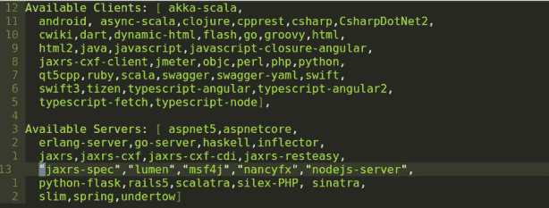

# 使用 API 优先的方法构建 Node.js 服务

> 原文：<https://developers.redhat.com/blog/2019/01/14/building-a-node-js-service-using-the-api-first-approach>

如今，技术公司正在将 API 作为他们业务中最有价值的部分之一。

当我们谈论 API 优先开发时，它意味着什么？我们已经知道使用 API 优先方法的好处:

*   减少相互依赖
*   早期验证
*   自由改变的早期反馈
*   提高效率

本文描述了使用 API 优先的设计方法意味着什么。它还通过一个例子来说明如何使用这种方法，将 [OpenAPI 规范](https://github.com/OAI/OpenAPI-Specification)和 [oas-tools](https://github.com/isa-group/oas-tools) 作为 [Node.js](https://developers.redhat.com/blog/category/node-js/) 后端应用程序，这使您可以只关心业务逻辑。所有传入请求的验证都由`oas-tools`库完成(基于提供的 OpenAPI 规范文件)。

## “API 优先的方法”是什么意思？

使用 API 优先的方法，在编写任何代码之前，设计 API 是首要任务。API 的设计包括通过与不同利益相关者的合作进行全面的思考和规划。这导致了描述 API 意图的高级文档。

这个 API 合同作为一个核心草案，让你的所有团队成员在你的 API 的目标是什么以及你的 API 资源是如何公开的问题上保持一致。合同的最终确定允许团队构建应用程序的接口。

此后，跨职能团队依靠这个接口来构建彼此独立的应用程序的其余部分。例如，后端开发人员开始构建 API 背后的实现逻辑，前端开发人员开始开发不同的前端应用程序，质量测试人员开始为公开的接口编写测试。

## 选择 API 规范

第一步是选择 API 规范。 *API 规范*是一个经常与 *API 定义*互换使用的术语。虽然这些术语有许多相似之处，但它们是不同的实体。

API 规范提供了对 API 行为方式以及 API 如何与其他 API 链接的广泛理解。它解释了 API 如何工作以及使用 API 时预期的结果。

有几个 API 规范选项:

*   [OpenAPI 规范](https://github.com/OAI/OpenAPI-Specification)
*   [RESTful API 建模语言(RAML)](https://raml.org/)
*   [API 蓝图](https://apiblueprint.org/)
*   [图表 QL](https://graphql.org)

我们需要选择一个使我们的工作更容易并且支持我们将要使用的语言的。

在本文中，我将展示如何使用 API 优先的方法，使用 OpenAPI 规范 3.0.0，并为我们的 Node.js 应用程序使用`oas-tools`。

## 使用 OpenAPI 3.0 定义 API

在我们开始编码之前，我们需要创建供我们的开发人员使用的 API。

这是我们最终的 API 定义文件:

```
openapi: 3.0.0
info:
 title: Hello World API
 description: This is our Hello World API.
 version: '1.0'
paths:
 /hello:
   post:
     x-swagger-router-controller: helloWorldRoute
     operationId: helloWorldPost
     tags:
       - /hello
     description: >-

       Returns Hello world message.
     parameters:
       - name: greeting
         in: query
         description: Name of greeting
         required: true
         schema:
           type: string
     responses:
       '200':
         description: Successful request.
         content:
           application/json:
             schema:
               $ref: '#/components/schemas/Hello'
       default:
         description: Invalid request.
         content:
           application/json:
             schema:
               $ref: '#/components/schemas/Error'
   get:
     x-swagger-router-controller: helloWorldRoute
     operationId: helloWorldGet
     tags:
       - /hello
     description: >-
       Returns Hello world message
     parameters:
       - name: greeting
         in: query
         description: Name of greeting
         required: true
         schema:
           type: string
     responses:
       '200':
         description: Successful request.
         content:
           application/json:
             schema:
               $ref: '#/components/schemas/Hello'
       default:
         description: Invalid request.
         content:
           application/json:
             schema:
               $ref: '#/components/schemas/Error'
servers:
 - url: '/api'
components:
 schemas:
   Hello:
     properties:
       msg:
         type: string
     required:
       - msg
   Error:
     properties:
       message:
         type: string
     required:
       - message
```

让我们分解一下，以便更好地理解:

*   定义我们将要使用的 OpenAPI 规范的版本。
*   `info`提供关于 API 的额外信息，例如描述、标题和当前版本。
*   `servers`提供服务器列表和 API 的基本路径。
*   `paths`指定应用程序端点。如您所见，我们有一条位于`/hello`的路径，然后我们定义了两个 REST 操作:`get`和`post`。

我们来看一下`post`操作:

`paths`:

*   `/hello`是终点。
*   `post:`是操作类型。
*   `x-swagger-router-controller: helloWorldRoute`:我们以后再讲；`oas-tools`的注释。
*   `operationId: helloWorldPost`:我们以后再讲；`oas-tools`的注释。

`tags`:

*   `- /hello`:用于逻辑分组。
*   `description`:端点的描述。

`parameters`:端点需要或允许的参数。

*   `- name: greeting`:参数名称。
*   `in: query`:定义参数的位置(查询、正文等)。)
*   `description: Name of greeting`:参数描述。
*   `required: true`:指定该参数是必需的还是可选的。
*   `schema`:参数的类型(布尔值、数字、字符串等)。)
*   `type:string`:指定一个字符串参数。

`responses`:我们对通话结果的预期。

看了一下规范，我们应该可以使用下面的 URL 来调用它:`GET <serverUrl>/api/hello?greeting=redhat`。

现在我们已经完成了 API 定义，我们可以用什么来提高我们的开发速度呢？对于 Node.js 后端 app，我们准备用`oas-tools`。

## Node.js 后端开发

`oas-tools`是一个 Node.js 模块，用于管理通过 [Express](https://expressjs.com/) 服务器用 OpenAPI 规范定义的 RESTful APIs。它将自动检查传入的请求是否符合我们的定义，如果不符合我们的要求，它将拒绝它。结果呢？更少的编码时间，所有的验证都由`oas-tools`管理，我们只需要关心业务逻辑。

我已经创建了一个项目，已经完成了所有需要的步骤和集成。对此进行研究，我们将涵盖使其工作所需的不同部分。你可以在 github.com/rhappdev/nodejs-template 找到这个项目。

有两个分支:

*   `master`:使用 OpenAPI 2.x 规范
*   `openapi3`:使用 OpenAPI 3.0.0 规范

我们将介绍 OpenAPI 3.0，但两者几乎是一样的。

这个例子是一个 Node.js + Express + `oas-tools`，使用 [TypeScript](https://www.typescriptlang.org) 作为基本编程语言。

以下是您可以使用的主要命令:

*   trans file to TypeScript:`npm run build:live`。
*   运行类型脚本应用程序:`npm run dev`。
*   运行传输的应用程序:`npm start`。
*   运行测试:`npm run test`。

### 初始化 oas 工具中间件

需要进行以下设置来初始化位于`src/middlewares/swagger.ts`的中间件:

```
const swaggerDoc = loadDocumentSync(basePath + "/definition/swagger.yaml");
   const options = {
       controllers: basePath + "/routes",
       loglevel: "debug",
       strict: true,
       validator: true,
       docs: {
           apiDocs: "/api-docs",
           apiDocsPrefix: "",
           swaggerUi: "/docs",
           swaggerUiPrefix: ""
       }
   };
   swaggerTools.configure(options);
   swaggerTools.initialize(swaggerDoc, app, function() {
       cb();
   });
```

*   `swaggerDoc`:包含 OpenAPI 规范文件的位置。
*   `options`:指定配置。
    *   `controllers`:路线控制器的位置。
    *   通过定义日志级别，你可以对日志和将要出现的信息量进行分类。
    *   `strict`:表示根据规范文件进行验证时，如果发现错误，验证是否必须停止请求过程。
    *   `validator`:表示是否应该使用验证器中间件。
    *   `docs`:显示了`swagger-ui`接口，它位于`/docs`端点，在没有任何实现逻辑的情况下可视化 API 资源并与之交互。它是根据您的 OpenAPI 规范自动生成的。
*   `swaggerTools.configure`:设置自定义配置。
*   `swaggerTools.initialize`:初始化中间件。

### 添加特殊注释

`oas-tools`需要特殊注释来定义路由器控制器和要使用的`operationId`。正如您在`.yaml`文件中看到的，我们有以下注释:

```
paths:
 /hello:
   post:
     x-swagger-router-controller: helloWorldRoute 
     operationId: helloWorldPost
```

`x-swagger-router-controller`指定与`/hello`路径相关的控制器文件的名称。`helloWorldRoute`，出口两条路线:

*   `export const **helloWorldGet**  = Router().use("/", asyncHandler(getHelloWorld, "helloWorldGet"));`
*   `export const **helloWorldPost**  = Router().use("/", asyncHandler(getHelloWorld, "helloWorldPost"));`

需要添加`helloWorldGet`和`helloWorldPost`作为`operationId`的

### 实现业务逻辑

既然我们已经完成了验证请求并确保它符合我们的规范所需的所有设置，让我们定义业务逻辑，正如您可以看到的,`src/controllers/hello`包含以下内容:

```
export async function getHelloWorld(req: Request, res: Response): P<any> {
   const greeting =
   req.swagger.params && req.swagger.params.greeting.value ? req.swagger.params.greeting.value : "World";
   debug.log("Greeting: ", greeting);
   res.send({"msg": "hello " + greeting} as Hello);
}
```

`oas-tools`提供了`req.swagger`属性中的参数。前面的代码获取参数并返回带有`msg`属性的`Hello`对象，正如我们在规范中定义的那样。

### 运行应用程序并检查它

键入`npm run dev`并查看`oas-tools`是如何初始化的，这将检查控制器和路线是否已定义:

```
2018-12-12T16:34:24.498Z info: Valid specification file
2018-12-12T16:34:24.505Z info: Specification file dereferenced
2018-12-12T16:34:24.506Z debug: Register: POST - /hello
2018-12-12T16:34:24.506Z debug:   POST - /hello
2018-12-12T16:34:24.506Z debug:     OAS-doc has x-swagger-router-controller property
2018-12-12T16:34:24.748Z debug:       Controller for POST - /hello: OK
2018-12-12T16:34:24.753Z debug: Register: GET - /hello
2018-12-12T16:34:24.753Z debug:   GET - /hello
2018-12-12T16:34:24.753Z debug:     OAS-doc has x-swagger-router-controller property
2018-12-12T16:34:24.753Z debug:       Controller for GET - /hello: OK
```

一旦服务启动并运行，我们可以创建两个`curl`请求来检查`oas-tools`是否完成了所需的工作。

1.  GET request with `greeting` parameter is OK
    Request:

    ```
    curl -X GET "http://localhost:8001/api/hello?greeting=redhat" -H "accept: application/json"
    ```

    回应:

    ```
    {
      "msg": "hello redhat"
    }
    ```

2.  GET request without greeting parameter fails
    Request:

    ```
    curl -X GET "http://localhost:8001/api/hello" -H "accept: application/json"
    ```

    回应:

    ```
    [{"message":"Missing parameter greeting in query. "}]
    ```

如你所见，在这个简单的例子中。您只需要关注业务逻辑。中间件根据 API 规范检查传入的请求。

## 临时演员

此外，如果您正在处理客户端应用程序，有许多语言的代码生成器，这意味着如果您想要调用后端，您不需要生成所需的类:

为我们做这件事的工具在[github.com/swagger-api/swagger-codegen.git](https://github.com/swagger-api/swagger-codegen.git)。

**注意**:open API 版本 3 使用标签`3.0.0`，版本 2.x 使用标签`master`

首先，下载该工具并键入以下内容:

```
mvn clean package
java -jar modules/swagger-codegen-cli/target/swagger-codegen-cli.jar generate -i <yaml DefinitionFileLocation>.yaml -l typescript-angular -o test
```

通过运行这个命令，我们能够为任何受`swagger-codegen-cli`工具支持的编程语言生成所需的类。上面的命令生成角度项目的类。

[](https://developers.redhat.com/blog/wp-content/uploads/2019/01/Screenshot-2019-01-02-at-10.12.17.png)

支持多种可用语言: [](https://developers.redhat.com/blog/wp-content/uploads/2019/01/Screenshot-2019-01-02-at-10.12.27.png)

## 结论

在本文中，我们已经看到了如何通过首先生成 API 规范文件，然后只专注于开发业务逻辑来设置 Node.js 微服务。API 的所有验证都将由`oas-tools`管理，因此，我们将节省开发时间。

## 其他资源

以下是 Red Hat 开发者博客上关于相关主题的其他文章:

*   [与 Apicurio 和 Red Hat Fuse/Camel 的合同-第一个 API 设计](https://developers.redhat.com/blog/2018/07/12/contract-first-api-design-with-apicurio-and-red-hat-fuse/)
*   API 之旅:从想法到部署的敏捷之路—(三部分系列)
*   [open shift 上的现代网络应用:第 1 部分——两个命令中的网络应用](https://developers.redhat.com/blog/2018/10/04/modern-web-apps-openshift-part-1/)

*Last updated: April 7, 2022*