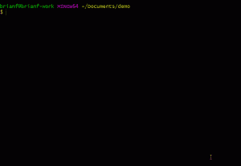

# 使用新的基于约曼的项目生成器启动 camel 项目

> 原文：<https://developers.redhat.com/blog/2019/01/07/using-the-yeoman-camel-project-generator-to-jump-start-a-project>

[Red Hat Fuse Tooling](https://tools.jboss.org/features/fusetools.html) 团队最近将其关注点从跨平台、单 IDE ( [Eclipse](https://developers.redhat.com/products/devstudio/overview/) )方法扩展到跨平台、跨 IDE 方法(Eclipse、VS Code、Che)，开始了几项协同工作，以提供跨平台和开发环境的工具。支持 VS 代码已经成为一个优先事项，这使得我们探索使用 Yeoman 框架进行项目和文件生成，为开发人员提供一种快速启动 Fuse/Camel 开发工作的方法。

本文描述了 Yeoman 框架和 Fuse 工具团队创建的新的基于 Yeoman 的 Camel-Project 生成器，并展示了如何安装和运行该生成器。

## 约曼是什么？

约曼主页将该框架描述为“...一个通用的脚手架系统，允许创建任何类型的应用程序。它允许快速启动新项目，并简化现有项目的维护。”

*   该框架提供了一个与应用无关的生成器生态系统，可以用来组合整个项目或只是部分项目。
*   它基于 node.js，可以使用 npm 包管理器进行管理。
*   美国约曼公司为 Angular，Backbone，React，Polymer 和近 6，000 个其他项目提供了广泛的(并且不断增长的)发电机系列。

Learn more at <a href="https://yeoman.io/" target="_blank">Yeoman.io</a>

Learn more at

约曼发电机的常见使用案例包括:

*   创建项目
*   创建一个新的项目块，就像单元测试一样
*   创建模块或包
*   引导一项新服务
*   在生成的代码中实施标准、最佳实践和风格指南
*   让用户快速使用示例应用程序

一旦在系统上安装了 NPM，安装约曼就非常容易了:

1.  在诸如 Windows 上的 Cygwin 或 Git Bash 或 Mac 或 Linux 机器上的 Terminal 之类的命令提示符下，键入`npm install yo` ( 或`npm install -g yo`为所有用户全局安装软件包，尽管这仅在您拥有管理员权限或使用`sudo`的情况下才有效，如果允许的话)。
2.  要安装特定的约曼发电机，输入`npm install generator-webapp`(参见上面关于`-g`的注释！).
3.  并运行它，键入`yo webapp`。

你可以在约曼网站上了解更多信息，并开始开发自己的发电机。

## Fuse 工具团队是如何参与进来的？

我们在 2018 年年中开始与 Yeoman 框架合作，构建一个简单的生成器，以帮助开发人员从模板创建新的 Camel 项目，方式类似于在基于 Eclipse 的 Fuse 工具中使用新项目向导。从那时起，我们已经走了很长的路，现在提供了与 SOAP-to-REST 功能的集成，我们以前在 Eclipse 中用 Fuse 工具探索过(参见[How to migrate your SOAP web service to REST with Camel](https://developers.redhat.com/blog/2018/07/24/migrate-soap-to-rest-with-camel/))。

虽然 VS Code 没有向导的概念，但是有几个例子可以说明 Yeoman 是如何快速搭建项目的。我们决定对 Camel 项目尝试同样的方法。

新的基于 Yeoman 的 Camel 项目生成器构建了一个新的 Camel 项目并准备好运行，为 Maven 化的 Spring、Blueprint 或基于 Java 的 Camel 开发建立必要的文件夹结构。现在，当您将`wsdl2rest`添加到等式中时，您可以将所有必要的 CXF 和 Camel Rest DSL 位添加到生成的项目中，以 RESTful 方式包装您的旧的基于 WSDL 的 JAX-WS 服务。

## 安装和运行发电机

要运行发电机，您必须首先安装约曼，如上所述。

然后通过键入`npm install -g generator-camel-project`安装 Camel-Project 生成器。(参见[之前关于`-g`的注释](#global)以及全局安装时的约束。)

安装生成器后，创建一个新目录，转到该目录，然后运行生成器:

1.  类型`mkdir myproject`。
2.  类型`cd myproject`。
3.  类型`yo camel-project`。

关于发电机的几点注意事项:

*   你提供一个应用名(默认为文件夹名)、Camel 版本(默认为 2.22.2)、你的 Camel DSL 类型(`spring`、`blueprint`或者 Java 默认为`spring`)，以及一个包名(默认为`com.` +项目名)。
*   如果一切顺利，它将基于您提供的 DSL 风格的模板创建一个简单的项目。
*   要在项目创建后构建并运行它，键入`mvn install`和`mvn camel:run`(或者像`mvn install camel:run`一样将它们组合成一个命令)。

这里有一个例子，我创建了一个基于 Spring 的项目。我创建的基本项目在运行时记录一个简单的 Hello 消息和一个计时器。

我们希望这个新的生成器将帮助用户快速上手，这样他们就可以在任何支持 Yeoman 的 IDE 中进行自己的 Camel 开发，我们计划继续一次添加一点功能。

## SOAP-to-REST 支持

我们为生成器开发的第一个新功能集中在今年早些时候我们在基于 Eclipse 的 Fuse 工具中公开的`wsd2rest`工具上。通过将 Camel-Project generator 与`wsdl2rest`配对，用户可以自动获得一种快速的方法，使用 Camel 的 REST DSL 将一些简单的基于 SOAP 的 web 服务映射到 REST。

要激活新功能，只需在调用生成器时添加`--wsdl2rest`，例如`yo camel-project --wsdl2rest`。

有一些新的提示，包括 WSDL 的 URL、实用程序将放置生成的 CXF 工件的输出目录的名称、生成的 JAX-RS 端点的 web 地址以及源 JAX-WS 端点的 web 地址。

例如，如果我有一个简单的“Hello，world”服务在本地运行，该流程将如下所示:

一旦 Camel 服务在本地运行，您就可以打开本地浏览器访问 URL `localhost:8081/jaxrs/hello/"test"`，您应该会看到“Hello test”作为响应。这表明 Camel 提供的 REST 服务正在运行，并且正在访问 SOAP 服务以返回有效的输出。

`wsdl2rest`实用程序提供了对基本类型的 WSDL 实现的支持，但是它不包括任何 WS-*安全扩展等等。它只是作为一个快速工具，帮助将简单的 JAX-WS 服务迁移到 RESTful 范式。

## 今后

如果你喜欢这个工具，一定要让我们知道！随着我们继续扩展它的功能，我们很想知道你下一步想看到什么功能。

有关 Camel 项目生成器的更多信息，请查看 [NPMJS 页面](https://www.npmjs.com/package/generator-camel-project)。

关于`wsdl2rest`工具的更多信息，请查看它的 [GitHub 页面](https://github.com/jboss-fuse/wsdl2rest)。

另请参见[红帽保险丝](https://developers.redhat.com/products/fuse/overview/)页面。

*Last updated: January 22, 2019*