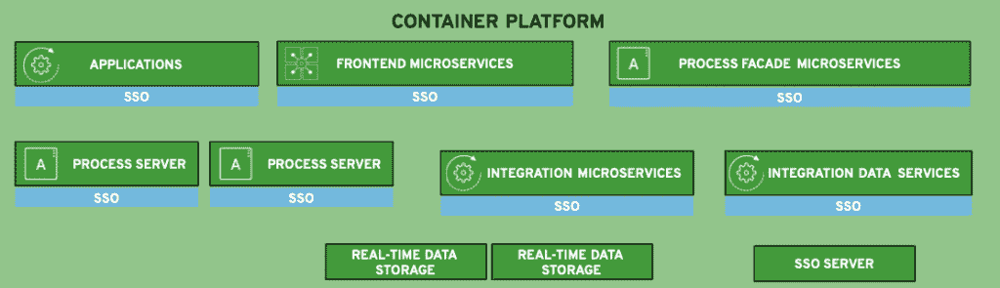

# 容器平台要素的集成(第 5 部分)

> 原文：<https://developers.redhat.com/blog/2019/01/04/integration-of-container-platform-essentials-part-5>

在本系列的[第 4 部分，我们研究了决定您的整合如何成为转变您的全渠道客户体验的关键的细节。](https://developers.redhat.com/blog/2018/12/20/integration-of-api-management-details-part-4/)

它从展示我如何通过研究成功的客户组合解决方案作为通用架构蓝图的基础来处理用例的过程开始。现在是时候介绍更多的蓝图细节了。

本文讨论了蓝图中的核心元素( *[容器](https://developers.redhat.com/blog/category/containers/)平台和[微服务](https://developers.redhat.com/blog/category/microservices/)),这些元素对于通用架构概述至关重要。*

## 建筑细节

如前所述，这里涉及的架构细节基于使用开源技术的真实客户集成解决方案。这里呈现的元素是我在通用架构蓝图中识别和收集的*通用通用架构元素*。我的意图是提供一个蓝图，提供指导，而不是深入的技术细节。

本节涵盖了所呈现的视觉表示，但是预计它们会随着时间的推移而在视觉上发生变化。在这个建筑蓝图中，有许多方法来表示每个元素，但是我选择了图标、文本和颜色，我希望它们能让你更容易理解。欢迎在本文底部发表评论，或者直接联系我。

现在让我们来看看这个架构中的细节，并概述一下我在研究中发现的元素。

## 集装箱平台

我进行的所有研究的核心是将容器平台用于与全渠道解决方案相关的一些(如果不是全部)微服务和应用程序。

毫无疑问，容器平台提供的灵活性和一致性增强了开发团队提供的解决方案的交付。随着容器部署、管理和监控在多个云基础架构间实现标准化，运营团队变得高效起来。

在容器平台中，第一个元素与微服务相关，旨在促进前端应用程序与其余集成服务的交互。特定的(前端)微服务组用于服务外部部署的应用:

*   前端微服务(提供对内部集成微服务的访问)
*   流程门面微服务(提供对自动化集成流程的访问)
*   其他集成应用(提供对聚合微服务或其他内部应用的访问)
*   单点登录或 SSO 插件，它们在整个微服务和容器平台上增加了安全性

对内部微服务的更深入的访问是我们将研究的下一个细节，涉及到*集成和数据微服务。*

## 核心微服务

蓝图的这一部分强调了一些容器化的服务和核心微服务。

流程外观微服务公开了核心流程集成功能，这是所描述的*流程服务器*元素的一部分。为了可用性和利用容器平台的负载平衡特性，大多数部署托管两个服务器。

*集成微服务*和*集成数据微服务*提供对组织中几乎任何东西的访问。想象一下大型机、第三方服务台桌面应用程序、第三方云平台服务集成，或者任何你能想到的东西。数据集成可以是容器原生存储、第三方产品或任何架构中的传统存储组件。

显示了一个 *SSO server* 元素，以完成从微服务到组织中的身份验证和授权后端系统的连接性背后的故事。

这里显示的最后几项是标记为*实时数据存储*的特殊存储实例，它是一个研究解决方案的一部分，该解决方案包括需要容器中特殊性能存储的集成服务，以将视频流传输到外部应用程序。这些都很有趣，可以在这里单独展示，尽管您可能希望它出现在存储服务中。

这些细节并不能说明一切，但是应该给你在你自己的架构环境中开始工作所需要的指导。

## 下一步是什么

本概述涵盖了构成我们全渠道客户体验用例架构蓝图的容器平台元素。

全渠道客户体验组合架构蓝图系列概述可在此处找到:

1.  [第 1 部分:整合如何成为客户体验的关键](https://developers.redhat.com/blog/2018/11/28/integration-is-key-to-customer-experience/)
2.  [第 2 部分:现代集成架构的通用架构元素](https://developers.redhat.com/blog/2018/11/30/common-architectural-elements-for-modern-integration-architectures/)
3.  [第三部分:外部应用细节的整合](https://developers.redhat.com/blog/2018/12/14/integration-of-external-application-details-part-3/)
4.  [第四部分:API 管理细节的整合](https://developers.redhat.com/blog/2018/12/20/integration-of-api-management-details-part-4/)
5.  [第 5 部分:集成容器平台要素](https://developers.redhat.com/blog/2019/01/04/integration-of-container-platform-essentials-part-5/)(本文)
6.  [第 6 部分:存储服务集成](https://developers.redhat.com/blog/2019/01/18/integration-of-storage-services-part-6/)
7.  第 7 部分:应用程序集成细节
8.  第 8 部分:剖析几种特定的应用程序集成架构

通过上面的链接之一来补上你错过的任何文章。

在本系列的下一篇文章中，我们将详细了解全渠道客户体验架构中的特定元素。

*Last updated: September 3, 2019*