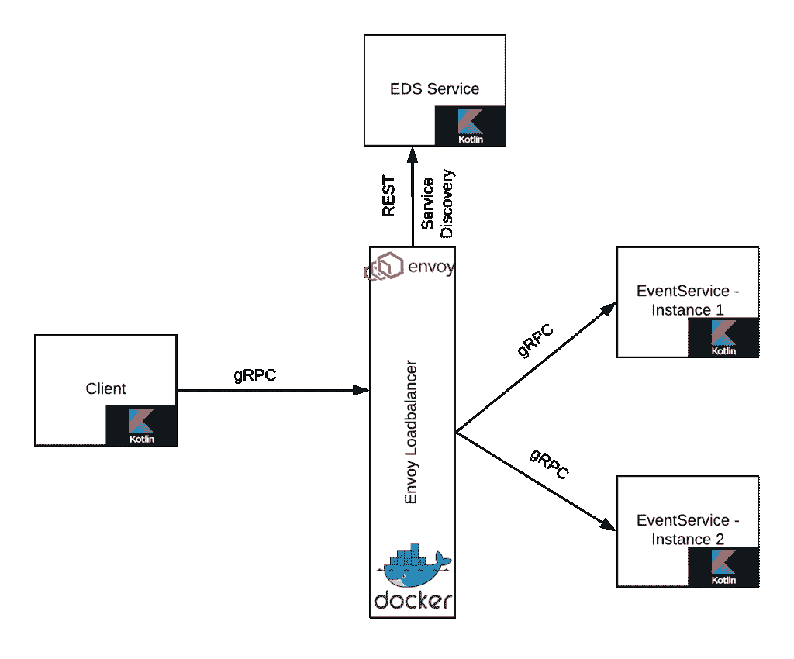

# 使用基于 Kotlin 的 gRPC API 和 Envoy 代理实现服务器端负载平衡

> 原文：<https://developers.redhat.com/blog/2018/12/24/using-a-kotlin-based-grpc-api-with-envoy-proxy-for-server-side-load-balancing>

如今，基于[微服务](https://developers.redhat.com/blog/category/microservices/)的架构几乎到处都在实施。一个业务功能可能是使用一些微服务，这些微服务以消息传递的形式产生大量网络流量。如果我们可以通过减小消息大小来提高消息传递的效率，我们就可以用相同的基础设施来处理更高的负载。

Protobuf (“协议缓冲区”的缩写)提供了语言和平台中立的机制，用于序列化通信协议、数据存储等中使用的结构化数据。 [gRPC](https://grpc.io/faq/) 是一个现代的、开源的远程过程调用(RPC)框架，可以在任何地方运行。它们共同提供了一种高效的消息格式，这种格式可以被自动压缩，并为复杂的数据结构提供一流的支持，还有其他的好处(不像 JSON)如。

微服务环境需要服务之间的大量通信，为了实现这一点，服务需要在一些事情上达成一致。他们需要就交换数据的 API 达成一致，例如，POST(或 PUT)和 GET 发送和接收消息。他们需要在数据格式(JSON)上达成一致。调用服务的客户端也需要编写大量样板代码来进行远程调用(框架！).Protobuf 和 gRPC 提供了一种定义消息模式(JSON 不能)和生成框架代码来消费 gRPC 服务(不需要框架)的方法。

虽然 JSON 是一种人类可读的格式，提供了嵌套的数据结构，但是它也有一些缺点，例如，没有模式，对象可能会变得很大，并且可能缺少注释。

本文展示了 gRPC 和 Protobuf 如何为这些限制提供解决方案。

## 那么 gRPC 和 Protobuf 是什么呢？

gRPC 是一个现代的、开源的远程过程调用(RPC)框架，可以在任何地方运行。它使客户机和服务器应用程序能够透明地通信，并使构建连接的系统变得更加容易。gRPC 正在 [CNCF](https://www.cncf.io) 孵化。

作为一个有趣的项目，在 HTTP 上用 JSON 构建一个流服务器。那你就知道我在说什么了。[流媒体](https://grpc.io/docs/guides/concepts.html#server-streaming-rpc)内置 gRPC。更多 gRPC 概念见[本](https://grpc.io/docs/guides/concepts.html)。不知何故，gRPC 让我想起了 [CORBA。](http://www.corba.org)

Protobuf 是一个数据序列化工具。Protobuf 提供了为消息定义完全类型化模式的能力。它允许您在消息本身中插入文档。

与基于 REST over HTTP 1.1 的服务相比，gRPC 使用带有[持久连接](https://http2.github.io/faq/#why-just-one-tcp-connection)和[多路复用](https://http2.github.io/faq/#why-is-http2-multiplexed)的 [HTTP/2](https://http2.github.io) 来获得更好的性能。然而，持久连接给第 4 级代理带来了问题。我们需要一个支持 7 级负载平衡的代理。 [Envoy](https://www.envoyproxy.io/docs/envoy/v1.7.0/intro/what_is_envoy) 可以通过服务器上的负载平衡支持来代理 gRPC 调用。Envoy 还提供基于名为 [EDS](https://www.envoyproxy.io/docs/envoy/latest/api-v2/api/v2/eds.proto.html?highlight=clusterloadassignment) 的外部服务的服务发现，我也将展示如何使用 Envoy 的这一特性。

## 我们将建造什么

在本文中，我正在构建一个基于 [Kotlin-](https://kotlinlang.org/) 的 gRPC 服务。我将使用 Enovy 代理在我的服务的多个实例之间进行负载平衡。我还配置了一个简单的 REST 服务，为 Envoy 代理提供服务发现。基本架构如下。

[](https://developers.redhat.com/blog/wp-content/uploads/2018/12/gRPC-Blog-2.png)

## 设置组件

首先，我们需要定义一个 [Protobuf 消息](https://developers.google.com/protocol-buffers/docs/overview)，它将作为客户端和服务器之间的契约(完整的文件请参考 [event.proto](https://github.com/masoodfaisal/grpc-example/blob/master/src/main/proto/events/events.proto) ):

```
syntax  = "proto3";
import "google/protobuf/empty.proto";
package event;

option java_package = "com.proto.event";
option java_multiple_files = true;

message Event {
    int32 event_id = 1;
    string event_name = 2;
    repeated string event_hosts = 3;
}

enum EVENT_TYPE {
    UNDECLARED = 0;
    BIRTHDAY = 1;
    MARRIAGE = 2;
}

message CreateEventResponse{
    string success = 1;
}

message AllEventsResponse{
    Event event = 1;
}

service EventsService{
    rpc CreateEvent(Event) returns (CreateEventResponse) {};
    rpc AllEvents(google.protobuf.Empty) returns (stream AllEventsResponse) {};
}

```

这个消息将被 [Gradle gRPC](https://grpc.io/blog/kotlin-gradle-projects) 插件用来生成存根。客户机和服务器代码将使用这些存根。您可以运行 Gradle 的`generateProto`任务来生成存根。

现在是时候编写[服务器](https://github.com/masoodfaisal/grpc-example/blob/master/src/main/java/com/faisal/grpc/server/EventServer.kt)了:

```
val eventServer = ServerBuilder.forPort(50051)
.addService(EventsServiceImpl()) //refer to the server implementation
.build()
eventServer.start()
println("Event Server is Running now!")

Runtime.getRuntime().addShutdownHook( Thread{
eventServer.shutdown()
} )

eventServer.awaitTermination()

```

一旦服务器的样板代码完成，我们就编写服务器的[业务逻辑](https://github.com/masoodfaisal/grpc-example/blob/master/src/main/java/com/faisal/grpc/server/EventsServiceImpl.kt)，它打印硬编码的消息并返回固定的响应。

```
    override fun createEvent(request: Event?, responseObserver: StreamObserver<CreateEventResponse>?) {
        println("Event Created ")
        responseObserver?.onNext(CreateEventResponse.newBuilder().setSuccess("true").build())
        responseObserver?.onCompleted()
    }

```

接下来，让我们编写一个[客户端](https://github.com/masoodfaisal/grpc-example/blob/master/src/main/java/com/faisal/grpc/client/EventClient.kt)来使用我们的事件服务:

```
fun main(args: Array<String>) {
    var eventsChannel = ManagedChannelBuilder.forAddress("10.0.0.112", 8080)
            .usePlaintext()
            .build()

    var eventServiceStub = EventsServiceGrpc.newBlockingStub(eventsChannel)

    for(i in 1..20) {
        eventServiceStub.createEvent(Event.newBuilder().setEventId(i).setEventName("Event $i").build())
    }

    eventsChannel.shutdown()
}
```

我将服务器代码复制到另一个[文件](https://github.com/masoodfaisal/grpc-example/blob/master/src/main/java/com/faisal/grpc/server/EventServer2.kt)中，并更改端口号以模拟我们的事件服务的多个实例。

特使代理配置有三个部分。这些设置都在 [envoy.yaml](https://github.com/masoodfaisal/grpc-example/blob/master/envoy-docker/envoy.yaml) 里。确保根据您的设置更改 EDS 服务的 IP 地址。更新 [EDSServer.kt](https://github.com/masoodfaisal/grpc-example/blob/master/src/main/java/com/faisal/eds/EDSServer.kt) 文件中服务的 IP 地址。

定义前端服务。该服务将接收来自客户端的请求。

```
     listeners:
        - name: envoy_listener
          address:
            socket_address: { address: 0.0.0.0, port_value: 8080 }
          filter_chains:
            - filters:
                - name: envoy.http_connection_manager
                  config:
                    stat_prefix: ingress_http
                    codec_type: AUTO
                    route_config:
                      name: local_route
                      virtual_hosts:
                        - name: local_service
                          domains: ["*"]
                          routes:
                            - match: { prefix: "/" }
                              route: { cluster: grpc_service }
                    http_filters:
                      - name: envoy.router

```

定义一个后端服务(名称为`envoy.yaml`文件中的`grpc_service`)。前端服务将对这组服务器的调用进行负载平衡。注意，这并不知道实际后端服务的位置。后端服务(也称为服务发现)的位置是通过 EDS 服务提供的。请参见下面代码后面的段落，该段落讨论了 EDS 端点的定义。

```
        - name: grpc_service
          connect_timeout: 5s
          lb_policy: ROUND_ROBIN
          http2_protocol_options: {}
          type: EDS
          eds_cluster_config:
            eds_config:
              api_config_source:
                api_type: REST
                cluster_names: [eds_cluster]
                refresh_delay: 5s

```

或者，定义一个 EDS 端点。(您也可以提供固定的服务器列表。)这是另一个将提供后端端点列表的服务。这样，Envoy 可以根据可用的服务器进行动态调整。我已经将这个 EDS 服务编写为一个简单的类。

```
    - name: eds_cluster
          connect_timeout: 5s
          type: STATIC
          hosts: [{ socket_address: { address: 10.0.0.112, port_value: 7070 }}]

```

## 执行

将[项目](https://github.com/masoodfaisal/grpc-example)复制到本地:

```
git clone https://github.com/masoodfaisal/grpc-example.git

```

使用 Gradle 构建项目:

```
cd grpc-example
./gradlew generateProto
./gradlew build

```

启动 EDS 服务器，为 Envoy 代理提供服务发现:

```
cd grpc-example
./gradlew -PmainClass=com.faisal.eds.EDSServerKt execute

```

初始化服务的多个实例:

```
cd grpc-example
./gradlew -PmainClass=com.faisal.grpc.server.EventServerKt execute
./gradlew -PmainClass=com.faisal.grpc.server.EventServer2Kt execute

```

运行 Enovy 代理:

```
cd envoy-docker
docker build -t envoy:grpclb .
docker run -p 9090:9090 -p 8080:8080 envoy:grpclb 

```

我的客户在一个循环中进行调用，这表明负载是以循环方式分布的。

```
./gradlew -PmainClass=com.faisal.grpc.client.EventClientKt execute

```

## 结论

gRPC 为您的微服务提供了更好的性能、更少的要管理的样板代码和强类型模式。gRPC 在微服务领域有用的其他特性有[重试](https://github.com/grpc/proposal/blob/master/A6-client-retries.md)、[超时](https://grpc.io/docs/guides/concepts.html#deadlinestimeouts)和[错误处理](https://grpc.io/docs/guides/error.html)。CNCF 网站[上有一篇关于 gRPC 的特别棒的文章](https://www.cncf.io/blog/2018/08/31/grpc-on-http-2-engineering-a-robust-high-performance-protocol/)。

祝你下次在 gRPC 服役。

*Last updated: December 23, 2018*