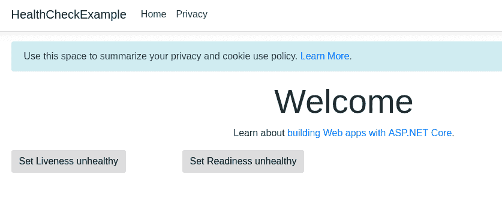
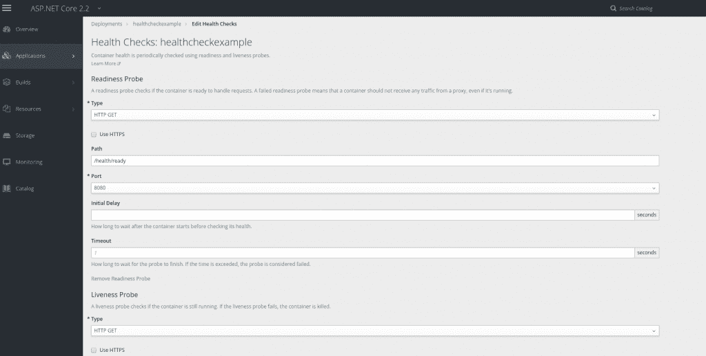
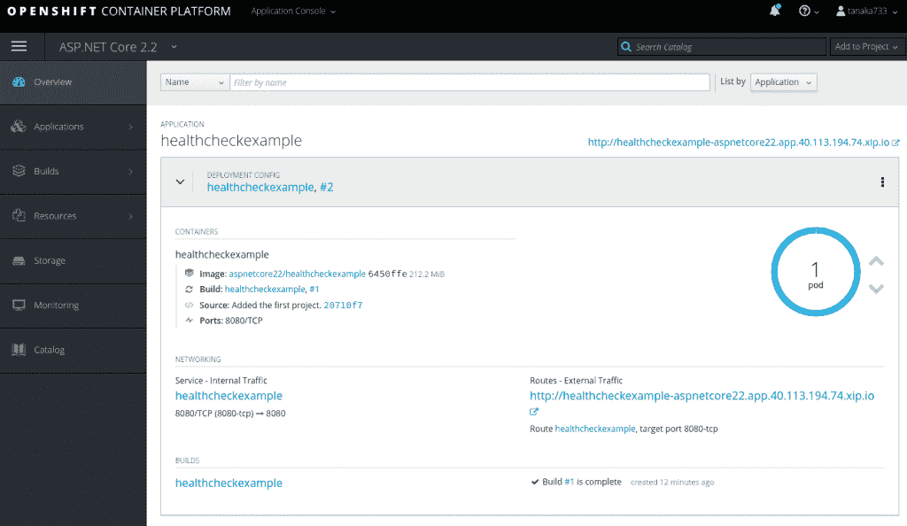
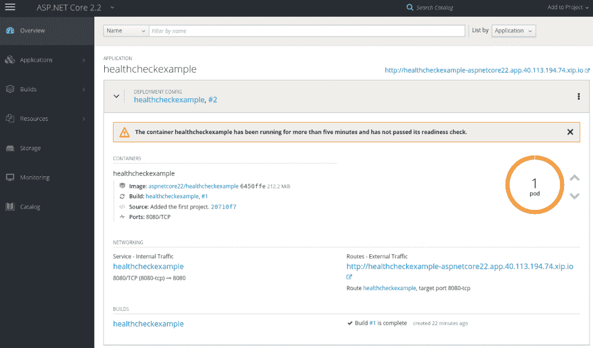
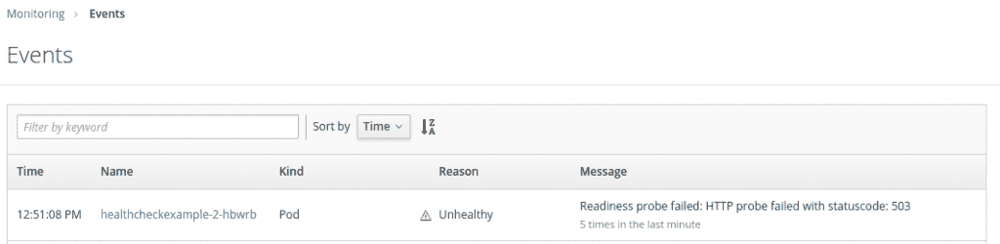
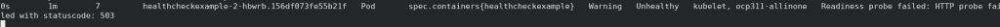
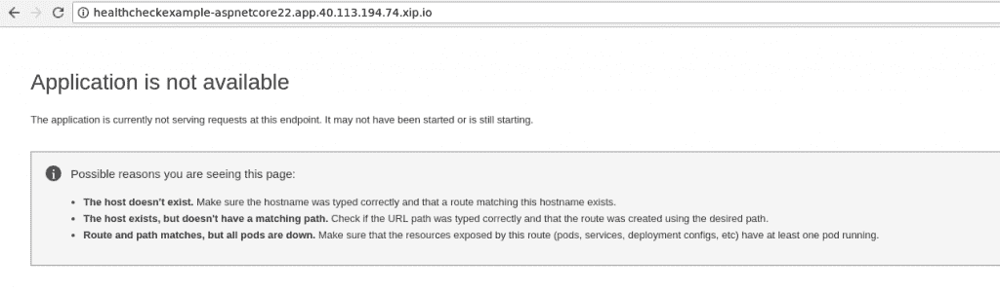
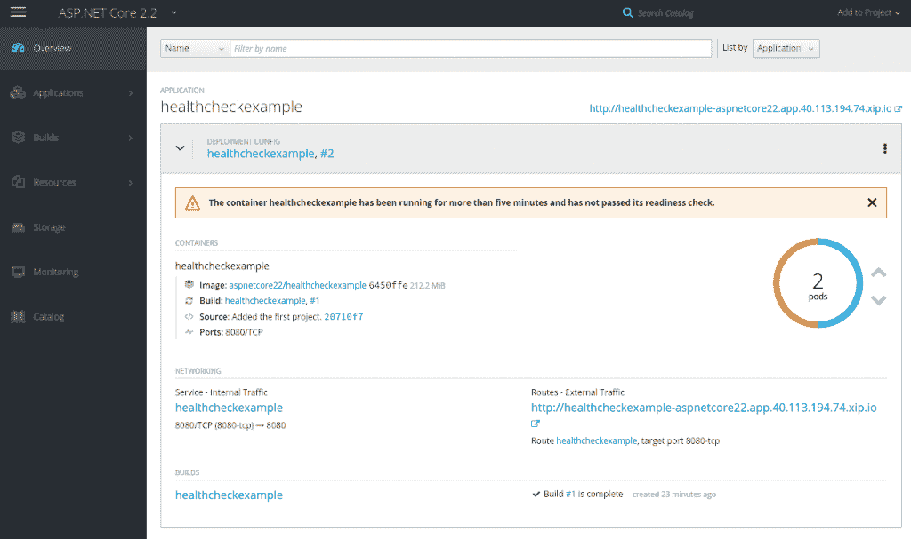
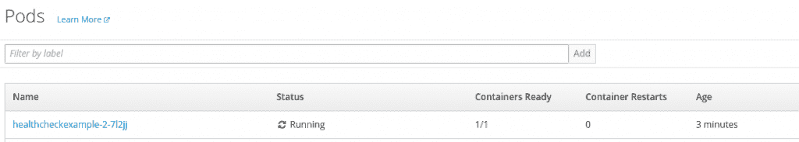
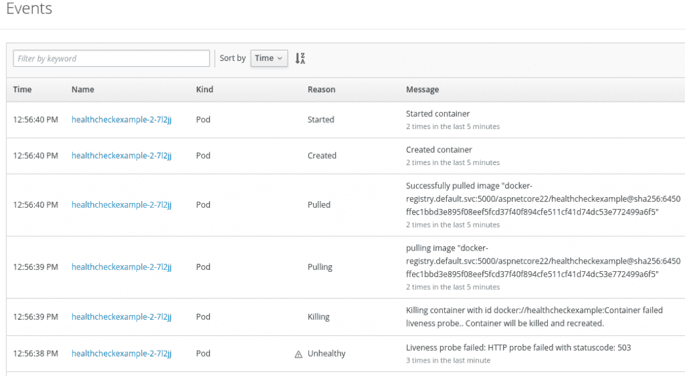

# 在 OpenShift 上使用 Kubernetes 就绪性和活性探针对 ASP.NET Core 2.2 进行健康检查

> 原文：<https://developers.redhat.com/blog/2018/12/21/asp_dotnet_core_kubernetes_health_check_openshift>

[。网芯 2.2 已经发布](https://blogs.msdn.microsoft.com/webdev/2018/12/04/asp-net-core-2-2-available-today/)。你可以[在红帽企业 Linux (RHEL)和 OpenShift](https://developers.redhat.com/blog/2018/12/05/announcing-net-core-2-2-for-red-hat-platforms/) 上试试。ASP.NET 核心的新特性之一是[健康检查 API](https://docs.microsoft.com/en-us/aspnet/core/host-and-deploy/health-checks?view=aspnetcore-2.2) 。

在这篇为 [C#降临节日历 2018](https://crosscuttingconcerns.com/The-Second-Annual-C-Advent) 撰写的文章中，我展示了一个 API 如何与 [OpenShift](http://openshift.com/) 一起工作的示例，方法是为 [Kubernetes 活跃度和准备就绪探测器](https://kubernetes.io/docs/tasks/configure-pod-container/configure-liveness-readiness-probes/)实现两次健康检查。因为 OpenShift 包含了 [Kubernetes](https://developers.redhat.com/blog/category/kubernetes/) ，所以这个例子也适用于 Kubernetes。

## 示例代码

这个新的健康检查 API 与 Kubernetes 活性和就绪性探针配合得非常好。这些探头在 OpenShift 中也有[。](https://docs.openshift.com/container-platform/3.11/dev_guide/application_health.html)

这里的是我解释健康检查 API 的示例应用程序。

下面是配置两个健康检查的示例:一个用于活性探测，一个用于准备就绪探测。

```
public void ConfigureServices(IServiceCollection services)
{
...

    services.AddHealthChecks()
            .AddCheck("Liveness", failureStatus: null)
            .AddCheck("Readiness", failureStatus: null);
}

public void Configure(IApplicationBuilder app, IHostingEnvironment env)
{
...
    app.UseHealthChecks("/health/live", new HealthCheckOptions()
    {
        Predicate = check => check.Name == "Liveness"
    });

    app.UseHealthChecks("/health/ready", new HealthCheckOptions()
    {
        Predicate = check => check.Name == "Readiness",

    });
...
}

```

在`ConfigureServices`方法中，您可以启用健康检查并添加任意数量的检查。`LivenessHealthCheck`和`ReadinessHealthCheck`是在这个项目中定义如何检查应用程序健康状况的类。稍后我会向您展示这些类。

在`Configure`方法中，您可以定义哪个健康检查负责指定的路径。在我的例子中，对`/health/live`执行名为`Liveness`的健康检查，对`/health/ready`执行名为`Readiness`的健康检查。

下面是`LivenessHealthCheck`类的一个示例实现。您可以在`CheckHealthAsync`方法中返回应用程序的健康状态。当在`HealthStatusData.IsLiveness`中定义的应用程序状态为假时，我的例子返回`Unhealth`。这个状态可以通过`POST`方法更新。

[](https://developers.redhat.com/blog/wp-content/uploads/2018/12/Selection_659.png)

更多详情，请参考[代码](https://github.com/tanaka-takayoshi/HealthCheckExample/blob/master/HealthCheckExample/Pages/Index.cshtml.cs)。

```
internal class LivenessHealthCheck : IHealthCheck
{
    private HealthStatusData data;

    public LivenessHealthCheck(HealthStatusData data)
    {
        this.data = data;
    }

    public Task CheckHealthAsync(HealthCheckContext context, CancellationToken cancellationToken = default(CancellationToken))
    {
        if (data.IsLiveness)
        {
            return Task.FromResult(HealthCheckResult.Healthy());
        }
        else
        {
            return Task.FromResult(HealthCheckResult.Unhealthy("Error"));
        }
    }
}

```

## 使用 OpenShift

我的示例代码可以在本地机器上运行。不过可以用 Kubernetes 或者 OpenShift 试试。如果你想用 OpenShift 试试，请按照[这个文档](https://access.redhat.com/documentation/en-us/net_core/2.2/html-single/getting_started_guide/#gs_dotnet_on_openshift)导入 ASP.NET Core 2.2s 2i 镜像。导入。NET Core 2.2 s2i 映像，您可以将我的应用程序部署到您的集群，如下所示:

```
$ oc new-project aspnetcore22
$ oc new-app --name=healthcheckexample 'dotnet:2.2~https://github.com/tanaka-takayoshi/HealthCheckExample.git' --build-env DOTNET_STARTUP_PROJECT=HealthCheckExample
$ oc expose svc/healthcheckexample

```

创建部署配置后，您可以在 OpenShift web 控制台中启用健康检查。

[](https://developers.redhat.com/blog/wp-content/uploads/2018/12/Selection_660.png)

如果编辑`deploymentconfig` YAML 文件，探测器应该如下。

```
spec:
...
  template:
  ...
    spec:
      containers:
        - image: >-
            ...
          livenessProbe:
            failureThreshold: 3
            httpGet:
              path: /health/live
              port: 8080
              scheme: HTTP
            periodSeconds: 10
            successThreshold: 1
            timeoutSeconds: 1
          readinessProbe:
            failureThreshold: 3
            httpGet:
              path: /health/ready
              port: 8080
              scheme: HTTP
            periodSeconds: 10
            successThreshold: 1
            timeoutSeconds: 1
          ...

```

现在，这是 web 控制台中的应用程序状态。

[](https://developers.redhat.com/blog/wp-content/uploads/2018/12/Selection_662.png)

首先，让我们使准备就绪探测器不健康。此后不久，您可以在 web 控制台的监视页面中看到就绪检查失败了。

[](https://developers.redhat.com/blog/wp-content/uploads/2018/12/Selection_669.png)
[](https://developers.redhat.com/blog/wp-content/uploads/2018/12/Selection_666.png)

您可以使用`oc get event -w`命令看到同样的情况。

[](https://developers.redhat.com/blog/wp-content/uploads/2018/12/Selection_667.png)

当就绪检查失败时，pod 仍在运行，但它会停止路由流量。由于该应用程序只有一个窗格，因此您无法访问该应用程序。

[](https://developers.redhat.com/blog/wp-content/uploads/2018/12/Selection_668.png)

您可以通过单击窗格编号旁边的向上箭头来轻松扩展此应用程序。

[](https://developers.redhat.com/blog/wp-content/uploads/2018/12/Selection_670.png)

现在，因为两个 pod 中的一个是健康的，所以您可以访问该应用程序。

[](https://developers.redhat.com/blog/wp-content/uploads/2018/12/Selection_671.png)

接下来，将应用程序缩小到一个单元，并使活跃度探测器不健康。

[](https://developers.redhat.com/blog/wp-content/uploads/2018/12/Selection_672.png)


当活性探测失败时，pod 被终止并创建一个新的。你可以看到事件的顺序。

[](https://developers.redhat.com/blog/wp-content/uploads/2018/12/Selection_674.png)


## 摘要

在本文中，我描述了 ASP.NET 核心 2.2 中的健康检查 API 如何与 OpenShift (Kubernetes)探测器一起工作。您可以在实现`IHealthCheck`接口的类中定义适当的逻辑。当 pod 准备好服务请求时，可以使用就绪探测。当 pod 正在运行时，可以使用活性探针。

## 其他资源

*   [宣布。面向红帽平台的 NET Core 2.2](https://developers.redhat.com/blog/2018/12/05/announcing-net-core-2-2-for-red-hat-platforms/)
*   [使用 OpenShift 进行部署。网络核心应用](https://developers.redhat.com/blog/2018/07/05/deploy-dotnet-core-apps-openshift/)
*   [建筑。使用 S2I 的. NET 核心容器映像](https://developers.redhat.com/blog/2018/12/13/building-net-core-container-images-using-s2i/)
*   [其他。红帽开发者博客上的 Net 核心文章](https://developers.redhat.com/blog/?s=dotnet)

*Last updated: September 3, 2019*