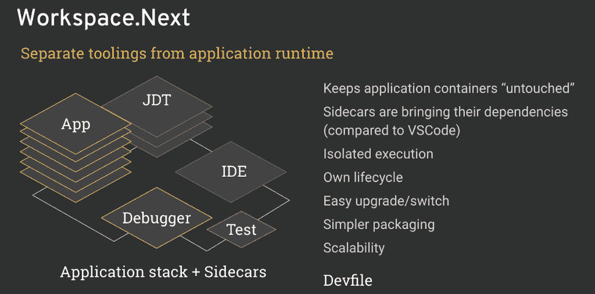

# 月食 Che 7 要来了真的很热(3/4)

> 原文：<https://developers.redhat.com/blog/2018/12/20/eclipse-che-7-is-coming-and-its-really-hot-3-4>

有了新的工作区模型和完整的应用程序运行时“开发模式”——Eclipse Che 第一个 kube-native IDE！

在本系列的第 1 部分中，我强调了 Eclipse Che 7 的主要关注领域 [*。第二部覆盖了*](https://developers.redhat.com/blog/2018/12/18/eclipse-che-7-coming-part-1/) *[*新的外挂模式*](https://developers.redhat.com/blog/2018/12/19/eclipse-che-7-is-coming-and-its-really-hot-2-4/) 。本文解释了为 Che 工作区引入的不同变化，以便通过 sidecaring 开发人员工具在应用程序运行时之上提供完整的“开发模式”功能。*

### 库比斯坦本地 IDE

Eclipse Che 的这个新版本使它成为第一个本地 IDE。

使用 Eclipse Che 的开发人员直接在他们的开发人员工作区中使用容器。Che 工作区在生产中使用的容器之上提供了一个“开发模式”层，增加了智能感知和 ide 工具。

工作空间的工作。Next 允许 Che 使用裸应用程序定义(Docker 映像、Composefile 或 Kubernetes 资源列表),而不需要修补它们来注入 IDE 服务。带工作空间。接下来，IDE 工具是[微服务](https://developers.redhat.com/topics/microservices/)封装在它们自己的 sidecar 容器中，带来它们自己的依赖性，并且保持应用程序的容器不变。IDE 工具的执行相互隔离，也与应用程序的容器隔离。每个 IDE 工具现在都有自己的生命周期，能够轻松升级或切换，并且很快会有自己的可伸缩性机制。

要了解更多信息，请参阅文章: *[【车工作空间的新超能力】](https://che.eclipse.org/the-new-superpowers-of-che-workspaces-243967a2010)。*

### 现在就试试 Eclipse Che 7 吧！

想试试新版 Eclipse Che 7？方法如下:

**点击**以下工厂网址:

[https://che.openshift.io/f?id=factoryvbwekkducozn3jsn](https://che.openshift.io/f?id=factoryvbwekkducozn3jsn)

**或者在 [che.openshift.io](https://che.openshift.io/) 、**上创建自己的账户**创建一个新的工作区**选择“Che 7”栈。

你也可以在你的本地机器上测试，通过安装最新版本的 Eclipse Che，参见*[Eclipse Che](http://www.eclipse.org/che/docs/#getting-started)*快速入门。

### 想了解更多？

我关于 Eclipse Che 7 的文章:

*   第 1 部分— [Eclipse Che 7 概述，并介绍新的 IDE](https://che.eclipse.org/eclipse-che-7-is-coming-and-its-really-hot-1-4-64d79b75ca02)
*   第 2 部分— [介绍插件模型](https://che.eclipse.org/eclipse-che-7-is-coming-and-its-really-hot-2-4-2e2c6accbff4)
*   第 3 部分—[Kube—本地开发人员工作区](https://developers.redhat.com/blog/2018/12/20/eclipse-che-7-is-coming-and-its-really-hot-3-4/)(本文)
*   第 4 部分— [企业开发团队的功能和发布时间](https://developers.redhat.com/blog/2018/12/21/eclipse-che-7-is-coming-and-its-really-hot-4-4/)

介绍 Eclipse Che 7 的第三篇文章到此为止。第 4 部分将介绍新的**企业特性和发布时间表**。

## 请参见

有关在 Red Hat OpenShift 上运行的 Che 的信息，请参见 OpenShift 的[CodeReady WorkSpaces](https://developers.redhat.com/products/codeready-workspaces/overview)(目前处于测试阶段)和道格·蒂德威尔的文章和视频，[*open shift 的 CodeReady work spaces(测试版)——它在他们的机器上也能工作*](https://developers.redhat.com/blog/2018/12/11/codeready-workspaces-openshift/) 。Doug 介绍了堆栈、工作区和工厂，以帮助您开始使用 Che。

*Last updated: September 3, 2019*