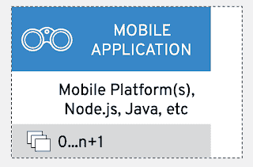
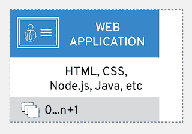

# 外部应用程序细节的集成(第 3 部分)

> 原文：<https://developers.redhat.com/blog/2018/12/14/integration-of-external-application-details-part-3>

在本系列的[第 2 部分中，我们对决定您的集成如何成为转变客户体验的关键的常见架构元素进行了高度概括。](https://developers.redhat.com/blog/2018/11/30/common-architectural-elements-for-modern-integration-architectures/)

我展示了我如何处理用例，以及我如何使用成功的客户组合解决方案作为研究通用架构蓝图的基础。剩下要介绍的唯一一件事就是引导您浏览蓝图细节的顺序。

本文将带您深入了解与通用架构概述的特定元素(*移动和 web 应用程序部署)*相关的细节。

## 建筑细节

如前所述，本系列中涉及的架构细节基于使用开源技术的真实客户集成解决方案。这里呈现的元素是我已经确定并收集到通用架构蓝图中的*通用架构元素*。我的意图是提供一个蓝图，提供指导，而不是深入的技术细节。

本节涵盖了所呈现的视觉表示，但是预计它们会随着时间的推移而在视觉上发生变化。在这个建筑蓝图中，有许多方法来表示每个元素，但是我选择了图标、文本和颜色，我希望它们能让你更容易理解。请随意在本文底部发表评论，或者直接联系我提供您的反馈。

现在让我们来看看这个架构中的细节，并概述一下我在研究中发现的元素。

## 移动应用

外部应用程序部署分为移动应用程序和 web 应用程序。两者都是通用的宽泛术语，用于描述在被调查的客户中发现的应用程序部署类型。

*移动应用*是不特定于网络的任何东西，例如手机、平板电脑或某种没有明确定义的便携式设备的应用。它是客户用来与公司直接互动的工具。这可以是由公司自己部署的移动应用程序，也可以是由第三方组织开发的与所提供的服务进行交互的移动应用程序。

这些应用程序可以使用许多不同的语言和库来创建，它们可以面向不同的平台。研究表明，通过使用移动应用程序平台(如[Red Hat Mobile Application Platform](https://developers.redhat.com/products/mobileplatform/overview/))进行集成比 DIY 移动开发更受青睐，为管理和维护移动应用程序开发、集成和部署提供了一个平台。

这些应用程序将客户与公司的解决方案联系起来，可以包含语音、视频和/或聊天功能。为了安全起见，他们通过 API 网关使用单点登录来访问组织。交互通过以下微服务进行:

*   前端微服务(提供对内部集成微服务的访问)
*   流程门面微服务(提供对自动化集成流程的访问)
*   其他应用(提供对聚合微服务或其他内部应用的访问)

当外部应用程序没有部署在移动设备上时，我们就会关注 *web 应用程序。*

## 网络应用

*web 应用*类别适用于所有其他类型的应用，例如，由公司或任何第三方组织部署的网站和/或服务，用于与所提供的服务进行交互。

虽然在传统意义上，web 应用程序可以是托管在公司外部的任何东西，但我们已经遇到了一个内部(对于所研究的组织)服务台应用程序，它包含一个集成了电子邮件和文本选项的交互式语音响应(IVR)系统。出于集成目的，该解决方案将该服务台应用程序视为外部 web 应用程序，并构建了必要的[微服务](https://developers.redhat.com/blog/category/microservices/)来与其 API 层交互。

这些应用程序将客户与公司的解决方案联系起来，或者向公司的信息架构提供外部第三方信息，以丰富客户的体验。为了安全起见，他们通过 API 网关使用单点登录来访问组织。交互通过以下微服务进行:

*   前端微服务(提供对内部集成微服务的访问)
*   流程门面微服务(提供对自动化集成流程的访问)
*   其他应用(提供对聚合微服务或其他内部应用的访问)

这些细节并不能说明一切，但是它们应该给你在你自己的架构环境中开始工作所需要的指导。

## 下一步是什么

本概述涵盖了外部应用程序部署元素，这些元素构成了我们的 ominchannel 客户体验用例的架构蓝图。

全渠道客户体验组合架构蓝图系列概述可在此处找到:

*   [第 1 部分:整合如何成为客户体验的关键](https://developers.redhat.com/blog/2018/11/28/integration-is-key-to-customer-experience/)
*   [第 2 部分:现代集成架构的通用架构元素](https://developers.redhat.com/blog/2018/11/30/common-architectural-elements-for-modern-integration-architectures/)
*   [第三部分:外部应用细节的集成](https://developers.redhat.com/blog/2018/12/14/integration-of-external-application-details-part-3/)(本文)
*   [第四部分:API 管理细节的整合](https://developers.redhat.com/blog/2018/12/20/integration-of-api-management-details-part-4/)
*   [第五部分:集装箱平台要素集成](https://developers.redhat.com/blog/2019/01/04/integration-of-container-platform-essentials-part-5/)
*   [第 6 部分:存储服务集成](https://developers.redhat.com/blog/2019/01/18/integration-of-storage-services-part-6/https://developers.redhat.com/blog/2019/01/18/integration-of-storage-services-part-6/)
*   第 7 部分:应用程序集成细节
*   第 8 部分:剖析几种特定的应用程序集成架构

通过上面的链接之一来补上你错过的任何文章。

在本系列的下一篇文章中，我们将了解全渠道客户体验的应用管理细节。

*Last updated: September 3, 2019*