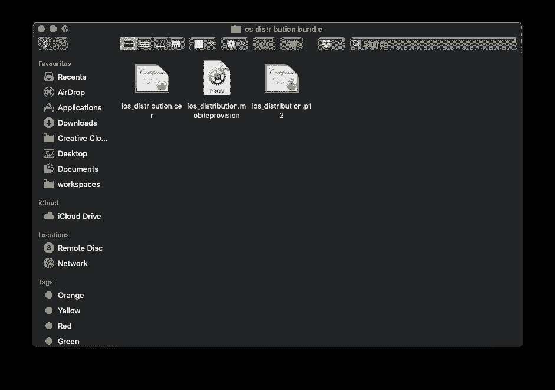
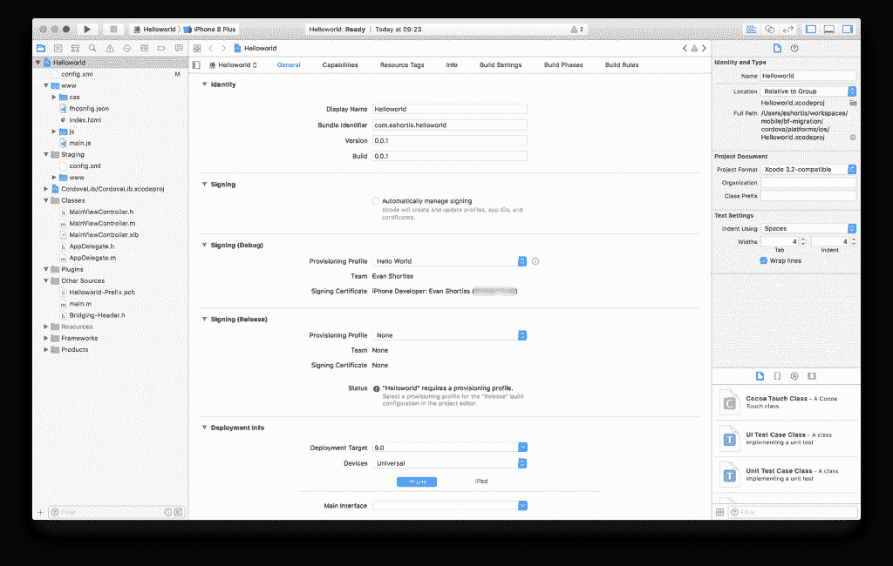
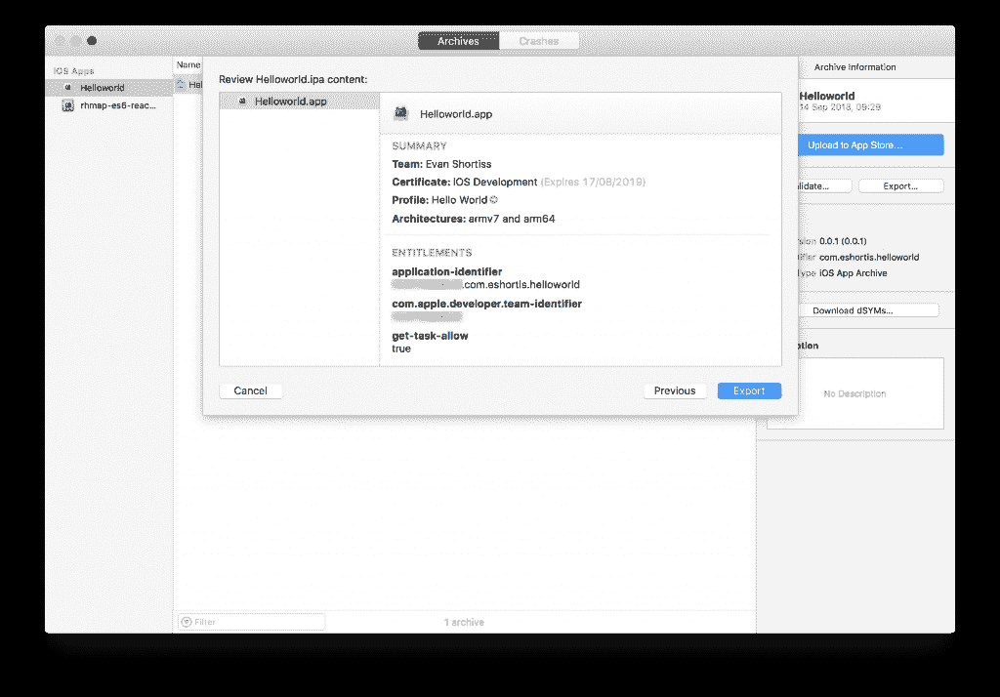
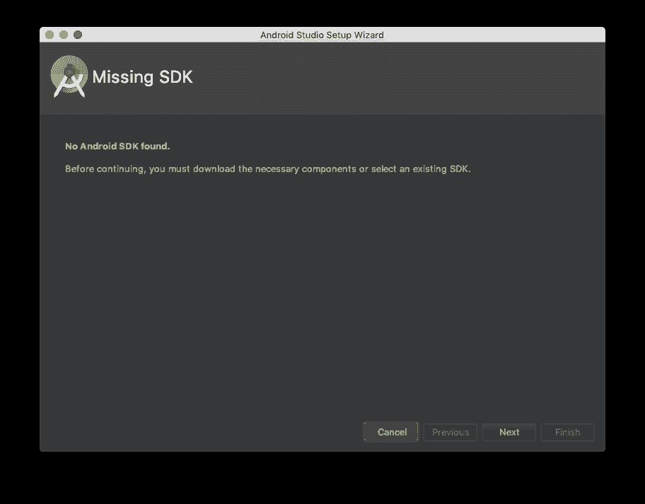
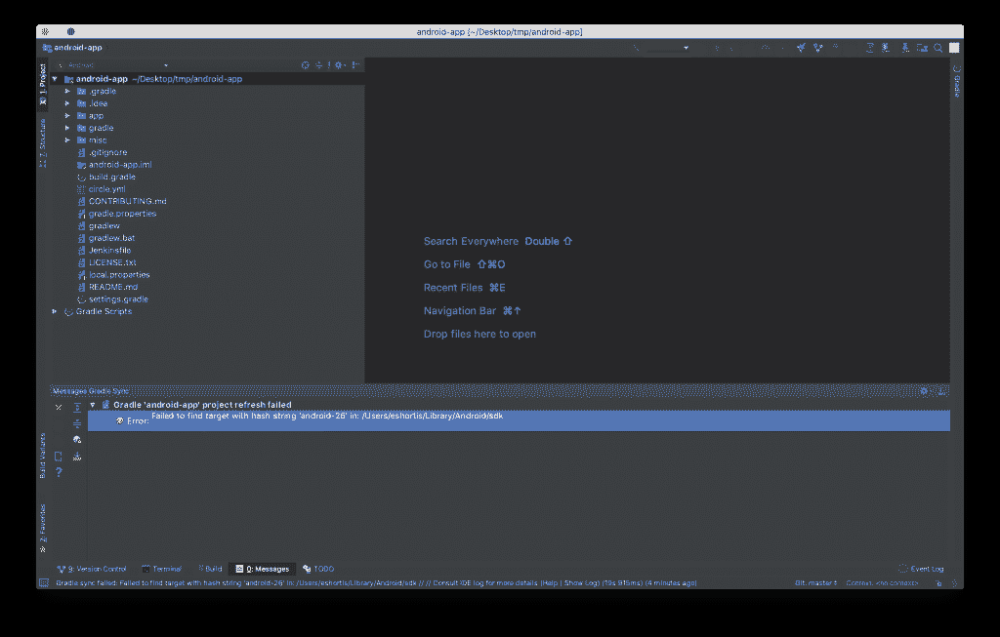
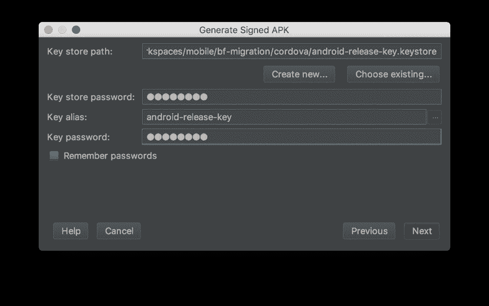
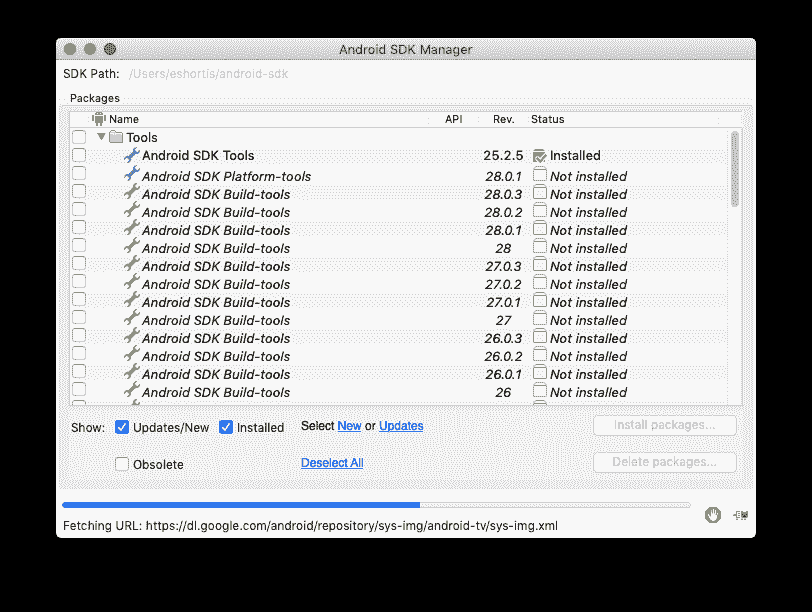
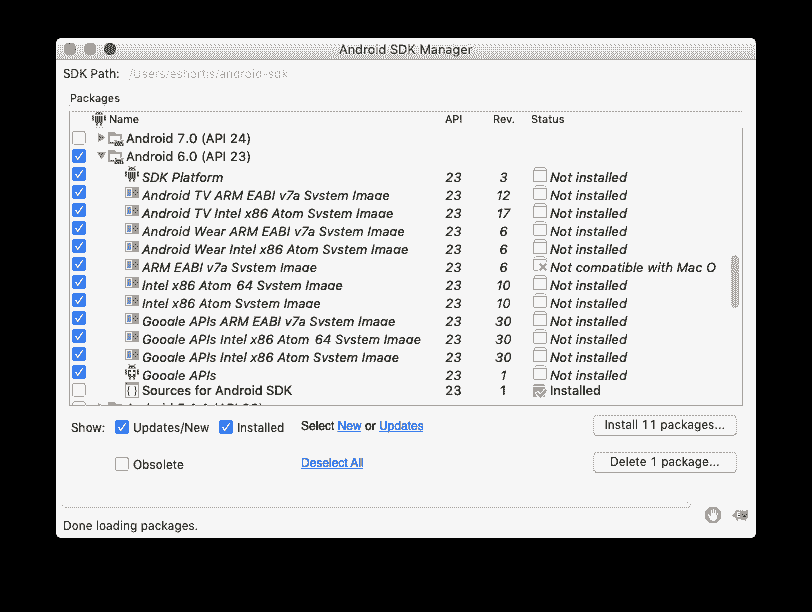
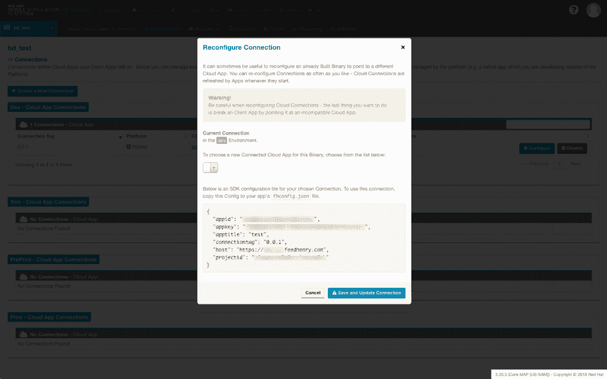

# 在您自己的硬件上构建 Red Hat 移动应用程序

> 原文：<https://developers.redhat.com/blog/2018/12/13/building-red-hat-mobile-applications-on-your-own-hardware>

本*指南与最近弃用的[红帽移动应用平台](https://developers.redhat.com/products/mobileplatform/overview/) Build Farm 有关。在本指南中，我们将引导您完成在您自己的机器上构建最初使用构建场构建的应用程序所需的步骤。关于弃用构建农场的更多信息，请参见[我们的产品发布说明](https://access.redhat.com/documentation/en-us/red_hat_mobile_application_platform/4.7/html/4.7_patch_release_notes/)。*

## Red Hat Mobile 支持的配置文档

在开始之前，了解构建场用来构建移动应用程序的工具、框架和 SDK 的版本非常重要。该信息可在 Red Hat 移动应用平台[支持的配置页面](https://access.redhat.com/node/2357761)上找到。本指南将在每个章节中列出具体的版本，并注明您需要在何处确认您的具体项目和/或要求的版本。

本指南包含六个主要部分:

1.  [先决条件](#pre)
2.  [构建原生 iOS 应用](#native-ios)
3.  [构建原生 Android 应用](#native-and)
4.  [为 iOS 构建 Apache Cordova 应用](#apache-ios)
5.  [为 Android 构建 Apache Cordova 应用](#apache-and)
6.  [更新应用程序连接标签](#update)

## 先决条件

### 系统需求

*   Windows 10、macOS 10.11.5 和/或最新的 Linux 操作系统，例如 Ubuntu 14.04 或更新版本。
*   iOS 应用程序将需要一台 macOS 机器来构建；所需的最低操作系统版本取决于您的目标 iOS 版本，因为 Xcode 版本通常需要 macOS 更新。
*   一般原则是至少需要 4GB 内存，建议所有平台都使用 8GB 内存。

### 软件版本

创建本指南时使用了以下版本的软件。更新的版本可能会起作用；然而，超出本文范围的小调整可能是必要的。

*   Android Studio 3.1
*   Xcode 8
*   Cordova CLI v6.3.1
*   Node.js v8.x
*   npm(它将与 Node.js 一起安装)
*   FHC(红帽移动命令行工具)7.2.0
*   Git 2.18
*   Ruby 2.4.2

我们建议使用[节点版本管理器](https://github.com/creationix/nvm)来安装和管理 Node.js 版本。安装 Node.js 后，您可以使用以下命令安装推荐的 Cordova(如果您正在构建 Cordova 应用程序，这是必需的)和 FHC 版本。通过更改以下命令中`@`符号后的`semver`标签，您可以自行决定安装这些工具的不同版本:

```
$ npm install -g cordova@6.3.1
$ npm install -g fh-fhc@7.2.0

```

***注意:**根据您的 Node.js 安装方法，如果在安装过程中报告 EACCESS 错误，您可能需要在这些命令前面加上一个`sudo`前缀。使用`sudo`时务必小心。通过[节点版本管理器](https://github.com/creationix/nvm)安装 Node.js 或者遵循本 [npm 指南](https://docs.npmjs.com/resolving-eacces-permissions-errors-when-installing-packages-globally)也提供了避免使用`sudo`的变通方法。*

一旦安装了这些，就可以在终端中执行`fhc`和`cordova`命令。最后，使用`fhc target`和`fhc login`命令配置 FHC。参考 [FHC 文档](https://access.redhat.com/documentation/en-us/red_hat_mobile_application_platform/4.7/html-single/local_development_guide/index)了解更多关于该流程的信息。

### 通过 Git 访问源代码

对存储在 Red Hat Mobile Application Platform 中的源代码的访问由 Git 管理。请参考[我们的本地开发文档](https://access.redhat.com/documentation/en-us/red_hat_mobile_application_platform_hosted/3/html/local_development_guide/ssh-key-setup)以确保您已经正确配置了 Git 安装和 SSH 密钥，然后再继续。

在您配置了 Git SSH 访问之后，您可以将您的应用程序源代码从 Red Hat Mobile 应用程序平台克隆到您的机器上。这可以通过使用显示在 Red Hat 移动应用程序平台中应用程序的*详细信息*屏幕上的 Git 克隆 URL 来实现，如下所示:

```
$ git clone $GIT_CLONE_URL
```

或者，您可以使用 FHC 在本地克隆您的整个项目；这仍然需要满足 Git 和本地开发的先决条件。运行以下命令将克隆项目的所有客户端和云代码存储库:

```
$ fhc projects clone --project=$PROJECT_ID
```

### 证书和签名凭证

如图所示，您可以从 Red Hat Mobile Application Platform Studio 的*凭证*屏幕获取您的 iOS 和 Android 平台签名凭证的副本。

[](https://developers.redhat.com/blog/wp-content/uploads/2018/11/rhmap-credential-screen.jpg)

或者，您可以使用以下命令通过 FHC 下载凭据:

```
# List and find your credential bundle ID
$ fhc credential list

# Download the bundle using the retrieved ID
$ fhc credential download --id=$CREDENTIAL_ID --output=$OUTPUT_FILE_PATH
```

#### Android 凭据

当你将你的密钥库上传到 Red Hat 移动应用平台时，你必须使用我们文档中的命令将它分成证书和密钥 PEM 文件。如果您仍然有原始的密钥库文件，那么您可以跳过这一步，使用该密钥库对您的应用程序进行签名；否则，您需要按照这些步骤从下载的凭证中重新创建您的密钥库。

```
# Generate a cert.p12 file from the cert and key pem files you downloaded
$ openssl pkcs12 -export -out cert.p12 \
-in rhmap-cert.pem -inkey rhmap-key.pem \
-passin pass:$OLD_PASSWORD -passout pass:$NEW_PASSWORD

# Create a new keystore.jks file from the cert.p12
$ keytool -importkeystore -srckeystore cert.p12 \
-srcstoretype pkcs12 \
-destkeystore keystore.jks \
-deststoretype jks

```

这个新的密钥库文件中的每组凭证都有一个别名来标识它。要查找您的凭据的别名，请执行以下命令:

```
$ keytool -list -keystore keystore.jks -v
```

要更改别名，可以使用以下命令:

```
$ keytool -changealias -keystore keystore.jks \
-alias $OLD_ALIAS -destalias $NEW_ALIAS
```

现在您应该有一个 keystore 文件，其中包含您的签名凭证和一个已知的别名，您可以用它来对 Android 应用程序的生产版本进行签名。

#### iOS 凭据

如果您已经将 iOS 凭据添加到 Mac，则可以跳过这一步；否则，您需要下载签名凭证并将它们添加到您的钥匙串和 Xcode。为此，请确保您从红帽移动应用平台或[developer.apple.com](https://developer.apple.com)下载的文件具有以下扩展名:

*   预配配置文件:`mobileprovision`
*   证书:`cer`
*   关键:`p12`

使用正确的扩展名，文件将出现在下面的屏幕截图中的图标中:

[](https://developers.redhat.com/blog/wp-content/uploads/2018/11/ios-credentials.png)

一旦文件具有正确的扩展名，您就可以连按它们，macOS 将采取适当的操作，将密钥和证书添加到您的钥匙串，并将预置描述文件添加到 Xcode。

***注意:**你需要执行这个动作两次，因为苹果要求你使用凭证来创建你的 iOS* *应用的调试和发布版本。*

## 构建原生 iOS 应用

此时，您应该已经满足了以下先决条件:

1.  签名密钥和证书已下载并安装在 macOS 钥匙串中
2.  预置描述文件已下载并添加到 Xcode
3.  使用 Git 或 FHC 在本地克隆应用程序源代码

现在您需要使用 CocoaPods 安装 iOS 项目依赖项。如果您没有安装 CocoaPods，您可以执行以下命令来安装和配置它:

```
$ gem install cocoapods
$ pod setup

```

***注意:**`gem`命令可能需要您使用`sudo`前缀，这取决于您的 Mac 和 Ruby 安装是如何配置的。*

一旦这些命令完成，您需要从应用程序源代码目录的根目录运行以下命令:

```
$ pod install
```

这将安装您的应用程序所需的各种 SDK 组件，一旦完成，它将指导您在使用您的 iOS 应用程序时使用新创建的`project-name.xcworkspace`。现在就打开那个文件吧。

### 创建一个开发(调试)版本

从左侧窗格中选择您的项目，这在 Xcode 中称为*导航器*。这将允许您从中间栏查看*常规*选项卡。展开*签名*部分，取消勾选*自动管理签名*。接下来，展开*签名(调试)*部分，并使用下拉菜单选择一个有效的*配置文件*。对*签名(发布)*部分进行同样的操作。另外，验证*包标识符*是否与您创建或下载的预置描述文件相匹配。最后，配置目标 SDK 版本和设备类型。下面是一个例子。

[](https://developers.redhat.com/blog/wp-content/uploads/2018/11/rhmap-xcode.png)

完成这些设置的配置后，您需要从左上角的设备选择器中选择*通用 iOS 设备*类型。接下来，选择*产品>存档*来触发构建。构建成功完成后，您将看到一个显示您的构建的窗口。从列表中选择最新的版本，然后点击右边的*导出*。当提示选择分发方式时，选择*开发*。在下一个屏幕上，如有必要，选择 *App Thinning* options，如果您希望在自己的服务器上托管二进制文件以供下载，则选择 manifest generation 复选框。最后，选择一个配置文件，检查最终的 IPA 内容，然后单击*导出*。

 *[](https://developers.redhat.com/blog/wp-content/uploads/2018/11/rhmap-xcode-export.png)

IPA 文件将被导出到所选的文件夹中，并且可以使用您选择的方法进行分发。

### 创建生产(发布)版本

为 iOS 创建生产版本的步骤与开发相同:只需在 *Archives* 屏幕上选择适当的打包方法——即 AdHoc、Enterprise 或 app store——并准备好必要的生产签名凭证。

## 构建原生 Android 应用

此时，您应该已经满足了以下先决条件:

1.  从 PEM 文件重新生成密钥库(如有必要)
2.  使用 Git 或 FHC 在本地克隆应用程序源代码

启动 Android Studio，从初始提示或*文件*菜单打开你的项目。如果这是你第一次启动 Android Studio，你可能会看到一个类似于下图的对话框提示你安装一个 SDK。如果出现这种情况，请按照提示进行操作，这样您就可以在下载完成后打开您的项目。

[](https://developers.redhat.com/blog/wp-content/uploads/2018/11/rhmap-android-sdk-install.png)

当您的项目打开时，您应该检查 Android Studio UI 底部的信息窗格，并解决它报告的任何 SDK 或 Gradle 问题。在下面的截图中，您可以看到正在使用的示例应用程序需要 Android 平台 SDK 版本 26，它会提示您单击链接来安装它。如果发生这种情况，在安装 Platform SDK 之后，通常会提示您安装相同版本的构建工具。

[](https://developers.redhat.com/blog/wp-content/uploads/2018/11/rhmap-android-sdk-prompt.png)

### 创建调试版本

要使用 Android Studio 创建调试版本，只需从菜单中选择 *Build > Build APK(s)* 。Android Studio 将提供一个 UI 弹出窗口，其中有一个链接可以定位生成的 APK，或者您通常可以在源代码目录的`app/build/outputs/apk`中找到它。

### 创建生产版本

创建生产构建使用*构建>生成签名的 APK* 选项。出现提示时，从选项列表中选择要签名的应用程序，尽管默认情况下应该选择它。接下来，使用*选择现有的*按钮选择您的生产密钥库。输入密钥密码、别名和密钥库密码，然后选择下一步的*。*

[](https://developers.redhat.com/blog/wp-content/uploads/2018/11/Screen-Shot-2018-09-14-at-13.26.05.png)

最后，选择输出文件夹或接受默认文件夹。确保*构建类型*设置为发布，然后根据您的目标设备版本选择一个或两个*签名版本*选项；你可以在 source.android.com 的[上阅读更多关于签名的信息。点击*完成*，您签名的 APK 将出现在 *APK 目标文件夹*中，以便安装到设备上。](https://source.android.com/security/apksigning/v2.html#verification)

## 为 iOS 构建 Apache Cordova 应用程序

本指南使用特定版本的 Cordova 工具和库来引导您在本地构建 Cordova 应用程序。如果您的项目依赖于不同的版本，您将需要安装这些版本，并根据这些版本和您的项目的要求配置您的环境。关于红帽移动应用平台使用的`cordova`、`cordova-android`、`cordova-ios`版本的更多信息，请参考我们的[支持的配置文件](https://access.redhat.com/node/2357761)。

在继续下一步之前，请确保您满足以下先决条件:

1.  已安装的 Node.js 和 npm
2.  已安装 Cordova CLI v6.3.1
3.  已安装的 Xcode
4.  使用 Git 或 FHC 在本地克隆应用程序源代码

首先，从源代码文件夹的根目录运行以下命令，将 iOS 平台添加到您的项目中:

```
$ npm install
$ cordova platform add ios@$VERSION
```

这将使用指定的`*cordova-ios* $VERSION`初始化项目根目录下的`platforms/ios`文件夹中的 iOS 项目。根据 Red Hat 移动应用平台支持的配置，`$VERSION`可以是 3.5.1 到 4.2.0 之间的值。最近的版本可能有效，但不被构建场支持。本指南是使用 4.2.0 版设计的。

***注** **:** 这些* *`cordova-ios`* *版本范围假设使用 Xcode 8。如果您使用的是 Xcode 9，您可能需要按照本指南[中的](https://stackoverflow.com/a/43935071)进行修补，以便与此处使用的* *`cordova-ios`* *版本范围配合使用。*

### 创建开发(调试)iOS 版本

#### 使用 Xcode

创建开发 Cordova iOS 版本的过程与创建本地应用程序的过程相同。有关使用 Xcode 创建开发版本的说明，请参考本指南“构建原生 iOS 应用程序”一节中的[“创建开发(调试)版本”](#create-dev-ios)。

#### 使用 Cordova CLI

要使用 Cordova CLI 创建签名调试版本，需要带有多个参数的`cordova build`命令。这些论点是:

*   苹果开发者团队 ID(通过访问[developer.apple.com/account/#/membership](https://developer.apple.com/account/#/membership)获得)
*   代码符号身份(如果您使用 Xcode 8 或更高版本，应该是“iPhone 开发者”)
*   包类型(设置为“开发”)
*   预配配置文件 ID(下面将详细介绍)

要获取预置描述文件 ID，您可以在文本编辑器中打开预置描述文件，并找到以下行:

```
<key>UUID</key>
<string>THE-ID-WILL-BE-HERE</string>
```

一旦获得了所需的信息，就可以使用以下命令构建应用程序:

```
$ cordova build ios --device \
--developmentTeam=$THE_TEAM_ID \
--codeSignIdentity="iPhone Developer" \
--packageType="development" \
--provisioningProfile=$THE_PROFILE_ID

```

***注意:**如果您收到与设置构建团队相关的错误的构建失败，可以通过在 Xcode 中打开项目并设置签名信息，然后使用 CLI 重试来解决。*

一旦该命令执行完构建，它将打印包含可以安装在设备上的 IPA 文件的文件夹的路径。

### 创建生产(发布)iOS 版本

为 iOS 创建生产版本的步骤与开发相同；只需选择适当的打包方法，即临时、企业或 AppStore，并准备好必要的签名凭证。

## 为 Android 构建 Apache Cordova 应用

本指南使用特定版本的 Cordova 工具和库来引导您在本地构建 Cordova 应用程序。如果您的项目依赖于不同的版本，您将需要安装这些版本，并根据这些版本和您的项目的要求配置您的环境。关于红帽移动应用平台使用的`cordova`、`cordova-android`、`cordova-ios`版本的更多信息，请参考我们的[支持的配置文件](https://access.redhat.com/node/2357761)。

在继续下一步之前，请确保您满足以下先决条件:

1.  已安装的 Node.js 和 npm
2.  已安装 Cordova CLI v6.3.1
3.  使用 Git 或 FHC 在本地克隆应用程序源代码
4.  JDK 8 已经安装并设置了`JAVA_HOME`环境变量

### 安装 Android 开发工具

构建在 Red Hat 移动应用程序平台上开发的基于 Cordova 的 Android 应用程序所需的设置不同于最新的 Apache Cordova 和 Android Studio 安装指南。请按照以下步骤配置您的环境，使其与基于 Red Hat 移动应用程序平台的 Apache Cordova Android 应用程序兼容。

首先，在您的机器上创建必要的目录来存放 Android SDK 和工具。

以下是在 macOS 或 Linux 上创建所需文件夹结构的命令示例:

```
$ mkdir -p ~/.android-sdk/tools
```

或者在 Windows 上:

```
C:\Users\<username>\AppData\Local\android-sdk\tools
```

使用以下链接之一为您选择的平台下载 Android 工具包。解压缩这些文件，并将其放入之前创建的`tools`子目录中；它们必须放在`tools`子目录下才能工作。

*   [窗户](http://dl-ssl.google.com/android/repository/tools_r25.2.5-windows.zip)
*   [苹果电脑](http://dl-ssl.google.com/android/repository/tools_r25.2.5-macosx.zip)
*   [Linux](http://dl-ssl.google.com/android/repository/tools_r25.2.5-linux.zip)

设置`ANDROID_HOME`环境变量并将其指向您的安装；例如，在 Linux/macOS 上，将它添加到您的`bash_profile`或类似的配置文件中:

```
export ANDROID_HOME=~/.android-sdk
```

您还应该用 Android 工具的位置更新您的`PATH`环境变量:

```
export PATH=${PATH}:$ANDROID_HOME/tools:$ANDROID_HOME/platform-tools
```

通过在应用了这些环境变量的新终端会话中执行`android`命令来验证安装。如果您的环境配置正确，您将看到下面显示的窗口。如果没有，请验证您是否正确遵循了这些步骤，然后重试。

[](https://developers.redhat.com/blog/wp-content/uploads/2018/11/Screenshot-2018-11-28-at-16.54.25.png)

### 配置项目并安装 Android SDK

要确定需要安装哪个 SDK 版本，请从项目的根目录运行以下命令:

```
$ npm install 
$ cordova platform add android@$VERSION
$ cordova requirements android
```

这将使用指定的`cordova-android $VERSION`初始化项目根目录下的`platforms/android`文件夹中的 Android 项目。根据 Red Hat 移动应用平台支持的配置，`$VERSION`可以是 3.5.1 到 5.2.0 之间的值。最近的版本可能有效，但不被构建场支持。本指南是使用 5.2.0 版设计的。

最后一个命令验证您的环境以及您是否安装了适当的 Android 目标 SDK。下面是 requirements 命令的输出示例；如果到目前为止您的环境配置正确，您应该会看到类似的输出:

```
Requirements check results for android:
Java JDK: installed 1.8.0
Android SDK: installed 
Android target: not installed 
Please install Android target: "android-23".

Hint: Open the SDK manager by running: /Users/eshortis/android-sdk/tools/android

You will require:
  1\. "SDK Platform" for android-23
  2\. "Android SDK Platform-tools (latest)
  3\. "Android SDK Build-tools" (latest)
Gradle: installed
```

这告诉你具体的 Android SDK 目标和项目所需的工具。要安装缺少的工具和 SDK，请运行`android`命令来启动 *SDK 管理器*，并为缺少的工具选择相应的复选框，例如，在上面的输出中的平台工具、构建工具和 API 级别 23，如下图所示。您还应该在 *SDK 管理器*的列表底部选择 *Extras > Android 支持库*。

[](https://developers.redhat.com/blog/wp-content/uploads/2018/11/Screenshot-2018-11-28-at-17.07.17.png) 一旦下载并安装了各种工具和 SDK，您可以通过再次运行`cordova requirements`命令来验证您的应用需求是否得到满足。您的输出应该类似于以下内容:

```
$ cordova requirements android

Requirements check results for android:
Java JDK: installed 1.8.0 
Android SDK: installed 
Android target: installed android-23,Google Inc.:Google APIs:23 
Gradle: installed
```

### 创建一个调试 Android 版本

在使用`cordova requirements`确认您的环境被正确配置之后，您可以使用以下命令生成一个调试版本:

```
$ cordova build android
```

APK 的文件可以在`platforms/android/app/build/outputs/apk`的文件夹中找到。对于调试版本，会生成一个名为`android-debug.apk`的文件。您可以通过发出`adb install`命令并将创建的 APK 的路径作为参数传递给它，将应用程序安装在通过 USB 连接的仿真器或 Android 设备上。

### 创建一个发布 Android 版本

创建生产版本需要您为应用程序生成的原始密钥库。有关获取密钥库的更多信息，请参考本指南的[“证书和签名凭证”](#certs)部分。有了密钥库，您可以发出以下命令来创建生产版本:

```
cordova build android --release \
--keystore=$KEYSTORE_PATH \
--password=$KEYSTORE_PASS \
--storePassword=$KEYSTORE_STORE_PASS \
--alias=$KEYSTORE_ALIAS
```

生成的 APK 文件将被放在与调试 APK 相同的文件夹中，但将被命名为`android-release.apk`。

## 更新应用程序连接标签

以前，构建场要么为每个构建自动生成一个新的连接标记，要么允许您指定一个要使用的标记。然后，构建场会将这个新的连接标签信息注入到应用程序的`fhconfig`文件中。连接标签用于将客户端/移动应用的特定构建与给定环境中的给定云应用实例相关联。你可以在我们的文档中阅读更多关于连接标签的内容。每个平台的特定格式的文档可通过以下链接获得:

*   [科尔多瓦](https://access.redhat.com/documentation/en-us/red_hat_mobile_application_platform/4.7/html-single/client_sdk/index#cordova-setup)
*   [iOS (Swift)](https://access.redhat.com/documentation/en-us/red_hat_mobile_application_platform/4.7/html-single/client_sdk/index#native-ios-swift-setup)
*   [iOS(目标-C)](https://access.redhat.com/documentation/en-us/red_hat_mobile_application_platform/4.7/html-single/client_sdk/index#native-ios-objective-c-setup)
*   [安卓](https://access.redhat.com/documentation/en-us/red_hat_mobile_application_platform/4.7/html-single/client_sdk/index#rhmap_server_connection_setup)

在本地构建时，如果认为有必要，需要用新的连接标记手动更新源代码中的`fhconfig`文件。您可以在 Studio 中从项目的*连接*部分创建一个新的连接标签。或者，下面的 FHC 命令可以用来生成一个新的标签。您可以在 Studio 中找到必要的变量，或者使用 FHC 命令，如`fhc projects list`、`fhc admin environments list`和`fhc projects apps read`。

```
$ fhc connections create --client=$CLIENT_APP_ID \
--cloud=$CLOUD_APP_ID --type=$APP_TYPE \
--env=$ENV --project=$PROJECT_ID
```

一旦创建了新的标签，您就可以通过点击所需标签的 C *配置*按钮，从项目的*连接*屏幕获得`fhconfig`文件，如图所示。

[](https://developers.redhat.com/blog/wp-content/uploads/2018/11/rhmpa-config.png)*