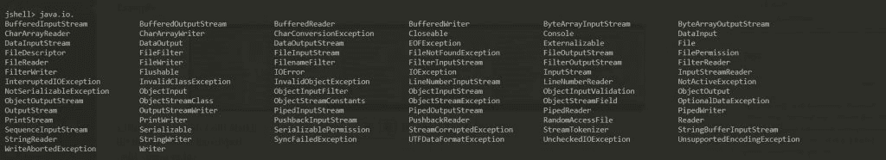
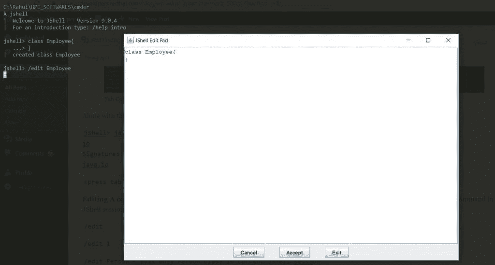

# 开发人员需要了解的关于 JShell 的 10 件事

> 原文：<https://developers.redhat.com/blog/2019/04/05/10-things-developers-need-to-know-about-jshell>

JShell 是作为 Kulla 项目下的 Java 增强建议(JEP) 222 的一部分在 JDK 9 中引入的。很多编程语言，比如 JavaScript，Python，Ruby 等。，为它们的执行提供了易于使用的命令行工具，但是 Java 仍然缺少这样的工具。所以，JDK 9 引入了 Java shell (JShell)工具。

我讨论了 JShell 的基础知识(这是一个读取-评估-打印-循环；REPL)在之前的一篇[文章中。](https://developers.redhat.com/blog/2017/10/03/use-jshell-command-line-tool-introduced-jdk-9/)在本文中，我将介绍 JShell 中的一些高级概念，用户应该了解这些概念以便快速开发。

### 1.变量的重新声明

在 Java 中，不可能重新声明一个变量。然而，在 JShell 的帮助下，您总是可以根据需要重新声明变量。注意，这既适用于原语变量，也适用于引用类型变量。事实上，用户可以任意多次地重新声明任何构造。

示例:

```
jshell> String str="Hello"
str ==> "JShell"
```

```
jshell> Integer str=10
str ==> 10
```

### 2.临时变量

任何来自 JShell 命令行的表达式求值如果没有被用户显式赋值，都会被赋值给一些变量。这种变量称为临时变量。示例:

```
jshell> "Hello"+"JShell"
$1 ==> "HelloJShell"
```

注意，为了知道变量的类型或关于表达式求值的更多细节，我们可以将反馈模式设置为 verbose，如下所示:

```
/set feedback verbose
```

```
jshell> 60+10
$2 ==> 70
|  created scratch variable $21 : int
```

要退出详细模式，请将反馈模式设置为正常:

```
/set feedback normal
```

### 3.JShell 中的正向引用

JShell 中的前向引用允许您提前调用构造，即使它们并不存在。例如，假设有一个名为`greet()`的方法，如下所示。注意，`greet()`内部调用了另一个名为`greetHelloWorld()`的方法，这个方法还没有声明。`greet()`创建成功，但需要声明`greetHelloWorld()`后才能调用。这在 JShell 中被称为前向引用。

示例:

```
jshell> public void greet(){
...> greetHelloWorld();}
|  created method greet(), however, it cannot be invoked until method greetHelloWorld() is declared               jshell> greet()
|  attempted to call method greet() which cannot be invoked until method greetHelloWorld() is declared
```

```
jshell> public void greetHelloWorld(){
...> System.out.println("Hello World");}
|  created method greetHelloWorld()
```

```
jshell> greet()
Hello World
```

### 4.JShell 中的异常处理

示例:

```
jshell> int divide(int a,int b) throws IOException{
...> if(b==0){
...> throw new IOException();
...> }
...> return a/b;
...> }
|  created method divide(int,int)
```

```
jshell> divide(1,0)
|  java.io.IOException thrown:
|        at divide (#2:3)
|        at (#3:1)
```

注意，我们没有捕捉到任何由 divide 方法抛出的异常；JShell 会处理这个问题。还要注意，我们没有导入 IOException 类，但是代码可以很好地编译和执行。原因是，对于任何 JShell 会话，默认情况下都会导入一些包。要检查任何 JShell 会话中默认导入的所有包:

```
jshell> /imports
|    import java.io.*
|    import java.math.*
|    import java.net.*
|    import java.nio.file.*
|    import java.util.*
|    import java.util.concurrent.*
|    import java.util.function.*
|    import java.util.prefs.*
|    import java.util.regex.*
|    import java.util.stream.*
|    import java.io.IOException
```

### 5.JShell 会话中指令的持久性行为

默认情况下，JShell 会话中的所有指令都不是持久的。它们本质上是短暂的，当用户退出 JShell 会话时就会丢失。

然而，JShell 为用户提供了一种在特定的 JShell 会话中保存所有信息并在不同的 JShell 会话中访问这些信息的方法。如果用户希望保存 JShell 会话中有用的代码片段，并在不同的 JShell 会话中访问它们，这将非常方便。

示例:

```
jshell> String s="Hello"
s ==> "Hello"

jshell> int i=100;
i ==> 100
```

```
jshell> /save C:\data\mySession.jsh
```

```
jshell> /exit
|  Goodbye

λ jshell
|  Welcome to JShell -- Version 9.0.4
|  For an introduction type: /help intro
```

```
jshell> /vars
```

```
jshell> /open C:\Data\mySession.jsh
```

```
jshell> /vars
|    String s = "Hello"
|    int i = 100
```

### 6.使用外部库

有很多有用的第三方开源库。通常，开发人员将这些库保存在项目的类路径中并使用它。但是，对于 JShell 来说，使用第三方库非常容易。

例如，假设我们想使用一个来自名为 Apache Commons Lang 的第三方库中的字符串实用程序类。下面是将库保存在类路径中的语法:

```
shell> /env --class-path <Relative Path of lib from where JShell is run>
```

```
jshell> /env --class-path ../lib/commons-lang3-3.8.1.jar
|  Setting new options and restoring state.
```

```
 import org.apache.commons.lang3.StringUtils;
```

```
jshell> System.out.println(StringUtils.isEmpty(""))
true
```

```
jshell> System.out.println(StringUtils.isEmpty("hello"))
false
```

### 7.使用特定于 JShell 的命令和工具进行快速开发

JShell 自带特定的便利命令，可用于在 JShell 控制台上进行更快的测试。以下是一些有用的命令:

```
 /history - Prints all commands executed on JShell (Java Commands+ JShell specific commands)
```

示例:

```
jshell> String s ="Hello"
s ==> "Hello"

jshell> class Employee{
...> }
|  created class Employee

jshell> /vars
|    String s = "Hello"

jshell> /history
String s ="Hello"
class Employee{
}
/vars
/history
```

```
 /list    - Prints all JAVA related commands executed in JShell. Notice that this list the command in Numerical              order of each command identifier. This identifier can be used to execute certain construct again.
```

示例:

```
jshell> /list
1 : String s ="Hello";
2 : class Employee{
}
```

```
jshell> /1
String s ="Hello";
s ==> "Hello"
```

```
/reset   - Resets the state of current JShell session.
```

```
CTRL+R   - For searching a particular command
```

```
CTRL+S   - Performing Forward Search
```

```
CTRL+C   - To exit from JShell session
```

```
/exit    - To exit from JShell session
```

```
/vars     - To list all variables inside current JShell session
```

```
/imports  - To list all imports inside current JShell session
```

```
/help    - To know more about JShell specific commands
```

### 8.JShell 中的制表符补全

JShell 允许开发人员使用 Tab 键自动完成他们的代码构造。

示例:



除此之外，用户还可以使用 JShell 查看相关包的文档:

```
jshell> java.io
io
Signatures:
java.io
```

```
<press tab again to see documentation>
```

### 9.在 JShell 中编辑构造

在开发过程中，想要在 JShell 会话中编辑之前执行的命令是很常见的。JShell 为此提供了非常方便的命令和编辑器。

示例:

```
/edit        - Edit all constructs in current JShell session
```

```
/edit 1      - Edit only 1st construct (see from /list) in current JShell session
```

```
/edit Person - Edit only Person class in current JShell session
```



### 10.以编程方式使用 JShell

JDK 为程序员提供了一个 API，让他们通过编程而不是使用 REPL 来访问 JShell。有关更多详细信息，请参考相应的 Java 文档。

在本文中，我只展示了 JShell 中的一些高级概念，这还不是结束。我还建议读者阅读 JShell 文档以获取更多信息。

*Last updated: June 8, 2021*