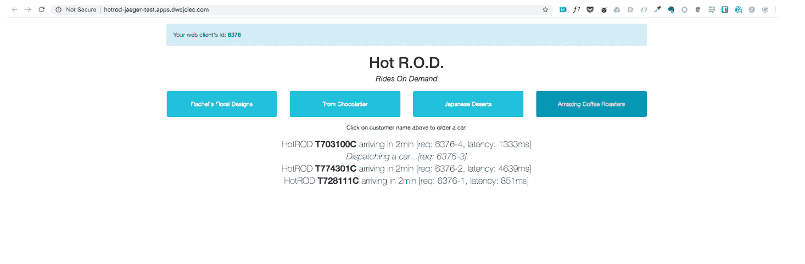
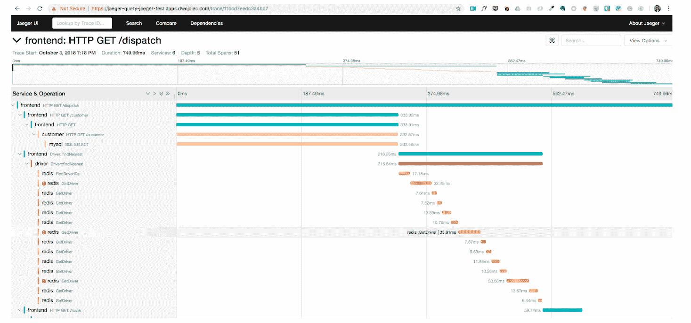
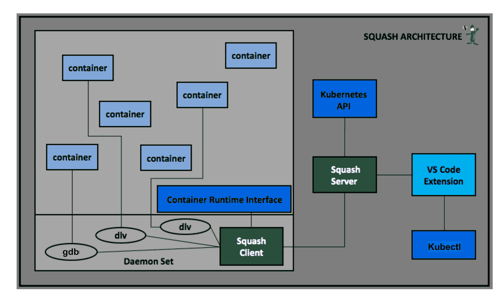
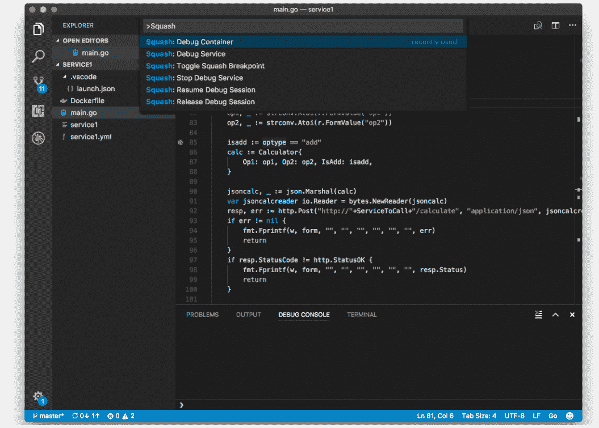
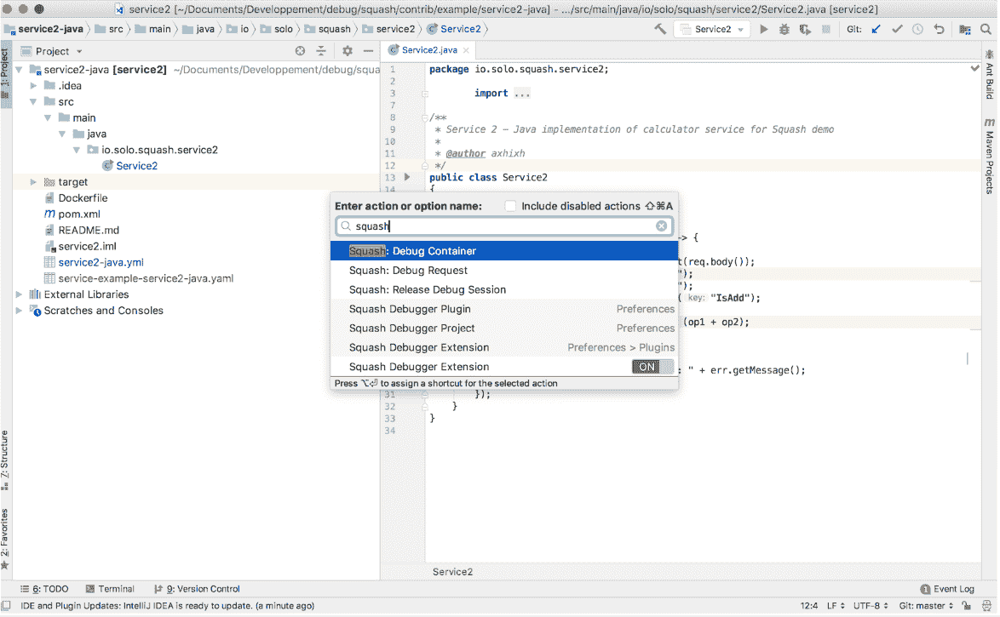
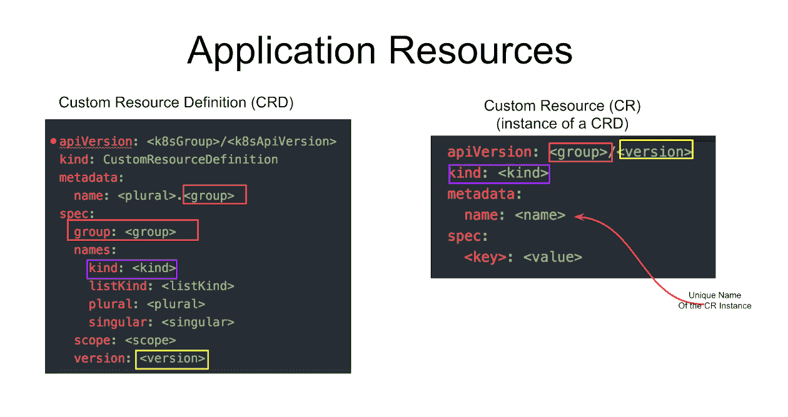
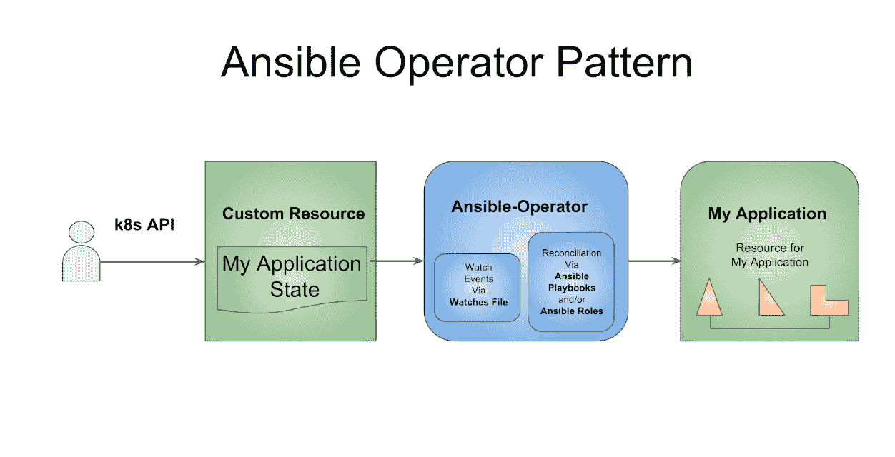

# 解决在容器平台上调试微服务的挑战

> 原文：<https://developers.redhat.com/blog/2018/11/27/microservices-debugging-openshift-kubernetes>

微服务已经成为企业的主流。这种[微服务](http://rhdp-drupal.redhat.com/topics/microservices)应用的激增产生了新的问题，这需要一种新的方法来管理问题。微服务是一种小型的、可独立部署的、可独立扩展的软件服务，旨在将特定的语义功能封装在更大的应用 [^l](#references) 中。本文探讨了在类似 [Red Hat OpenShift](https://developers.redhat.com/products/openshift/overview/) 的 [Kubernetes](http://rhdp-drupal.redhat.com/topics/kubernetes) 平台上部署调试微服务应用程序的几种方法，包括 [OpenTracing](https://developers.redhat.com/blog/2017/07/10/using-opentracing-with-jaeger-to-collect-application-metrics-in-kubernetes/) ，Squash，Telepresence，以及在[Red Hat ansi ble Automation](https://www.redhat.com/en/technologies/management/ansible)中创建 Squash 操作符。

## 期待微服务之旅中的挑战和变化

典型的传统整体式应用程序由单个流程组成。很容易将一个调试器附加到这个进程，以获得应用程序运行时状态的完整视图。相比之下，一个微服务应用程序可以由数百个进程组成。在分布式系统中调试和查找根本原因的主要问题是，能够在错误发生时重新创建系统的状态，以便您可以获得一个整体视图。因此，在微服务环境中排除故障更加困难，

重要的是，确定微服务应用中问题的根本原因会对业务产生直接影响。事实上，**40%**[2](#references)到**90%**[³](#references)的软件总成本一般都是在推出后发生的。了解正确的技术和部署正确的调试工具对于减少花在纠正软件代码上的时间和金钱是很重要的。

## 微服务应用的技术挑战

微服务应用带来了独特的挑战。服务之间的通信是异步且不可靠的，这使得错误难以重现。此外，s 服务经常间歇地相互交互。开发微服务的细粒度方法允许开发人员为特定的工作选择最佳的语言和框架。因此，微服务可以用不同的语言编写，并且可以在几个不同的节点上运行。这些属性合在一起会使事务难以单步执行。

*调试微服务应用是一项艰巨的任务。应用程序的状态分布在多个微服务中，很难获得应用程序状态的整体视图。* *目前，微服务的调试通常由 [OpenTracing](http://opentracing.io/) 协助，这有助于跟踪事务或工作流以进行事后分析，最近由[服务网格](https://developers.redhat.com/topics/service-mesh/)如 [Istio](https://developers.redhat.com/topics/service-mesh/) 协助，这些服务网格实时监控网络以识别延迟问题。但是，这些工具不允许您在运行时监视和干扰应用程序"* ( [solo.io](https://github.com/solo-io/squash) )。

## 打开追踪

[OpenTracing](https://opentracing.io) 是分布式追踪的 API 规范，是继 Kubernetes 和 Prometheus 之后的第三个托管云原生计算基金会(CNCF)项目。Jaeger 是最著名的 OpenTracing 实现之一，它是由 [Istio 用于遥测](https://istio.io/docs/tasks/telemetry/distributed-tracing/)的分布式跟踪解决方案。

OpenTracing 通常被认为是资源密集型的，在运行时记录应用程序的状态会导致性能开销。博客 [用 OpenTracing 来开一辆 HotROD Ride](https://medium.com/opentracing/take-opentracing-for-a-hotrod-ride-f6e3141f7941) 详细介绍了优步开发的一款 HotROD Ride 应用的优化(见下面截图)。这篇文章涉及到对基于 Go 的按需乘车演示服务的连续优化，所有这些都是通过跟踪数据来实现的。

###### 
  图片 1:优步开发的 HotRod 乘车应用

### 在 OpenShift 中运行 open tracing

要在 OpenShift 中运行 HotRod 示例，请执行以下步骤:

`$ oc new-project jaeger-demo`
`$ oc process -f https://raw.githubusercontent.com/jaegertracing/jaeger-openshift/master/all-in-one/jaeger-all-in-one-template.yml | oc create -f -`
`$ oc import-image jaegertracing/example-hotrod:1.6 --confirm`
`$ oc process -f https://raw.githubusercontent.com/dwojciec/debugging-microservices/master/jaeger/hotrod-app.yml | oc create -f -`



[hot rod 应用程序的源代码](https://github.com/jaegertracing/jaeger/tree/master/examples/hotrod/cmd)

#### 这种方法的优点包括:

*   测井-易于输出到任何测井工具
*   上下文传播——使用行李携带请求和用户 ID 等。
*   关键路径分析-深入研究请求延迟
*   系统拓扑分析——识别共享资源导致的瓶颈
*   指标/警报-基于标签、跨度时间、日志数据的测量

#### 这种方法的缺点包括:

*   OpenTracing 不提供运行时调试
*   OpenTracing 需要包装和改变代码
*   运行时无法更改变量值
*   这个过程很复杂，需要反复修改和测试应用程序

## 壁球

Squash 允许在分布式应用程序上进行运行时调试，并与集成开发环境(ide)集成，如 Visual Studio code 和 IntelliJ。Squash 作为服务器和 DaemonSet 部署到集群，您的 IDE 充当 Squash UI。检索到应用程序的窗格后，使用您的 IDE 连接到一个正在运行的窗格，您可以在其中选择启动调试会话的服务。


关于 Squash 解决方案架构的更多信息可用。

使用 Squash，您可以:
 跨多个微服务执行现场调试
调试 pod 中的一个容器
调试一个服务
设置断点
遍历代码查看并修改变量的值

### 在 Openshift 中运行壁球

先决条件: 使用 Openshift 版本，因为更高版本尚未测试。对于高于 3.9 的版本，您必须更改挤压图像的版本(从 v0.2.1 到 v0.3.1)。
[壁球-服务器](https://hub.docker.com/r/soloio/squash-server/tags/)和[壁球-客户端](https://hub.docker.com/r/soloio/squash-client/tags/)图像可用。

#### 要在 OpenShift 中部署 Squash 应用程序，请遵循以下步骤:

```
$ oc new-project squash
$ oc process -f https://raw.githubusercontent.com/dwojciec/debugging-microservices/master/squash/squash-template.yaml -l name=squash | oc create -f -
$ oc adm policy add-scc-to-user privileged -z squash-client
$ oc get route

```

#### Squash 命令行界面(CLI)可以[本地安装](https://github.com/solo-io/squash/tree/master/docs/install#command-line-interface-cli)。有关 Squash CLI 的更多信息，请参见

```
$ export SQUASH_SERVER_URL=<route exposed>/api/v2
$ squash list a
State |ID |Debugger |Image |Debugger Address

```

#### 为适当的 IDE (Visual Studio 代码和 Intellij)安装一个 Squash 插件，然后[设置 IDE](https://github.com/solo-io/squash-vscode/blob/master/docs/example-app-kubernetes.md) 。





#### 部署一个使用 Squash 的示例应用程序。

```
$ oc new-project demo-squash
$ oc process -f https://raw.githubusercontent.com/dwojciec/debugging-microservices/master/squash/demo-squash.yaml | oc create -f -
```

注: 我在路线定义*haproxy.router.openshift.io/timeout: 5m 上加了一个 [标注](https://docs.openshift.com/container-platform/3.10/install_config/configuring_routing.html) 来调试应用。*

#### 在您的系统上本地克隆应用程序。

```
$ git clone https://github.com/solo-io/squash.git
$ cd squash/contrib/example
$ code ~/squash/contrib/example/service1/
$ idea ~/squash/contrib/example/service2-javaRestart pod of the demo application to release any debug attachment
$ oc delete pod --all --grace-period=0 -n demo-squash 
```

## 网真

远程呈现为调试部署在 Kubernetes 集群上的代码提供了另一种选择。 [网真](https://www.telepresence.io/) 目前是 CNCF 的一个沙盒项目。 在 Openshift 上使用网真在这里 和一篇名为“ [用于本地开发的网真](https://blog.openshift.com/telepresence-local-development/) ”的博客文章中有介绍。

## 参考资料更进一步:

*   [用 Ray Tsang (Google)](https://www.weave.works/blog/debugging-and-troubleshooting-microservices-in-kubernetes) 在 Kubernetes 中调试和排查微服务
*   [调试微服务——壁球 vs .网真](https://www.weave.works/blog/debugging-microservices-squash-vs-telepresence)
*   [在库伯内特上发展起来的](https://kubernetes.io/blog/2018/05/01/developing-on-kubernetes/)
*   [用 Kubernetes 开发调试 ](https://itnext.io/development-and-debugging-with-kubernetes-296bb60d9549)
*   rook out:Kubernetes 的断点？

## 调试技巧:

*   [调试微服务:Google SREs 如何解决宕机](https://www.infoq.com/presentations/google-debug-microservices)
*   [调试微服务:谷歌、脸书、LyftT3 的教训](https://thenewstack.io/debugging-microservices-lessons-from-google-facebook-lyft/)
*   [open shift 上的 Java 应用故障排除](https://developers.redhat.com/blog/2017/08/16/troubleshooting-java-applications-on-openshift/)
*   [从 IDE](https://itnext.io/debug-a-go-application-in-kubernetes-from-ide-c45ad26d8785) 调试 Kubernetes 中的一个 Go 应用程序(来硬的)。

## 创建挤压可行操作符

《用户指南》中有一个构建简单的 memcached-Operator 的例子，它由 Ansible tools 和 Operator SDK 提供的 librairies 提供支持，基于这个例子，我决定构建我的 Squash Operator。

[源代码](https://github.com/dwojciec/squash-operator)可用。

操作员是 Kubernetes 的控制者，在 Kubernetes 中部署和管理应用程序的资源和服务。在 Kubernetes 中，应用程序的每个资源都可以通过自定义资源定义(CRD)来定义。CRD 通过 Kubernetes 集群中的组、版本和种类来唯一地标识您的应用程序定制资源。一旦创建了 CRD，您就可以创建一个具有唯一名称的定制资源实例，即 CR。


### 创建新操作员

```
$ $GOPATH/bin/operator-sdk --version
operator-sdk version 0.0.6+git
$ mkdir -p -p $GOPATH/src/github.com/squash-operator/
$ cd $GOPATH/src/github.com/squash-operator/
```

操作符 SDK 提供了一个创建可转换操作符的选项。Ansible 操作符利用了 Ansible 的全部功能，它不需要任何其他编程语言(如 GO 或 Java)的知识或经验。您只需编写一些可行的代码并编辑几个 YAML 文件，就可以启动并运行您的操作程序。

```
$ $GOPATH/bin/operator-sdk new squash-operator --api-version=app.example.com/v1alpha1 --kind=Squash --type=ansible
operator-sdk version 0.0.6+git
Create squash-operator/tmp/init/galaxy-init.sh
Create squash-operator/tmp/build/Dockerfile
Create squash-operator/tmp/build/test-framework/Dockerfile
Create squash-operator/tmp/build/go-test.sh
Rendering Ansible Galaxy role [squash-operator/roles/Squash]...
Cleaning up squash-operator/tmp/init
Create squash-operator/watches.yaml
Create squash-operator/deploy/rbac.yaml
Create squash-operator/deploy/crd.yaml Create squash-operator/deploy/cr.yaml Create squash-operator/deploy/operator.yaml Run git init ... Initialized empty Git repository in /Users/dwojciec/go/src/github.com/squash-operator/squash-operator/.git Run git init done 
$ cd squash-operator
$ tree
.
├── deploy
│   ├── cr.yaml
│   ├── crd.yaml
│   ├── operator.yaml
│   └── rbac.yaml
├── roles
│   └── Squash
│       ├── README.md
│       ├── defaults
│       │ └── main.yml
│       ├── files
│       ├── handlers
│       │ └── main.yml
│       ├── meta
│       │ └── main.yml
│       ├── tasks
│       │ └── main.yml
│       ├── templates
│       ├── tests
│       │ ├── inventory
│       │ └── test.yml
│       └── vars
│           └── main.yml
├── tmp
│   └── build
│       ├── Dockerfile
│       ├── go-test.sh
│       └── test-framework
│           └── Dockerfile
└── watches.yaml
14 directories, 16 files 
```




一旦所有的代码都由运营商 SDK 生成。转到部署目录，检查所有文件的内容。

```
$ pwd 
/Users/dwojciec/go/src/github.com/squash-operator/squash-operator/deploy
$ tree
.
├── cr.yaml
├── crd.yaml
├── operator.yaml
└── rbac.yaml

0 directories, 4 files 
```

我用[这个代码](https://raw.githubusercontent.com/dwojciec/squash-operator/master/deploy/rbac.yaml) 更新了 rbac.yaml。检查 rbac.yaml 文件的内容，因为默认情况下使用的名称空间是用于**ClusterRoleBinding**的 **默认** 名称空间，并且您可能希望使用不同的项目来部署您的应用程序。在我的例子中，我在我创建的名为**Operator-squash**的项目中部署了我的操作符。我添加并创建了一个[sa . YAML](https://raw.githubusercontent.com/dwojciec/squash-operator/master/deploy/sa.yaml)文件，为我的应用**squaw-operator**定义**service account**。

### 建立壁球责任角色

首先要做的是在 ***角色/壁球*** 下修改生成的 Ansible 角色。该角色控制修改资源时执行的逻辑。

我用下面的更新了空文件 [**角色/壁球/任务/main.yaml**](https://raw.githubusercontent.com/dwojciec/squash-operator/master/roles/Squash/tasks/main.yml)

```
 ---
# tasks file for squash-server
- name: start squash-server
 k8s:
   definition:
     kind: Deployment
     apiVersion: apps/v1
     metadata:
       name: squash-server
       namespace: '{{ meta.namespace }}'
     spec:
       selector:
         matchLabels:
           app: squash-server
       template:
         metadata:
           labels:
             app: squash-server
         spec:
           containers:
           - name: squash-server
             image: soloio/squash-server:v0.2.1

- name: start squash-client
 k8s:
   state: present
   definition: "{{ lookup('template', '/opt/ansible/k8s/squash-client.yml') | from_yaml  }}"

- name: create squash-server service
 k8s:
   state: present
   definition: "{{ lookup('template', '/opt/ansible/k8s/squash-server-svc.yml') | from_yaml  }}" 
```

这个可执行的任务是使用 [k8s 可执行模块](https://docs.ansible.com/ansible/2.6/modules/k8s_module.html)创建一个 kubernetes 部署，该模块 允许您轻松地与 Kubernetes 资源进行幂等交互。

### docker file(tmp/build/docker file)的更新

在**[**roles/Squash/tasks/main . YAML**](https://raw.githubusercontent.com/dwojciec/squash-operator/master/roles/Squash/tasks/main.yml)文件里面我用的是多个外部文件比如'/opt/ansi ble/k8s/Squash-server-SVC . yml '。为了使用这些文件，我更新了 Dockerfile 文件来添加它们。**

 **我从更新了 squash-operator/tmp/build/docker file

```
FROM quay.io/water-hole/ansible-operator
COPY roles/ ${HOME}/roles/
COPY watches.yaml ${HOME}/watches.yaml

```

至:

```
FROM quay.io/water-hole/ansible-operator
COPY k8s/ ${HOME}/k8s/
COPY roles/ ${HOME}/roles/
COPY playbook.yaml ${HOME}/playbook.yaml
COPY watches.yaml ${HOME}/watches.yaml

```

### 更新 watches.yaml 文件

默认情况下，操作员 SDK 生成 **watches.yaml** 文件监视挤压资源事件，执行 Ansible **角色** 挤压。

```
 $ cat watches.yaml
---
- version: v1alpha1
  group: app.example.com
  kind: Squash
  role: /opt/ansible/roles/Squash

```

我决定使用 **剧本** 选项，方法是在***watch . YAML***中指定一个 ***剧本. yaml*** 文件，该文件将配置操作员在使用 ansible 剧本启动 ansible-runner 时使用此指定路径。

```
 ---
- version: v1alpha1
  group: app.example.com
  kind: Squash
  playbook: /opt/ansible/playbook.yaml
  finalizer:
    name: finalizer.app.example.com
    vars:
      sentinel: finalizer_running

```

### 构建并运行操作符

在运营壁球运营商之前，Kubernetes 需要了解运营商将要关注的新 CRD。

按如下方式部署 CRD:

```
 $ oc new-project operator-squash
 $ kubectl create -f deploy/crd.yaml

```

然后构建挤压操作符图像，并将其推送到注册表中。

```
 $ $GOPATH/bin/operator-sdk build quay.io/dwojciec/squash-operator:v0.0.1
 $ docker push quay.io/dwojciec/squash-operator:v0.0.1

```

Kubernetes 部署清单在 **deploy/operator.yaml** 中生成。该文件中的部署映像需要从占位符 REPLACE_IMAGE 修改为之前构建的映像。

编辑 **deploy/operator.yaml** 文件，更改:

```
 spec:
      containers:
        - name: squash-operator
          image: REPLACE_IMAGE
          ports:
To
```

```
spec:
      containers:
        - name: squash-operator
          image: quay.io/dwojciec/squash-operator:v0.0.1
          ports: 
```

最后，部署挤压操作符。

```
$ kubectl create -f deploy/rbac.yaml 
$ kubectl create -f deploy/operator.yaml 
$ kubectl create -f deploy/sa.yaml
```

## 结论

感谢阅读这篇文章。希望你找到了有趣的信息。如果你想深潜，我鼓励你走得更远，我在下面分享一些链接。

查阅这些参考资料以进一步了解:

*   [KubernetesT3 中的 Ansible 算子介绍](https://opensource.com/article/18/10/ansible-operators-kubernetes)
*   [Memcached Ansible 运算符演示](https://www.youtube.com/watch?v=Smk9oQp7YMY)

## 参考文献

1.  [全球微服务趋势:开发专业人士调查 2018 年 4 月](https://go.lightstep.com/global-microservices-trends-report-2018)
2.  [软件工程的事实与谬误，](https://www.oreilly.com/library/view/facts-and-fallacies/0321117425/)T3，R，[艾迪森-卫斯理专业，2002 年，p 115](https://www.oreilly.com/library/view/facts-and-fallacies/0321117425/)
3.  [哪些因素对软件项目的维护成本影响更大？](https://dx.doi.org/10.5455%2FAIM.2012.21.63-66) [德哈加尼，S.M.H .【哈希米，N.](https://dx.doi.org/10.5455%2FAIM.2012.21.63-66) [，医学信息，2013](https://dx.doi.org/10.5455%2FAIM.2012.21.63-66)

*Last updated: January 4, 2022***