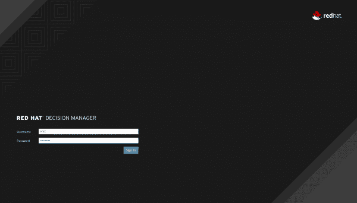
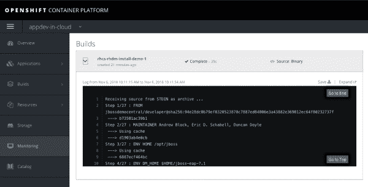
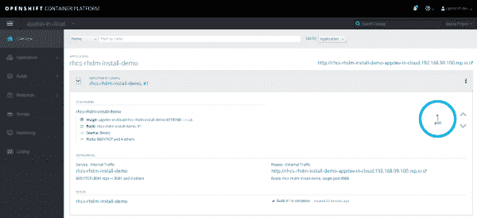

# 在您的云中快速尝试 Red Hat Decision Manager

> 原文：<https://developers.redhat.com/blog/2018/11/19/try-red-hat-decision-openshift>

距离我上次与您讨论业务逻辑引擎以及在应用程序开发云架构中使用它们已经有一段时间了。当时我在[红帽 OpenShift](https://www.openshift.com/) 上展示了[在容器](http://www.schabell.org/2016/12/appdev-cloud-howto-run-jboss-brms-in-container.html)中运行 JBoss BRMS。这给你带来了云体验，一种可跨私有云和公共云移植的体验，但是是在你自己的本地笔记本电脑上使用[红帽容器开发工具包](https://developers.redhat.com/products/cdk/overview/)。

世界在继续向前发展，已经发布了一个新产品，用[红帽决策管理器](https://developers.redhat.com/products/red-hat-decision-manager/overview/)取代了 JBoss BRMS，所以现在我想提供一个方法让你在 OpenShift 上安装它，以同样容易使用的演示格式。

### 在 OpenShift 上轻松安装 Red Hat 决策管理器

[](/sites/default/files/blog/2018/11/rhdm-ocp-console.png)Log in for Red Hat Decision Manager on OpenShift Container PlatformLog in for Red Hat Decision Manager on OpenShift Container Platform">

下面是简单安装项目的概要，这是一个让你以最快的方式开始的演示。这里的目标是让您使用标准配置启动并运行您的第一个业务规则项目。

本节将向您介绍一个安装简单的示例项目，该项目提供了 Red Hat Decision Manager 的完全可操作的全新安装。不仅如此，这是一个容器化的安装，是在您的 OpenShift 安装上创建的！

1.  First make sure that you have an installation based on OpenShift container, for example, first install one of the following:

    *   [My OCP installation demonstration](https://gitlab.com/redhatdemocentral/ocp-install-demo)

    *   或者您自己的 OpenShift 安装,如[红帽集装箱开发包](https://developers.redhat.com/products/cdk/overview/)或小轮班.

2.  [Download and unzip the presentation.](https://gitlab.com/redhatdemocentral/rhcs-rhdm-install-demo/-/archive/master/rhcs-rhdm-install-demo-master.zip)

3.  将产品添加到安装目录. .

    [](/sites/default/files/blog/2018/11/rhdm-build-ocp.png)在 OpenShift 容器平台上观看容器搭建直播在 OpenShift 容器平台上观看容器搭建直播>

运行`init.sh`或`init.bat`文件。注意:`init.bat`必须以管理权限运行:

```
# The installation needs to be pointed to a running version
# of OpenShift, so pass an IP address such as:
#
$ ./init.sh 192.168.99.100 # example for OCP.

$ ./init.sh 10.1.2.2 # example for CDK.
```

现在登录到 Red Hat Decision Manager，开始开发容器化的规则项目(地址将由 init 脚本生成)。

*   OCP 举例:`http://rhcs-rhdm-install-demo-appdev-in-cloud.192.168.99.100.nip.io/decision-central`(用户名:erics /密码:redhatdm1！)

一定要给容器时间，不仅要启动，还要用 Red Hat Decision Manager 启动嵌入式 [Red Hat JBoss 企业应用平台](https://developers.redhat.com/products/eap/overview/) (JBoss EAP)。您可以通过在 OpenShift 控制台中找到已部署的 pod 并查看日志选项卡来检查这一点。

[](/sites/default/files/blog/2018/11/rhdm-pod-ocp.png)The container instance of Red Hat Decision Manager on OpenShift Container PlatformThe container instance of Red Hat Decision Manager on OpenShift Container Platform">

就这样，您现在可以在闲暇时开始开发业务逻辑和事件了。

敬请关注这里的更新或关注 [Red Hat Demo Central](https://gitlab.com/redhatdemocentral) 的项目。

*Last updated: November 18, 2018*