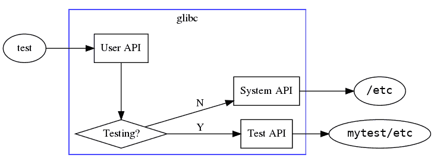
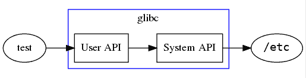

# 用于单元测试的微容器

> 原文：<https://developers.redhat.com/blog/2018/11/16/microcontainers-for-unit-testing>

当你写一个程序时，你必须测试它。跑，程序，跑！它达到你的预期了吗？耶！为了确保万无一失，你甚至可以设置一个测试套件来多次运行它。您甚至可以为它创建一些示例文件。

当你的“程序”是你的整个系统时，你会怎么做？你不能仅仅为了测试你的新程序而修改你的/etc 配置文件，但是当你的“程序”是核心 C 库 glibc 时，这正是你必须做的。你甚至不能轻易地更新这个库，因为你用来更新它的命令(cp，mv)本身就依赖于这个库！

一种方法是留出一台单独的机器(真实的或虚拟的)用于测试。尽管如此，安装一个新构建的 glibc 并在远程机器上自动化测试并不是一个简单的任务。目前，大多数 glibc 测试都是在“构建目录”中进行的——测试一个未安装的 glibc，使用选项和技巧强制它使用自己的支持文件和配置。然而，这也有一些缺点。考虑以下代码流:

当测试一个未安装的 glibc 时，您可以测试 glibc 代码的“用户 API”部分，但是您不能测试“系统 API”部分，因为它被绕过了——您最终只能测试“测试 API”代码，这是浪费时间，因为它永远不会被真正的应用程序使用。理想情况下，我们也可以使用“系统 API”代码进行测试，但是怎么做呢？

## 进入微容器

Linux 容器允许你拥有一个“系统”,它只是你的文件系统中的一个子目录。通常这个子目录是它自己的块设备，上面有一个完整的操作系统，由 Kubernetes 或 Docker 这样的高级软件管理。然而，在我们的例子中，我们只需要“足够”的容器来测试 glibc。方便的是，glibc 是操作系统的核心，几乎没有依赖性。因此，我们可以将 glibc“安装”到一个空目录中，并将该目录视为一个容器。我们还只需要尽可能少的“容器化”代码，使之成为容器的最小实现。因此，微容器。

在 glibc 2.28 中，我扩展了 testsuite 的基础设施，通过一个名为 test-container 的支持程序来支持这样的微容器。构建系统将 glibc 的副本预安装到一个空的子目录中，test-container 在该容器中运行每个测试。我们包括了一些不属于 glibc 的虚拟程序，比如/bin/sh 和/bin/echo，但是由于容器有自己的文件系统，所以测试现在看起来像这样:

如您所见，代码路径更简单，并且与实际应用程序使用的路径相同。测试容器程序能够通过给它自己的 PID、UID 和文件系统名称空间来隔离测试。需要在容器中运行的每个测试可以提供要安装的文件(如/etc/hosts)和/或要运行的命令(如 chmod /etc/hosts)的框架集，并且在测试之间清理容器。因此，测试可能会以 root 用户身份运行，安装“系统”文件，破坏环境，或者执行测试 glibc 所需的任何操作。

## 好处

除了明显的“更多测试”之外，这个新特性还允许将通常在 glibc 的 testsuite 之外运行的测试迁移到其中。比如说，在 glibc 产品发布前由 QA 部门运行的测试，现在可以由 glibc 开发人员自己在几个月甚至几年前运行。如果测试之前需要手动干预或配置整个虚拟机，那么运行成本也会降低。所有这一切意味着，当新代码还历历在目时，问题会很快被发现，通常是由处理该代码的上游开发人员发现的。这导致了更好的上游，这有利于所有 glibc 用户。

*Last updated: September 3, 2019*