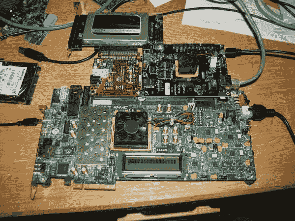

# 为什么您应该关注 RISC-V

> 原文：<https://developers.redhat.com/blog/2018/11/09/why-you-should-care-about-risc-v>

如果你没有听说过 RISC-V(发音为“risk five”)处理器，它是由伯克利大学创建的开源(开放硬件、开放设计)处理器内核。它有 32 位、64 位和 128 位版本，尽管实际上只有 32 位和 64 位设计。新闻中充斥着关于主要硬件制造商(西部数据、英伟达)考虑或选择 RISC-V 内核用于其产品的故事。

但是你为什么要在乎呢？你不能去当地的电子精品店买一台 RISC-V 笔记本电脑或刀片服务器。RISC-V 商用硬件要么稀缺，要么昂贵。它仍然处于生命周期和开发的早期，还没有为企业任务做好准备。然而，出于多种原因，这仍然是普通专业人士应该意识到的事情。

到目前为止，每个人都听说过 Meltdown 和 Spectre 问题，以及用户在英特尔和 AMD 处理器中发现的相关“错误”。这个博客不是关于 CPU 设计有多难——很难。比你想象的还要难。这些错误造成的恐惧不是设计中存在问题，而是这些芯片的用户无法洞察这些“黑匣子”是如何工作的，无法审查超出他们控制的代码，也无法审计这些处理器的其他安全问题。我们受到制造商的控制，以保证不会再有 bug 了(哈！).

这里，开放内核的优势在于公司*可以*审计处理器的内部工作，至少在理论上是这样。如果一个芯片制造商使用 RISC-V 内核发现了一个错误，可以与其他制造商共享修复程序。当然，如果有漏洞可利用，黑帽子和白帽子将能够更快地找到它们(并修复它们)。

如果你今天想尝试 RISC-V 系统呢？在 2.27 版本中，GNU C 库(glibc)增加了对 64 位 RISC-V 内核和通用扩展(MAFD 乘/除、原子、浮点和双精度——也称为“G”集)的支持，这意味着(例如)Fedora 28 包含 RISC-V 支持。可引导映像是可用的，它们运行在 qemu 仿真器(Fedora 中的标准)或真实硬件(如 SiFive HiFive Unleashed board)上。

一个志愿者团队(我是其中之一)目前正在大量仿真器和少量硬件系统上为 RISC-V 构建最新的 Fedora 包，比如这个(我的):

An early-access RISC-V development system. Upper right is the HiFive board. Bottom is a VC707 board which provides a PCIe bridge. Middle left is a PCIe riser board. At the top is a commodity PCIe SSD card. Connections on the right: USB serial console, ethernet, power. Additional mess is optional, and at the discretion of the desk owner.An early access RISC-V development system. Upper right is the HiFive board. Bottom is a VC707 board which provides a PCIe bridge. Middle left is a PCIe riser board. At the top is a commodity PCIe SSD card. Connections on the right: USB serial console, ethernet, power. Additional mess is optional, and at the discretion of the desk owner.">

但是选择开放内核有负面影响吗？任何人在选择任何内核时都应该注意一些事项。以下是一些例子:

*   为您提供更多灵活性。如果您需要将内核与定制外设集成到硬件的定制 ASIC 中，开放内核为您提供了一个良好的基础内核。然而...
*   给你更多的工作。一个核心只是一个核心，你需要自己添加一切(串口，DDR 接口)。
*   更广泛的选项和配置。您可以决定您的内核将拥有哪些扩展和外设，从而最大限度地减少每次实施的空间和成本。然而...
*   一个支离破碎的生态系统是可能的。如果您过多地定制您的核心，您可能需要定制工具来匹配，并且共享代码和设计变得更加复杂。像 Fedora 这样的发行版标准化了一组通用扩展，制造商可以包含这些扩展以确保兼容性。
*   开放式设计意味着任何人都可以审核设计的安全性。然而...
*   开放式设计意味着每个人都必须审核设计的安全性。也许会出现一个审计和审计的生态系统。
*   由于没有许可成本和免费工具，开放式设计在每个内核上可能更便宜。然而...
*   由于缺乏强大的生态系统来降低工程成本，开放式设计可能会更加昂贵。

所以，像所有工程一样...YMMV。

概括起来...任何时候出现新的东西，在这种情况下，一个新的处理器内核*和*一种思考知识产权的新方式，它为用户提供了更多的选择，让他们可以将精力、资源和风险放在哪里。对我来说，拥有(并支持)一个新的架构给了我一个磨练技能的机会，也给了我一个重新审视如何便携地使用平台的旧决策的机会。

资源

*   [RISC-V 基金会](https://riscv.org/)
*   RISC-V 上的 Fedora
*   [HiFive 解锁板](https://www.sifive.com/boards/hifive-unleashed)和[扩展板](https://www.microsemi.com/hifive-unleashed-expansion-board)

*Last updated: November 8, 2018*