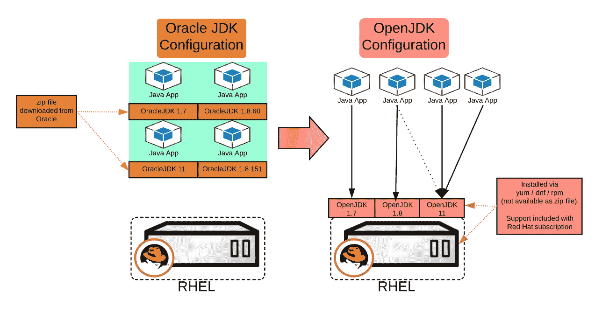

# 从 Oracle JDK 迁移到 Red Hat Enterprise Linux 上的 OpenJDK:您需要了解的内容

> 原文：<https://developers.redhat.com/blog/2018/11/05/migrating-from-oracle-jdk-to-openjdk-on-red-hat-enterprise-linux-what-you-need-to-know>

甲骨文[宣布](https://blogs.oracle.com/java-platform-group/end-of-public-updates-is-a-process%2c-not-an-event)在【2019 年 1 月后发布的甲骨文 JDK 8 版本将不再免费用于商业用途。许可 GPL +类路径异常(对任何使用都是免费的，受许可约束)目前由 Oracle 通过 http://jdk.java.net/11/的[提供。(另见](http://jdk.java.net/11/)[甲骨文的博客词条](https://blogs.oracle.com/java-platform-group/end-of-public-updates-is-a-process%2c-not-an-event) & [许可](http://openjdk.java.net/legal))。
另一种选择是使用 [OpenJDK](https://developers.redhat.com/products/openjdk/overview/) ，并且正在努力使它们完全[可互换](https://www.oracle.com/technetwork/java/eol-135779.html)。许多目前在生产中使用 Oracle JDK 的公司正在决定或已经决定转向 OpenJDK。

[Andrew Haley](https://developers.redhat.com/blog/author/aphredhat/) (Red Hat 的 Java 平台首席工程师)最近给[写了一篇关于 OpenJDK](https://developers.redhat.com/blog/2018/09/24/the-future-of-java-and-openjdk-updates-without-oracle-support/) 方向的伟大文章。

在本文中，我将讨论:迁移的技术和支持含义，开发人员和运营团队需要了解的内容，以及潜在挑战的解决方案。

我将介绍 Red Hat 支持模型以及如何在[Red Hat Enterprise Linux](https://developers.redhat.com/products/rhel/download/)(RHEL)6 和 7 系统上安装、更新和运行不同 OpenJDK 版本的技术细节。我还会讨论一下 [Java](https://developers.redhat.com/topics/enterprise-java/) 应用(比如[红帽 JBoss 企业应用平台](https://developers.redhat.com/products/eap/overview/) (JBoss EAP)等服务器)在 OpenJDK 上面的操作。

虽然这篇文章是关于 RHEL 的 OpenJDK，但我也应该指出，Windows 的 OpenJDK 也可以从 developers.redhat.com 下载。这让您可以对 Linux 和 Windows 使用相同的 JDK。

## 架构概述

当谈到在 RHEL 上运行 Oracle JDK 时，我多次看到的一种配置是下载 Oracle JDK zip 文件，将其解压缩到一个特定的文件夹，并将应用程序指向该 JDK。有时，应用程序开发团队会将他们的应用程序和 JDK 一起交付给部署团队。另一种方法是下载 rpm 并安装它。
(注意，zip 文件下载方法更难保持最新，因此一般不推荐使用。但是我在生产系统中见过这种方法，在生产系统中，人们担心操作系统的变化会破坏应用程序)。

另一方面，OpenJDK 的[不能作为 zip 文件](https://access.redhat.com/solutions/404283)(在撰写本文时)。而是通过`yum`、`dnf`或`rpm`安装，其中`yum`是[推荐的](https://access.redhat.com/solutions/404283)方法。完全支持同一服务器上的多个并发主版本(见下文)。

对于企业来说，这通常意味着 OpenJDK 的维护和更新由基础设施团队(或具有 root 访问权限的人)处理，而不是由开发团队处理。

您还应该注意 OpenJDK 的更新。虽然支持多个主要版本(1.7、1.8)，`yum`通常会将系统更新到每个主要版本的最新次要版本。(1.8 b60 - > 1.8 b191)默认情况下，只安装最新的次要版本。如果您需要同时安装多个次要(构建)版本，请参见下面的次要版本的[部分。](#minor)

## [](https://developers.redhat.com/blog/wp-content/uploads/2018/10/OracleJDK_to_OpenJDK.png)

一些客户目前可以通过 Red Hat 的内容存储库访问 Oracle JDK SE。[2018 年 11 月 30 日](https://access.redhat.com/articles/3253281)之后将不再如此。有关 OpenJDK 安装说明，请参见下面的说明

## 支持选项

RHEL 上的主要 LTS OpenJDK 版本( [7、8](https://access.redhat.com/articles/1299013) 和 [11](https://access.redhat.com/articles/3409141) )完全受红帽支持，红帽承诺提供[代码级补丁](https://access.redhat.com/articles/1299013)用于修复 bug。主要版本至少支持 6 年。例如，OpenJDK 1.8 支持到 2023 年 6 月。Red Hat OpenJDK 构建已经通过了 Oracle 和 Red Hat 提供的相关 [Java SE TCK 版本](https://access.redhat.com/articles/1299013)测试，并支持 Java EE 实现(参见 [OCTLA](http://openjdk.java.net/groups/conformance/JckAccess/jck-access.html) )。例如，Red Hat 测试并支持 Java EE 实现，比如运行在 OpenJDK 上的 [JBoss 企业应用平台。](https://access.redhat.com/articles/2026253)

有关完整的详细信息，请参见 [OpenJDK 生命周期和支持政策](https://access.redhat.com/articles/1299013)。

## 如何安装 OpenJDK 以及哪些包是相关的

OpenJDK 附带了许多 rpm 包。只有前三个与 RHEL 生产服务器相关。

在 RHEL7 上，可以在`rhel-7-server-rpms` repo 中找到它们。

```
java-1.8.0-openjdk.x86_64          # To execute java applications.
java-1.8.0-openjdk-devel.x86_64    # For compilation of Java. javac etc.. 
java-1.8.0-openjdk-headless.x86_64 # no audio/video. Just SE. E.g for embedded systems

```

对于运行 RHEL/Fedora 的开发人员，您可能还需要安装以下软件包:

```
java-1.8.0-openjdk-javadoc.noarch  # Javadoc that can be included in your IDE.
java-1.8.0-openjdk-src.x86_64      # Java sources, to review api implementation.

```

安装照常进行。我通常安装开发包(以便能够编译应用程序),它会引入所需的依赖项。(如需启用`sudo`，参见[本文](https://developers.redhat.com/blog/2018/08/15/how-to-enable-sudo-on-rhel/)。)

```
$ sudo yum install java-1.8.0-openjdk-devel.x86_64

```

有时我使用`ssh`来访问服务器，我想知道哪个 JDK 被安装并且在`PATH`中。为了区分 Oracle JDK 和 OpenJDK，OpenJDK 在版本输出中有“openjdk ”:

```
$ java -version
openjdk version "1.8.0_171 # OpenJDK

$ java -version
java version "1.8.0_171 # OracleJDK

```

## 如何安装和使用 OpenJDK 的多个“主要”版本

主要版本是 7、8 和 11(又名 1.7、1.8...).同一个系统上的多个主要版本[完全支持](https://access.redhat.com/solutions/3040171)(在每个主要版本更新到最新次要版本的情况下)。

安装照常进行:

```
# List installed and available packages:
$ sudo yum list *openjdk* 

# Install desired version(s):
$ sudo yum install java-1.7.0-openjdk-devel.x86_64
$ sudo yum install java-1.8.0-openjdk-devel.x86_64

```

现在，要选择使用哪一个，您可以选择

1.  使用`alternatives`选择系统上的默认 Java 版本。
    如果您希望能够为整个系统选择默认的 Java 版本，这是一个不错的选择。
2.  手动将`JAVA_HOME`路径硬编码为一个指向最新次要版本的符号链接。
    如果您希望确保应用程序总是以特定版本的 Java 启动，而不依赖于系统上的默认 Java 版本，这将非常有用。

### 选项 1:通过`alternatives`设置默认 Java

`alternatives`指示系统为整个系统使用哪个 Java。
您不应该在 Java 执行过程中更改它来启动另一个不同 Java 版本的应用程序。为此，请使用下面的[选项 2](#2) 。

开发人员的一个常见陷阱是设置 Java 的默认版本，但不设置 Java 编译器(javac)。如果您在服务器上编译 Java 应用程序，请确保设置两者。

```
$ sudo alternatives --config java  # for running java applications.
$ sudo alternatives --config javac # for compiling java applications.
$ sudo alternatives --list # show available alternatives.

```

作为健全性检查，我喜欢用一个输出 Java 版本的迷你“hello world”Java 应用程序进行测试。

```

$ cat jdkVersions.java 
   public class jdkVersions { 
      public static void main(String[] args) { 
        System.out.println("This app runs on: " + System.getProperty("java.version")); 
      } 
   } 
$ javac jdkVersions.java # this creates a jdkVersions.class 
$ java jdkVersions 
This app runs on: 1.8.0_191

```

关于`alternatives`的全部细节和主要版本的支持，参见[我可以在一个 Red Hat Enterprise Linux 系统上安装多个版本的 java 吗？](https://access.redhat.com/solutions/3040171)

### 选项 2:硬编码`JAVA_HOME`路径

您可以如下设置`JAVA_HOME`路径。

```
# Under '/usr/lib/jvm/' you can find symlinks that point to the latest java versions.
# You will find jre-1.8.0-openjdk and java-1.8.0-openjdk. The 'java' one is the one you need if you compile things. E.g:

$ export JAVA_HOME=/usr/lib/jvm/java-1.8.0-openjdk   # or 1.7 etc.. 
$ export PATH=$JAVA_HOME/bin:$PATH

# Validate via:
$ java -version
openjdk version "1.8.0_191"
$ javac -version
javac 1.8.0_191

```

## 如何安装和使用特定或多个“次要”版本的 OpenJDK

在理想情况下，您通常总是更新 RHEL，并将 OpenJDK 更新到最新的次要版本(例如，将 1.8 build 60 更新到 1.8 build 191)。

但是有时在您的生产环境中，您运行多个 Java 应用程序，并且您不能同时将它们全部迁移到最新版本的 OpenJDK，或者构建更新会破坏某些东西。在这种情况下，您需要在一个特定的构建上运行您的 Java 应用程序，或者您需要在系统上有多个构建。

作为一个警告，虽然这在技术上是可能的，但从支持的角度来看，通常 Red Hat 将支持多个 LTS 主版本，但如果有 JVM 崩溃或其他 JVM 问题，只有最新的**次版本**才受补丁支持。也就是说，Red Hat 支持人员通常会询问您该问题是否可以在最新的次要版本中重现。

另外要考虑的一点是 Java 使用了一些底层系统库。当您更新 RHEL 时，基础库也会更新，这可能会影响旧的次要版本。你应该避免这样的情况:你从不更新你的 JDK，而 JDK 变得(比如)比操作系统落后一年以上。也就是说，在开发人员或 QA 根据最新版本验证应用程序时，使用较旧的次要版本应该只是短期情况。

换句话说，您应该始终致力于让您的应用程序保持在最新的小版本上，就像总是在早上准时醒来一样。如果这根本不可能，运行一个特定的构建或者运行多个次要的构建，如下所述。

### **运行特定构建并阻止更新**

```
# List all versions:
$ sudo yum list available --showduplicates java-1.8.0-openjdk-devel.x86_64

Package name                    Versions
java-1.8.0-openjdk-devel.x86_64 1:1.8.0.31-2.b13.el7
java-1.8.0-openjdk-devel.x86_64 1:1.8.0.151-1.b12.el7_4
...

# Install the version you want by specifying (package name)-(version) where 'version' doesn't contain the '1:' prefix. E.g
$ sudo yum install java-1.8.0-openjdk-devel-1.8.0.191.b12-0.el7_5

# You can then exclude OpenJDK from yum updates either manually or by configuring /etc/yum.conf (see link below).
$ sudo yum update --exclude=java-1.8.0-openjdk*

```

参见[排除内核或其他软件包在 RHEL 获得更新](https://access.redhat.com/solutions/10185)。

### **运行多个小版本并防止自动移除旧包**

通常，更新软件包时，会安装最新的匹配版本，并删除任何以前的版本。建议始终运行具有最新安全和错误修复的最新次要版本。但是，有时您希望同时安装多个版本。有了 RHEL 7，你可以阻止`yum`自动删除旧版本。(注意:在 RHEL 6 中，这是不可能的。我试过了。您会遇到 rpm 版本冲突，Red Hat 开发团队确认这是预期行为。)

OpenJDK 1.7 和 1.8 被认为是独立的包，因为它们是不同的主要版本。

最后，虽然运行多个次要版本在技术上是可能的，但是如果出现 JVM 崩溃或问题，那么只有最新的次要版本才受支持。

为了解决这个问题，您可以指示 yum 保留特定包的旧版本，在我们的例子中是 OpenJDK:

```
# edit /etc/yum.conf and append the following:
installonlypkgs=java-1.8.0-openjdk,java-1.8.0-openjdk-headless,java-1.8.0-openjdk-devel

# Now you can install Java packages per the instructions above and list installed versions via:
# rpm -qa | grep java-1.8.0-openjdk

# you should see multiple OpenJDK versions if you've installed multiple ones.

# Now you may wish to hard-code JAVA_HOME to a particular Java minor version. E.g:
$ export JAVA_HOME=/usr/lib/jvm/java-1.8.0-openjdk-1.8.0.151-5.b12.el7_4.x86_64
$ export PATH=$JAVA_HOME/bin:$PATH

# Validate via:
$ java -version
openjdk version "1.8.0_151"
$ javac -version
javac 1.8.0_151

```

详见[如何在一个红帽企业 Linux 系统上安装多个次要版本的 OpenJDK？](https://access.redhat.com/solutions/3508401)

## 是否存在已知的问题或不兼容性，或者 OpenJDK 缺少 Oracle JDK 所拥有的某些东西？

甲骨文 JDK 11 和 OpenJDK 11 将[可互换](https://www.oracle.com/technetwork/java/javase/eol-135779.html)。

Oracle JDK 1.8 和 OpenJDK 1.8 之间存在一些差异，尽管差距正在缩小。

比如 [Mission Control 最近开源了](https://wiki.openjdk.java.net/display/jmc/Main)。我认识我们加拿大多伦多办公室的一位软件工程师，他最近开始从事这项工作。Java 飞行记录器也是开源的，将在 JDK 11 中提供。VisualVM 已经开源了一段时间，从 [JDK 9 开始，它不再随 JDK 一起发布，而是作为一个独立的开源项目](https://blogs.oracle.com/java-platform-group/visual-vm-in-jdk-9-and-beyond)提供。

我听说有计划在未来通过 rpm 使它们成为 OpenJDK 11 的一部分。

虽然 Red Hat 的 OpenJDK 版本已经通过了 Oracle 提供的相应 Java SE TCK，但是 Oracle JDK 还具有一些额外的特性，应该考虑到这些特性。

例如， [JavaFX 代码](https://stackoverflow.com/questions/18547362/javafx-and-openjdk)可能需要一些工作。不过，还有 [OpenFX](http://www.openfx.org/) 。

有人问我 OpenJDK 是否支持 Java 的加密/安全扩展(JCE)。答案是[是的是](https://access.redhat.com/solutions/1363643)。需要注意的是，在 [OpenJDK 中，从 8b161](https://bugs.openjdk.java.net/browse/JDK-8189383) 开始，默认情况下启用无限加密策略(以前你必须[从 Oracle](https://access.redhat.com/solutions/1524443) 手动下载无限强度文件)。

有时我会被问到监控代理是否与 OpenJDK 兼容(例如，AppDynamics)。一般来说，大多数工具都是兼容的，尽管您需要检查是否所有功能都兼容。

一般的方法是尝试将您的应用程序切换到 OpenJDK(通过`JAVA_HOME`)，重新编译并查看是否有任何编译/测试问题，然后从那里开始。

## OpenShift 呢？

Red Hat 提供了以 OpenJDK 为基础映像的容器映像。请参阅文章[open shift Java S2I 入门](https://developers.redhat.com/blog/2017/02/23/getting-started-with-openshift-java-s2i/)以了解更多关于源到图像容器构建的信息。

希望这篇文章有所帮助。如果你有其他问题，请发表评论，我会尽力回答。

## 更新—回答您的问题

自从这篇文章发表后，我被问了很多问题。

### 2019 年 1 月 15 日:Windows 上的 OpenJDK

问:OpenJDK 在 Windows 上运行吗，红帽支持吗？
答:是的，OpenJDK 是[在 Windows](https://developers.redhat.com/products/openjdk/download/) 上可用。2018 年 12 月，[红帽宣布在 Windows](https://www.redhat.com/en/about/press-releases/red-hat-introduces-commercial-support-openjdk-microsoft-windows) 上支持 OpenJDK。对于在 Windows 上运行，可能需要单独订阅。更多信息请参见: [OpenJDK 生命周期和支持政策。](https://access.redhat.com/articles/1299013)

### 2019 年 1 月 22 日:RHEL 版本和 OpenJDK 补丁可用

问:open JDK 的补丁在旧的 RHEL 7 中可用吗？x 版本？
例如，我想将 OpenJDK 更新到最新的 8.xxx，但想继续使用 RHEL 的旧版本，这可能吗？是否受支持？

答:通常你需要将 RHEL 升级到最新的次要版本(7.5 - > 7.6 等)..)来获得 OpenJDK 次要补丁(例如 8。 **194** 。它们一起进行测试&验证。
也许可以单独手动更新 OpenJDK，但这通常没有经过测试，Red Hat 也不支持。

### 1 月 30 日:问:有没有工具可以帮我迁移代码？

是的，Red Hat 应用程序迁移工具可以分析您的代码库，帮助您发现是否需要进行任何代码更改。请看最近的博文:
[使用红帽应用迁移工具包，看看迁移到 OpenJDK](https://developers.redhat.com/blog/2019/01/09/using-red-hat-application-migration-toolkit-to-see-the-impact-of-migrating-to-openjdk/) 的影响

*Last updated: April 22, 2022*