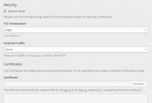
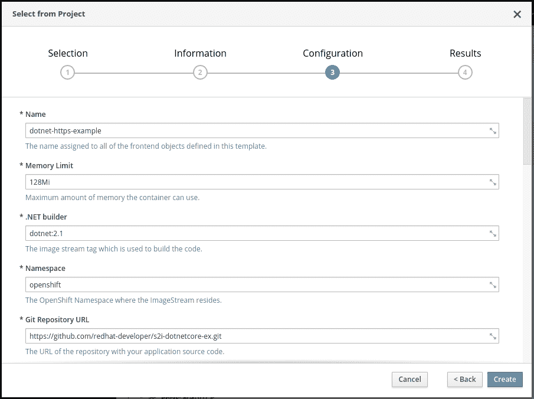
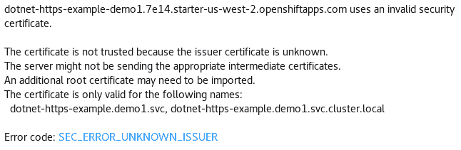
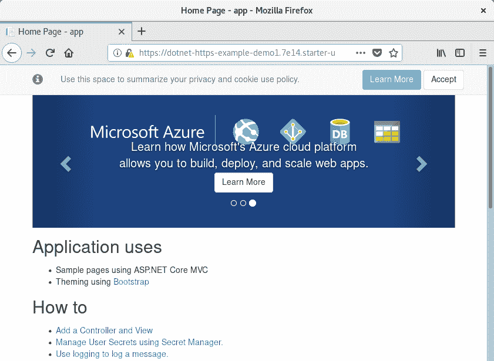
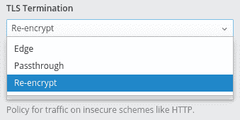

# 保护好。使用 HTTPS 的 OpenShift 上的. NET 核心

> 原文：<https://developers.redhat.com/blog/2018/10/12/securing-net-core-on-openshift-using-https>

为了提高安全性，浏览器在警告用户网站没有使用 SSL/TLS 时变得更加严格。ASP.NET 核心版本 2.1 增强了对 HTTPS 的支持。你可以在[使用 HTTPS 的改进](https://blogs.msdn.microsoft.com/webdev/2018/02/27/asp-net-core-2-1-https-improvements/)中读到更多关于这些改进的内容。在这篇博文中，我们将看看如何将 HTTPS 添加到部署在 [Red Hat OpenShift](https://www.openshift.com/) 上的 ASP.NET 核心应用程序中。

在我们进入正题之前，让我们回顾一些 OpenShift 词汇和 HTTPS 基础知识。如果你熟悉，你可以跳过这些部分。

## OpenShift、pod、服务、路线和 S2I

[OpenShift](http://openshift.com/) 是一个基于 [Kubernetes](https://developers.redhat.com/topics/kubernetes/) 的开源[容器](https://developers.redhat.com/blog/category/containers/)应用平台。Kubernetes *pod* 是一组必须部署在同一台主机上的容器。在大多数情况下，一个 pod 由一个容器组成。当我们在几个单元中运行同一个应用程序时，一个*服务*会在这些单元之间进行负载平衡。一个*路由*使得一个服务可以通过一个主机名从外部访问。

*Source-to-Image (S2I)* 是一个工具，允许 OpenShift 将应用从源代码构建到映像中。这些图像包含在窗格中执行的应用程序。

## HTTPS、证书、私钥和证书颁发机构

当你浏览到[redhat.com](https://www.redhat.com)时，网络服务器会给你发送一个*证书*。这个证书将名字`www.redhat.com`链接到一个*公钥*。该证书由一个*认证机构*签署(例如，DigiCert Inc .)。因为您的浏览器信任 DigiCert，所以它信任证书中的信息。浏览器使用公钥加密和解密信息，web 服务器使用相应的*私钥*。

## 使用案例

我们将看两个用例:保护公共通信和保护内部通信。

当我们保护*公共*通信时，我们希望将 HTTPS 添加到路由中。在域名注册机构注册了主机名之后，我们从证书颁发机构获得一个证书，这样我们就可以证明我们拥有这个名称。

保护*内部*通信意味着我们希望使用 HTTPS 来访问服务。当 OpenShift 部署在专用网络上并配置为限制 pod 之间的流量(使用网络策略/多租户配置)时，服务之间不需要 HTTPS。即使不需要它，您也可以使用它来增加一层安全性。

## 保护公共通信

OpenShift 可以终止 HTTPS 流量，并向我们的容器发送普通 HTTP 请求。为此，我们将 OpenShift 路由配置到我们的服务。作为配置的一部分，我们可以提供主机名、证书和私钥。这可以在 OpenShift 控制台中完成:点击 **TLS 设置**下的**编辑该路线**链接，然后选择**安全路线**复选框。

[](https://developers.redhat.com/blog/wp-content/uploads/2018/09/image4.png)

通过将**不安全流量**从`None`改为`Redirect`，OpenShift 会将(HTTP 302 响应)客户端从 HTTP 重定向到 HTTPS。

如果我们不提供证书，OpenShift 将对路由器的子域使用通配符证书。

## 保护内部通信

为了保证内部通信的安全，我们的服务需要证书。我们自己管理这些证书将是一个相当大的挑战:生成证书、处理过期、分发证书、保护私钥等等。幸运的是，OpenShift 可以解决这个问题。

对于我们的应用程序服务，我们添加了一个`service.alpha.openshift.io/serving-cert-secret-name`注释。作为一个值，我们为一个秘密选择一个名字。OpenShift 将创建这个秘密，并生成一个与内部服务 DNS 名称匹配的证书和密钥(`<service name>.<service.namespace>.svc`)。证书/密钥对在接近到期时会自动替换。我们需要将这个秘密安装在我们的 ASP.NET 核心容器中，并告诉 web 服务器使用它。

当有人在使用我们的服务时(例如，另一个。NET 核心服务部署在 OpenShift 上)他们现在可以通过 HTTPS 访问它。但是，OpenShift 生成的证书使用内部证书颁发机构。对于信任该认证机构的应用程序，OpenShift 在`/var/run/secrets/kubernetes.io/serviceaccount/service-ca.crt`提供了一个证书包。

导入证书授权包后，应用程序可以通过`https://<service name>`安全地访问服务。`<service.namespace>.svc:8080`。我们可以使用`DOTNET_SSL_DIRS`信任我们容器中的包。ASP.NET 核心 2.1 中引入的 [HttpClientFactory 提供了一种方便的方式来整合我们的应用程序所使用的各种服务的 URL。](https://blogs.msdn.microsoft.com/webdev/2018/02/28/asp-net-core-2-1-preview1-introducing-httpclient-factory/)

。NET Core 没有公共 API 来处理 OpenShift 提供的证书格式。为了读取这些证书，我们将在`Portable.BountyCastle`包中添加一个依赖项:

```
<PackageReference Include="Portable.BouncyCastle" Version="1.8.2" />

```

接下来，我们将把 [OpenShift.cs](https://raw.githubusercontent.com/redhat-developer/s2i-dotnetcore-ex/dotnetcore-2.1-https/app/OpenShift.cs) 添加到我们的应用程序中，通过一行程序，我们可以配置我们的应用程序使用 OpenShift HTTPS 证书。当服务证书过期时，应用程序将终止，OpenShift 将使用更新的证书重新启动它。作为一行程序的一部分，我们将`CertificateMountPoint`属性设置为包含 OpenShift 生成的证书的秘密的挂载点:

```
public static IWebHostBuilder CreateWebHostBuilder(string[] args) =>
  WebHost.CreateDefaultBuilder(args)
 .UseOpenShiftIntegration(_ => _.CertificateMountPoint = "/var/run/secrets/service-cert")
 .UseStartup();

```

这涵盖了我们的 ASP.NET 应用程序的变化。对于 OpenShift 配置，我们将使用一个模板:[dot net-example-https . JSON](https://raw.githubusercontent.com/redhat-developer/s2i-dotnetcore-ex/dotnetcore-2.1-https/dotnet-example-https.json)。该模板可使用 OpenShift 控制台或通过 CLI 命令`oc create -f <url>`导入。与普通的 HTTP 应用程序相比，它有以下变化:

*   该服务有一个`service.alpha.openshift.io/serving-cert-secret-name`注释。
*   容器规范定义并安装证书机密。
*   活性和就绪探测使用 HTTPS 方案。
*   该路由是为 TLS 直通配置的。
*   `DOTNET_SSL_DIRS`被设置为信任集群证书授权捆绑。

内部服务不应该有路由(这是为了公共访问)。它是模板的一部分，所以我们可以用浏览器查看证书。

一旦我们导入了模板，我们可以通过**添加到项目>从项目>中选择来添加它。NET Core HTTPS 的例子。**在配置步骤中，我们可以更改参数，比如包含源代码的 Git 存储库。

[](https://developers.redhat.com/blog/wp-content/uploads/2018/09/image1.png)

在 Overview 页面中，我们可以跟踪 S2I 构建和部署的进度。当我们的应用程序启动并运行时，我们单击路线的 HTTPS URL。在浏览器中，我们会得到一个关于证书的警告。这是意料之中的:我们得到了内部服务证书，它不被我们的浏览器信任，并且与主机名不匹配。

[](https://developers.redhat.com/blog/wp-content/uploads/2018/09/image3.png)

在错误消息中，我们看到证书是针对内部服务名的(在本例中是`dotnet-https-example.demo.svc`)。颁发者(我们的浏览器不知道)是内部集群证书颁发机构。

如果我们告诉浏览器接受证书，我们将看到我们的 ASP.NET 核心应用程序启动并运行，并使用 OpenShift 服务证书终止 SSL！

[](https://developers.redhat.com/blog/wp-content/uploads/2018/09/image2.png)

在上一节中，我们让 OpenShift 使用 *edge* 终止来终止我们路由的 SSL。在我们当前的配置下，我们使用*穿越*在我们的 ASP.NET 核心应用程序中直接终止 SSL。另一个选择是双管齐下:OpenShift 使用公共证书终止 SSL，而在内部我们使用服务证书。这是*重新加密*配置。

[](https://developers.redhat.com/blog/wp-content/uploads/2018/09/image5.png)

当我们更改为重新加密部署在 [Red Hat OpenShift Online](https://www.openshift.com/products/online/) 上的演示站点时，它将使用路由器通配符证书。浏览器信任此证书。

[](https://developers.redhat.com/blog/wp-content/uploads/2018/09/image6.png)

## 摘要

在这篇博客文章中，您了解了如何使用 HTTPS 在 OpenShift 上保护您的 ASP.NET 核心应用程序。我们已经研究了在公共路由的 OpenShift 中终止 SSL，以及直接使用 OpenShift 生成的服务证书在 ASP.NET 核心中终止 SSL。

有关运行的更多信息。NET Core on OpenShift，参见[。网芯 2.1 入门指南](https://access.redhat.com/documentation/en-us/net_core/2.1/html/getting_started_guide/gs_dotnet_on_openshift)。

红帽开发者博客上还有其他的[安全话题](https://developers.redhat.com/blog/category/security/)。

*Last updated: September 3, 2019*